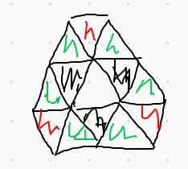
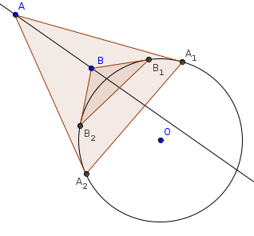
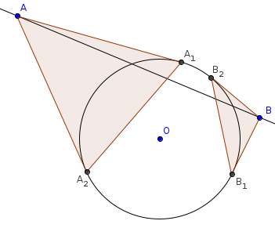
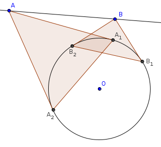

# E_(en)

Thank you very much for taking part in the contest!

 **Contest timeline*** -0:05. Starting the chat with the Questions Answering team: [tnowak](https://codeforces.com/profile/tnowak "Grandmaster tnowak") and our beloved coordinator [antontrygubO_o](https://codeforces.com/profile/antontrygubO_o "Grandmaster antontrygubO_o"). We hope that there won't be that many questions :)
* -0:01. One minute to go! I hope that everything goes smoothly. I'm so afraid of posting the editorial accidentally that I moved this timeline into another blog...
* 0:01. First blood in Div2! Congratulations to [majorro](https://codeforces.com/profile/majorro "Expert majorro")!.
* 0:03. First blood in Div1 as well! Congratulations to [Errichto](https://codeforces.com/profile/Errichto "International Grandmaster Errichto"), your knapsack is ready for a journey to win!
* 0:04. [Sho](https://codeforces.com/profile/Sho "Expert Sho") first to solve Div2B. Well done!
* 0:05. We also have the first question. So far so good...
* 0:06. [Um_nik](https://codeforces.com/profile/Um_nik "Legendary Grandmaster Um_nik") gets the first pretests pass in Div1B. The cheaters are caught!
* 0:09. [bandiaoz](https://codeforces.com/profile/bandiaoz "Expert bandiaoz") packs the first Knapsack in Div2! A difficulty spike is coming...
* 0:12. [Benq](https://codeforces.com/profile/Benq "Legendary Grandmaster Benq") is leading in Div1 after the first successful construction of a Xorry tree. He needed just under 4 minutes to complete task, scary pace...
* 0:20. [batman_begins](https://codeforces.com/profile/batman_begins "Expert batman_begins") the first person to catch Div2 cheaters. Congratulations!
* 0:25. [Benq](https://codeforces.com/profile/Benq "Legendary Grandmaster Benq") first one again! This time it's problem Div1D/1 which shows no challenge to him!
* 0:40. Noone has attempted Div1D/2 yet. It looks like the strongest contestants have switched to solving E and F. Maybe we gave a too low bonus score for this subproblem? Easy subtask is quite hard, but I guess that implementing the harder version can still give you some benefit if you can't solve E or F.
* 0:42. Ok, I was wrong. [Benq](https://codeforces.com/profile/Benq "Legendary Grandmaster Benq") orz!
* 0:48. [1700012703](https://codeforces.com/profile/1700012703 "Unrated, 1700012703") is leading the Div2 contest with 5 solves! How do you pronounce this nickname?
* 0:59. [ecnerwala](https://codeforces.com/profile/ecnerwala "Legendary Grandmaster ecnerwala") solves problem Div1F!! Congratulations, a well deserved top spot (for now :) ).
* 1:05. [Um_nik](https://codeforces.com/profile/Um_nik "Legendary Grandmaster Um_nik") and [maroonrk](https://codeforces.com/profile/maroonrk "Legendary Grandmaster maroonrk") sent first submissions for Div1E. Unfortunately, both failed on pretest 3, each with a different wrong answer.
* 1:10. [Benq](https://codeforces.com/profile/Benq "Legendary Grandmaster Benq") steals the top spot from [ecnerwala](https://codeforces.com/profile/ecnerwala "Legendary Grandmaster ecnerwala") with a successful attempt on Div1F. There's still one more unsolved task left...
* 1:13. [ksun48](https://codeforces.com/profile/ksun48 "Legendary Grandmaster ksun48") joins the WA party on Div1E. Will we see some correct submission?
* 1:14. Is it a miracle? No, it's just [Um_nik](https://codeforces.com/profile/Um_nik "Legendary Grandmaster Um_nik"). First blood on Div1E! Can he outperform [Benq](https://codeforces.com/profile/Benq "Legendary Grandmaster Benq") by solving task F?
* 1:20. [ainta](https://codeforces.com/profile/ainta "Legendary Grandmaster ainta") solves problem Div1F as well. Who's going to be the first one to take both of E and F?
* 1:25. There are 15 people in Div2 with 5 problems solved. Nobody has claimed a subtask of F yet.
* 1:38. We have a first successful hack! Congratulations to [Mark2020](https://codeforces.com/profile/Mark2020 "Expert Mark2020"). We haven't expected hacks at all, though.
* 1:40. [shb](https://codeforces.com/profile/shb "Expert shb") is the first person to solve the easier subtask of Div2F. Will he win the contest? Or is someone else catching up?
* 1:41. [Um_nik](https://codeforces.com/profile/Um_nik "Legendary Grandmaster Um_nik") solves Div1F! There's still some space for improvement for him. D-hard awaits.
* 1.57. Anton, do you have some keyboard problems? Did you really want to answer the question with: *bbbaba, bbbaba*?
* 2:06. [Um_nik](https://codeforces.com/profile/Um_nik "Legendary Grandmaster Um_nik") finishes the contest with a full score. Congratulations!
* 2:15. There's a bunch of wrong answers on Div1E. Is someone going to get another accept?
* 2:30. The contest has ended. The editorial is up! :)
[1447A - Add Candies](https://codeforces.com/contest/1447/problem/A "Codeforces Round 683 (Div. 2, by Meet IT)")

 **Tiny hint**We're only interested in differences between the elements. Is there another way to express the operation?

 **Hint**The operation in the i-th turn is equivalent to selecting one element and subtracting i from it.

 **Solution**The sequence 1, 2, ..., n satisfies task's constraints. After the additions all positions will contain n⋅(n+1)2 candies.

[1447B - Numbers Box](https://codeforces.com/contest/1447/problem/B "Codeforces Round 683 (Div. 2, by Meet IT)")

 **Hint**We want to minimize the number of negative numbers as much as we can by applying the operations. What is the minimum possible number of those negatives?

 **Solution**Let X be the number of non-zero numbers in the grid, and let's see what happens in different scenarios.

 1. both cells have negative numbers, then X goes down by 2.
2. both cells have positive numbers, then X goes up by 2.
3. one cell has a positive number while the other one has a negative number, then X stays the same.

It is important to notice that we can apply this operation not only for the two neighboring cells, but for any two — to achieve this effect we apply this operation on any path between the cells consecutively.

The parity of X never changes. So, for even X the answer is the sum of the absolute value of all numbers, S. Otherwise, one element will not be positive in the end -- so it's best to choose the one with minimum absolute value, V, and subtract 2⋅V from the sum.

The existence of zeroes doesn't really change anything, both formulas output the same value in such a case.

This gives us a solution in O(N⋅M)

[1447C - Knapsack](https://codeforces.com/contest/1447/problem/C "Codeforces Round 683 (Div. 2, by Meet IT)")

 **Hint**Are there any items which you can put in the knapsack to fulfill the goal with one item? What happens if there are none? 

 **Solution**If there is an item of size C satisfying: ⌈W2⌉≤C≤W, it is enough to output only that item. Otherwise, we should exclude items which are larger than the size of the knapsack and take a closer look at the situation. Consider greedily adding items in any order until we find a valid solution or run out of items.

This is correct because all items have sizes less than W2, so it is not possible to exceed knapsack size by adding one item in a situation where the sum of items C doesn't satisfy constraint ⌈W2⌉≤C≤W.

This gives us a solution in O(n).

 **Alternative solution**From the analysis above, we can also conclude that greedily adding the items from largest to smallest if they still fit in the knapsack will always find a solution if one exists. 

This gives us a solution in O(nlogn).

[1447D - Catching Cheaters](https://codeforces.com/contest/1447/problem/D "Codeforces Round 683 (Div. 2, by Meet IT)")

 **Hint**This is a dynamic programming problem. Recall the DP calculating the Longest Common Substring for two strings. What similarities are there in our setup, and what differs?

 **Key observation**If a substring has a negative score, we can throw it away and start from scratch.

 **Solution**Let DP[i][j] be the maximum similarity score if we end the first substring with Ai and the second substring with Bj. We will also allow the corresponding most similar string to be empty so that DP[i][j] is always at least 0.

It turns out that the fact we need to search for substrings of our words is not a big problem, because we can think of extending the previous ones. In fact, we have just two possibilities:

 1. Ai and Bj are the same letters. In this case, we say that DP[i][j]=min(DP[i][j],DP[i−1][j−1]+2) as the new letter will increase the LCS by 1, but both of the strings increase by one in length, so the total gain is 4−1−1=2.
2. In every case, we can refer to DP[i][j−1] or DP[i][j−1] to extend one of the previous substrings, but not the LCS, so: DP[i][j] = max(DP[i-1][j], DP[i][j-1]) — 1.

An inquisitive reader may wonder why it doesn't hurt to always apply case 2 in calculations, so clearing the doubts, it's important to informally notice that we never get a greater LCS this way so wrong calculations only lead to the worse score, and that our code will always find a sequence of transitions which finds the true LCS as well.

Implementing the formulas gives a really short O(n⋅m) solution. 

[1447E - Xor Tree](https://codeforces.com/contest/1447/problem/E "Codeforces Round 683 (Div. 2, by Meet IT)")

 **Small hints**Is it possible that the graph formed has a cycle? How to evaluate whether a sequence is good?

 **First step**Since we have n edges and two of them must coincide (the pair of numbers with the smallest xor), we will have at most n−1 edges in the graph. Thus, we only need to check if the resulting graph is connected. How to do it?

 **Hint**Let's look at the most significant bit, and group the numbers into two sets S0 and S1, depending on the value of the bit. What can we say about sizes of S0 and S1 in a good sequence?

 **Next step**It is easy to see that if 2≤|S0| and 2≤|S1| then the whole sequence isn't good, as for any number in Si the smallest xor will be formed by another number in Si. So there won't be any connections between the numbers forming the two sets. 

Thus, one of the sets must have no more than one element. If that set contains no elements, then the solution can obviously be calculated recursively. If it instead had one element, then as long as we make the other sequence good, it will be connected to something — and thus the whole graph.

 **Solution**Let F(S) be the maximum possible number of values we can take from S so that they form a good sequence. Divide the numbers into S0 and S1 as above. If S0 or S1 is empty, strip the most significant bit and solve the problem recursively. Otherwise, the result is 1+max(F(S0),F(S1)). Straightforward recursive calculation of this formula gives the runtime of (n⋅30), as all numbers are smaller than 230.

[1447F1 - Frequency Problem (Easy Version)](https://codeforces.com/contest/1447/problem/F1 "Codeforces Round 683 (Div. 2, by Meet IT)")

 **Hint**What can you say about the values which are the most frequent ones in the optimal solution?

 **First steps**Let D be the most frequent value in the whole sequence. If D is not unique, we output n. Otherwise, we can prove that one of the most frequent values in an optimal solution is D.

 **Proof of the observation above**We'll prove this by contradiction. Consider an optimal interval [a,b] in which D is not in the set of most frequent values. Let's think of the process of expanding the interval to [a−1,b], [a−2,b], ..., [1,b], [1,b+1], ..., [1,n]. Since D is most frequent in the entire sequence, at some point in this process it will appear the same number of times as at least one of the other most frequent values. The corresponding interval will also satisfy the task's conditions, hence [a,b] cannot be an optimal interval if D does not appear most frequently.

 **Consequence of the observation**For each value V we can solve the task when (D,V) are the most-frequent values independently, ignoring other values. Now we would like to solve the following subproblem: find the longest interval of sum 0 where elements in the array are either 1 (V), −1 (D) or 0 (other values). The solution's complexity should be proportional to the frequency of V in order to obtain an efficient solution for the entire task.

 **Why the simplification works**You might be worried that we can't simply ignore the other values, since they may end up being more frequent than (D, V) in the interval that we've found. This might be true, but can only be an underestimation of the optimal interval's length. A similar expanding argument to the proof above shows that:

 * we never overestimate the result
* for the values of (D, V) which form the optimal interval we find exactly the right interval value.
 **Solution for the easy version**For the easy version, it's sufficient to consider all pairs (D, V) in linear time, by using the standard algorithm which computes the longest interval with sum 0. Thus, we get a solution with complexity O(100⋅n). 

 **Hint for the subproblem**A bit of thinking may lead you to the observation that solving the task in O(nlogn) or even O(nlog2n) isn't pleasant. The constraints are low enough to allow an O(n√n) solution, how about giving it a try?

 **Solution of the subproblem**If an element V appears more than √n times, we can simply brute-force this pair with partial sums (D,V) in O(n).

For the other elements, for all the appearances of V we'll consider only at most |V|+1 neighboring occurrences of D to search for the optimal interval. We can generalize the brute-force solution to work for this case too, by writing a function that solves just for a vector of interesting positions. Don't forget to take into account extending intervals with zeroes as well.

With proper preprocessing, this gives a solution in O(|V|2) per value V. Therefore, total runtime is bounded by O(n√n).

[1446E - Long Recovery](../problems/E._Long_Recovery.md "Codeforces Round 683 (Div. 1, by Meet IT)")

 **Setup**We're interested in the longest possible recovery path, so let's imagine choosing the longest sequence of operations ourselves. How long can this process last?

 **The upper bound**Let P be the number of pairs of neighboring cells with different state. Consider what happens to P after an operation where we change the state of a cell c. It can be seen that P decreases by 1 if c had a neighbor with the same state as c, and P decreases by 3 if all the neighbors of c had a different state. Let's call the first kind of operation **cheap** and the other **expensive**.

 **When does the organism remain sick?**We now know that the process cannot last forever. When is it possible that the patient never recovers? If at some point there is a cycle of infected cells, then none of them can ever become healthy. Conversely, if there is no cycle of infected cells, and not all cells are healthy, then it is possible to make some infected cell healthy. If A is the initial set of infected cells, let ¯A be the set of cells which can eventually be infected. By the above, we should output *SICK* if and only if ¯A contains a cycle.

We can compute ¯A using a BFS. No cell with coordinates outside of [0,500)x[0,500) will ever become infected, so we can safely make the BFS linear in the number of cells in this region.

 **Solution**Let's assume that ¯A contains no cycle. We want to determine the minimum possible number of expensive operations used during the process of making all the cells healthy. We can consider each connected component of ¯A separately and add the results, so let's suppose ¯A is connected. The very last operation must be expensive, since it changes the state of an infected cell with three healthy neighbors. There is one other case where we need an expensive operation: if there's no way to make a cheap operation at the very beginning. In fact, this can happen only if A consists of three cells arranged in a 'triforce'. It turns out that we never need any other expensive operations.

So, assuming ¯A contains no cycle, we can compute the longest possible recovery period as follows. Compute the number P of pairs of neighboring cells with different states. Subtract twice the number of connected components of ¯A. Subtract twice the number of connected components of ¯A for which the corresponding cells in A are just three cells arranged in a triforce.

Note that the observation that the *bad beginning component* is only a triforce is actually not necessary to code a working solution (one can just check if there's a cheap move at the beginning, just remember that we're inspecting components of ¯A), but it will help us to prove the solution formally.

 **Proof**Let's now prove that we never need any other expensive operations than the ones described. Suppose A is a set of at least 2 infected cells, such that (i) ¯A is cycle-free, (ii) ¯A is connected, and (iii) A is not a triforce. We claim that there is a some cheap operation, such that the resulting set A′ of infected cells still satisfies (i), (ii) and (iii). We will always have (i), since ¯A′⊆¯A, so we just need to worry about (ii) and (iii), i.e. we need to ensure that ¯A′ is connected and that A′ is not a triforce.

We need to consider a few different cases.

 1. Suppose there is a cheap infection operation. Then just perform it. The resulting set A′ will have ¯A′=¯A still connected, and A′ will not be a triforce since it has adjacent infected cells.
2. Suppose there is no cheap infection operation, but there is a cheap operation turning a cell c from infected to healthy. Consider what happens if we perform it. Since there is no cheap infection operation, any cell in ¯A∖A must have three neighbors in A. So it has at least two neighbors in A∖c. So it lies in ¯A∖c. So ¯A∖c⊇¯A∖c. We claim that (ii) is satisfied, i.e. ¯A∖c is connected. If c is a leaf in ¯A, this is clear, since removing a leaf from a tree does not disconnect it. If c is not a leaf in ¯A, then it has at least two neighbors in ¯A∖c, so ¯A∖c=¯A is again connected. So the only possible issue is with (iii), i.e. A∖c might be a triforce. In this case, A must be a triforce with an extra cell added, and we should just have chosen another c.
3. Suppose there is no cheap operation. This means that no elements of A can be adjacent (since a tree with more than one vertex has a leaf). Moreover, any element of ¯A∖A is surrounded by elements of A. Because A has at least 2 cells and ¯A is connected, we must somewhere have three cells in A arranged in a triforce. See the picture below. The green cells are not in A since no elements of A are adjacent, and the red cells are not in A since ¯A is cycle-free. So A cannot have any cells other than these 3, since ¯A is connected.

This covers all cases, finishing the proof.

[1446F - Line Distance](../problems/F._Line_Distance.md "Codeforces Round 683 (Div. 1, by Meet IT)")

 **Stupid hint**Binary search is your friend. To determine if the answer is bigger or smaller than r, we need to count the number of pairs of points A, B such that d(O,AB)>r.

 **Geometric insight**We need to reformulate the condition d(O,AB)>r to make the counting easier.

Draw a circle of radius r centered on O, and consider two points A, B strictly outside the circle. Note that d(O,AB)>r if and only if AB does not intersect this circle.

Now draw the tangents from A, B to the circle. Let the corresponding points on the circle be A1,A2,B1,B2. Observation: the line segments A1A2,B1B2 intersect if and only if AB does not intersect the circle. Moreover, if we pick polar arguments a1,a2,b1,b2∈[0,2π), for the points in the circle, such that a1<a2 and b1<b2, then the line segments intersect if the intervals [a1,a2],[b1,b2] overlap.

We don't need to worry too much about precision errors, because if r is close to the real answer, then it doesn't matter what our calculations return.

(To compute a1, note that cos∠AOA1=r/|OA|. So we get a1,a2 be adding / subtracting cos−1r|OA| from the argument of A.)

 **Proof of observation**We can prove the observation by considering three different cases, shown in pictures.

One circle segment contains the other, and the line AB intersects the circle outside the segment AB.

The circle segments are disjoint, and the line segment AB intersects the circle.

The circle segments partially intersect, and the line AB does not intersect the circle.

 **Final details**Now we have computed some intervals and want to find the number of pairs of intervals which partially overlap. To do this, first sort the endpoints of the intervals. Do some coordinate compression on the left endpoints. Build a Fenwick tree on the compressed coordinates. Sweep through the endpoints. Whenever you see a left endpoint, add it to the tree. Whenever you see a right endpoint, remove it from the tree, query the tree for the number of points greater than the corresponding left endpoint, and add the result to the answer.

