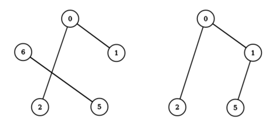

<h1 style='text-align: center;'> C. Xor Tree</h1>

<h5 style='text-align: center;'>time limit per test: 2 seconds</h5>
<h5 style='text-align: center;'>memory limit per test: 256 megabytes</h5>

For a given sequence of distinct non-negative integers $(b_1, b_2, \dots, b_k)$ we determine if it is good in the following way:

* Consider a graph on $k$ nodes, with numbers from $b_1$ to $b_k$ written on them.
* For every $i$ from $1$ to $k$: find such $j$ ($1 \le j \le k$, $j\neq i$), for which $(b_i \oplus b_j)$ is the smallest among all such $j$, where $\oplus$ denotes the operation of bitwise XOR ([https://en.wikipedia.org/wiki/Bitwise_operation#XOR](https://en.wikipedia.org/wiki/Bitwise_operation#XOR)). Next, draw an undirected edge between vertices with numbers $b_i$ and $b_j$ in this graph.
* We say that the sequence is good if and only if the resulting graph forms a tree (is connected and doesn't have any simple cycles).

It is possible that for some numbers $b_i$ and $b_j$, you will try to add the edge between them twice. Nevertheless, you will add this edge only once.

You can find an example below (the picture corresponding to the first test case). 

Sequence $(0, 1, 5, 2, 6)$ is not good as we cannot reach $1$ from $5$.

However, sequence $(0, 1, 5, 2)$ is good. 

  You are given a sequence $(a_1, a_2, \dots, a_n)$ of distinct non-negative integers. You would like to remove some of the elements (possibly none) to make the remaining sequence good. What is the minimum possible number of removals required to achieve this goal?

It can be shown that for any sequence, we can remove some number of elements, leaving at least $2$, so that the remaining sequence is good.

#### Input

The first line contains a single integer $n$ ($2 \le n \le 200,000$) — length of the sequence.

The second line contains $n$ distinct non-negative integers $a_1, a_2, \ldots, a_n$ ($0 \le a_i \le 10^9$) — the elements of the sequence.

#### Output

You should output exactly one integer — the minimum possible number of elements to remove in order to make the remaining sequence good.

## Examples

#### Input


```text
5
0 1 5 2 6
```
#### Output


```text
1
```
#### Input


```text
7
6 9 8 7 3 5 2
```
#### Output


```text
2
```
## Note

## Note

 that numbers which you remove don't impact the procedure of telling whether the resulting sequence is good.

It is possible that for some numbers $b_i$ and $b_j$, you will try to add the edge between them twice. Nevertheless, you will add this edge only once.


#### Tags 

#2100 #NOT OK #binary_search #bitmasks #data_structures #divide_and_conquer #dp #trees 

## Blogs
- [All Contest Problems](../Codeforces_Round_683_(Div._1,_by_Meet_IT).md)
- [Announcement (en)](../blogs/Announcement_(en).md)
- [E (en)](../blogs/E_(en).md)
