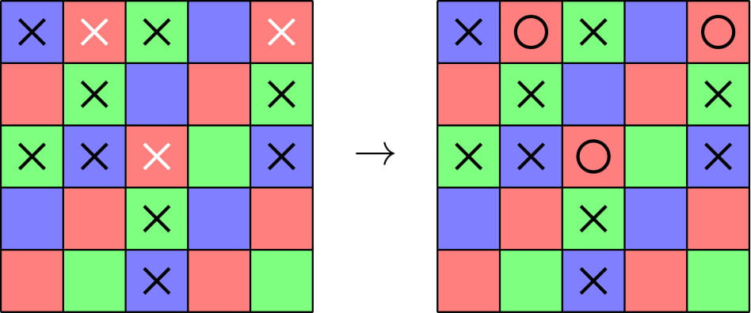
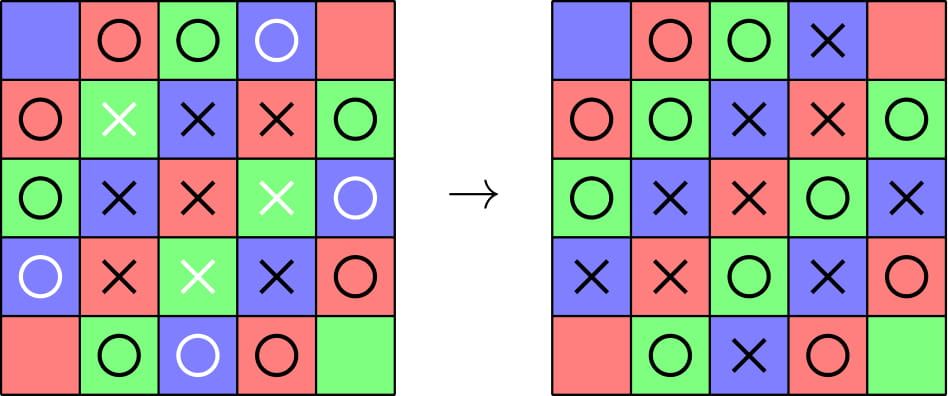
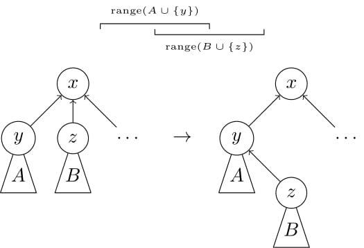

# Tutorial_(en)

I hope you enjoyed the problems! Implementations will be added soon.

**UPD**: Implementations are added!

[1450A - Avoid Trygub](../problems/A._Avoid_Trygub.md "Codeforces Global Round 12")

 **Tutorial**
### [1450A - Avoid Trygub](../problems/A._Avoid_Trygub.md "Codeforces Global Round 12")

The string "trygub" is not sorted alphabetically, and a subsequence of a sorted string is necessarily sorted. So, if we sort the input string, it will be a solution. Complexity is O(n) with counting sort.

[Implementation](https://codeforces.com/contest/1450/submission/100590853)

[1450B - Balls of Steel](../problems/B._Balls_of_Steel.md "Codeforces Global Round 12")

 **Tutorial**
### [1450B - Balls of Steel](../problems/B._Balls_of_Steel.md "Codeforces Global Round 12")

We claim the answer is always −1 or 1.

In fact, suppose in the first operation of a solution we select a point p. If we aren't done, there will at least one point with distance more than k from p. However, there will be no point within distance k of p, no matter how we perform future operations. So it is impossible for p to merge with a new point, and a solution with more than 1 operation will be impossible.

To see if the answer is 1, we should check if there is some point p within distance k from all other points. Otherwise, the answer is −1. Complexity is O(n2) to compute pairwise distances.

[Implementation](https://codeforces.com/contest/1450/submission/100590978)

[1450C1 - Errich-Tac-Toe (Easy Version)](../problems/C1._Errich-Tac-Toe_(Easy_Version).md "Codeforces Global Round 12")

 **Tutorial**
### [1450C1 - Errich-Tac-Toe (Easy Version)](../problems/C1._Errich-Tac-Toe_(Easy_Version).md "Codeforces Global Round 12")

For each cell (i,j), let's associate it with the color (i+j)mod3. Every three consecutive cells contains one of each color. So, if we choose one color and flip all tokens with that color, it will be a solution. We need only prove that there is a color associated with at most one third of the tokens.

Let there be xi tokens in cells of diagonal number i, for i=0,1,2. Then we have k=x0+x1+x2. Therefore, min{x0,x1,x2}≤⌊k3⌋.

Here's the coloring on an example. There are 3 X's on red, 4 on blue, and 5 on green. Red has the fewest, so we flip those.

  [Implementation](https://codeforces.com/contest/1450/submission/100591010)

[1450C2 - Errich-Tac-Toe (Hard Version)](../problems/C2._Errich-Tac-Toe_(Hard_Version).md "Codeforces Global Round 12")

 **Tutorial**
### [1450C2 - Errich-Tac-Toe (Hard Version)](../problems/C2._Errich-Tac-Toe_(Hard_Version).md "Codeforces Global Round 12")

If for every three consecutive tokens in the grid, we make sure there is an X and there is an O, we are done. For each cell (i,j)(i,j), let's associate it with the color (i+j)mod3(i+j)mod3. Since every three consecutive cells contains one of each color, if we make all of one color X and all of a different color O, it would be a solution. It remains to prove that one such way makes at most ⌊k3⌋⌊k3⌋ operations.

For each token on the grid, it is associated with a color (00, 11, or 22) and a type (X or O). Therefore each token falls into one of 66 categories. So we can make a table for how many tokens fall in each category.

 XO0x0o01x1o12x2o2012Xx0x1x2Oo0o1o2 Firstly, k=x0+x1+x2+o0+o1+o2k=x0+x1+x2+o0+o1+o2.

Let aijaij denote the number of operations we make if we flip all X's in cells with color ii and flip all O's in cells with color jj. Then aij=xi+ojaij=xi+oj.

Now, we have a01+a02+a10+a12+a20+a21=2ka01+a02+a10+a12+a20+a21=2k.

Finally, min{a01,a02,a10,a12,a20,a21}≤⌊2k/6⌋=⌊k3⌋min{a01,a02,a10,a12,a20,a21}≤⌊2k/6⌋=⌊k3⌋.

Here's the coloring in an example. We flip all green X's and blue O's.

  [Implementation](https://codeforces.com/contest/1450/submission/100591026)

[1450D - Rating Compression](../problems/D._Rating_Compression.md "Codeforces Global Round 12")

 **Tutorial**Tutorial is loading...[Implementation](https://codeforces.com/contest/1450/submission/100591109)

[1450E - Capitalism](../problems/E._Capitalism.md "Codeforces Global Round 12")

 **Tutorial**
### [1450E - Capitalism](../problems/E._Capitalism.md "Codeforces Global Round 12")

Firstly, each edge connects a person with even income and a person with odd income. So if the graph is not bipartite, then a solution does not exist.

Consider a friendship between people u and v, where we don't know the direction. Since |au−av|=1, we know that au−av≤1 and av−au≤1. Consider a directed friendship (u→v). Since au+1=av, we know that av−au≤1 and au−av≤−1.

For each friendship, let's add two directed edges between them. If it's undirected, we add one from u→v of weight 1 and one from v→u of weight 1. If it's directed, we add one from u→v of weight 1, and one from v→u of weight −1.

The way we added these edges ensures that if u and v are any two vertices and there is a path of distance d from u to v, then av−au≤d. Note that if a negative cycle exists in our graph, then the inequalities give a contradiction. Otherwise if an answer exists, some vertex u will have minimum au and another vertex v will have maximum av, and av−au≤dist(u→v). Therefore, the answer cannot be greater than the diameter: maxu,vdist(u→v). If we find a construction with this answer, then this proves optimality.

Let our construction be as follows. First, choose two vertices u and v such that dist(u→v) is maximized. Let's assign ai=dist(u→i). The property of shortest paths tell us that all the desired inequalities hold for ai. Then we know all directed friendships are correct: av−au=1. For all undirected friendships, we know |av−au|≤1. Since the graph is bipartite, it cannot hold that au=av, therefore |av−au|=1, so all requirements hold and the income inequality is maximized.

For the implementation, we need to check the graph is bipartite, check if negative cycles exist, and find all-pairs shortest paths. For this, we can simply do Floyd-Warshall in O(n3) time.

[Implementation](https://codeforces.com/contest/1450/submission/100591174)

[1450F - The Struggling Contestant](../problems/F._The_Struggling_Contestant.md "Codeforces Global Round 12")

 **Tutorial**
### [1450F - The Struggling Contestant](../problems/F._The_Struggling_Contestant.md "Codeforces Global Round 12")

Suppose p is a permutation that satisfies the condition. Imagine we add a divider between adjacent indices that are not adjacent in p. If k is the number of "jumps" in p, then we have split the array a into k+1 consecutive segments. The permutation will scan these segments in some order, and each segment can be scanned in forward or reversed order. We can visualize the problem like we "cut" the array in k places, then reorder and reverse the segments so that no two adjacent tags are equal.

Obviously, for all i such that ai=ai+1 we need to cut between i and i+1. Now, we only need to think about the endpoints of these segments, and we need a condition for when it is possible to avoid connecting equal endpoints. For a tag x, define f(x) as the number of times x appears as an endpoint of a segment. Note that if a segment consists of only one tag, we count x twice, as both a left and right endpoint.

We claim that a valid reordering of the segments is possible if and only if for all tags x, it holds that f(x)≤k+2.

* Let x be a tag. Let's prove that if a solution exists, then f(x)≤k+2. Consider a reordering of the segments as [y1,y2],[y3,y4],…,[y2k+1,y2k+2]. Here, y2i−1 and y2i are the endpoints of the segment that appears i-th in the solution order. Since y2i and y2i+1 are connected, they cannot both be x. It can be that y1=x, and it can be that y2k+2=x, but at most half of the remaining endpoints (there are 2k of them) can be x due to these connections. So f(x)≤k+2.
* Let's prove that if f(x)≤k+2 for all tags x, then we can construct a solution. We proceed by induction on k. If k=0, there is only one segment and we are done. Now, suppose k≥1. Let x be any tag with maximum f(x). Select one segment with x as an endpoint and another with y≠x as an endpoint. (Note that such a pair of segments always exists). Connect the selected x and y together, merging them into one segment. We have reduced the number of segments by 1, and we have decreased the frequencies of x and y as endpoints by 1. After making this connection, the condition clearly holds for x and y. For all other tags z (z≠x, z≠y), it holds before the operation that f(z)≤(2k+2)−f(x)≤(2k+2)−f(z) and so f(z)≤k+1. After the operation, k decreases and f(z) is unchanged, so f(z)≤k+2 holds. By induction, a solution exists.

To find the solution with the minimum number of cuts, we firstly must cut the array between all adjacent indices of equal tags. If this set of cuts already satisfies the above condition, we are done.

Otherwise, there is a tag x such that f(x)>k+2 and for all tags y≠x, f(y)≤k+2. If we add a cut between two consecutive tags such that one of them is x, it increases f(x) by one and k by one, so it is useless. If we cut between two consecutive tags that are not x, it does not change f(x) and it increases k by one. That is, each such cut brings the condition one step closer to equality. Therefore if a solution exists and f(x)>k+2, we require exactly f(x)−(k+2) additional cuts.

Let's summarize the solution. If some tag x has more than ⌈n/2⌉ occurrences, a solution does not exist. Otherwise, let k be the number of adjacent equal tags, and add the necessary cuts in these positions. Let x be the tag that occurs most frequently as an endpoint in the resulting segments. The answer is k+max{0,f(x)−(k+2)}.

[Implementation](https://codeforces.com/contest/1450/submission/100591545)

[1450G - Communism](../problems/G._Communism.md "Codeforces Global Round 12")

 **Tutorial**
### [1450G - Communism](../problems/G._Communism.md "Codeforces Global Round 12")

Let C denote the set of distinct characters in s.

Suppose there is a sequence of operations that transforms every character to x in the end. For an operation where we transform all occurrences of y to z, let's add a directed edge (y→z). The resulting structure is a directed tree rooted at x. This is because every character except x is transformed exactly once.

For each character y, denote the index of its first occurrence by ly and its last occurrence by ry. For any non-empty subset S of characters, define range(S)=[miny∈Sly,maxy∈Sry]. That is, the smallest interval capturing all occurrences of characters belonging to S. Also define cnt(S) as the number of occurrences of characters in S.

Given a directed tree structure, we can decide its validity regardless of the order of operations. For a character y, let Sy denotes the set of characters in the subtree of y. The condition is that for every character y,

cnt(Sy)≥k|range(Sy)|.

Now, we can devise a bitmask dp. For any subset M, let dp(M) be true if we can organize the characters of M into a valid tree rooted at a character outside of M. Then the final answer will be the set of characters x such that dp(C∖{x}) is true.

To create the dp transitions, there are 2 cases. 

1. Choose a character y∈M to be an ancestor of all of M. That is, if the condition (1) holds for the set M=Sy and dp(M∖{y}) is true, then dp(M) is true.
2. The set M should be split into at least two disjoint subtrees. That is, if there is a non-empty, proper subset S⊂M such that dp(S) and dp(M∖S) are true, then dp(M) is also true.

These transitions give rise to an O(n+3|C|) solution, since we iterate over all subsets of M in case 2. We still need another observation to optimize this further. The key observation is that we may assume for the transitions of case 2 that range(S)∩range(M∖S)=∅. That is, the sets of characters in sibling subtrees occur on disjoint intervals.

To prove that this assumption is justified, we show that a valid tree can be transformed to a valid tree that does satisfy our assumption.

  Suppose there are two siblings y and z whose subtrees have overlapping ranges. Then if we change z's parent to y, we only need to check that the condition (1) still holds for y. In fact,

cnt(A∪{y}∪B∪{z})=cnt(A∪{y})+cnt(B∪{z})

≥k⋅|range(A∪{y})|+k⋅|range(B∪{z})|≥k⋅|range(A∪{y}∪B∪{z})|.

Of course, after the transformation in the figure, maybe our assumption still does not hold. But observe that if we repeat this process, it will stop in finitely many steps. This is because the sum of depths of all nodes strictly increases with each transformation, and the depth of a node is bounded by |C|.

Now that the claim is proven, it is not hard to improve our solution to O(n+|C|2|C|). If we sort the characters in C by the index of their first occurrence, it is sufficient to try only |C|−1 splits according to this order for case 2. That is, if the characters in M are ordered c1,…,cm, then we should take S={c1,…,ci} for some i.

[Implementation](https://codeforces.com/contest/1450/submission/100591664)

[1450H1 - Multithreading (Easy Version)](../problems/H1._Multithreading_(Easy_Version).md "Codeforces Global Round 12")

 **Tutorial**
### [1450H1 - Multithreading (Easy Version)](../problems/H1._Multithreading_(Easy_Version).md "Codeforces Global Round 12")

Lets first solve for a given coloring, c, the value of f(c). Let Bodd, Beven denote the number of black spots on even positions, and odd positions respectively. We notate similarly for Wodd and Weven. 

Claim: f(c)=12|Bodd−Beven|.

Proof: Let's show for any coloring where Bodd−Beven=2k (the other case Beven−Bodd=2k is equivalent) we have f(c)=k.

1. Let's show f(c)≤k with a construction of k intersections. Given the condition, let's show a construction. Suppose that Bodd≥1 and Beven≥1. Then there are two adjacent positions of the same color. Connect those positions and continue to solve for the remaining spools. Eventually, there will be Bodd=2k and Weven=2k in an alternating pattern bwbw…bwbw. It's easy to connect these to form k connections.
2. Let's show f(c)≥k by proving any matching has at least k intersections. First, we may assume there are no same-color intersections. If one existed, we could improve the matching, not increasing the number of different-color intersections.Now, since Bodd−Beven=2k, there are at least k black spools on odd positions that are connected to other black spools on odd positions. Each such thread splits the other spools into two sections, each with an odd number of spools. Therefore each of these k threads intersects another thread. Qed.

Now, suppose we have F unfilled positions total. Say Fodd are on odd positions and Feven are on even positions. Let x=n2−Wodd−Beven.

Claim: Let i≡x(mod2). The number of valid, s-reachable colorings c with f(c)=12|x−i| is equal to (Fi).

Proof: Suppose we have a subset of i unfilled positions. For the elements of the subset, we color even positions black and odd positions white. For elements outside the subset, we color even positions white and odd positions black. Say that a is the number of positions in our subset on even positions. Now, Beven+a spools will be black on even positions, and Bodd+Fodd−i+a will be black on odd positions. Then

f(c)=12|(Beven+a)−(Bodd+Fodd−i+a)|

=12|Beven−Bodd−Fodd+i|=12|x−i|.

It is clear that our mapping is a bijecetion. Qed.

Given our claims, we can write the expected value as such:

12F∑0≤i≤Fi≡x(mod2)|x−i|(Fi).

[Implementation](https://codeforces.com/contest/1450/submission/100591679)

[1450H2 - Multithreading (Hard Version)](../problems/H2._Multithreading_(Hard_Version).md "Codeforces Global Round 12")

 **Tutorial**
### [1450H2 - Multithreading (Hard Version)](../problems/H2._Multithreading_(Hard_Version).md "Codeforces Global Round 12")

Continued from Easy Version tutorial.

Recall the answer is

12F∑0≤i≤Fi≡x(mod2)|x−i|(Fi).

Now we have to maintain this sum over updates.

Let's ignore the 2F, and rewrite the sum as 

∑0≤i≤x−2i≡x(mod2)x(Fi)−∑0≤i≤x−2i≡x(mod2)i(Fi)+∑x+2≤i≤Fi≡x(mod2)i(Fi)−∑x+2≤i≤Fi≡x(mod2)x(Fi).

We will transform sums of the form i(Fi) to sums of the form (Fi). We rewrite them with the following identity. i(Fi)=F(F−1i−1)

To deal with the i≡x(mod2) condition, we use Pascal's rule to rewrite each (Fi) as (F−1i−1)+(F−1i), and each sum becomes a prefix sum or suffix sum of some binomial coefficients with the same upper index. The indices change by O(1) between updates, and we should handle these cases. We can handle changes to the upper index by noting the following equation, again due to Pascal's rule.

k∑i=0(F+1i)=2k∑i=0(Fi)−(Fk).

It is easy to handle updates to the lower index by adding and subtracting some binomial coefficients when necessary.

Be careful about cases where F=1 since the transformed prefix sum won't consider all possibilities.

[Implementation](https://codeforces.com/contest/1450/submission/100591731)

