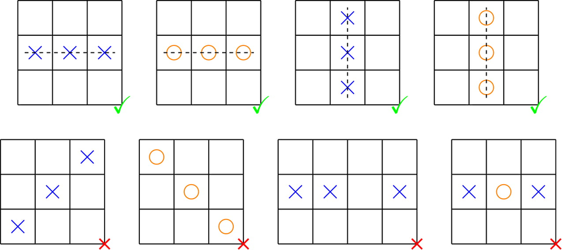

<h1 style='text-align: center;'> C2. Errich-Tac-Toe (Hard Version)</h1>

<h5 style='text-align: center;'>time limit per test: 1 second</h5>
<h5 style='text-align: center;'>memory limit per test: 256 megabytes</h5>

The only difference between the easy and hard versions is that tokens of type O do not appear in the input of the easy version.

Errichto gave Monogon the following challenge in order to intimidate him from taking his top contributor spot on Codeforces.

In a Tic-Tac-Toe grid, there are $n$ rows and $n$ columns. Each cell of the grid is either empty or contains a token. There are two types of tokens: X and O. If there exist three tokens of the same type consecutive in a row or column, it is a winning configuration. Otherwise, it is a draw configuration.

  The patterns in the first row are winning configurations. The patterns in the second row are draw configurations. In an operation, you can change an X to an O, or an O to an X. Let $k$ denote the total number of tokens in the grid. Your task is to make the grid a draw in at most $\lfloor \frac{k}{3}\rfloor$ (rounding down) operations.

You are not required to minimize the number of operations.

### Input

The first line contains a single integer $t$ ($1\le t\le 100$) — the number of test cases.

The first line of each test case contains a single integer $n$ ($1\le n\le 300$) — the size of the grid.

The following $n$ lines each contain a string of $n$ characters, denoting the initial grid. The character in the $i$-th row and $j$-th column is '.' if the cell is empty, or it is the type of token in the cell: 'X' or 'O'.

It is guaranteed that not all cells are empty.

The sum of $n$ across all test cases does not exceed $300$.

### Output

For each test case, print the state of the grid after applying the operations.

We have proof that a solution always exists. If there are multiple solutions, print any.

## Example

### Input


```text
3
3
.O.
OOO
.O.
6
XXXOOO
XXXOOO
XX..OO
OO..XX
OOOXXX
OOOXXX
5
.OOO.
OXXXO
OXXXO
OXXXO
.OOO.
```
### Output


```text

.O.
OXO
.O.
OXXOOX
XOXOXO
XX..OO
OO..XX
OXOXOX
XOOXXO
.OXO.
OOXXO
XXOXX
OXXOO
.OXO.
```
## Note

In the first test case, there are initially three 'O' consecutive in the second row and the second column. By changing the middle token to 'X' we make the grid a draw, and we only changed $1\le \lfloor 5/3\rfloor$ token.

In the second test case, the final grid is a draw. We only changed $8\le \lfloor 32/3\rfloor$ tokens.

In the third test case, the final grid is a draw. We only changed $7\le \lfloor 21/3\rfloor$ tokens.


#### Tags 

#2300 #NOT OK #constructive_algorithms #math 

## Blogs
- [All Contest Problems](../Codeforces_Global_Round_12.md)
- [Announcement (en)](../blogs/Announcement_(en).md)
- [Tutorial (en)](../blogs/Tutorial_(en).md)
