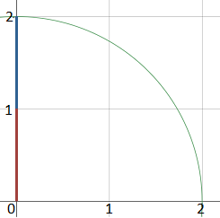

<h1 style='text-align: center;'> D. Circle Game</h1>

<h5 style='text-align: center;'>time limit per test: 2 seconds</h5>
<h5 style='text-align: center;'>memory limit per test: 256 megabytes</h5>

Utkarsh is forced to play yet another one of Ashish's games. The game progresses turn by turn and as usual, Ashish moves first.

Consider the 2D plane. There is a token which is initially at $(0,0)$. In one move a player must increase either the $x$ coordinate or the $y$ coordinate of the token by exactly $k$. In doing so, the player must ensure that the token stays within a (Euclidean) distance $d$ from $(0,0)$.

In other words, if after a move the coordinates of the token are $(p,q)$, then $p^2 + q^2 \leq d^2$ must hold.

The game ends when a player is unable to make a move. It can be shown that the game will end in a finite number of moves. If both players play optimally, determine who will win.

### Input

The first line contains a single integer $t$ ($1 \leq t \leq 100$) — the number of test cases.

The only line of each test case contains two space separated integers $d$ ($1 \leq d \leq 10^5$) and $k$ ($1 \leq k \leq d$).

### Output

For each test case, if Ashish wins the game, print "Ashish", otherwise print "Utkarsh" (without the quotes).

## Example

### Input


```text
5
2 1
5 2
10 3
25 4
15441 33
```
### Output


```text
Utkarsh
Ashish
Utkarsh
Utkarsh
Ashish
```
## Note

In the first test case, one possible sequence of moves can be

$(0, 0) \xrightarrow{\text{Ashish }} (0, 1) \xrightarrow{\text{Utkarsh }} (0, 2)$.

Ashish has no moves left, so Utkarsh wins.




#### Tags 

#1700 #NOT OK #games #geometry #math 

## Blogs
- [All Contest Problems](../Codeforces_Round_685_(Div._2).md)
- [Announcement (en)](../blogs/Announcement_(en).md)
- [Tutorial (en)](../blogs/Tutorial_(en).md)
