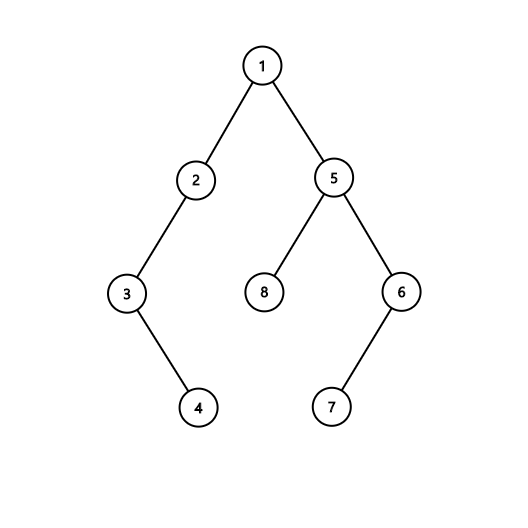

<h1 style='text-align: center;'> E. Dog Snacks</h1>

<h5 style='text-align: center;'>time limit per test: 3 seconds</h5>
<h5 style='text-align: center;'>memory limit per test: 512 megabytes</h5>

Gildong is playing with his dog, Badugi. They're at a park that has $n$ intersections and $n-1$ bidirectional roads, each $1$ meter in length and connecting two intersections with each other. The intersections are numbered from $1$ to $n$, and for every $a$ and $b$ ($1 \le a, b \le n$), it is possible to get to the $b$-th intersection from the $a$-th intersection using some set of roads.

Gildong has put one snack at every intersection of the park. Now Gildong will give Badugi a mission to eat all of the snacks. Badugi starts at the $1$-st intersection, and he will move by the following rules:

* Badugi looks for snacks that are as close to him as possible. Here, the distance is the length of the shortest path from Badugi's current location to the intersection with the snack. However, Badugi's sense of smell is limited to $k$ meters, so he can only find snacks that are less than or equal to $k$ meters away from himself. If he cannot find any such snack, he fails the mission.
* Among all the snacks that Badugi can smell from his current location, he chooses a snack that minimizes the distance he needs to travel from his current intersection. If there are multiple such snacks, Badugi will choose one arbitrarily.
* He repeats this process until he eats all $n$ snacks. After that, he has to find the $1$-st intersection again which also must be less than or equal to $k$ meters away from the last snack he just ate. If he manages to find it, he completes the mission. Otherwise, he fails the mission.

Unfortunately, Gildong doesn't know the value of $k$. So, he wants you to find the minimum value of $k$ that makes it possible for Badugi to complete his mission, if Badugi moves optimally.

### Input

Each test contains one or more test cases. The first line contains the number of test cases $t$ ($1 \le t \le 10^4$).

The first line of each test case contains one integer $n$ ($2 \le n \le 2 \cdot 10^5$) — the number of intersections of the park.

The next $n-1$ lines contain two integers $u$ and $v$ ($1 \le u,v \le n$, $u \ne v$) each, which means there is a road between intersection $u$ and $v$. All roads are bidirectional and distinct.

It is guaranteed that: 

* For each test case, for every $a$ and $b$ ($1 \le a, b \le n$), it is possible to get to the $b$-th intersection from the $a$-th intersection.
* The sum of $n$ in all test cases doesn't exceed $2 \cdot 10^5$.
### Output

For each test case, print one integer — the minimum possible value of $k$ such that Badugi can complete the mission.

## Example

### Input


```text
3
3
1 2
1 3
4
1 2
2 3
3 4
8
1 2
2 3
3 4
1 5
5 6
6 7
5 8
```
### Output


```text
2
3
3
```
## Note

In the first case, Badugi can complete his mission with $k=2$ by moving as follows: 

1. Initially, Badugi is at the $1$-st intersection. The closest snack is obviously at the $1$-st intersection, so he just eats it.
2. Next, he looks for the closest snack, which can be either the one at the $2$-nd or the one at the $3$-rd intersection. Assume that he chooses the $2$-nd intersection. He moves to the $2$-nd intersection, which is $1$ meter away, and eats the snack.
3. Now the only remaining snack is on the $3$-rd intersection, and he needs to move along $2$ paths to get to it.
4. After eating the snack at the $3$-rd intersection, he needs to find the $1$-st intersection again, which is only $1$ meter away. As he gets back to it, he completes the mission.

In the second case, the only possible sequence of moves he can make is $1$ – $2$ – $3$ – $4$ – $1$. Since the distance between the $4$-th intersection and the $1$-st intersection is $3$, $k$ needs to be at least $3$ for Badugi to complete his mission.

In the third case, Badugi can make his moves as follows: $1$ – $5$ – $6$ – $7$ – $8$ – $2$ – $3$ – $4$ – $1$. It can be shown that this is the only possible sequence of moves for Badugi to complete his mission with $k=3$.

  

#### Tags 

#2300 #NOT OK #binary_search #dfs_and_similar #dp #greedy #trees 

## Blogs
- [All Contest Problems](../Codeforces_Round_688_(Div._2).md)
- [Announcement (en)](../blogs/Announcement_(en).md)
- [Tutorial (en)](../blogs/Tutorial_(en).md)
