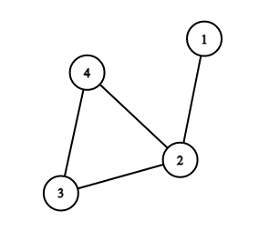

<h1 style='text-align: center;'> E. Number of Simple Paths</h1>

<h5 style='text-align: center;'>time limit per test: 2 seconds</h5>
<h5 style='text-align: center;'>memory limit per test: 256 megabytes</h5>

You are given an undirected graph consisting of $n$ vertices and $n$ edges. It is guaranteed that the given graph is connected (i. e. it is possible to reach any vertex from any other vertex) and there are no self-loops and multiple edges in the graph.

Your task is to calculate the number of simple paths of length at least $1$ in the given graph. 
## Note

 that paths that differ only by their direction are considered the same (i. e. you have to calculate the number of undirected paths). For example, paths $[1, 2, 3]$ and $[3, 2, 1]$ are considered the same.

You have to answer $t$ independent test cases.

Recall that a path in the graph is a sequence of vertices $v_1, v_2, \ldots, v_k$ such that each pair of adjacent (consecutive) vertices in this sequence is connected by an edge. The length of the path is the number of edges in it. A simple path is such a path that all vertices in it are distinct.

### Input

The first line of the input contains one integer $t$ ($1 \le t \le 2 \cdot 10^4$) — the number of test cases. Then $t$ test cases follow.

The first line of the test case contains one integer $n$ ($3 \le n \le 2 \cdot 10^5$) — the number of vertices (and the number of edges) in the graph.

The next $n$ lines of the test case describe edges: edge $i$ is given as a pair of vertices $u_i$, $v_i$ ($1 \le u_i, v_i \le n$, $u_i \ne v_i$), where $u_i$ and $v_i$ are vertices the $i$-th edge connects. For each pair of vertices $(u, v)$, there is at most one edge between $u$ and $v$. There are no edges from the vertex to itself. So, there are no self-loops and multiple edges in the graph. The graph is undirected, i. e. all its edges are bidirectional. The graph is connected, i. e. it is possible to reach any vertex from any other vertex by moving along the edges of the graph.

It is guaranteed that the sum of $n$ does not exceed $2 \cdot 10^5$ ($\sum n \le 2 \cdot 10^5$).

### Output

For each test case, print one integer: the number of simple paths of length at least $1$ in the given graph. 
## Note

 that paths that differ only by their direction are considered the same (i. e. you have to calculate the number of undirected paths).

## Example

### Input


```text
3
3
1 2
2 3
1 3
4
1 2
2 3
3 4
4 2
5
1 2
2 3
1 3
2 5
4 3
```
### Output


```text
6
11
18
```
## Note

Consider the second test case of the example. It looks like that:



There are $11$ different simple paths:

1. $[1, 2]$;
2. $[2, 3]$;
3. $[3, 4]$;
4. $[2, 4]$;
5. $[1, 2, 4]$;
6. $[1, 2, 3]$;
7. $[2, 3, 4]$;
8. $[2, 4, 3]$;
9. $[3, 2, 4]$;
10. $[1, 2, 3, 4]$;
11. $[1, 2, 4, 3]$.


#### Tags 

#2000 #NOT OK #combinatorics #dfs_and_similar #graphs #trees 

## Blogs
- [All Contest Problems](../Codeforces_Round_686_(Div._3).md)
- [Announcement (en)](../blogs/Announcement_(en).md)
- [Tutorial](../blogs/Tutorial.md)
