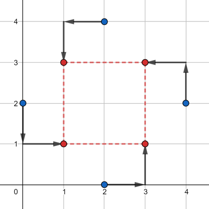

<h1 style='text-align: center;'> E. Four Points</h1>

<h5 style='text-align: center;'>time limit per test: 2 seconds</h5>
<h5 style='text-align: center;'>memory limit per test: 256 megabytes</h5>

You are given four different integer points $p_1$, $p_2$, $p_3$ and $p_4$ on $\mathit{XY}$ grid.

In one step you can choose one of the points $p_i$ and move it in one of four directions by one. In other words, if you have chosen point $p_i = (x, y)$ you can move it to $(x, y + 1)$, $(x, y - 1)$, $(x + 1, y)$ or $(x - 1, y)$.

Your goal to move points in such a way that they will form a square with sides parallel to $\mathit{OX}$ and $\mathit{OY}$ axes (a square with side $0$ is allowed).

What is the minimum number of steps you need to make such a square?

### Input

The first line contains a single integer $t$ ($1 \le t \le 10^4$) — the number of test cases.

Each test case consists of four lines. Each line contains two integers $x$ and $y$ ($0 \le x, y \le 10^9$) — coordinates of one of the points $p_i = (x, y)$.

All points are different in one test case.

### Output

For each test case, print the single integer — the minimum number of steps to make a square.

## Example

### Input


```text
3
0 2
4 2
2 0
2 4
1 0
2 0
4 0
6 0
1 6
2 2
2 5
4 1
```
### Output


```text
8
7
5
```
## Note

In the first test case, one of the optimal solutions is shown below: 

   Each point was moved two times, so the answer $2 + 2 + 2 + 2 = 8$.In the second test case, one of the optimal solutions is shown below: 

   The answer is $3 + 1 + 0 + 3 = 7$.In the third test case, one of the optimal solutions is shown below: 

   The answer is $1 + 1 + 2 + 1 = 5$.

#### Tags 

#2400 #NOT OK #brute_force #constructive_algorithms #flows #geometry #greedy #implementation #math #ternary_search 

## Blogs
- [All Contest Problems](../Educational_Codeforces_Round_99_(Rated_for_Div._2).md)
- [Announcement](../blogs/Announcement.md)
- [Tutorial](../blogs/Tutorial.md)
