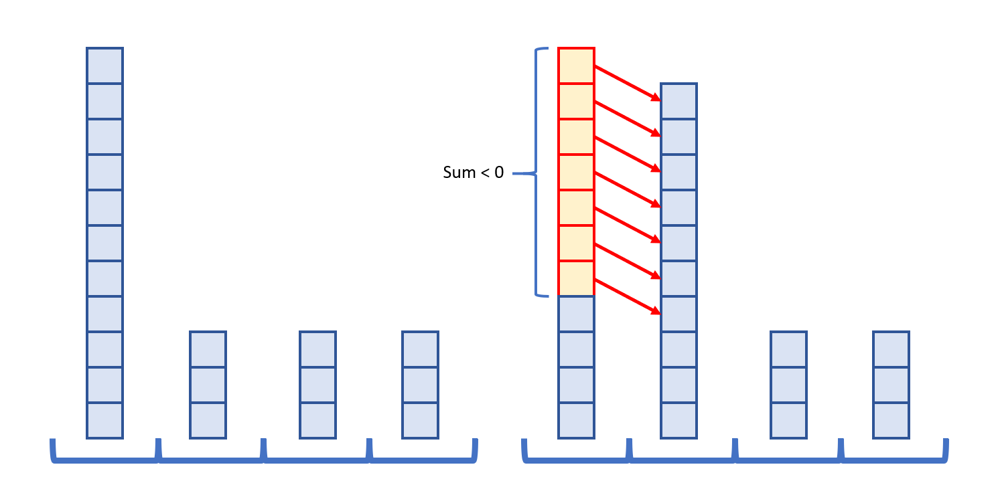

# Tutorial

### [1415A - Prison Break](https://codeforces.com/contest/1415/problem/A "Technocup 2021 - Elimination Round 2")

The problem is equivalent to finding the farthest cell from (x,y)(x,y). It is easy to see that, if they move optimally, (i,j)(i,j) can reach (x,y)(x,y) just by moving in an L shape, and this is equivalent to the Manhattan distance between the two points. The longest distance a prisoner will move on rows is max(x−1,n−x)max(x−1,n−x), and for the columns it is (y−1,m−y)(y−1,m−y). So answer is just max(x−1,n−x)+max(y−1,m−y)max(x−1,n−x)+max(y−1,m−y)

 
### [1415B - Repainting Street](https://codeforces.com/contest/1415/problem/B "Technocup 2021 - Elimination Round 2")

If we want to paint every house on the street with color xx, it is easy to see that we need to change every house with color different from xx, and not necessarily repaint houses already painted in color xx. We can do the following greedy algorithm to minimize the number of days: Find leftmost house not painted in color xx. Assume this is in position ii. Then we will paint [i,i+k−1][i,i+k−1] with color xx. Repeat this until all houses are painted in color xx. Why is this optimal? When we find the leftmost house not painted in xx, we know we need to change it, and as it is the leftmost one, everything before it is painted in xx. To maximize our chances of changing other houses that need repainting, we choose this as the leftmost position in our painting range. This can be implemented easily with a linear pass. However, we don't know the color xx that we will have at the end. Limit of colors are small enough, so we can try all of them and just keep the smallest answer.

Time complexity: O(n⋅max(c))O(n⋅max(c))

Space complexity: O(n)O(n)

 
### [1415C - Bouncing Ball](https://codeforces.com/contest/1415/problem/C "Technocup 2021 - Elimination Round 2")

Note that instead of deletion of the first cell we can increase the value of pp by one, these operations are equivalent. Now let's loop through the possible final values of pp, let it be qq (p≤q≤np≤q≤n). Then we need to add missing platforms in cells qq, (q+k)(q+k), (q+2k)(q+2k), and so on.

Let's compute the array cici — the number of cells without a platform among cells ii, (i+k)(i+k), (i+2k)(i+2k), an so on. It can be computed using the method of dynamic programming, going from large ii to small: ci=ci+k+(1−ai)ci=ci+k+(1−ai).

Now the time required to add the platforms for a given value of qq is cq⋅xcq⋅x, while the time needed to increase pp to qq is (q−p)⋅y(q−p)⋅y. The total time equals cq⋅x+(q−p)⋅ycq⋅x+(q−p)⋅y. We only have to choose minimum among all possible values of qq.

 
### [1415D - XOR-gun](https://codeforces.com/contest/1415/problem/D "Technocup 2021 - Elimination Round 2")

First let's compute array b1,b2,…,bnb1,b2,…,bn, where bibi is the index of the highest bit equal to 11 in the binary notation of aiai. The statement says bi≤bi+1bi≤bi+1. These values can be computed by dividing the given numbers by 22 until they are zero.

Note that if for a given ii the equality bi−1=bi=bi+1=tbi−1=bi=bi+1=t holds, then we can apply an operation to aiai and ai+1ai+1, and the resulting integer is smaller than ai−1ai−1. Indeed, in ai−1ai−1 the highest bit set is tt, but in ai⊕ai+1ai⊕ai+1 the tt-th and higher bits are zeros. That means if there is such an ii (it is easy to check in a single linear pass), then the answer is 11.

Now note that if there is no such ii, then the size of the array nn is not bigger than 2⋅(⌊log2109⌋+1)=602⋅(⌊log2109⌋+1)=60! Indeed, there are no more than two integers with the same highest bit set. It is much easier to solve the problem in such constraints. 

Consider some solution. In the final array, let's denote it as cc, there is ii such that ci>ci+1ci>ci+1. Note that each element of the final array is equal to XOR of some subsegment of the initial array, and each element of the initial array belongs to exactly one such subsegment. Let this subsegment for cici be al,al+1,…,amal,al+1,…,am, and for ci+1ci+1 be am+1,am+2,…,aram+1,am+2,…,ar. Then it's clear that to find an optimal solution it is enough to loop through all possible values of ll, mm, and rr and check whether XOR of all elements of the left subsegment is larger than XOR of all elements of the right subsegment. If this inequality holds, update answer with value r−l−1r−l−1. The complexity of this part is O(n3)O(n3) or O(n4)O(n4) depending on implementation.

 
### [1415E - New Game Plus!](https://codeforces.com/contest/1415/problem/E "Technocup 2021 - Elimination Round 2")

We see that each playthrough (whether it is the first one or any of the playthroughs after the reset) is completely independent of any other playthrough. Thus, we should instead think of the problem as partitioning the nn bosses into k+1k+1 playthroughs.

 Consider a playthrough with xx bosses which have point increments a1,a2,⋯,axa1,a2,⋯,ax when fought in order. Then, the number of points that we will get is (x−1)a1+(x−2)a2+…+(1)ax−1+(0)ax(x−1)a1+(x−2)a2+…+(1)ax−1+(0)ax. A simple greedy argument tell us that within a single playthrough, we should always fight the bosses in non-increasing order of point increments, i.e. a1≥a2≥…≥axa1≥a2≥…≥ax. 

 We can visualize this with k+1k+1 stacks, each representing a playthrough. Each stack contains all of the bosses that will be fought in that playthrough, and the stack is non-increasing from top to bottom, meaning we fight the bosses from top to bottom. 

  We now see that k=0k=0 is a fairly trivial case; just fight the bosses in non-increasing order of point increments. For the rest of the tutorial, we will assume k≥1k≥1. 

 For simplicity, we say that a boss is in position pp of a playthrough if there are pp more bosses below this one on its playthrough stack. Notice that if we have two bosses in two different playthroughs with point increments aa and bb with positions ii and jj in their respective playthroughs, then the total points gained from the two bosses is ia+jbia+jb. We now see that if a≥ba≥b, then i≥ji≥j and vice versa. For example, the configuration below is not optimal because swapping the −5−5 and −3−3 gives a better answer.

   Therefore, all bosses in lower-numbered positions should have point increments that are less than any boss in a higher-numbered position. This means that we can place the bosses on the stacks one at a time in non-decreasing order of point increments to reach an optimal configuration.

 Call a boss good if it has a non-negative point increment, and bad otherwise. Let's fix the arrangement of bad bosses and try to place the good bosses in non-decreasing order of point increments. We can see that placing a boss with point increment aa on a stack with height hh will add ahah to the total, so we should always pick the stack with maximum height. Thus, all of the good bosses will always end up on the same stack, and that stack will be the stack of maximum height. Call this stack the main stack; the other kk stacks are the side stacks.

 If there exists two side stacks whose heights differ by at least 22, then we can always move the top-most bad boss of the taller side stack to the shorter side stack and decrease the loss in points. In the example below, the −10−10 on the left stack (of height 55) can be moved down to the top of the right stack (of height 33). 

  Thus, the maximum and minimum heights of these kk side stacks cannot differ by more than 1. 

 Let the minimum height of these kk stacks be hh. If we consider the bottom hh bosses of all k+1k+1 stacks, we see that they still must have the property that all bosses in lower positions have point increments that are less than any boss in higher positions. Thus, they must consist of the h(k+1)h(k+1) bosses with smallest point increments. 

 Direct Greedy

We first sort the bosses in non-decreasing order of point increments. For each possible prefix PP that contains only negative point increments, we take all bosses in PP and distribute them evenly across the k+1k+1 stacks. We then take the remaining bosses and place them on the tallest of the stacks (if there are multiple stacks of the same height, the result is the same). 

 Performing this computation naively takes O(n2)O(n2) time, but this can be sped up using precomputation of weighted prefix and suffix sums to evaluate all configurations in O(n)O(n). The final time complexity is O(nlogn)O(nlogn) due to sorting.

Smarter Greedy

Let's take all nn point increments and place them in a "sliding" stack such that they are arranged in non-decreasing order from bottom to top. We will slide the stack across the k+1k+1 playthroughs and leave the bottom point increment behind. Shown below is an example with n=8n=8 and k=2k=2.

  Every time we slide the stack, we reduce the total by the sum of all of the point increments that we slide down by 11 position. Thus, we should only slide it down if the sum of those is less than 00 as that will give us a more optimal solution.

  We notice that the point increments that we slide down always form a suffix of the point increments when sorted in non-decreasing order. The moment we stop sliding is when the sum of the suffix is non-negative, giving the optimal solution. Thus, we can find the optimal configuration directly by finding the right suffix and distributing the remaining negative point increments evenly.

 Genius Greedy (found by K0u1e)

Sort the point increments in non-increasing order a1,a2,…,ana1,a2,…,an. Maintain a priority queue that initially contains k+1k+1 zeros. We now process the point increments in non-increasing order.

 To process the current point increment aiai, we perform the following steps in order: 

* Find the largest number xx in the priority queue and remove it from the priority queue
* Add xx to our running total
* Push x+aix+ai back into the priority queue

The answer is the final total at the end. It will be left as an exercise to the reader to figure out why this solution is indeed equivalent to the previous solution. 

 
### [1415F - Cakes for Clones](https://codeforces.com/contest/1415/problem/F "Technocup 2021 - Elimination Round 2")

Let mintimeimintimei be the minimum time we can get to coordinate xixi given that all previous cakes are collected and the latest created clone is already useless. Also let dpi,jdpi,j be a boolean being true if we can reach a situation where we just collected the ii-th cake, and our clone is currently waiting for the cake jj in correct position.

Let us currently be in the position of the ii-th event and the latest clone is useless (state mintimeimintimei). Then it is always optimal to collect the ii-th cake with a new clone while we move somewhere. There are two possible options for further actions: 

1. We directly go to the next event. Then we just need to update mintimei+1mintimei+1, and not forget to wait for the clone to collect the ii-th cake.
2. We want to leave clone somewhere waiting for some jj-th cake and go take the (i+1)(i+1)-th cake ourselves. Then if we have enough time to do that, make dpi+1,jdpi+1,j reachable.

Let us be in the state dpi,jdpi,j (we have just collected the ii-th cake, and our clone is waiting for the jj-th cake). If i+1≠ji+1≠j, then we should just go and collect the i+1i+1-th cake, otherwise there are two possibilities: 

1. The j+1j+1-th cake is collected by a new clone, then we have to updated mintimej+1mintimej+1.
2. We want to leave a new clone waiting for some later cake kk (after the old one collects cake jj), and take the j+1j+1-th cake ourselves, then the transition leads to the state dpj+1,kdpj+1,k.

We can collect all cakes if mintimen≤tnmintimen≤tn, or dpn−1,ndpn−1,n is reachable.

The total complexity is O(n2)O(n2), because we only loop through the position of the next clone in O(n)O(n) states.

 
### [1456E - XOR-ranges](../problems/E._XOR-ranges.md "Codeforces Round 687 (Div. 1, based on Technocup 2021 Elimination Round 2)")

First, we will make all segments exclusive for convenience.

Assume we have segment (l,r)(l,r), we gonna analyze the process of forming xx from highest bit to lowest bit: Let hbhb is the highest bit such that hbhb-th bit of ll and rr are different (Apparently, bits higher than hbhb of x has to be same with bits of ll and rr). We call hbhb key bit of the segment. Now we set hbhb-th bit of xx off (almost similar if we set on). From now on, we have x<rx<r and continue considering lower bits. If the considered bit is on in ll, we must set this bit on in xx, otherwise, we have two choices: 

* Set this bit off in xx and consider lower bits.
* Set this bit on in xx and don't need to care about lower bits (Because x>lx>l now).

 Let call low bits that we don't need to care free bits.Back to the problem, imagine if we fixed all non-free bits of every element, how should we set other bits in order to minimize the cost? It's quite simple: Consider ii-th bit, call the pair (l,r)(l,r) visible if ii-th bits of ll and rr are non-free but ones of A[l+1,l+2,..,r−1]A[l+1,l+2,..,r−1] are free. For each visible pair such that ii-th bit of endpoints in this pair are different from each other, we'll add cici to the answer. This thing inspire us to write a dynamic programming function: dp(i,l,r,state(l),state(r))dp(i,l,r,state(l),state(r)) (state(l)state(l) is (f,c)(f,c) with ff is how did you set key bit for ll-th element, and cc is where is lowest non-free bit of this element (equal to or lower than ii), similar to state(r)state(r)) is minimal cost at ii-th and higher bits of A[l..r]A[l..r] such that (l,r)(l,r) is currently visible. We have two types of transition: 

* Make (l,r)(l,r) really visible by going to (i+1)(i+1)-th bit.
* Make (l,r)(l,r) invisible by choosing md(l<md<r)md(l<md<r) and choosing state(md)state(md) such that lowest non-free bit of mdmd-th element is ii.

 (Note that if ii is the highest bit, first transition only be allowed if l+1=rl+1=r)Our answer is just dp(0,0,N+1,(0,0),(0,0))dp(0,0,N+1,(0,0),(0,0))

