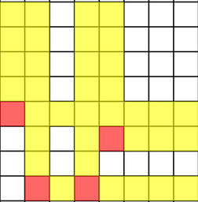
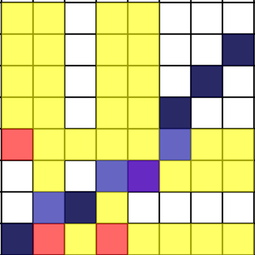

# Tutorial_(en)

Keeping track of both Codeforces round and online team contest was a doozy, so this is only the best draft of the editorial I have. Missing problems will gradually be added, and existing explanations may improve over time. Hope you enjoyed the problems, and let me know if anything can be explained better!

**UPD**: okay, all of the problems are out, and most of the bugs are fixed (I hope). By the way, we had a nice [discussion](https://codeforces.com/https://youtu.be/1OWGTQpfk5Y) with [Errichto](https://codeforces.com/profile/Errichto "International Grandmaster Errichto") on his stream about Div. 2 problems, which some of you may find more approachable. Be sure to check it out, as well as other stuff [Errichto](https://codeforces.com/profile/Errichto "International Grandmaster Errichto") creates!

 
### [1459A - Red-Blue Shuffle](https://codeforces.com/contest/1459/problem/A "Codeforces Round 691 (Div. 2)")

First we can observe that if a card has $r_i = b_i$, then if doesn't affect the comparison between $R$ and $B$ regardless of its position. We can forget about all such cards. Formally, if we erase all such cards after the permutation, then $R$ and $B$ are still compared in the same way, and further all the remaining cards are still permuted equiprobably.

Now we only have cards with $r_i > b_i$ (let's call them Red-favourable) and $r_i < b_i$ (call them Blue-favourable). But then, the comparison between $R$ and $B$ will only be decided by whether the first card is Red- or Blue-favourable. Naturally, if, say, there are more Red-favourable cards than Blue-favourable cards, then Red is more likely to win. If there is an equal number of Red- and Blue-favourable cards, then the chances are equal.

Thus, for the solution purposes we only need to count indices $i$ with $r_i > b_i$ and those with $r_i < b_i$, and compare these two numbers.

 
### [1459B - Move and Turn](https://codeforces.com/contest/1459/problem/B "Codeforces Round 691 (Div. 2)")

We will describe an $O(1)$ formula solution. Some slower solutions were also allowed.

First, consider the case when $n$ is even. Regardless of the initial direction, we will make $n / 2$ horizontal (west-east) steps and $n / 2$ vertical (north-south) steps. Further, directions of horizontal and vertical steps may be decided independently.

If we have to make, say, $k$ horizontal steps choosing left/right direction every time, there are $k + 1$ possible horizontal positions $x$ we can end up in. Indeed, all possible ways can be grouped as follows:

* $k$ steps left, $0$ steps right: $x = -k$;
* $k - 1$ steps left, $1$ step right: $x - -k + 2$;
* ...
* $0$ steps left, $k$ steps right: $x = k$.

Back in the case of even $n$, since the directions for vertical and horizontal steps can be chosen independently, there are $(n / 2 + 1)^2$ possible combinations of final $x$ and $y$.

Let's now say that $n = 2k + 1$ is odd. If we start with a horizontal step, then in total we will be making $k + 1$ horizontal steps and $k$ vertical steps, thus the number of combinations here is $(k + 1) \times (k + 2)$. A similar argument applies for when we start with a vertical step. Finally, observe that it is impossible to reach the same position starting with both vertical and horizontal step. This is because the parity of, say, the final horizontal position $x$ is the same as the number of horizontal steps, thus it can not be the same after $k$ and $k + 1$ horizontal steps. Thus, in the odd case the answer is $2(k + 1)(k + 2)$, where $k = n / 2$ rounded down.

 
### [1459C - Row GCD](https://codeforces.com/contest/1459/problem/C "Codeforces Round 691 (Div. 2)")

From basic properties of GCD we know that $GCD(x, y) = GCD(x - y, y)$. The same applies for multiple arguments: $GCD(x, y, z, \ldots) = GCD(x - y, y, z, \ldots)$. Let's use this for $GCD(a_1 + b_j, \ldots, a_n + b_j)$ and subtract $a_1 + b_j$ from all other arguments: $GCD(a_1 + b_j, \ldots, a_n + b_j) = GCD(a_1 + b_j, a_2 - a_1, \ldots, a_n - a_1)$.

If we find $G = GCD(a_2 - a_1, \ldots, a_n - a_1)$, then any answer can be found as $GCD(a_1 + b_j, G)$. Note that we have to assume that GCD of an empty set is $0$, and $GCD(x, 0) = x$ for any $x$, since $0$ is the only number divisible by any other number.

 
### [1459D - Glass Half Spilled](https://codeforces.com/contest/1459/problem/D "Codeforces Round 691 (Div. 2)")

Suppose that we want to collect water in a certain set of chosen glasses $S$. Let $A_S$ be the total capacity of chosen glasses, and $B_S$ be the total amount of water currently contained in chosen glasses. Also, let $B$ be the total amount of water in all glasses. 

Clearly, the optimal way is to directly transfer water from non-chosen glasses to chosen ones. Then, we already secured $B_S$ units, and we can transfer up to $B - B_S$ units, thus the largest possible amount is $B_S + (B - B_S) / 2 = B / 2 + B_S / 2$. But all this water may not fit into the chosen glasses, so the actual amount we collect is $\min(A_S, B / 2 + B_s / 2)$.

To find the optimum answer for each $k$, let's use dynamic programming: define $dp[i][k][A]$ as the largest possible $B_S$ for a subset of $k$ glasses among $1, \ldots, i$ such that the total capacity in the subset is $A$. We can recalculate this with transition $dp[i][k][A] = \max(dp[i - 1][k][A], dp[i - 1][k - 1][A - a[i]] + b[i])$. Then, $ans[k] = \max_A \min(A, dp[n][k][A] / 2 + B / 2)$. Time complexity is $O(n^3 \max a_i)$, where $\max a_i$ is the largest capacity of a glass. We can also get rid of storing the first dimension $i$ by overwriting DP values as $i$ increases, and obtain $O(n^2 \max a_i)$ memory.

 
### [1459E - Latin Square](https://codeforces.com/contest/1459/problem/E "Codeforces Round 691 (Div. 2)")

For convenience, let's assume that all row and column indices, as well as matrix values, are from $0, \ldots, n - 1$ instead for $1, \ldots, n$.

If only shift operations were present, we could solve the problem in linear time: just maintain where the top left corner ends up after all the shifts, and then the matrix can be easily reconstructed (if this is not immediately clear to you, take a moment and think how this should be done). For the inverse operations, the approach is going to be similar, but we'll need a different way to look at the matrix. Instead of the matrix, let's think about the set of all triples $(i, j, a[i][j])$. Imagining a set of $n^2$ points in 3D, where $i, j$ are $x$ and $y$ coordinates in the horizontal plance, and $a[i][j]$ is the height $z$ is a good mental picture.

Shift operations apply $x \to (x \pm 1) \bmod n$ and $y \to (y \pm 1) \bmod n$ to all points. We can think of this as a translation of the entire 3D space, with some looping at the borders. Instead of the given points, let's keep track of where the point $(0, 0, 0)$ is located after the operations are done; it's just as easy as in two-dimensional version from before.

Now let's introduce the inverses. Consider, say, a row inverse operation, and all the points $(i, j, k)$, where $k = a[i][j]$, that have the same row index $i$. As an example, suppose that the top ($0$-th) row of the matrix contains numbers $(2, 1, 3, 0)$. The entries in the row correspond to points $(0, 0, 2)$, $(0, 1, 1)$, $(0, 2, 3)$, $(0, 3, 0)$. The inverse permutation to this row is $(3, 1, 0, 2)$, thus the new set of points should be $(0, 0, 3)$, $(0, 1, 1)$, $(0, 2, 0)$, $(0, 3, 2)$. In general, if there is currently a point $(i, j, k)$ in the set, then after the inverse there must be a point $(i, k, j)$. Thus, the entire operation may be summarized as "swap the second and third coordinates". Similarly, the column inverse is "swap the first and third coordinates". Again, we think of this transformation applied to the entire 3D space: this can be seen as a mirror reflection with respect to $y = z$ or $x = z$ plane.

How does this affect our "keep track of $(0, 0, 0)$" approach? It is easy to update its position: just swap respective coordinates. However, we now need to care about how the answer is reconstructed, since, say, the point $(1, 0, 0)$ not necessarily ends up one step to the right of $(0, 0, 0)$. Thus, in addition, let's keep track of how the direction vectors $v_x = (1, 0, 0)$, $v_y = (0, 1, 0)$, $v_z = (0, 0, 1)$ are permuted after all operations. Shifts do not affect them, but inverses swap two of them, depending on which coordinates where swapped.

We are almost done, we just need to reconstruct the answer at the end. If we had an initially given point $p = (i, j, k)$, where will it end up? If the origin ends up at a position represented as a vector $v_0 = (x, y, z)$, then $p$ ends up at $p' = v_0 + iv_x + jv_y + kv_z$, where $v_x, v_y, v_z$ are permuted accordingly. Once we have the result $p' = (i', j', k')$, all we need is to put $k'$ into $b[i'][j']$, where $b$ is the answer matrix.

This results, once again, in a linear time solution. This explanation could have been much shorter with some linear-algebraic machinery (basically each transformation = multiplication by a certain matrix), but I chose to leave it as elementary ($\neq$ simple!) as possible.

 
### [1459F - Flip and Reverse](https://codeforces.com/contest/1459/problem/F "Codeforces Round 691 (Div. 2)")

Let's go over characters of $s$ left to right and keep track of the balance = (the number of $0$'s) - (the number of $1$'s) among the visited characters. We can think about starting at the point $0$, and moving right (from $x$ to $x + 1$) when we see a $0$, and moving left (to $x - 1$) when we see a $1$. Each time we go from $x$ to $x \pm 1$, let's connect the two points with an edge. We'll keep track of all the edges, even if there are multiple ones connecting the same pair of points. Since our path visits all edges we've created exactly once, it is an Eulerian path in the (multi)graph constructed this way. The start point of the path is $0$, and the finish point is equal to the total balance of the string $s$.

Now, let's think about what a transformation does. A valid substring subject to the transformation has an equal number of $0$'s and $1$'s, thus it must correspond to a part of our path which is a round tour from a point $x$ back to itself. Flipping and reversing the substring makes us traverse all the same edges, but in reverse order and in reverse direction. Thus, in terms of graphs and paths, what we're doing is reversing a cycle that occurs in the Eulerian path. Note that the collection of edges is preserved after every operation, in other words, the graph is an invariant of the process. Furthermore, the start and finish of the path also stay the same.

The answer (= lex. min. string) thus also corresponds to a certain Eulerian path in the very same graph, but which one? It should be the lex. min. path (where we prefer going right before going left) that is obtainable from the initial one with cycle reverses. However, the important observation is: in this particular graph any Eulerian path is obtainable from any other one with cycle reverses (as long as they start and finish in the same places).

There are a few ways to prove this. For example, consider two Eulerian paths, and look at the first point where they diverge: say, one goes $x \to x + 1$, while the other goes $x \to x - 1$. But both paths will have to eventually return to $x$ to go in the other direction, thus there is at least one extra edge in each direction $x \to x + 1$ and $x \to x - 1$, unvisited before the divergence happened. Let's wait until the first path visits at least two edges between $x$ and $x - 1$, returning back to $x$, and reverse the resulting cycle. With this, the next edge after diverging have changed from $x \to x + 1$ to $x \to x - 1$, and now the two paths diverge some time later. We can proceed until both paths are the same.

The observation implies that we should simply look for the lex. min. Eulerian path in the entire graph. Let's try to do this greedily: build the path from the beginning, marking edges as used when we traverse them. Take the transition $x \to x + 1$ whenever there is a unused edge leading there, otherwise settle for $x \to x - 1$. There is a caveat, though: we can not go $x \to x + 1$ if this uses the last edge between $x$ and $x + 1$, and additionally we still have to visit $x$ some time later (say, if $x$ has unused edges to $x - 1$). However, with this extra condition in place, the greedy algorithm will always find an Eulerian path, and it's clearly the lex. min. one. This procedure is fairly easy to implement in linear time: reconstruct the graph and do the greedy thing.

 
### [1458E - Nim Shortcuts](../problems/E._Nim_Shortcuts.md "Codeforces Round 691 (Div. 1)")

Given the shortcut positions, we can immediately mark some initial positions as winning or losing for the first player. Namely, all shortcut positions are immedilately losing, and any position within one move of a shortcut position is winning (unless it's also a shortcut position). In an example picture below cells $(x, y)$ correspond to different initial positions. Red cells mark shortcut positions, and yellow cells are single move wins.

  Which of the unmarked positions are losing for the starting player? We can repeatedly apply the usual game-analysing rule: if all positions reachable in one move from a position $(x, y)$ are known to be wins, then position $(x, y)$ loses. We'll consider all candidates subject to this rule in lexicographic order. The first candidate is the position $(0, 0)$. A few situations can happen as we proceed forward:

* $(x, y)$ is a shortcut position. There's no need to mark it as losing, just go to $(x + 1, y + 1)$, as all positions $(x + 1, y)$, $(x + 2, y)$, $\ldots$ and $(x, y + 1)$, $(x, y + 2)$, $\ldots$ are known to be single-move wins to $(x, y)$.
* $(x, y)$ is a single move win to a shortcut $(x', y)$ with $x' < x$. Then, skip $(x, y)$ and go to the next natural candidate $(x + 1, y)$, since all cells $(x, y + 1)$, $(x, y + 2)$, $\ldots$ are known to be single-move wins to $(x', y)$.
* $(x, y)$ is a single move win to a shortcut $(x, y')$ with $y' < y$. Then, skip $(x, y)$ and go to the next natural candidate $(x, y + 1)$, since all cells $(x + 1, y)$, $(x + 2, y)$, $\ldots$ are known to be single-move wine to $(x, y')$.
* Neither of the above applies. Then, there can be no losing positions reachable in one move from $(x, y)$: single-move wins are eliminated, and all manually marked positions $(x', y'$) saitsfy $x' < x$, $y' < y$. Thus, per our rule, we mark $(x, y)$ as losing and proceed to $(x + 1, y + 1)$.

Here's what happens in the picture above. All candidates considered throughout the process are tinted blue, and all identified losing positions are dark blue.

  With this procedure we can identify all losing positions $(x, y)$ under $x, y \leq C$ in roughly $O(C \log n)$ time ($n$ is the number of shortcuts). This is too slow since coordinates can be up to $10^9$. However, we can speed up consecutive applications of the last case of the above procedure as follows:

* ...
* Neither of the above applies. Let $X > x$ and $Y > y$ be the closest $x$-coordinate and $y$-coordinate of a shortcut position respectively ($X$ and $Y$ may correspond to different shortcut positions). Let $\Delta = \min(X - x, Y - y)$. Then, mark all positions $(x, y), (x + 1, y + 1), \ldots, (x + \Delta - 1, y + \Delta - 1)$ as losing, and go to $(x + \Delta, y + \Delta)$.

This is justified since all thusly marked positions don't share any coordinate with a shortcut, thus surely they're all subject to this case of the procedure.

Looking up $X$ and $Y$ can be implemented with sets of all $x_i$ and $y_i$, and upper bound calls. Further, instead of marking all cells $(x, y), (x + 1, y + 1), \ldots, (x + \Delta - 1, y + \Delta - 1)$ one by one, let's memorize them as a diagonal segment, described by the initial point $(x, y)$ and length $\Delta$. We can now observe that the optimized process only takes $O(n)$ steps. Indeed, for each step we can find a shortcut $(x_i, y_i)$ such that either $x \geq x_i$ or $y \geq y_i$ is true for the first time. In particular, the number of diagonal segments representing all additional losing positions is $O(n)$.

Now, to answer any query $(a, b)$ we have to check if one of the following is true:

* $(a, b)$ is a shortcut;
* $(a, b)$ belongs to a diagonal segment.

The first condition is easy to check if all shortcuts are stored, say, in a set structure. Diagonal segments can also be stored in a set, and we can find the closest to $(a, b)$ with a lower bound, say, by comparing $x$-coordinates. This results in an $O(n \log n)$ precomputation, and $O(\log n)$ per initial position query.

*(Kudos to [Golovanov399](https://codeforces.com/profile/Golovanov399 "International Grandmaster Golovanov399") for his neat [grid drawing tool](https://codeforces.com/https://golovanov399.github.io/grid/rect_grid_draw.htm))*

 
### [1458F - Range Diameter Sum](../problems/F._Range_Diameter_Sum.md "Codeforces Round 691 (Div. 1)")

Please bear with my formal style for this one as my hand-waving skills are too weak to explain this properly.

We'll use the "divide-and-conquer" strategy. Let us implement a recursive procedure $solve(l, r)$ that will compute the sum $\sum_{l \leq i \leq j \leq r} diam(i, j)$. It will do so as follows:

* If $l = r$, then answer is trivially $0$.
* Otherwise, choose $m = \lfloor(l + r) / 2 \rfloor$, and compute the following sum: $\sum_{i = l}^m \sum_{j = m + 1}^r diam(i, j)$.
* The only entries $diam(i, j)$ that are not accounted for satisfy either $l \leq i \leq j \leq m$ or $m + 1 \leq i \leq j \leq r$. Compute their total as $solve(l, m) + solve(m + 1, r)$, and return the total answer.

Of course, $\sum_{i = l}^m \sum_{j = m + 1}^r diam(i, j)$ is the tricky part. We'll need some preparation to compute it. To make arguments cleaner, let us introduce an extra vertex in the middle of every edge, subdividing it into two. We'll refer to new vertices as extra vertices, and the old vertices as proper vertices. Since all distances are doubled, we will have to divide the answer by two in the end.

We will define a circle $C(v, r)$ of radius $r$ centered at a vertex $v$ in the tree as the set of all vertices at distance at most $r$ from the vertex $v$. We also assume that if $r > 0$ there are at least two vertices in $C(v, r)$ exactly at distance $r$ from $v$, otherwise decrease $r$ accordingly.

For a set of vertices $S$ we define $Cover(S)$ as a circle of smallest radius containing all vertices of $S$. If we assume that all vertices of $S$ are proper, then $Cover(S)$ is unique. Indeed, after subdividing all distances among $S$ are even, thus in $Cover(S) = (v, r)$ we must have $r = diam(S) / 2$, and $v$ is the unique diameter midpoint. We can see that if $r > 0$, then $S$ has at least two vertices at distance $r$ from the covering circle center $v$, namely, the diameter endpoints.

Warning: math ahead. It you're not interested in proofs, only read the premise of Lemma 2.

Lemma 1. If a circle $C(v, r)$ contains two proper vertices $a, b$, then it also contains the midpoint $c$ on the path between $a, b$, and further $dist(v, c) \leq r - dist(a, b) / 2$.

Proof. Say, for the vertex $a$ we have $dist(v, a) \leq dist(v, c) + dist(c, a) = dist(v, c) + dist(a, b) / 2$. This inequality is strict: $dist(v, a) < dist(v, c) + dist(c, a)$ only when $v$ and $a$ are in the same subtree with respect to $c$. If we assume that respective inequalities for $a, b$ are both strict, then both $a, b$ are in the same subtree of $c$, in which case $c$ can not be the midpoint. Otherwise, say, for $a$ we have $r \geq dist(v, a) = dist(v, c) + dist(c, a) = dist(v, c) + dist(a, b) / 2$, and $dist(v, c) \leq r - dist(a, b) / 2$ by simple rearrangement.

An immediate corollary of this lemma is this: if a circle $C(v, r)$ contains a set of proper vertices $S$, it also contains $Cover(S)$. We apply the lemma to the midpoint of $diam(S)$, which is also the center $v'$ of $Cover(S) = C(v', r')$, to establish $dist(v, v') \leq r - r'$. Then, for any vertex $w$ of $Cover(S)$ we $dist(v, w) \leq dist(v, v') + dist(v', w) \leq r$, thus $w \in C(v, r)$.

Lemma 2. Let $S$, $T$ be two non-empty sets of proper vertices. Then the smallest covering circle $Cover(S \cup T)$ can be found by only knowing $Cover(S)$ and $Cover(T)$, by the following rule:

* If $Cover(S) \subseteq Cover(T)$, then $Cover(S \cup T) = Cover(T)$.
* If $Cover(T) \subseteq Cover(S)$, then $Cover(S \cup T) = Cover(S)$.
* Let none of $Cover(S) = (v_S, r_S)$ and $Cover(T) = (v_T, r_T)$ contain the other one. Then, $Cover(S \cup T) = C(V, R)$ has radius $R$ equal to $(r_S + dist(v_S, v_T) + r_T) / 2$ (which is asserted to be an integer), and its center $V$ is located on the unique path $v_S v_T$ at distance $(r - r_S) / 2$ (which is asserted to be an integer) from $v_S$.

Proof. The first two cases are somewhat easy. Say, in the first case $Cover(S \cup T)$ has to contain $T$, then it must contain $Cover(T)$, and then it contains $Cover(S)$ by default.

Now, assume the latter case. Any two vertices $v \in S$, $u \in T$ satisfy $dist(v, u) \leq dist(v, v_S) + dist(v_S, v_T) + dist(v_T, u) \leq r_S + dist(v_S, v_T) + r_T$, thus $\max dist(v, u) = 2R \leq r_S + dist(v_S, v_T) + r_T$. Now, let $ab$ and $cd$ be diameter endpoints of $S$ and $T$ respectively. Here we can even choose, say, $a$ outside of $Cover(T)$, since $S \not \subseteq Cover(T)$, similarly choose $c \not \in Cover(S)$. We then must have $dist(a, c) = r_S + dist(v_S, v_T) + r_T$, thus $Cover(S \cup T)$ has radius $R$ at least half of that, and $V$ is the only possible center candidate.

When one or both of $Cover(S)$ and $Cover(T)$ has zero radius, the claim can established pretty much directly.

Okay, we're out of the woods now!

The last lemma allows us to maintain $Cover(S) = C(v, r)$ for any set $S$, and further "merge" $Cover(S)$ and $Cover(T)$ to obtain $Cover(S \cup T)$, since all we need is distances between vertices, and finding a vertex on a $v_S v_T$ at certain distance from $v_S$. We can also efficiently check if $C(v, r)$ contains $C(v', r')$ by verifying $dist(v, v') \leq r - r'$. All of that can be done with binary lifting and LCA manipulations in $O(\log n)$ per operation.

At last, let's get back to the divide-and-conquer step. Let us find circles $C_1(i) = (v_i, r_i) = Cover(i, \ldots, m)$, and $C_2(j) = (v_j, r_j) = Cover(m + 1, \ldots, r)$ for all relevant $i, j$. We have $C_1(m) = C(m, 0)$, and $C_1(i)$ is a merge of $C_1(i + 1)$ and $C(i, 0)$ for any smaller $i$; similar for $C_2(j)$.

Now, let's consider the sum $\sum_{j = m + 1}^r diam(i, j)$ for some $i$. $diam(i, j)$ is equal to twice the radius of the merge of $C_1(i)$ and $C_2(j)$. Consider increasing $j$ from $m + 1$ to $r$. Since $C_2(j) \subseteq C_2(j + 1)$ for any $j$, we have three interesting ranges for $j$, in order from left to right:

1. $j \in [m + 1, t_1(i))$: $C_2(j) \subseteq C_1(i)$;
2. $j \in [t_1(i), t_2(i))$: $C_1(i)$ and $C_2(j)$ are not contained in each other;
3. $j \in [t_2(i), r]$: $C_1(i) \subseteq C_2(j)$.

In the first range $diam(i, j) = 2r_i$, and in the third range $diam(i, j) = 2r_j$. If we know the boundaries $t_1(i)$ and $t_2(i)$, then these can be accounted for with prefix sums on $r_j$ (and simple multiplcation for $r_i$).

In the second range we have to sum up $r_i + dist(v_i, v_j) + r_j$. Again, summands $r_i$ and $r_j$ are accounted in the same way. Only $\sum_{j \in [t_1(i), t_2(i))} dist(v_i, v_j)$ remains.

Instead of computing this directly right now, consider how $t_1(i)$ and $t_2(i)$ change as $i$ decreases from $m$ to $l$. We have $C_1(i) \subseteq C_1(i - 1)$, thus we can conclude that $t_1(i)$ and $t_2(i)$ both do not decrease, and the range $[t_1(i), t_2(i))$ is a "sliding window" with both endpoints moving to the right. Boundaries $t_1(i)$ and $t_2(i)$ can thus be maintained with the two-pointers approach, and vertices in the range can be maintained with a queue, where vertices enter from the right and leave from the left.

On top of the queue that supports "push-back" and "pop-front", we'd also like to query "sum of distances from an arbitrary vertex $v$ to all vertices in the queue". To this end (and only this), we will have to use centroid decomposition in its most basic form. It's fair to say that the margins of this explanation are already too crowded for a proper explanation of this. In short, we can add/remove vertices and query the distance sum in $O(\log n)$ time. This concludes the divide-and-conquer step description.

With the usual divide-and-conquer time analysis we arrive at an $O(n \log^2 n)$ solution.

