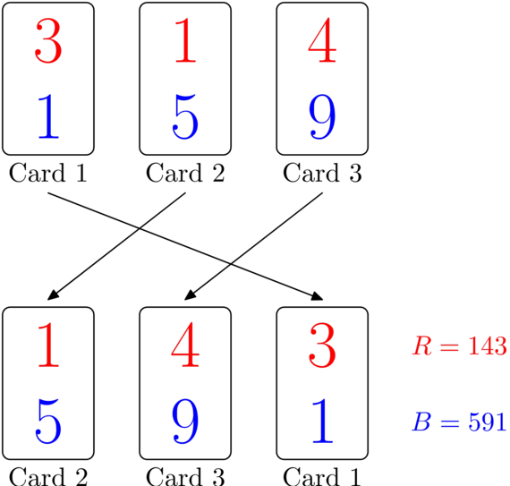

<h1 style='text-align: center;'> A. Red-Blue Shuffle</h1>

<h5 style='text-align: center;'>time limit per test: 2 seconds</h5>
<h5 style='text-align: center;'>memory limit per test: 512 megabytes</h5>

There are $n$ cards numbered $1, \ldots, n$. The card $i$ has a red digit $r_i$ and a blue digit $b_i$ written on it.

We arrange all $n$ cards in random order from left to right, with all permutations of $1, \ldots, n$ having the same probability. We then read all red digits on the cards from left to right, and obtain an integer $R$. In the same way, we read all blue digits and obtain an integer $B$. When reading a number, leading zeros can be ignored. If all digits in a number are zeros, then the number is equal to $0$. Below is an illustration of a possible rearrangement of three cards, and how $R$ and $B$ can be found.

  Two players, Red and Blue, are involved in a bet. Red bets that after the shuffle $R > B$, and Blue bets that $R < B$. If in the end $R = B$, the bet results in a draw, and neither player wins.

Determine, which of the two players is more likely (has higher probability) to win the bet, or that their chances are equal. Refer to the 
## Note

 section for a formal discussion of comparing probabilities.

### Input

The first line contains a single integer $T$ ($1 \leq T \leq 100$) — the number of test cases.

Descriptions of $T$ test cases follow. Each test case description starts with a line containing a single integer $n$ ($1 \leq n \leq 1000$) — the number of cards.

The following line contains a string of $n$ digits $r_1, \ldots, r_n$ — red digits on cards $1, \ldots, n$ respectively.

The following line contains a string of $n$ digits $b_1, \ldots, b_n$ — blue digits on cards $1, \ldots, n$ respectively.

## Note

 that digits in the same line are not separated with any delimiters.

### Output

Print $T$ answers for the test cases in order, one per line.

If Red has a strictly higher change to win, print "RED".

If Blue has a strictly higher change to win, print "BLUE".

If both players are equally likely to win, print "EQUAL".

## Note

 that all answers are case-sensitive.

## Example

### Input


```text
3
3
777
111
3
314
159
5
09281
09281
```
### Output


```text
RED
BLUE
EQUAL
```
## Note

Formally, let $n_R$ be the number of permutations of cards $1, \ldots, n$ such that the resulting numbers $R$ and $B$ satisfy $R > B$. Similarly, let $n_B$ be the number of permutations such that $R < B$. If $n_R > n_B$, you should print "RED". If $n_R < n_B$, you should print "BLUE". If $n_R = n_B$, print "EQUAL".

In the first sample case, $R = 777$ and $B = 111$ regardless of the card order, thus Red always wins.

In the second sample case, there are two card orders when Red wins, and four card orders when Blue wins:

* order $1, 2, 3$: $314 > 159$;
* order $1, 3, 2$: $341 > 195$;
* order $2, 1, 3$: $134 < 519$;
* order $2, 3, 1$: $143 < 591$;
* order $3, 1, 2$: $431 < 915$;
* order $3, 2, 1$: $413 < 951$.

Since $R < B$ is more frequent, the answer is "BLUE".

In the third sample case, $R = B$ regardless of the card order, thus the bet is always a draw, and both Red and Blue have zero chance to win.


#### Tags 

#800 #NOT OK #math #probabilities 

## Blogs
- [All Contest Problems](../Codeforces_Round_691_(Div._2).md)
- [Announcement (en)](../blogs/Announcement_(en).md)
- [Tutorial (en)](../blogs/Tutorial_(en).md)
