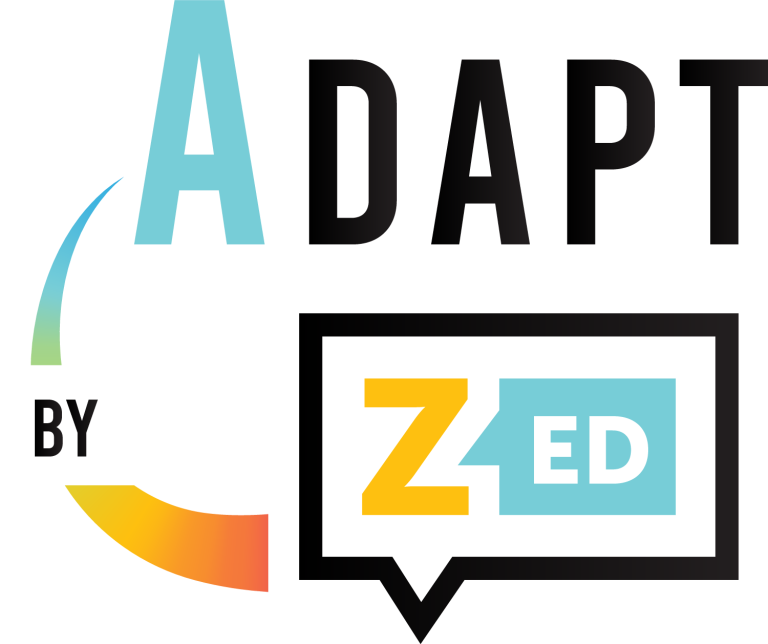

# Announcement

 Hi Codeforces!

I am glad to announce and invite you to [Codeforces Round 689 (Div. 2, based on Zed Code Competition)](https://codeforces.com/contest/1461 "Codeforces Round 689 (Div. 2, based on Zed Code Competition)"), which will be held on [Friday, December 11, 2020 at 20:35UTC+6](https://codeforces.com/https://www.timeanddate.com/worldclock/fixedtime.html?day=11&month=12&year=2020&hour=17&min=35&sec=0&p1=166).

We want to offer you to solve 6 problems taken from the Zed Code Competition 2020, which was held as part of the [Adapt by Zed](https://codeforces.com/http://zed.epam.com/) conference powered by [EPAM Systems](https://codeforces.com/https://www.epam.com/).

**This round will be rated for the participants with rating lower than 2100.** 

 * The authors of the round are: Aliaksandr [AleXman111](https://codeforces.com/profile/AleXman111 "Candidate Master AleXman111") Kryvasheyeu, Aliaksandr [sdryapko](https://codeforces.com/profile/sdryapko "Candidate Master sdryapko") Drapko, Aliaksei [netman](https://codeforces.com/profile/netman "Candidate Master netman") Vistiazh and me.
* The round was coordinated by Vladimir [vovuh](https://codeforces.com/profile/vovuh "Master vovuh") Petrov and Nikolay [KAN](https://codeforces.com/profile/KAN "Legendary Grandmaster KAN") Kalinin.
* The round was tested by: [awoo](https://codeforces.com/profile/awoo "Grandmaster awoo"), [mohammedehab2002](https://codeforces.com/profile/mohammedehab2002 "Grandmaster mohammedehab2002"), [thenymphsofdelphi](https://codeforces.com/profile/thenymphsofdelphi "Grandmaster thenymphsofdelphi"), [_overrated_](https://codeforces.com/profile/_overrated_ "Master _overrated_"), [BRCode](https://codeforces.com/profile/BRCode "Expert BRCode"), [morzer](https://codeforces.com/profile/morzer "Expert morzer"), [Retired_cherry](https://codeforces.com/profile/Retired_cherry "Expert Retired_cherry"), [mesanu](https://codeforces.com/profile/mesanu "Expert mesanu"), [SlavicG](https://codeforces.com/profile/SlavicG "Expert SlavicG"), [Shinchan01](https://codeforces.com/profile/Shinchan01 "Expert Shinchan01"), [manik.jain](https://codeforces.com/profile/manik.jain "Specialist manik.jain"), [Coder-HVZ](https://codeforces.com/profile/Coder-HVZ "Specialist Coder-HVZ"), [Rox](https://codeforces.com/profile/Rox "Candidate Master Rox"), [hloya_ygrt](https://codeforces.com/profile/hloya_ygrt "Grandmaster hloya_ygrt"), [244mhq](https://codeforces.com/profile/244mhq "Legendary Grandmaster 244mhq"), [Wind_Eagle](https://codeforces.com/profile/Wind_Eagle "Master Wind_Eagle"), [PuRpLe_FoReVeR](https://codeforces.com/profile/PuRpLe_FoReVeR "International Master PuRpLe_FoReVeR"), [Gassa](https://codeforces.com/profile/Gassa "Master Gassa"), [namanbansal013](https://codeforces.com/profile/namanbansal013 "Expert namanbansal013"), [saurabhyadavz](https://codeforces.com/profile/saurabhyadavz "Specialist saurabhyadavz") and [andrew](https://codeforces.com/profile/andrew "Grandmaster andrew").
* And, of course, thank you very much Mike [MikeMirzayanov](https://codeforces.com/profile/MikeMirzayanov "Headquarters, MikeMirzayanov") Mirzayanov for creating the polygon and codeforces platforms.

Thanks a lot for your contribution to the preparation of the round! Good luck with the competition!

**UPD:** The scoring distribution is **500 — 1000 — 1250 — 1500 — 2250 — 2750**.

Congratulations to the winners of **div 2**:

 1. [yash_daga](https://codeforces.com/profile/yash_daga "Candidate Master yash_daga")
2. [AiriKatagiri](https://codeforces.com/profile/AiriKatagiri "Candidate Master AiriKatagiri")
3. [tejas10p](https://codeforces.com/profile/tejas10p "Candidate Master tejas10p")
4. [RNG-Ming](https://codeforces.com/profile/RNG-Ming "Newbie RNG-Ming")
5. [meidong](https://codeforces.com/profile/meidong "Newbie meidong")

as well as **div 1** winners:

 1. [neal](https://codeforces.com/profile/neal "International Grandmaster neal")
2. [Geothermal](https://codeforces.com/profile/Geothermal "International Grandmaster Geothermal")
3. [LayCurse](https://codeforces.com/profile/LayCurse "International Grandmaster LayCurse")
4. [emthrm](https://codeforces.com/profile/emthrm "Grandmaster emthrm")
5. [hank55663](https://codeforces.com/profile/hank55663 "International Grandmaster hank55663")

Thank you all for participating! ([editorial](Tutorial.md))

