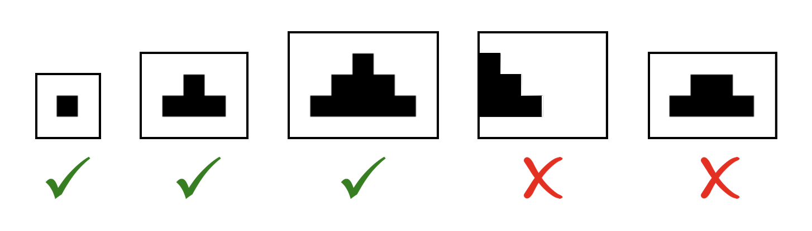

<h1 style='text-align: center;'> B. Find the Spruce</h1>

<h5 style='text-align: center;'>time limit per test: 1 second</h5>
<h5 style='text-align: center;'>memory limit per test: 256 megabytes</h5>

Holidays are coming up really soon. Rick realized that it's time to think about buying a traditional spruce tree. But Rick doesn't want real trees to get hurt so he decided to find some in an $n \times m$ matrix consisting of "*" and ".".

  To find every spruce first let's define what a spruce in the matrix is. A set of matrix cells is called a spruce of height $k$ with origin at point $(x, y)$ if:

* All cells in the set contain an "*".
* For each $1 \le i \le k$ all cells with the row number $x+i-1$ and columns in range $[y - i + 1, y + i - 1]$ must be a part of the set. All other cells cannot belong to the set.

 
## Example

s of correct and incorrect spruce trees:

  Now Rick wants to know how many spruces his $n \times m$ matrix contains. Help Rick solve this problem.

### Input

Each test contains one or more test cases. The first line contains the number of test cases $t$ ($1 \le t \le 10$).

The first line of each test case contains two integers $n$ and $m$ ($1 \le n, m \le 500$) — matrix size.

Next $n$ lines of each test case contain $m$ characters $c_{i, j}$ — matrix contents. It is guaranteed that $c_{i, j}$ is either a "." or an "*".

It is guaranteed that the sum of $n \cdot m$ over all test cases does not exceed $500^2$ ($\sum n \cdot m \le 500^2$).

### Output

For each test case, print single integer — the total number of spruces in the matrix.

## Example

### Input


```text
4
2 3
.*.
***
2 3
.*.
**.
4 5
.***.
*****
*****
*.*.*
5 7
..*.*..
.*****.
*******
.*****.
..*.*..
```
### Output


```text
5
3
23
34
```
## Note

In the first test case the first spruce of height $2$ has its origin at point $(1, 2)$, the second spruce of height $1$ has its origin at point $(1, 2)$, the third spruce of height $1$ has its origin at point $(2, 1)$, the fourth spruce of height $1$ has its origin at point $(2, 2)$, the fifth spruce of height $1$ has its origin at point $(2, 3)$.

In the second test case the first spruce of height $1$ has its origin at point $(1, 2)$, the second spruce of height $1$ has its origin at point $(2, 1)$, the third spruce of height $1$ has its origin at point $(2, 2)$.


#### Tags 

#1400 #NOT OK #brute_force #dp #implementation 

## Blogs
- [All Contest Problems](../Codeforces_Round_689_(Div._2,_based_on_Zed_Code_Competition).md)
- [Announcement](../blogs/Announcement.md)
- [Tutorial](../blogs/Tutorial.md)
