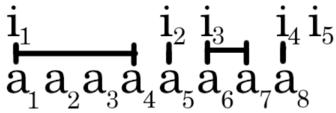

# Tutorial

All problems were created by [MikeMirzayanov](https://codeforces.com/profile/MikeMirzayanov "Headquarters, MikeMirzayanov") and developed by me ([Stepavly](https://codeforces.com/profile/Stepavly "Master Stepavly")) and [Supermagzzz](https://codeforces.com/profile/Supermagzzz "Master Supermagzzz").

[1462A - Favorite Sequence](../problems/A._Favorite_Sequence.md "Codeforces Round 690 (Div. 3)")

 **Editorial**
### [1462A - Favorite Sequence](../problems/A._Favorite_Sequence.md "Codeforces Round 690 (Div. 3)")

In this problem, you can implement an algorithm opposite to that given in the condition. Let's maintain two pointers to the left-most and right-most unhandled element. Then, restoring the original array, you: 

* put the left-most unhandled item in the first position
* put the right-most unhandled item in the second position
* put the left-most unhandled item in the third position
* put the right-most unhandled item in the fourth position
* ...

 That is, in general, you put the leftmost elements on all odd positions, and the rightmost ones on all even positions. After processing each element, you either move the left pointer forward by one, or the right one backward by one. **Solution**
```cpp
#include <bits/stdc++.h>

using namespace std;

void solve() {
  int n;
  cin >> n;
  vector<int> v(n);
  for (int &e : v) {
    cin >> e;
  }
  int left = 0, right = n - 1;
  vector<int> ans(n);
  for (int i = 0; i < n; i++) {
    if (i % 2 == 0) {
      ans[i] = v[left++];
    } else {
      ans[i] = v[right--];
    }
  }
  for (int i : ans) {
    cout << i << " ";
  }
  cout << "n";
}

int main() {
  int t;
  cin >> t;
  while (t--) {
    solve();
  }
}
```
[1462B - Last Year's Substring](../problems/B._Last_Year's_Substring.md "Codeforces Round 690 (Div. 3)")

 **Editorial**
### [1462B - Last Year's Substring](../problems/B._Last_Year's_Substring.md "Codeforces Round 690 (Div. 3)")

Let's see how the deleted substring tt should look so that after deleting it, the string ss turns into the string "2020". The length of the string tt must be n−4n−4. Then we can iterate over all substrings of the string ss of length n−4n−4 (there are no more than five such substrings) and look at the string obtained after deleting the substring. 

That is, we need to check that one of the following character sequence matches the (2,0,2,0)(2,0,2,0):

* (s[1],s[2],s[3],s[4])(s[1],s[2],s[3],s[4]);
* (s[1],s[2],s[3],s[n])(s[1],s[2],s[3],s[n]);
* (s[1],s[2],s[n−1],s[n])(s[1],s[2],s[n−1],s[n]);
* (s[1],s[n−2],s[n−1],s[n])(s[1],s[n−2],s[n−1],s[n]);
* (s[n−3],s[n−2],s[n−1],s[n])(s[n−3],s[n−2],s[n−1],s[n]);
 **Solution**
```cpp
#include <bits/stdc++.h>

using namespace std;

void solve() {
  int n;
  cin >> n;
  string s;
  cin >> s;

  for (int i = 0; i <= 4; i++) {
    if (s.substr(0, i) + s.substr(n - 4 + i, 4 - i) == "2020") {
      cout << "YES" << endl;
      return;
    }
  }
  cout << "NO" << endl;
}

int main() {
  int tests;
  cin >> tests;
  while (tests-- > 0) {
    solve();
  }
  return 0;
}
```
[1462C - Unique Number](../problems/C._Unique_Number.md "Codeforces Round 690 (Div. 3)")

 **Editorial**
### [1462C - Unique Number](../problems/C._Unique_Number.md "Codeforces Round 690 (Div. 3)")

First of all, let's understand that the answer to the problem should not contain zeros (leading zeros are useless, while others increase the number, but do not change the sum). It is also clear that the number we found should have the minimum possible length (since the longer the numbers without leading zeros, the larger they are). Numbers of the same length are compared lexicographically, that is, first by the first digit, then by the second, and so on. This means that the digits in the number must go in sorted order (the order of the digits does not affect the sum, but does affect the value).

Let's minimize the length of the number first. We need to get the specified sum in as few digits as possible. So we should use as large digits as possible. Then let's start with the number 99 and add the digits from 88 to 11 to the beginning of the number in turn, until the sum of the digits exceeds the specified sum. Obviously, you can't get an answer for fewer digits.

Now we minimize the number itself. First, we must minimize the first digit. The first digit is uniquely determined as the difference between the sum of the remaining digits and the required sum. So you need to maximize the sum of all digits except the first one (which has already been done in the previous paragraph). It only remains to correct the first digit and print the answer.

 **Solution**
```cpp
#include <bits/stdc++.h>

using namespace std;

void solve() {
  int x;
  cin >> x;
  vector<int> ans;
  int sum = 0, last = 9;
  while (sum < x && last > 0) {
    ans.push_back(min(x - sum, last));
    sum += last;
    last--;
  }
  if (sum < x) {
    cout << -1 << "n";
  } else {
    reverse(ans.begin(), ans.end());
    for (int i : ans) {
      cout << i;
    }
    cout << "n";
  }
}

int main() {
  int t;
  cin >> t;
  while (t--) {
    solve();
  }
}
```
[1462D - Add to Neighbour and Remove](../problems/D._Add_to_Neighbour_and_Remove.md "Codeforces Round 690 (Div. 3)")

Problem authors: [MikeMirzayanov](https://codeforces.com/profile/MikeMirzayanov "Headquarters, MikeMirzayanov"), [Supermagzzz](https://codeforces.com/profile/Supermagzzz "Master Supermagzzz"), [Stepavly](https://codeforces.com/profile/Stepavly "Master Stepavly").

 **Editorial**
### [1462D - Add to Neighbour and Remove](../problems/D._Add_to_Neighbour_and_Remove.md "Codeforces Round 690 (Div. 3)")

Let kk — be the number of operations performed by Polycarp. Let's see how to check if kk is the answer.

Let's denote by ss the sum of numbers in the array aa. Note that after each operation ss does not change. Since we know that after kk operations all elements must be the same and the sum of the numbers in the array does not change, then each of the remaining elements must be equal to sn−ksn−k.

Let's check if it is possible to perform kk operations so that at the end all elements are equal to sn−ksn−k. Note that the process described in the condition is equivalent to the following process: 

* Choose a set of n−k+1n−k+1 indices i1,i2,…,in−k+1i1,i2,…,in−k+1 (1=i1<i2<⋯<in−k<in−k+1=n+11=i1<i2<⋯<in−k<in−k+1=n+1) — partitions;
* Create a new array bb of n−kn−k elements, where bj=∑t=ijij+1−1btbj=∑t=ijij+1−1bt

 For example, the array aa of 88 elements after 44 operations could turn into an array b=[a1+a2+a3+a4,a5,a6+a7,a8]b=[a1+a2+a3+a4,a5,a6+a7,a8]. In this case, the set of indices is i=[1,5,6,8,9]i=[1,5,6,8,9].   Then, to check if kk is the answer, it is necessary to split the aa array into n−kn−k subarrays, in which the sum of all elements is equal to sn−ksn−k. Such a check can be implemented greedily in O(n)O(n). It is enough to go through the array from left to right and take an element into the current subarray until the sum in it exceeds sn−ksn−k.

The resulting solution works in O(n⋅σ(s))O(n⋅σ(s)) or O(n2)O(n2), where σ(s)σ(s) is the number of divisors ss.

 **Solution**
```cpp
#include <bits/stdc++.h>
using namespace std;

using ll = long long;

void solve() {
  int n;
  cin >> n;
  vector<ll> a(n);
  ll sum = 0;
  for (ll &x : a) {
    cin >> x;
    sum += x;
  }

  for (int i = n; i >= 1; i--) {
    if (sum % i == 0) {
      ll needSum = sum / i;
      ll curSum = 0;
      bool ok = true;
      for (int j = 0; j < n; j++) {
        curSum += a[j];
        if (curSum > needSum) {
          ok = false;
          break;
        } else if (curSum == needSum) {
          curSum = 0;
        }
      }

      if (ok) {
        cout << n - i << endl;
        return;
      }
    }
  }
}

int main() {
  int tests;
  cin >> tests;
  while (tests-- > 0) {
    solve();
  }
  return 0;
}
```
[1462E1 - Close Tuples (easy version)](../problems/E1._Close_Tuples_(easy_version).md "Codeforces Round 690 (Div. 3)")

 **Editorial**
### [1462E1 - Close Tuples (easy version)](../problems/E1._Close_Tuples_(easy_version).md "Codeforces Round 690 (Div. 3)")

In the easy version of the problem, you can count how many times each number occurs (the numbers themselves do not exceed nn). Note that we do not have very many options for which triples of numbers can be included in the answer.

Let's iterate over xx – the minimum number in the triples. Then there are the following options: 

* [xx, x+1x+1, x+2x+2];
* [xx, x+1x+1, x+1x+1];
* [xx, x+2x+2, x+2x+2];
* [xx, xx, x+1x+1];
* [xx, xx, x+2x+2];
* [xx, xx, xx].

In each option, you need to multiply the number of ways to choose one, two or three numbers from all occurrences of this number. This is done using binomial coefficients. Formally, if cnt[x]cnt[x] — is the number of occurrences of the number xx, then the formulas corresponding to the options in the list above are as follows:

* cnt[x]⋅cnt[x+1]⋅cnt[x+2]cnt[x]⋅cnt[x+1]⋅cnt[x+2];
* cnt[x]⋅cnt[x+1]⋅(cnt[x+1]−1)2cnt[x]⋅cnt[x+1]⋅(cnt[x+1]−1)2;
* cnt[x]⋅cnt[x+2]⋅(cnt[x+2]−1)2cnt[x]⋅cnt[x+2]⋅(cnt[x+2]−1)2;
* cnt[x]⋅(cnt[x]−1)2⋅cnt[x+1]cnt[x]⋅(cnt[x]−1)2⋅cnt[x+1];
* cnt[x]⋅(cnt[x]−1)2⋅cnt[x+2]cnt[x]⋅(cnt[x]−1)2⋅cnt[x+2];
* cnt[x]⋅(cnt[x]−1)⋅(cnt[x]−2)6cnt[x]⋅(cnt[x]−1)⋅(cnt[x]−2)6.

If we sum these values over all xx from 11 to nn, then we get the answer to the problem.

 **Solution**
```cpp
#include <bits/stdc++.h>

using namespace std;
using ll = long long;

void solve() {
  int n;
  cin >> n;
  vector<ll> cnt(n + 1);
  for (int i = 0; i < n; i++) {
    int x;
    cin >> x;
    cnt[x]++;
  }
  ll ans = 0;
  for (int i = 2; i < n; i++) {
    ans += cnt[i - 1] * cnt[i] * cnt[i + 1];
  }
  for (int i = 1; i < n; i++) {
    ans += cnt[i] * (cnt[i] - 1) / 2 * cnt[i + 1];
  }
  for (int i = 2; i <= n; i++) {
    ans += cnt[i - 1] * cnt[i] * (cnt[i] - 1) / 2;
  }
  for (int i = 2; i < n; i++) {
    ans += cnt[i - 1] * cnt[i + 1] * (cnt[i + 1] - 1) / 2;
  }
  for (int i = 2; i < n; i++) {
    ans += cnt[i + 1] * cnt[i - 1] * (cnt[i - 1] - 1) / 2;
  }
  for (int i = 1; i <= n; i++) {
    ans += cnt[i] * (cnt[i] - 1) * (cnt[i] - 2) / 6;
  }
  cout << ans << "n";
}

int main() {
  int t;
  cin >> t;
  while (t--) {
    solve();
  }
}
```
[1462E2 - Close Tuples (hard version)](../problems/E2._Close_Tuples_(hard_version).md "Codeforces Round 690 (Div. 3)")

 **Editorial**
### [1462E2 - Close Tuples (hard version)](../problems/E2._Close_Tuples_(hard_version).md "Codeforces Round 690 (Div. 3)")

The key idea that allows us to move from the previous version to this one is that the values of the numbers themselves are not important to us. The main idea is to consider all numbers in the interval [x,x+k][x,x+k].

Let's also, as in the previous version, iterate over the minimum element xx in the tuple. Now let's find the count of numbers cntcnt that lie in the interval [x,x+k][x,x+k] (this can be done with a binary search, two pointers, or prefix sums using an array of occurrences). Then it remains to add to the answer the number of ways to choose m−1m−1 numbers from cnt−1cnt−1 (we fixed one of the numbers as the minimum). You have to sum these values over all possible values of xx (even the same) because now you are not fixing the value of the minimum element (as in the previous problem), but its index in the sorted array.

To calculate binomial coefficients quickly, you can pre-compute all factorial values and all 1n!1n! values by modulo. If you do not know how to calculate the inverse element by modulo, then you could pre-compute the part of Pascal's triangle in O(nm)O(nm).

 **Solution**
```cpp
#include <bits/stdc++.h>

using namespace std;
using ll = long long;

const int N = 300500;
const int mod = 1000000007;
ll fact[N];
ll invFact[N];

ll fast_pow(ll a, ll p) {
    ll res = 1;
    while (p) {
        if (p % 2 == 0) {
            a = (a * a) % mod;
            p /= 2;
        } else {
            res = (res * a) % mod;
            p--;
        }
    }
    return res;
}

ll C(int n, int k) {
    if (k > n) {
        return 0;
    }
    return fact[n] * invFact[k] % mod * invFact[n - k] % mod;
}

void solve() {
    int n, m, k;
    cin >> n >> m >> k;
    vector<ll> v(n);
    for (ll &e : v) {
        cin >> e;
    }
    sort(v.begin(), v.end());
    ll ans = 0;
    for (int i = 0; i < n; i++) {
        int l = i + 1;
        int r = upper_bound(v.begin(), v.end(), v[i] + k) - v.begin();
        ans = (ans + C(r - l, m - 1)) % mod;
    }
    cout << ans << "n";
}

int main() {
    fact[0] = invFact[0] = 1;
    for (int i = 1; i < N; i++) {
        fact[i] = (fact[i - 1] * i) % mod;
        invFact[i] = fast_pow(fact[i], mod - 2);
    }
    int t;
    cin >> t;
    while (t--) {
        solve();
    }
}
```
[1462F - The Treasure of The Segments](../problems/F._The_Treasure_of_The_Segments.md "Codeforces Round 690 (Div. 3)")

 **Editorial**
### [1462F - The Treasure of The Segments](../problems/F._The_Treasure_of_The_Segments.md "Codeforces Round 690 (Div. 3)")

As we know from the problem statement:

Polycarp believes that a set of kk segments is good if there is a segment [li,ri][li,ri] (1≤i≤k1≤i≤k) from the set, such that it intersects every segment from the set (the intersection must be a point or segment).

Let's iterate over this segment (which intersects all the others) and construct a good set of the remaining segments, maximum in terms of inclusion. It is easy to understand that this set will include all segments that intersect with ours. We must delete all other segments.

Two segments [l1,r1][l1,r1] and [l2,r2][l2,r2] intersect if max(l1,l2)≤min(r1,r2)max(l1,l2)≤min(r1,r2). Then if the segment that we iterate over has coordinates [L,R][L,R], then we must remove all such segments [l,r][l,r] for which r<Lr<L or R<lR<l is satisfied (that is, the segment ends earlier than ours begins, or vice versa).

Note that these two conditions cannot be fulfilled simultaneously, since l≤rl≤r, and if both conditions are satisfied, then r<L≤R<lr<L≤R<l. This means that we can count the number of segments suitable for these conditions independently.

Each of these conditions is easy to handle. Let's create two arrays — all the left boundaries of the segments and all the right boundaries of the segments. Let's sort both arrays. Now we can count the required quantities using the binary search or prefix sums (but in this case, we need to use the coordinate compression technique).

Taking at least the number of deleted segments among all the options, we will get the answer to the problem.

 **Solution**
```cpp
#include <bits/stdc++.h>

using namespace std;
using ll = long long;

void solve() {
    vector<int> L;
    vector<int> R;
    int n;
    cin >> n;
    vector<pair<int, int>> v(n);
    for (auto &[l, r] : v) {
        cin >> l >> r;
        L.push_back(l);
        R.push_back(r);
    }
    sort(L.begin(), L.end());
    sort(R.begin(), R.end());
    int ans = n - 1;
    for (auto [l, r] : v) {
        int left = lower_bound(R.begin(), R.end(), l) - R.begin();
        int right = max(0, n - (int)(upper_bound(L.begin(), L.end(), r) - L.begin()));
        ans = min(ans, left + right);
    }
    cout << ans << "n";
}

int main() {
    int t;
    cin >> t;
    while (t--) {
        solve();
    }
}


```
