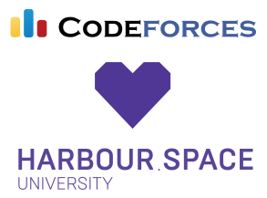

# Announcement

Hello Codeforces!

On [Thursday, December 17, 2020 at 20:35UTC+6](https://codeforces.com/https://www.timeanddate.com/worldclock/fixedtime.html?day=17&month=12&year=2020&hour=17&min=35&sec=0&p1=166) [Educational Codeforces Round 100 (Rated for Div. 2)](https://codeforces.com/contest/1463 "Educational Codeforces Round 100 (Rated for Div. 2)") will start.

Series of Educational Rounds continue being held as [Harbour.Space University](https://codeforces.com/https://harbour.space/) initiative! You can read the details about the cooperation between [Harbour.Space University](https://codeforces.com/https://harbour.space/) and Codeforces in the [blog post](//codeforces.com/blog/entry/51208).

This round will be **rated for the participants with rating lower than 2100**. It will be held on extended ICPC rules. The penalty for each incorrect submission until the submission with a full solution is 10 minutes. After the end of the contest you will have 12 hours to hack any solution you want. You will have access to copy any solution and test it locally.

You will be given **6 or 7 problems** and **2 hours** to solve them.

The problems were invented and prepared by Roman [Roms](https://codeforces.com/profile/Roms "Master Roms") Glazov, Adilbek [adedalic](https://codeforces.com/profile/adedalic "International Master adedalic") Dalabaev, Vladimir [vovuh](https://codeforces.com/profile/vovuh "Master vovuh") Petrov, Ivan [BledDest](https://codeforces.com/profile/BledDest "International Grandmaster BledDest") Androsov, Maksim [Neon](https://codeforces.com/profile/Neon "Candidate Master Neon") Mescheryakov and me. Also huge thanks to Mike [MikeMirzayanov](https://codeforces.com/profile/MikeMirzayanov "Headquarters, MikeMirzayanov") Mirzayanov for great systems Polygon and Codeforces.

Also thanks to Nikolay [KAN](https://codeforces.com/profile/KAN "Legendary Grandmaster KAN") Kalinin for one of the problems' ideas.

Good luck to all the participants!

Our friends at Harbour.Space also have a message for you:

*Hey Codeforces!*

*It’s almost the Holiday season, and this year, we have an extra reason to celebrate — this December marks Harbour.Space’s 5-year anniversary!*

*Looking back, we’re especially thankful for the wonderful partnerships that have made our university what it is today.* 

*Codeforces has been one of our key partners since the beginning, and we would like to thank the community for growing with us for the past 5 years.* 

*You guys are rock stars, and we’re excited to see where the future takes us both.* 

 Best,   
 Harbour.Space University

Congratulations to the winners: 

| Rank | Competitor | Problems Solved | Penalty |
| --- | --- | --- | --- |
| 1 | [heno239](https://codeforces.com/profile/heno239 "International Grandmaster heno239") | 6 | 174 |
| 2 | [Geothermal](https://codeforces.com/profile/Geothermal "International Grandmaster Geothermal") | 6 | 178 |
| 3 | [stevenkplus](https://codeforces.com/profile/stevenkplus "International Grandmaster stevenkplus") | 6 | 238 |
| 4 | [hank55663](https://codeforces.com/profile/hank55663 "International Grandmaster hank55663") | 5 | 87 |
| 5 | [neal](https://codeforces.com/profile/neal "International Grandmaster neal") | 5 | 121 |

Congratulations to the best hackers: 

| Rank | Competitor | Hack Count |
| --- | --- | --- |
| 1 | [3.141592653](https://codeforces.com/profile/3.141592653 "Master 3.141592653") | **49****:-3** |
| 2 | [sheaf](https://codeforces.com/profile/sheaf "Expert sheaf") | **48****:-17** |
| 3 | [adnan_toky](https://codeforces.com/profile/adnan_toky "Expert adnan_toky") | **32****:-2** |
| 4 | [qqwrwwv](https://codeforces.com/profile/qqwrwwv "Candidate Master qqwrwwv") | **30****:-2** |
| 5 | [star_xingchen_c](https://codeforces.com/profile/star_xingchen_c "Candidate Master star_xingchen_c") | **27****:-1** |

 1083 successful hacks and 1034 unsuccessful hacks were made in total!And finally people who were the first to solve each problem: 

| Problem | Competitor | Penalty |
| --- | --- | --- |
| A | [XAXAEBATb](https://codeforces.com/profile/XAXAEBATb "Candidate Master XAXAEBATb") | 0:01 |
| B | [MikMirzoyanov](https://codeforces.com/profile/MikMirzoyanov "Candidate Master MikMirzoyanov") | 0:03 |
| C | [Geothermal](https://codeforces.com/profile/Geothermal "International Grandmaster Geothermal") | 0:11 |
| D | [peti1234](https://codeforces.com/profile/peti1234 "International Grandmaster peti1234") | 0:06 |
| E | [CoderAnshu](https://codeforces.com/profile/CoderAnshu "Master CoderAnshu") | 0:23 |
| F | [heno239](https://codeforces.com/profile/heno239 "International Grandmaster heno239") | 1:13 |

**UPD:** [Editorial is out](Tutorial.md)

