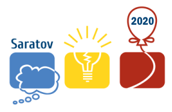

# Announcement

Hello!

ICPC Southern and Volga Russian Regional Contest (Northern Eurasia) 2020 has ended on November 15. This year the competition took place online. 108 teams competed, many of them received an invitation based on the results in Qualification Contest.

On [Friday, December 25, 2020 at 17:35UTC+6](https://codeforces.com/https://www.timeanddate.com/worldclock/fixedtime.html?day=25&month=12&year=2020&hour=14&min=35&sec=0&p1=166) will start online-mirror [2020-2021 ICPC, NERC, Southern and Volga Russian Regional Contest (Online Mirror, ICPC Rules)](https://codeforces.com/contest/1468 "2020-2021 ICPC, NERC, Southern and Volga Russian Regional Contest (Online Mirror, ICPC Rules)").

Hope you enjoy the problems. In this contest I play a role of Cheif Judge and the jury teams consists of ex-participants of ICPC from Saratov and jury members from other cities: [adedalic](https://codeforces.com/profile/adedalic "International Master adedalic"), [ashmelev](https://codeforces.com/profile/ashmelev "International Grandmaster ashmelev"), [BledDest](https://codeforces.com/profile/BledDest "International Grandmaster BledDest"), [DmitryKlenov](https://codeforces.com/profile/DmitryKlenov "Expert DmitryKlenov"), [DStepanenko](https://codeforces.com/profile/DStepanenko "Expert DStepanenko"), [elena](https://codeforces.com/profile/elena "Unrated, elena"), [KAN](https://codeforces.com/profile/KAN "Legendary Grandmaster KAN"), [kuviman](https://codeforces.com/profile/kuviman "Master kuviman"), [MikeMirzayanov](https://codeforces.com/profile/MikeMirzayanov "Headquarters, MikeMirzayanov"), [pashka](https://codeforces.com/profile/pashka "International Grandmaster pashka"), [PavelKunyavskiy](https://codeforces.com/profile/PavelKunyavskiy "International Grandmaster PavelKunyavskiy"), Дмитрий Мещеряков, Герман Наркайтис. Many thanks to all of them!

I send special rays of gratitude to testers: [Merkurev](https://codeforces.com/profile/Merkurev "Legendary Grandmaster Merkurev"), [Um_nik](https://codeforces.com/profile/Um_nik "Legendary Grandmaster Um_nik"), [romanasa](https://codeforces.com/profile/romanasa "International Master romanasa"), [josdas](https://codeforces.com/profile/josdas "Grandmaster josdas"), [budalnik](https://codeforces.com/profile/budalnik "International Grandmaster budalnik"), [Perforator](https://codeforces.com/profile/Perforator "Grandmaster Perforator"), [Oleg_Smirnov](https://codeforces.com/profile/Oleg_Smirnov "International Master Oleg_Smirnov"), [IlyaLos](https://codeforces.com/profile/IlyaLos "International Master IlyaLos"), [Supermagzzz](https://codeforces.com/profile/Supermagzzz "Master Supermagzzz"), [Stepavly](https://codeforces.com/profile/Stepavly "Master Stepavly"), [Igor_Kudryashov](https://codeforces.com/profile/Igor_Kudryashov "International Master Igor_Kudryashov"), [HolkinPV](https://codeforces.com/profile/HolkinPV "Candidate Master HolkinPV"), [Edvard](https://codeforces.com/profile/Edvard "Candidate Master Edvard"), [le.mur](https://codeforces.com/profile/le.mur "Pupil le.mur")!

I invite ICPC teams and individual participants of Codeforces competitions to take part!

Of course, the competition will be unrated. I ask the participants of the official competition to refrain from participating in the mirror and discussing problems until its end.

Since this year the audience of participants was wider (due to the online format), we also selected problems a little more accessible than in previous years. If you are from the top team that claims a medal in the ICPC Finals, then it may be more fun for you to take part in this contest personally.

Good luck!

