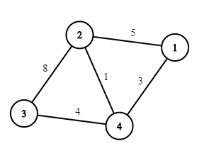
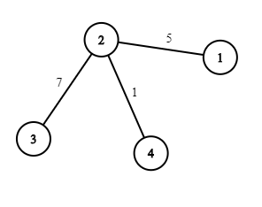
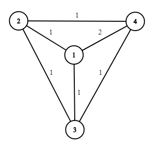

<h1 style='text-align: center;'> J. Road Reform</h1>

<h5 style='text-align: center;'>time limit per test: 2 seconds</h5>
<h5 style='text-align: center;'>memory limit per test: 512 megabytes</h5>

There are $n$ cities and $m$ bidirectional roads in Berland. The $i$-th road connects the cities $x_i$ and $y_i$, and has the speed limit $s_i$. The road network allows everyone to get from any city to any other city. 

The Berland Transport Ministry is planning a road reform.

First of all, maintaining all $m$ roads is too costly, so $m - (n - 1)$ roads will be demolished in such a way that the remaining $(n - 1)$ roads still allow to get to any city from any other city. Formally, the remaining roads should represent an undirected tree.

Secondly, the speed limits on the remaining roads might be changed. The changes will be done sequentially, each change is either increasing the speed limit on some road by $1$, or decreasing it by $1$. Since changing the speed limit requires a lot of work, the Ministry wants to minimize the number of changes.

The goal of the Ministry is to have a road network of $(n - 1)$ roads with the maximum speed limit over all roads equal to exactly $k$. They assigned you the task of calculating the minimum number of speed limit changes they have to perform so the road network meets their requirements.

For example, suppose the initial map of Berland looks like that, and $k = 7$:

  Then one of the optimal courses of action is to demolish the roads $1$–$4$ and $3$–$4$, and then decrease the speed limit on the road $2$–$3$ by $1$, so the resulting road network looks like that:

  
### Input

The first line contains one integer $t$ ($1 \le t \le 1000$) — the number of test cases.

The first line of each test case contains three integers $n$, $m$ and $k$ ($2 \le n \le 2 \cdot 10^5$; $n - 1 \le m \le \min(2 \cdot 10^5, \frac{n(n-1)}{2})$; $1 \le k \le 10^9$) — the number of cities, the number of roads and the required maximum speed limit, respectively.

Then $m$ lines follow. The $i$-th line contains three integers $x_i$, $y_i$ and $s_i$ ($1 \le x_i, y_i \le n$; $x_i \ne y_i$; $1 \le s_i \le 10^9$) — the cities connected by the $i$-th road and the speed limit on it, respectively. All roads are bidirectional.

The road network in each test case is connected (that is, it is possible to reach any city from any other city by traveling along the road), and each pair of cities is connected by at most one road.

The sum of $n$ over all test cases does not exceed $2 \cdot 10^5$. Similarly, the sum of $m$ over all test cases does not exceed $2 \cdot 10^5$.

### Output

For each test case, print one integer — the minimum number of changes the Ministry has to perform so that the maximum speed limit among the remaining $(n - 1)$ roads is exactly $k$.

## Example

### Input


```text
44 5 74 1 31 2 52 3 82 4 13 4 44 6 51 2 11 3 11 4 22 4 14 3 13 2 13 2 101 2 81 3 105 5 151 2 173 1 152 3 101 4 142 5 8
```
### Output

```text

1
3
0
0

```
## Note

The explanation for the example test:

The first test case is described in the problem statement.

In the second test case, the road network initially looks like that:

  The Ministry can demolish the roads $1$–$2$, $3$–$2$ and $3$–$4$, and then increase the speed limit on the road $1$–$4$ three times.

In the third test case, the road network already meets all the requirements.

In the fourth test case, it is enough to demolish the road $1$–$2$ so the resulting road network meets the requirements.


#### Tags 

#1800 #NOT OK #dsu #graphs #greedy 

## Blogs
- [All Contest Problems](../2020-2021_ICPC,_NERC,_Southern_and_Volga_Russian_Regional_Contest_(Online_Mirror,_ICPC_Rules).md)
- [Announcement](../blogs/Announcement.md)
- [Tutorial #1 (en)](../blogs/Tutorial_1_(en).md)
