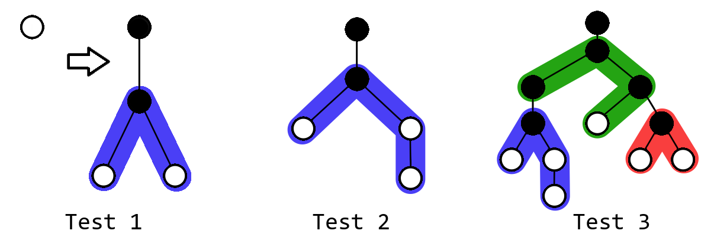

<h1 style='text-align: center;'> F. Power Sockets</h1>

<h5 style='text-align: center;'>time limit per test: 4 seconds</h5>
<h5 style='text-align: center;'>memory limit per test: 256 megabytes</h5>

// We decided to drop the legend about the power sockets but feel free to come up with your own :^)

Define a chain: 

* a chain of length $1$ is a single vertex;
* a chain of length $x$ is a chain of length $x-1$ with a new vertex connected to the end of it with a single edge.

You are given $n$ chains of lengths $l_1, l_2, \dots, l_n$. You plan to build a tree using some of them.

* Each vertex of the tree is either white or black.
* The tree initially only has a white root vertex.
* All chains initially consist only of white vertices.
* You can take one of the chains and connect any of its vertices to any white vertex of the tree with an edge. The chain becomes part of the tree. Both endpoints of this edge become black.
* Each chain can be used no more than once.
* Some chains can be left unused.

The distance between two vertices of the tree is the number of edges on the shortest path between them.

If there is at least $k$ white vertices in the resulting tree, then the value of the tree is the distance between the root and the $k$-th closest white vertex.

What's the minimum value of the tree you can obtain? If there is no way to build a tree with at least $k$ white vertices, then print -1.

###### Input

The first line contains two integers $n$ and $k$ ($1 \le n \le 2 \cdot 10^5$, $2 \le k \le 10^9$) — the number of chains and the minimum number of white vertices a tree should have to have a value.

The second line contains $n$ integers $l_1, l_2, \dots, l_n$ ($3 \le l_i \le 2 \cdot 10^5$) — the lengths of the chains.

###### Output

Print a single integer. If there is no way to build a tree with at least $k$ white vertices, then print -1. Otherwise, print the minimum value the tree can have.

## Examples

###### Input


```text
1 2
3
```
###### Output


```text
2
```
###### Input


```text
3 3
4 3 3
```
###### Output


```text
3
```
###### Input


```text
3 5
4 3 4
```
###### Output


```text
4
```
###### Input


```text
2 10
5 7
```
###### Output


```text
-1
```
## Note

  You are allowed to not use all the chains, so it's optimal to only use chain of length $4$ in the second example.


#### Tags 

#2600 #NOT OK #binary_search #data_structures #greedy 

## Blogs
- [All Contest Problems](../Educational_Codeforces_Round_101_(Rated_for_Div._2).md)
- [Announcement](../blogs/Announcement.md)
- [Tutorial](../blogs/Tutorial.md)
