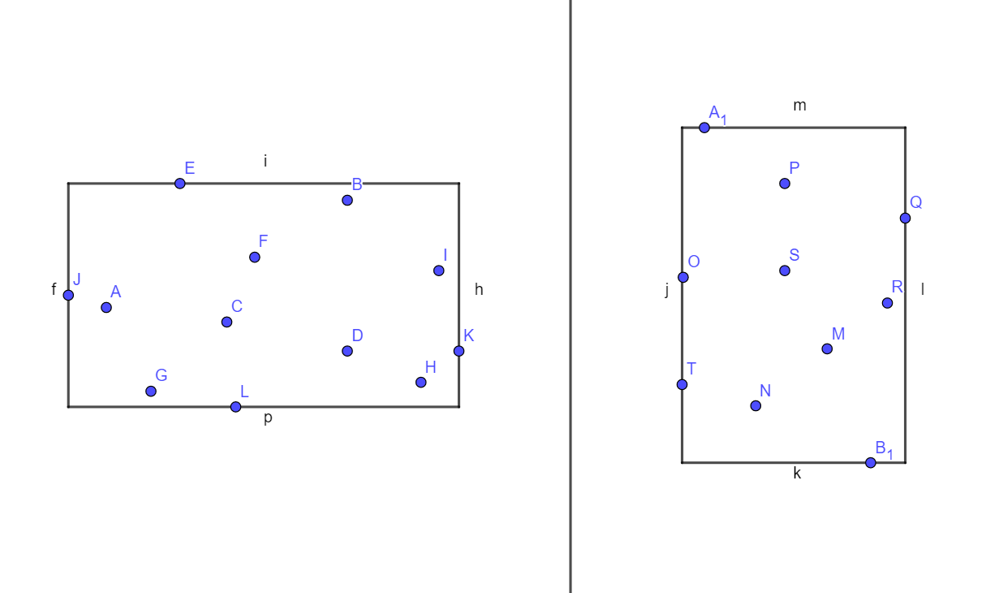
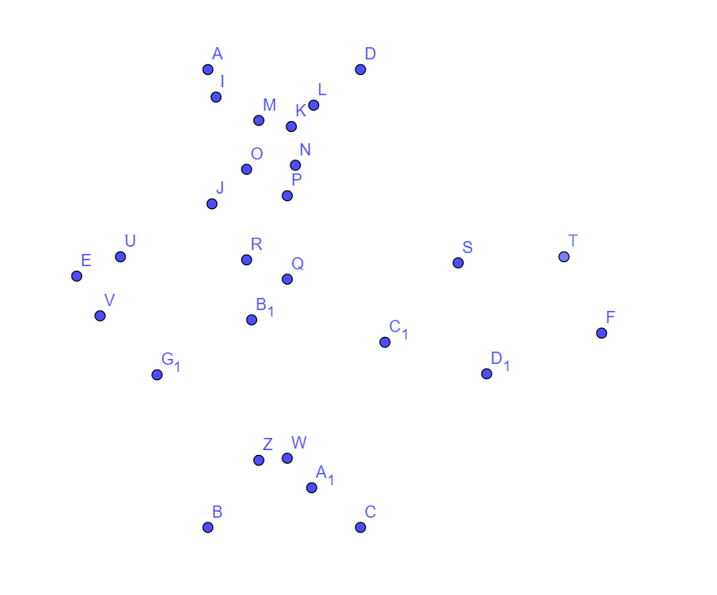
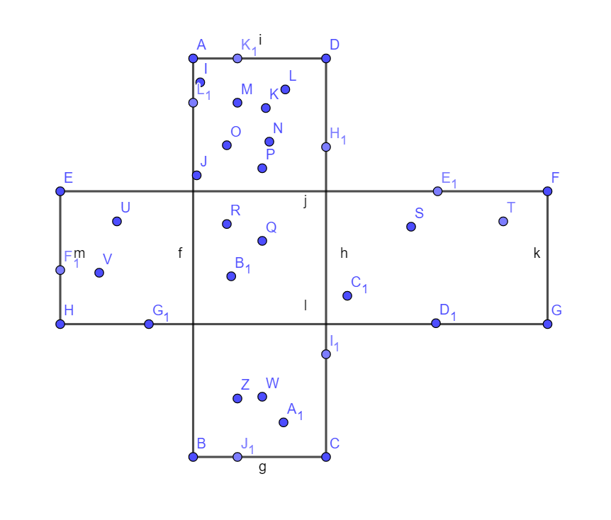
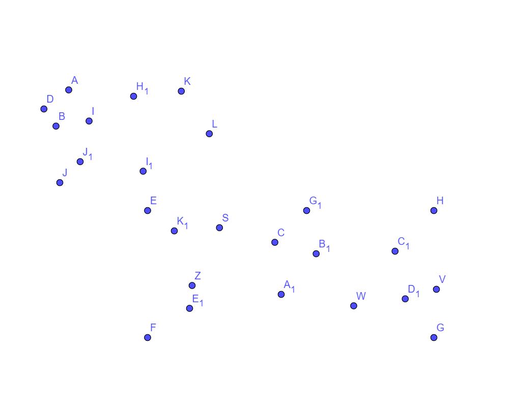
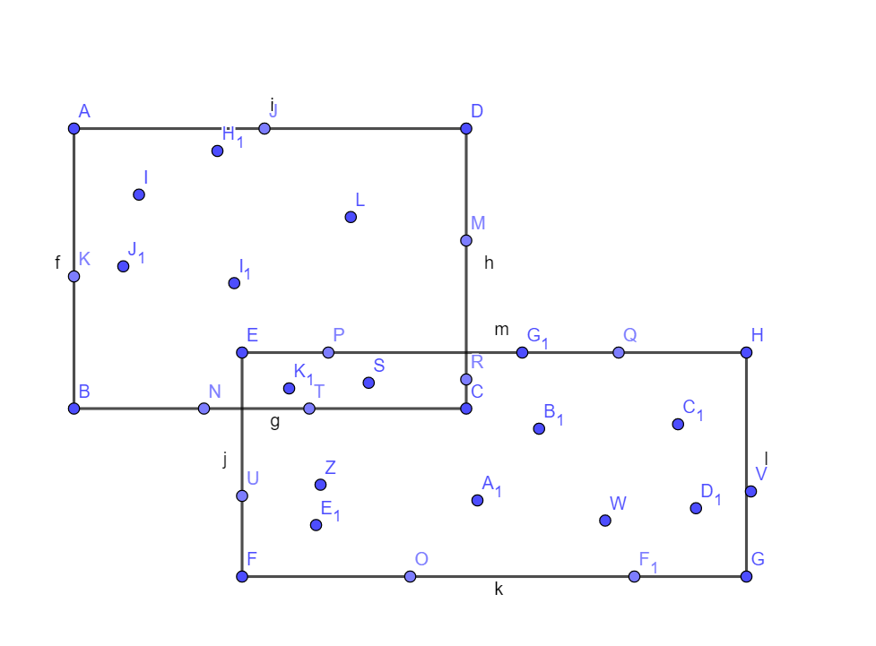

# Разбор

### [1471A - Strange Partition](https://codeforces.com/contest/1471/problem/A "Codeforces Round 694 (Div. 2)")

Note that, ⌈a+bx⌉≤⌈ax⌉+⌈bx⌉⌈a+bx⌉≤⌈ax⌉+⌈bx⌉. It means that the maximal sum is attained if we do not apply any operations, and the minimal one is attained if we replace all the element with a single one, equal to the sum of all elements.

 
### [1471B - Strange List](https://codeforces.com/contest/1471/problem/B "Codeforces Round 694 (Div. 2)")

Solution 1. Let's represent each element aiai as xbi⋅cixbi⋅ci, where bibi is the maximal possible. Let's take minimum over all values bibi, and let's assume it's attained at position jj. The robot will add each element to the array bjbj times (element at position jj will be the first one, which will stop being divisible by xx). However, we should not forget about the prefix before position jj: each of those number is divisible by a higher power of xx, and this prefix will count towards the total sum. The final answer is (bj+1)⋅∑ni=1ai+∑j−1i=1ai(bj+1)⋅∑i=1nai+∑i=1j−1ai

In this solution we divide each number aiai by xx to generate the array b1,b2,…,bnb1,b2,…,bn, and then it takes O(n)O(n) to compute both sums. The final complexity of the solution is O(nlogA)O(nlog⁡A), where AA denotes the maximum possible element of the array.

Solution 2. Let's maintain the list of pairs {ai,cnti}{ai,cnti} — it indicates a range of cnticnti elements equal to aiai. Then we can easily implement the operation performed by the robot: if we consider pair {a,cnt}{a,cnt}, we either append the array with a pair {ax,cnt⋅x}{ax,cnt⋅x}, or terminate the process. The answer to the problem equals to sum of values ai⋅cntiai⋅cnti.

Each number aiai will be copied to the end of the array at most O(logA)O(log⁡A) times, since each time aiai is divided by xx. Since there are nn elements in the array initially, the total complexity of this solution is O(nlogA)O(nlog⁡A).

 
### [1470A - Strange Birthday Party](../problems/A._Strange_Birthday_Party.md "Codeforces Round 694 (Div. 1)")

Let's note that it is beneficial to give cheaper gifts to people with a larger kiki value.

Suppose that in the optimal answer a pair of people AA and BB, such that kA≥kBkA≥kB get gifts with values a≥ba≥b. Then we can give a gift bb to a person AA and to a person BB give a gift aa or min(a,ckB)min(a,ckB) dollars. If a≤ckBa≤ckB, than we spend the same amount of money. Otherwise, it's a better answer.

So the problem can be solved using greedy algorithm. Let's sort guest in order of descending value kiki. Than give each person a cheapest gift, or ckicki dollars, if it better. To determinate a cheapest gift, let's store the index of the last purchased gift. Thus, the final asymptotics is O(mlogn)O(mlog⁡n).

 
### [1470B - Strange Definition](../problems/B._Strange_Definition.md "Codeforces Round 694 (Div. 1)")

It is well known that lcm(x,y)=x⋅ygcd(x,y)lcm(x,y)=x⋅ygcd(x,y), and it immediately follows that lcm(x,y)gcd(x,y)lcm(x,y)gcd(x,y) == x⋅ygcd(x,y)2x⋅ygcd(x,y)2, which means that numbers xx and yy are adjacent if and only if x⋅yx⋅y is a perfect square.

Let alphaxalphax be the maximum possible integer such that palphaxpalphax divides xx, and alphayalphay be the maximum possible integer such that palphaypalphay divides yy. Then x⋅yx⋅y is perfect square if and only if αx+αyαx+αy is even, which means αx≡αyαx≡αy (mod 22).

Let x=pα11⋅…⋅pαkkx=p1α1⋅…⋅pkαk. Let's replace it with pα1mod21⋅…⋅pαkmod2kp1α1mod2⋅…⋅pkαkmod2. After such a replacement two integers are adjacent if and only if they are equal.

Let's replace each element of the array and split the numbers into classes of equal numbers. If the number of integers in a single class is even, after a single operation each element from this class will be transformed to 11, and if the number of integers is odd, the class of the element will remain unchanged. Since the class of integer 1 always remains unchanged, all integers will keep their classes starting from after the first operation.

Since didi denotes the size of the class, the beauty of the array is defined as the size of the maximal class. If aa if the size of the maximal class at the beginning of the process, and bb — the total number of elements with a class of even size or with the class equal to 1. Then for a query with w=0w=0 the answer is aa, for a query with w>0w>0 the answer is max(a,b)max(a,b).

This solution can easily be implemented with O(nlogA)O(nlog⁡A) complexity, where AA denotes the maximum number in the array.

 
### [1470C - Strange Shuffle](../problems/C._Strange_Shuffle.md "Codeforces Round 694 (Div. 1)")

Short version: note that, during the first n2n2 iterations the number of people with more than kk cards, increases. Let's find at least one such person. To do this, let's wait for n−−√n iterations. After this there is always a continuous segment of length n−−√n with elements >k>k. To find it, we can split the array into blocks of size n−−√n, ask one element from each block, and find the desired integer >k>k. Then we can use binary search to find the position pp. In total we need 2n−−√+logn2n+log⁡n queries.

More detailed version: let's use induction to prove that players that are located from the same distance from the player pp always have 2k2k cards in total. It is obviously true initially. After one operation, when the array aa is transformed to the array bb, and let's consider a pair of elements located on the same distance from position pp: ii and jj. Note that, bi+bj=(⌈ai−12⌉+⌊ai+12⌋)+(⌈aj−12⌉+⌊aj+12⌋)=(⌈ai−12⌉+⌊aj+12⌋)+(⌊ai+12⌋+⌈aj−12⌉)=k+k=2kbi+bj=(⌈ai−12⌉+⌊ai+12⌋)+(⌈aj−12⌉+⌊aj+12⌋)=(⌈ai−12⌉+⌊aj+12⌋)+(⌊ai+12⌋+⌈aj−12⌉)=k+k=2k (excluding the neighbours of pp). It proves that the player pp will always have kk cards.

Now let's prove that the number of cards that players p+1,p+2,…,n,1,…p−1p+1,p+2,…,n,1,…p−1 have is not increasing. Again, if we consider a single step: bi+1=⌈ai2⌉+⌊ai+22⌋≥⌈ai−12⌉+⌊ai+12⌋=bibi+1=⌈ai2⌉+⌊ai+22⌋≥⌈ai−12⌉+⌊ai+12⌋=bi.

During the first n2n2 iterations, the number of elements that are greater than kk, is increasing. Before ii-th iteration we have ap+i−1>k,ap+i=kap+i−1>k,ap+i=k. After ii-th iteration ap+i=⌈ap+i−12⌉+k2>kap+i=⌈ap+i−12⌉+k2>k, because kk is even.

The rest of the solution is described in the «short» version of the solution above.

 
### [1470D - Strange Housing](../problems/D._Strange_Housing.md "Codeforces Round 694 (Div. 1)")

One can prove that the answer always exists if the graph is connected, and the algorithm proves it.

Let us paint all vertices with black and white colors. Let us pick any vertex and paint it black, and let us paint all its neighbours with white. Then let's pick any uncoloured vertex that is connected to a white one, paint it black, and paint all its neighbours white. We continue this process until there are no uncoloured vertices left. We claim that the set of black vertices is the answer.

We are never painting two adjacent vertices black, since we colour all their neighbours with white. It is also true that the set of already coloured vertices is always connected if we keep only the edges adjacent to black vertices: it is true initially, and whenever we paint a vertex white, it is connected to a black one directly, and when we paint a vertex black, one of its edges goes to a white one coloured on the previous steps (that is how we pick the vertex to paint it white).

 
### [1470E - Strange Permutation](../problems/E._Strange_Permutation.md "Codeforces Round 694 (Div. 1)")

Let call the cost of rotation of segment [L,R][L,R] value R−LR−L coins.

Let's calculate how many ways can we apply to the array of length lenlen with total cost less or equal to cc. We can fix len−1len−1 bars between neighbouring elements of array. There is a bijection between ways to select cc of them and ways to apply some not overlapping rotations with total cost equals cc. We can see, that the number of ways is equals (len−10)+⋯+(len−1c)=ways(len,c)(len−10)+⋯+(len−1c)=ways(len,c). Now we can check if the answer to the query is −1−1.

It is easy to see, that the answer on query depends only on construction of jj-th permutation from pp. This construction can be represented as set of rotations of size not larger than cc. And the number of possible rotations in this set doesn't exceed m=ncm=nc. If we can answer this query for each suffix of pp, we can determine jj-th permutation: 

* ll cc kk What is the leftmost rotation on the suffix of length lenlen, if we have cc coins and we want to get kk-th permutation of this suffix.

Let's fix any suffix px,px+1,…,pnpx,px+1,…,pn. We can build a long array consisting of the leftmost rotations in construction of each permutation of this suffix using not more than cc coins. It is easy to see that each rotation will appear on some segment of this array. We can determine the length of this segment: if it was the rotation [l,r][l,r], than the length of this segment is ways(n−r,c−r+l)ways(n−r,c−r+l). Exactly once happends that there is no leftmost rotation.

For x−1x−1 (suffix px−1,px,…,pnpx−1,px,…,pn) relative order of this segments won't change because we will add px−1px−1 to the beginning of each permutation. Only cc segments will appear (rotations [x−1,x],[x−1,x+1],…,[x−1,x+c−1][x−1,x],[x−1,x+1],…,[x−1,x+c−1]).

We can show that new segment will appear only in the beginning and in the end (because only their first element isn't equal px−1px−1).

We can show that query ll cc kk is equivalent to query nn cc k′k′ because of the structure of this array.

In O(m)O(m) we can build this array using deque. We should do this for each cc.

Let's answer the queries offline using the following algorithm: 

* Iterate in order of decreasing cc (let's call a level set of queries with the same cc).
* Sort queries in order of increasing kk. Using two pointers approach we can move all queries to another level and change them to type nn cc k′k′.

If we will remove queries from each level after answering them, memory will be reduced from O(qc+nc)O(qc+nc) to O(q+nc)O(q+nc).

Total work time: O(sort(q)⋅c+nc2)O(sort(q)⋅c+nc2). It can be optimized to O(sort(q)+q⋅logn⋅logc+nc2)O(sort(q)+q⋅logn⋅logc+nc2) using another sort algorithms. Also there is a solution in O(nc2+q⋅c⋅log(nc))O(nc2+q⋅c⋅log(nc)) and O(nc)O(nc) memory with binary search and slower solutions with different data structures.

 
### [1470F - Strange Covering](../problems/F._Strange_Covering.md "Codeforces Round 694 (Div. 1)")

It is clear that there are only 3 structurally different ways to pick two rectangles optimally:

1. Two rectangles do not intersect:  In this case one can iterate over all horizontal / vertical lines, separating those rectangles, find the extremal points in both halfplanes, and pick the rectangles with corners in the extremal points.
2. Rectangles do intersect, forming a «cross»:  In this case note that for each of the rectangles at least two sides lie on the boundary of the bounding box of all points:

  To find such rectangles efficiently, one can iterate over the right boundary of the «vertical» rectangle. Let LdLd — be the lowest yy coordinate of a point to the left of left boundary of the «vertical» rectangle, LuLu — the highest yy coordinate of a point to the left of the boundary of the «vertical» rectangle, and similarly RdRd — the lowest yy-coordinate of a point to the right of the «vertical» rectangle, RuRu — the highest yy-coordinate of a point to the right.

We can assume that Ru≥LuRu≥Lu (this can be guaranteed by picking a prefix in our data structure that we will find later). On such a prefix where Ld≥RdLd≥Rd we need to choose the rightmost bound. What remains is a subrange where Ld≤RdLd≤Rd and Lu≤RuLu≤Ru. If we fix two bounds of a rectangle LL and RR, their total area equals (Ru−Ld)⋅H+(R−L)⋅W(Ru−Ld)⋅H+(R−L)⋅W, where WW is the height of the bounding box, and HH — its length. Rewriting (Ru−Ld)⋅H+(R−L)⋅W=(R⋅W+Ru⋅H)−(L⋅W+Ld⋅H)(Ru−Ld)⋅H+(R−L)⋅W=(R⋅W+Ru⋅H)−(L⋅W+Ld⋅H) one can see that the optimal LL can be chosen with a segment tree.
3. Two rectangles intersect in a such a way so that one of the vertices lies inside or on the boundary of the other one:  In this case one of the corners of each rectangle coincides with a corner of the bounding box. Let's call such a corner interesting. 

  If we fix the interesting vertex of one of the rectangles, the remaining rectangle can be uniquely determined. Looking at the formulas, it is clear that once we know the xx-coordinate of an interesting corner of the rectangles, one can choose the yy-coordinate of the interesting corner by answering a query in form «minimize a⋅x+b⋅ya⋅x+b⋅y», where (a,b)(a,b) — one of the pairs belonging to a fixed precomputed set, and (x,y)(x,y) is a query. Dividing the expression by xx one can get a+b⋅yxa+b⋅yx — a standard query that can be solved using convex hull trick. The only piece remaining is to guarantee that the chosen rectangles intersect. To achieve this once we fixed xx we only need to consider a continuous segment of yys, so we need to find the maximal value of a subrange of linear functions, which can be implemented in offline manner in O(nlogn)O(nlog⁡n) time with a segment tree of convex stacks

The overall complexity of this solution is O(nlogn)O(nlog⁡n).
