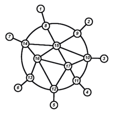

<h1 style='text-align: center;'> D. Strange Housing</h1>

<h5 style='text-align: center;'>time limit per test: 1 second</h5>
<h5 style='text-align: center;'>memory limit per test: 256 megabytes</h5>

Students of Winter Informatics School are going to live in a set of houses connected by underground passages. Teachers are also going to live in some of these houses, but they can not be accommodated randomly. For safety reasons, the following must hold:

* All passages between two houses will be closed, if there are no teachers in both of them. All other passages will stay open.
* It should be possible to travel between any two houses using the underground passages that are open.
* Teachers should not live in houses, directly connected by a passage.

Please help the organizers to choose the houses where teachers will live to satisfy the safety requirements or determine that it is impossible.

#### Input

The first input line contains a single integer $t$ — the number of test cases ($1 \le t \le 10^5$). 

Each test case starts with two integers $n$ and $m$ ($2 \le n \le 3 \cdot 10^5$, $0 \le m \le 3 \cdot 10^5$) — the number of houses and the number of passages.

Then $m$ lines follow, each of them contains two integers $u$ and $v$ ($1 \le u, v \le n$, $u \neq v$), describing a passage between the houses $u$ and $v$. It is guaranteed that there are no two passages connecting the same pair of houses.

The sum of values $n$ over all test cases does not exceed $3 \cdot 10^5$, and the sum of values $m$ over all test cases does not exceed $3 \cdot 10^5$.

#### Output

For each test case, if there is no way to choose the desired set of houses, output "NO". Otherwise, output "YES", then the total number of houses chosen, and then the indices of the chosen houses in arbitrary order.

## Examples

#### Input


```text
2
3 2
3 2
2 1
4 2
1 4
2 3
```
#### Output


```text
YES
2
1 3 
NO
```
#### Input


```text
1
17 27
1 8
2 9
3 10
4 11
5 12
6 13
7 14
8 9
8 14
8 15
9 10
9 15
10 11
10 15
10 17
11 12
11 17
12 13
12 16
12 17
13 14
13 16
14 16
14 15
15 16
15 17
16 17
```
#### Output


```text
YES
8
1 3 4 5 6 9 14 17 
```
## Note

The picture below shows the second example test. 

  

#### Tags 

#2200 #NOT OK #constructive_algorithms #dfs_and_similar #graph_matchings #graphs #greedy 

## Blogs
- [All Contest Problems](../Codeforces_Round_694_(Div._1).md)
- [Announcement](../blogs/Announcement.md)
- [Разбор](../blogs/Разбор.md)
