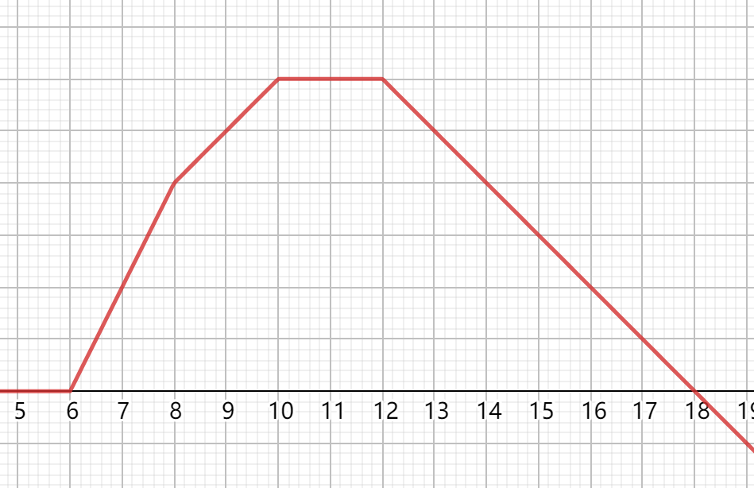

# Tutorial_(en)

Thanks for joining us today! Here is the editorial for today's problems:

[1478A - Nezzar и разноцветные шары](https://codeforces.com/contest/1478/problem/A "Codeforces Round 698 (Div. 2)")

 **Tutorial**
### [1478A - Nezzar and Colorful Balls](https://codeforces.com/contest/1478/problem/A "Codeforces Round 698 (Div. 2)")

For positions which numbers are the same, they cannot be colored using same color.

Let us color the $i$-th occurrence of any number using color $i$.

We can see that: 

* We cannot use fewer colors: if there are $k$ occurrence of any number, at least $k$ color is needed.
* The assignment of color is valid: Since the sequence was non-increasing, for any subsequence it is also non-increasing. As there are no duplicates in colored subsequence, the subsequence is strictly increasing as well.

Therefore, we only need to count the number of occurrence of every number and take the maximum of them.

Time complexity: $O(n)$ per test case

 **Solution**
```cpp
#include<bits/stdc++.h>
using namespace std;
 
#define rep(i,n) for (int i=0;i<(int)(n);++i)
#define rep1(i,n) for (int i=1;i<=(int)(n);++i)
#define range(x) begin(x), end(x)
#define sz(x) (int)(x).size()
#define pb push_back
#define F first
#define S second
 
typedef long long ll;
typedef unsigned long long ull;
typedef long double ld;
typedef pair<int, int> pii;
typedef vector<int> vi;
 
const int maxn=200007;
int t,n;
int cnt[maxn];
int main(){
    ios::sync_with_stdio(false);
    cin.tie(0), cout.tie(0);
    cin>>t;
    while (t--){
        cin>>n;
        rep1(i,n) cnt[i]=0;
        rep1(i,n){
            int u;
            cin>>u;
            cnt[u]++;
        }
        int mx=0;
        rep1(i,n) mx=max(mx,cnt[i]);
        cout<<mx<<"n";
    }
    return 0;
}
```
[1478B - Nezzar и счастливые числа](https://codeforces.com/contest/1478/problem/B "Codeforces Round 698 (Div. 2)")

 **Tutorial**
### [1478B - Nezzar and Lucky Number](https://codeforces.com/contest/1478/problem/B "Codeforces Round 698 (Div. 2)")

For any given $d$, We can observe the following: 

* $10d$ to $10d + 9$ contains $d$ as one of its digit
* Let $k = 10d + 9$ be the upper bound of such range For every number $x > k$, we can keep reducing $x$ by $d$, $x$ will eventually fall into the range mentioned above, which contains $d$ as digit.

Therefore, for numbers $x > k$, they are always achievable. For $x \leq k - 10$, as $k <= 109$, we can run a standard knapsack dynamicprogramming solution, where $dp[x]$ indicates if $x$ is achievable. $dp[x]$ is achievable, if and only if one of the following is true: 

* $x = 0$
* For some $y < x$, $dp[y]$ is true and $x - y$ contains $d$ as digit

Iterating for every $x$, all $dp[x]$ for $x < k$ can be computed with $O(k)$ per state (as we only need to consider $y < k$.

Besides dynamic programming solution, brute force solutions with enough optimization should also pass the test cases easily.

Time complexity: $O((10d)^2)$ per test case.

 **Solution**
```cpp
#include<bits/stdc++.h>
using namespace std;
 
const int maxn=207;
int t,d,q;
bool dp[maxn];
int main(){
    ios::sync_with_stdio(false);
    cin.tie(0), cout.tie(0);
    cin>>t;
    while (t--){
        memset(dp,0,sizeof(dp));
        dp[0]=1;
        cin>>q>>d;
        if (!d) d+=10;
        int mx=d*10;
        for (int i=0;10*i+d<=mx;++i){
            for (int j=0;10*i+d+j<=mx;++j){
                dp[10*i+d+j]|=dp[j];
            }
        }
        while (q--){
            int u;
            cin>>u;
            if (u>=mx||dp[u]) cout<<"YESn";
            else cout<<"NOn";
        }
    }
    return 0;
}
```
[1478C - Nezzar и симметричный массив](https://codeforces.com/contest/1478/problem/C "Codeforces Round 698 (Div. 2)")

 **Tutorial**
### [1478C - Nezzar and Symmetric Array](https://codeforces.com/contest/1478/problem/C "Codeforces Round 698 (Div. 2)")

WLOG, we may assume that $0 < a_1 < a_2 < \ldots < a_n$, and $a_{i+n}=-a_i$ for each $1 \le i \le n$.

Let's sort array $d$ firstly. It can be observed that the array $d$ satisfied the following property:

* $d_{2i-1}=d_{2i}$ for each $1 \le i \le n$;
* $d_{2i} \neq d_{2i+2}$ for each $1 \le i < n$.
* $d_{2i}$ must be generated for index $i$ or $i+n$.

More importantly, we have the following relation: $$d_{2n}-d_{2n-2}=\sum_{i=1}^{n} (a_n-a_i)+\sum_{i=1}^n (a_n+a_i) - \sum_{i=1}^n|a_{n-1}-a_i| - \sum_{i=1}^n (a_{n-1}+a_i) = (2n-2)(a_n-a_{n-1})$$

And observe that $|a_i-a_n|+|a_i+a_n|=2a_n$ is a constant independent of index $1 \le i\le n$. Therefore, we may remove $a_n$ and $-a_n$ by subtracting some constant for $d_i$ for all $1 \le i \le 2(n-1)$, indicating that we will calculate $a_{i+1}-a_{i}$ for all $1 \le i < n$, which can be done in $O(n)$.

Lastly, we should determine if there exists an postivie integer $a_1$ which generates $d_1$, which can be done in $O(n)$.

 **Solution**
```cpp
#include<bits/stdc++.h>
#define int long long
using namespace std;
 
const int maxn=200007;
int t;
int n,a[maxn],b[maxn],d[maxn];
 
signed main(){
    ios::sync_with_stdio(false);
    cin.tie(0), cout.tie(0);
    cin>>t;
    while (t--){
        cin>>n;
        for (int i=0;i<2*n;++i) cin>>a[i];
        sort(a,a+2*n,greater<int>());
        for (int i=0;i<n;++i){
            if (a[i*2]!=a[i*2+1]){
                cout<<"NOn";
                goto cont;
            }
            b[i]=a[i*2];
        }
        for (int i=1;i<n;++i){
            if (b[i-1]==b[i]||(b[i-1]-b[i])%(2*(n-i))){
                cout<<"NOn";
                goto cont;
            }
            d[i]=(b[i-1]-b[i])/2/(n-i);
        }
        for (int i=1;i<n;++i){
            b[n-1]-=2*i*d[i];
        }
        if (b[n-1]<=0||b[n-1]%(2*n)) cout<<"NOn";
        else cout<<"YESn";
 
        cont:;
    }
    return 0;
}
```
[1477A - Nezzar и доска](../problems/A._Nezzar_and_Board.md "Codeforces Round 698 (Div. 1)")

 **Tutorial**
### [1477A - Nezzar and Board](../problems/A._Nezzar_and_Board.md "Codeforces Round 698 (Div. 1)")

Let's first assume that $x_1=0$ (Otherwise, we could subtract $x_1$ for $x_1,x_2,\ldots,x_n$ and $k$). We will now prove that the answer is "YES" if and only if $k$ can be divided by $g=\gcd(x_2,x_3,\ldots,x_n)$. 

One direction is straightforward. Note that any number written on the board should be divisible by $g$, which follows from the fact that $g|x, g|y \implies g|2x-y$. It only remains to prove that for any $x$ divisible by $g$, we could write down $x$ on the board. We will prove it by induction on $n$.

Base case ($n=2$) is obvious. Let $g_0=\gcd(x_2,x_3,\ldots,x_{n-1})$. By Bézout's Theorem, there exists integers $s,t$ such that $g_0 s-x_n t = g$. By induction, we could write down $g_0$ on the board, and trivially $x_n t$ can be written on the board. Therefore, we could write down $g$ applying operation recursively.

 **Solution**
```cpp
#include<bits/stdc++.h>
#define int long long
using namespace std;
 
const int maxn=200007;
int t;
int n,k;
int x[maxn];
 
signed main(){
    ios::sync_with_stdio(false);
    cin.tie(0), cout.tie(0);
    cin>>t;
    while (t--){
        cin>>n>>k;
        for (int i=0;i<n;++i) cin>>x[i];
        sort(x,x+n);
        int g=0;
        for (int i=1;i<n;++i){
            g=__gcd(g,x[i]-x[0]);
        }
        if ((k-x[0])%g) cout<<"NOn";
        else cout<<"YESn";
    }
    return 0;
}
```
[1477B - Nezzar и бинарная строка](../problems/B._Nezzar_and_Binary_String.md "Codeforces Round 698 (Div. 1)")

 **Tutorial**
### [1477B - Nezzar and Binary String](../problems/B._Nezzar_and_Binary_String.md "Codeforces Round 698 (Div. 1)")

The operations can be described backward: 

* Iterate days in reverse order and start with $f$. In $i$-th day, if there is a strict majority of $0$s or $1$s between $l_i$ and $r_i$, change ALL element inside the range to be the majority. Otherwise, declare that the operation failed.

We can see that the "backward" operation is deterministic, so we can compute the source string from destination string alone and check if the source string computed equal to $s$.

To simulate the operations, We need to support two kind of operations: 

* range query on sum, and
* range assignment

Which can be simulated using e.g. lazy segment tree.

Time complexity: $O((q + n) \log{n})$

 **Solution**
```cpp
#include<bits/stdc++.h>
using namespace std;
 
#define rep(i,n) for (int i=0;i<(int)(n);++i)
#define rep1(i,n) for (int i=1;i<=(int)(n);++i)
#define range(x) begin(x), end(x)
#define sz(x) (int)(x).size()
#define pb push_back
#define F first
#define S second
 
typedef long long ll;
typedef unsigned long long ull;
typedef long double ld;
typedef pair<int, int> pii;
typedef vector<int> vi;
 
const int maxn=200007;
set<int> seg; // segment: [seg[i],seg[i+1])
int n,q,t,prv;
int l[maxn],r[maxn];
bool val[maxn];
string s;
int main(){
    ios::sync_with_stdio(false);
    cin.tie(0), cout.tie(0);
    cin>>t;
    while (t--){
        cin>>n>>q;
        cin>>s;
        rep(i,q) cin>>l[i]>>r[i], l[i]--;
        reverse(l,l+q), reverse(r,r+q);
        seg.clear();
        rep(i,n) seg.insert(i), val[i]=s[i]-'0';
        seg.insert(n);
        auto add=[&](int u){
            if (seg.find(u)==seg.end()){
                auto ret=*prev(seg.upper_bound(u));
                val[u]=val[ret];
                seg.insert(u);
            }
        };
        rep(i,q){
            add(l[i]), add(r[i]);
            vi remv;
            remv.clear();
            int sum[2];
            memset(sum,0,sizeof(sum));
            auto iter=seg.find(l[i]);
            while (1){
                if (*iter==r[i]) break;
                int prev=*iter;
                iter=next(iter);
                if (*iter<r[i]) remv.pb(*iter);
                sum[val[prev]]+=*iter-prev;
            }
            if (sum[0]==sum[1]){
                cout<<"-n";
                goto cont;
            }
            if (sum[0]<sum[1]) val[l[i]]=1;
            else val[l[i]]=0;
            for (auto c:remv) seg.erase(c);
        }
        prv=0;
        for (auto c:seg){
            if (!c) continue;
            for (int i=prv;i<c;++i) cout<<val[prv];
            prv=c;
        }
        cout<<"n";
        cont:;
    }
}
```
[1477C - Nezzar и красивая карта](../problems/C._Nezzar_and_Nice_Beatmap.md "Codeforces Round 698 (Div. 1)")

 **Tutorial**
### [1477C - Nezzar and Nice Beatmap](../problems/C._Nezzar_and_Nice_Beatmap.md "Codeforces Round 698 (Div. 1)")

There are two different approaches to solve this task.

Furthest Points

Pick an arbitrary point, and in each iteration, select the furthest point from previously chosen point among all available points. Indeed, we can prove the correctness by contradiction.

Insertion Sorting

Notice that in any triangle (possibly degenerate), there exists at most one obtuse angle or right angle in this triangle. Therefore, we may build our permutation using modified version of insertion sort (it suffices to substitute comparing operator).

We believe that time complexity for the latter approach is better than $O(n^2)$. However, we fail to find a proof or counterexample for it. It would be grateful if someone could figure it out and inform us about it!

 **Solution**
```cpp
#include<bits/stdc++.h>
using namespace std;
 
const int maxn=6007;
 
int n;
int x[maxn],y[maxn];
vector<int> perm;
signed main(){
    ios::sync_with_stdio(false);
    cin.tie(0), cout.tie(0);
    cin>>n;
    for (int i=0;i<n;++i) cin>>x[i]>>y[i];
    for (int i=0;i<n;++i){
        perm.push_back(i);
        for (int j=i;j>1;--j){
            if (1ll*(x[perm[j]]-x[perm[j-1]])*(x[perm[j-1]]-x[perm[j-2]])+1ll*(y[perm[j]]-y[perm[j-1]])*(y[perm[j-1]]-y[perm[j-2]])>=0){
                swap(perm[j],perm[j-1]);
            }
            else{
                break;
            }
        }
    }
    for (auto c:perm) cout<<c+1<<" ";
       
}
```
[1477D - Nezzar и тайные перестановки](../problems/D._Nezzar_and_Hidden_Permutations.md "Codeforces Round 698 (Div. 1)")

 **Tutorial**
### [1477D - Nezzar and Hidden Permutations](../problems/D._Nezzar_and_Hidden_Permutations.md "Codeforces Round 698 (Div. 1)")

We can describe the problem in graph theory terms:

We are given a graph $G$ of $n$ vertices and $m$ edge. The $i$-th edge connects vertices $l_i$ and $r_i$. We need to write down two numbers on each vertices, on $i$-th vertex we write $p_i$ and $q_i$ on it, so that: 

* $p$ and $q$ forms a permutation from $1$ to $n$,
* For each edge $(u,v)$, the relative order between $p_u$ and $p_v$ must be the same as between $q_u$ and $q_v$.
* We want to maximize the number of vertices $u$, so that $p_u \neq q_u$.

 We can observe the following: 

* For any vertex $u$ with degree $n-1$, $p_u = q_u$.

Proof: For such vertex $u$, let $p_u = k$. Then, there are exactly $k - 1$ neighbors of $u$ that has its $p$-number smaller than $u$. Similarly, let $q_u = k'$. Then, there are exactly $k' - 1$ neighbors of $u$ that has its $q$-number smaller than $u$. Since the relative order between $u$ and its neighbors must be the same across $p$ and $q$, $k' - 1 = k - 1$, which leads to $k' = k$.

We can assign those numbers with any unused number and delete them from the graph. Now we will consider only vertices with degree $< m-1$, where $m$ is the number of remaining vertices. We claim that the maximum number of differing position to be exactly $m$.

As all vertices have degree $< m-1$, it is easier to consider the complement graph $G'$, where $(u,v)$ in $G'$ is connected if and only if $(u,v)$ is not connected in $G$. Notice that $G'$ consists of connected components and each vertex has at least one neighbor.

We will focus on a single connected component. Let us find any spanning tree of this particular component. If the spanning tree is a[star](https://codeforces.com/https://en.wikipedia.org/wiki/Star_(graph_theory)), Let the center of star be $u$ and the other vertices be $v_1, v_2, \cdots v_k$. Then, the following is a valid assignment: 

* $p_u = 1, q_u = k + 1$
* $p_{v_i} = i + 1, q_{v_i} = i$ for $1 \leq i \leq k$

Otherwise, we claim that we can decompose any tree into different connected stars with at least two nodes each. If we can do so, we can assign numbers $1, 2, \cdots k_1$ to first star with $k_1$ nodes, $k_1 + 1, k_1 + 2, \cdots k_1 + k_2$ to second star with $k_2$ nodes and so on. Notice that the relative order between nodes of different stars never change.

The remaining part is to decompose tree into stars. There are a lot of algorithms to do so, one of them would be: 

 Iterate all unassigned nodes. For any unassigned node $u$, * If any neighbors of $u$ are unassigned, assign $u$ to be the center of new star component along with all unassigned neighbors of $u$.
* Otherwise, notice that all neighbors of $u$ is now a non-center member of some star component. Pick up any of $u$'s neighbor, $v$. If the star component of $v$ has at least two non-center nodes, remove $v$ from its original star component and make node $u$ and node $v$ a star component centered at $u$. Otherwise, make $v$ to be the center of its star component and add $u$ to it.

We can see that the algorithm produces star components of at least two nodes each, and therefore we can apply the assignment of numbers to each stars individually and concat the results. In the end, all nodes will have their $p$ and $q$ assigned differently.

It is possible to find all the needed spanning tree in $O((n + m) \log n)$ time. Then, it takes $O(n)$ total time to compute answers for all trees. Therefore, time complexity is $O((n + m) \log n)$.

 **Solution**
```cpp
#include<bits/stdc++.h>
using namespace std;
 
const int maxn=500007;
 
struct info{
    int idx,val;
    friend bool operator<(info u,info v){
        return u.val==v.val?u.idx<v.idx:u.val<v.val;
    }
};
 
struct stars{
    int rt;
    vector<int> leaves;
};
set<int> rv; // remained vertices
set<int> g[maxn]; // original graph
set<int> t[maxn]; // dfs tree
set<info> d;
int deg[maxn];
int n,m;
int perm1[maxn],perm2[maxn];
vector<stars> res;
 
void dfs(int u){
    rv.erase(u);
    int crt=0;
    while (1){
        auto iter=rv.upper_bound(crt);
        if (iter==rv.end()) break;
        int v=*iter;
        crt=v;
        if (g[u].find(v)!=g[u].end()) continue;
        t[u].insert(v), t[v].insert(u);
        dfs(v);
    }
}
 
int main(){
    ios::sync_with_stdio(false);
    cin.tie(0), cout.tie(0);
    int tc;
    cin>>tc;
    while (tc--){
        cin>>n>>m;
        for (int i=1;i<=n;++i) g[i].clear(), t[i].clear();
        rv.clear(), res.clear(), d.clear();
        for (int i=1;i<=m;++i){
            int u,v;
            cin>>u>>v;
            g[u].insert(v), g[v].insert(u);
        }
        for (int i=1;i<=n;++i) rv.insert(i);
        while (rv.size()>0){
            int u=*(rv.begin());
            dfs(u);       
        }
        int rem=n;
        for (int i=1;i<=n;++i){
            deg[i]=t[i].size();
            if (deg[i]){
                d.insert((info){i,deg[i]});
            }
            else{
                perm1[i]=perm2[i]=rem;
                rem--;
            }
        }
        while (d.size()){
            int idx=(*(d.begin())).idx;
            int f=*(t[idx].begin());
            vector<int> leaves;
            leaves.clear();
            d.erase((info){f,deg[f]});
            for (auto c:t[f]){
                d.erase((info){c,deg[c]});
                if (deg[c]==1) leaves.push_back(c);
                else deg[c]--, d.insert((info){c,deg[c]}), t[c].erase(f);
            }
            res.push_back((stars){f,leaves});
        }
        int l=0,r=0;
        for (auto c:res){
            perm1[c.rt]=++l;
            for (auto ls:c.leaves){
                perm1[ls]=++l;
                perm2[ls]=++r;
            }
           perm2[c.rt]=++r;
        }
        for (int i=1;i<=n;++i) cout<<perm1[i]<<" ";
        cout<<"n";
        for (int i=1;i<=n;++i) cout<<perm2[i]<<" ";
        cout<<"n";
    }
}
```
[1477E - Nezzar и турнир](../problems/E._Nezzar_and_Tournaments.md "Codeforces Round 698 (Div. 1)")

 **Tutorial**
### [1477E - Nezzar and Tournaments](../problems/E._Nezzar_and_Tournaments.md "Codeforces Round 698 (Div. 1)")

Let's firstly consider a simplified problem where the scoring device will not reset to $0$. For any player, his score will be fully determined by his potential as well as the potential of first player when $k$ is fixed. Indeed, similar property still holds in our setting.

Observation 1. For any fixed arrangement of players with potentials $c_1,c_2,\ldots,c_{n+m}$, $score_i=k-c_1+c_i+\max(0,c_1-k-\min(c_1,c_2,\ldots,c_i))$, where $score_i$ is the score of the $i$-th player. 

Observation 2. If the first player is fixed, it is optimal to place players in second team in descending order of potentials, then place all players in ascending order of potentials.

Let $f(t)$ be the difference where $a_x=t$ is selected as the first, and others ordered optimally (and $g(t)$ for sequence $b$ similarly). With some calculation, we may get $$f(t) = (n-1) \max(0,t-k-\min) - \sum_{i=1}^m \max(0,t-k-b_i) + (m-n) t + C$$ where $\min$ is the minimum value among $a$ and $b$, and $C$ is a universal constant(similarly for $g$).

Suppose that we have an oracle of $f$, we are aiming to find out the maximum value of $f(t)$ over sets of values $\{a_1,a_2,\ldots,a_n\}$. It can be seen that maximum values can only be reached on $O(1)$ inputs (which can be found in $O(\log n)$ time). For better understanding, you may refer to the following figure.

  Here is a figure for $n=3$, $m=3$, $k=2$, $\min=4$, $b_1=6, b_2=8$ and $b_3=10$. It can be seen that in this configuration, function is monotone increasing when $t<10$ and decreasing after. It can be shown that $f$ acts similarly. Therefore, it only remains to calculate $f$ for any given input $t$ efficiently, which can be decomposed to the following queries. 

* minimum value over $a_i$, $b_i$.
* $\sum_{1 \le i \le m} \max(0,k-t-b_i)$ for given $k$.

All those can be done efficiently via segment tree.

 **Solution**
```cpp
//#pragma GCC optimize("Ofast")
//#pragma GCC target("sse,sse2,sse3,ssse3,sse4,popcnt,abm,mmx,avx")
//#pragma GCC optimize("unroll-loops")
#include<bits/stdc++.h>
using namespace std;
 
#define rep(i,n) for (int i=0;i<(int)(n);++i)
#define rep1(i,n) for (int i=1;i<=(int)(n);++i)
#define range(x) begin(x), end(x)
#define sz(x) (int)(x).size()
#define pb push_back
#define F first
#define S second
 
typedef long long ll;
typedef unsigned long long ull;
typedef long double ld;
typedef pair<int, int> pii;
typedef vector<int> vi;
 
namespace internal {
 
// @param n `0 <= n`
// @return minimum non-negative `x` s.t. `n <= 2**x`
int ceil_pow2(int n) {
    int x = 0;
    while ((1U << x) < (unsigned int)(n)) x++;
    return x;
}
 
}
 
template <class S, S (*op)(S, S), S (*e)()> struct segtree {
  public:
    segtree() : segtree(0) {}
    segtree(int n) : segtree(std::vector<S>(n, e())) {}
    segtree(const std::vector<S>& v) : _n(int(v.size())) {
        log = internal::ceil_pow2(_n);
        size = 1 << log;
        d = std::vector<S>(2 * size, e());
        for (int i = 0; i < _n; i++) d[size + i] = v[i];
        for (int i = size - 1; i >= 1; i--) {
            update(i);
        }
    }
 
    void set(int p, S x) {
        assert(0 <= p && p < _n);
        p += size;
        d[p] = x;
        for (int i = 1; i <= log; i++) update(p >> i);
    }
 
    S get(int p) {
        assert(0 <= p && p < _n);
        return d[p + size];
    }
 
    S prod(int l, int r) {
        assert(0 <= l && l <= r && r <= _n);
        S sml = e(), smr = e();
        l += size;
        r += size;
 
        while (l < r) {
            if (l & 1) sml = op(sml, d[l++]);
            if (r & 1) smr = op(d[--r], smr);
            l >>= 1;
            r >>= 1;
        }
        return op(sml, smr);
    }
 
    S all_prod() { return d[1]; }
 
    template <bool (*f)(S)> int max_right(int l) {
        return max_right(l, [](S x) { return f(x); });
    }
    template <class F> int max_right(int l, F f) {
        assert(0 <= l && l <= _n);
        assert(f(e()));
        if (l == _n) return _n;
        l += size;
        S sm = e();
        do {
            while (l % 2 == 0) l >>= 1;
            if (!f(op(sm, d[l]))) {
                while (l < size) {
                    l = (2 * l);
                    if (f(op(sm, d[l]))) {
                        sm = op(sm, d[l]);
                        l++;
                    }
                }
                return l - size;
            }
            sm = op(sm, d[l]);
            l++;
        } while ((l & -l) != l);
        return _n;
    }
 
    template <bool (*f)(S)> int min_left(int r) {
        return min_left(r, [](S x) { return f(x); });
    }
    template <class F> int min_left(int r, F f) {
        assert(0 <= r && r <= _n);
        assert(f(e()));
        if (r == 0) return 0;
        r += size;
        S sm = e();
        do {
            r--;
            while (r > 1 && (r % 2)) r >>= 1;
            if (!f(op(d[r], sm))) {
                while (r < size) {
                    r = (2 * r + 1);
                    if (f(op(d[r], sm))) {
                        sm = op(d[r], sm);
                        r--;
                    }
                }
                return r + 1 - size;
            }
            sm = op(d[r], sm);
        } while ((r & -r) != r);
        return 0;
    }
 
  private:
    int _n, size, log;
    std::vector<S> d;
 
    void update(int k) { d[k] = op(d[2 * k], d[2 * k + 1]); }
};
 
 
const int maxn=500007;
const int maxm=1000007;
int n,m,k,q,t;
ll sum;
int a[maxn],b[maxn];
 
struct S{
    int cnt;
    ll sum;
};
 
S e(){
    return {0,0};
}
 
S op(S l,S r){
    return {l.cnt+r.cnt,l.sum+r.sum};
}
 
 
 
signed main(){
    ios::sync_with_stdio(false);
    cin.tie(0), cout.tie(0);
    segtree<S,op,e> seg_a(maxm),seg_b(maxm);
    auto fa=[&](int x){
        if (x>m||x<=0) cerr<<x<<endl;
        assert(x<=m&&x>0);
        return seg_a.max_right(0,[&](S l){return l.cnt<x;});
    };
    auto fb=[&](int x){
        assert(x<=n&&x>0);
        return seg_b.max_right(0,[&](S l){return l.cnt<x;});
    };
    auto solve=[&](int start,int coef){
//        cerr<<"start coef:"<<start<<" "<<coef<<endl;
        int mn=min(fa(1),fb(1));
        if (start<=k+mn) return 1ll*(n-m)*start+sum;
        auto ret=seg_b.prod(0,start-k);
//        cerr<<"ret:"<<ret.cnt<<" "<<ret.sum<<endl;
        return 1ll*coef*(start-k-mn)+1ll*(n-m)*start+sum+ret.sum-1ll*ret.cnt*(start-k);
    };
    cin>>m>>n>>q;
    rep1(i,m) {cin>>a[i],sum+=a[i]; auto ret=seg_a.get(a[i]); ret.cnt++, ret.sum+=a[i], seg_a.set(a[i],ret);}
    rep1(i,n) {cin>>b[i],sum-=b[i]; auto ret=seg_b.get(b[i]); ret.cnt++, ret.sum+=b[i], seg_b.set(b[i],ret);}
    sum+=1ll*(m-n)*k;
    auto res=[&](){
        ll ans=-1e15;
        ans=max(ans,solve(fb(1),m));
        ans=max(ans,solve(fb(n),m));
        ans=max(ans,solve(fa(1),m-1));
        ans=max(ans,solve(fa(m),m-1));
        int threshold=n>1?fb(n-1):0;
        if (k+threshold<=1e6){
            int pos=max(seg_a.prod(0,k+threshold).cnt,1);
            ans=max(ans,solve(fa(pos),m-1));
            int nxt_pos=seg_a.max_right(0,[&](S l){return l.cnt<=pos;});
            if (nxt_pos<maxm) ans=max(ans,solve(nxt_pos,m-1));
        }
        cout<<ans<<"n";
    };
    while (q--){
        int op,idx,x;
        cin>>op;
        if (op==1){
            cin>>idx>>x;
            auto ret=seg_a.get(a[idx]);
            ret.cnt--, ret.sum-=a[idx];
            seg_a.set(a[idx],ret);
            sum-=a[idx];
            sum+=x;
            a[idx]=x;
            ret=seg_a.get(x);
            ret.cnt++, ret.sum+=x;
            seg_a.set(x,ret);
        } 
        if (op==2){
            cin>>idx>>x;
            auto ret=seg_b.get(b[idx]);
            ret.cnt--, ret.sum-=b[idx];
            seg_b.set(b[idx],ret);
            sum+=b[idx];
            sum-=x;
            b[idx]=x;
            ret=seg_b.get(x);
            ret.cnt++, ret.sum+=x;
            seg_b.set(x,ret);
        }
        if (op==3){
            cin>>k;
            sum+=(m-n)*k;
            res();
            sum-=(m-n)*k;
        }
    }  
    return 0;
}
```
[1477F - Nezzar и шоколадные плитки](../problems/F._Nezzar_and_Chocolate_Bars.md "Codeforces Round 698 (Div. 1)")

 **Tutorial**
### [1477F - Nezzar and Chocolate Bars](../problems/F._Nezzar_and_Chocolate_Bars.md "Codeforces Round 698 (Div. 1)")

Let's firstly solve an easier version where $n=1$.

Part 1 ($n = 1$)

Let's firstly rephrase the original task and solve it for case $n=1$.

- Let $p_k$ the probability of event that $X_{(i)}-X_{(i-1)} \le K$ for $1 \le i \le k$ and $L - X_{(k)} \le K$. Here, $k$ real numbers $X_1,X_2,\ldots,X_k$ are chosen uniformly from $(0,L)$, and $X_{(1)},X_{(2)},\ldots,X_{(k)}$ is the sorted array of $X_0=0,X_1,X_2,\ldots,X_k$. Then the disire answer would be $\sum_{k=0}^{+\infty} (1-p_k)$.

To simplify notations, denote $w=\frac{K}{L}$. We are aiming to calculate $p_n$ from now on.

Let $Z_i=X_{(i)}-X_{(i-1)}$，then the pdf(probability density function) of the union distribution of $Z_1,Z_2,\ldots,Z_n$ is

$$f(z_1,z_2,\ldots,z_n)=n! I_{0<z_i<1,\sum_{i=1}^n z_i < 1}$$

Hence,

$$p_n= n! \int_{0<z_i<w, 1-w < \sum_{i=1}^n z_i < 1} 1 dz_1 dz_2 \ldots dz_n= n! w^n \int_{0<z_i<1, \frac{1}{w}-1<\sum_{i=1}^n z_i<\frac{1}{w}} 1 dz$$

Consider $Y_1,Y_2,\ldots,Y_n$ i.i.d, where $Y_i$ follows uniform distribution sampling from $(0,1)$，then the integral above is $Pr[\frac{1}{w}-1<\sum_{i=1}^n Y_i<\frac{1}{w}]$。

Note that $\sum_{i=1}^n Y_i$ follows Irwin–Hall distribution whose CDF(cumulative distribution function) is $$F(x)={\frac {1}{n!}}\sum _{{k=0}}^{{\lfloor x\rfloor }}(-1)^{k}{\binom {n}{k}}(x-k)^{n}$$

Thus，$p_n = n!w^n(F(\frac{1}{w})-F(\frac{1}{w}-1))$。

$$p_n=1- \left(\sum_{k=0}^x (-1)^k \binom{n}{k} (1-wk)^n - \sum_{k=0}^{x-1} (-1)^k \binom{n}{k}(1-(k+1)w)^n\right) \\\ =\sum_{k=1}^x (-1)^{k-1} \left(\binom{n}{k}+\binom{n}{k-1}\right)(1-kw)^n$$

where$x=\left[\frac{1}{w}\right]$。

using identity $\sum_{n \ge k}\binom{n}{k} x^n=x^k(1-x)^{-(k+1)}$ to finish this task.

Main version

To avoid confusion, we will let $q_{m,j}$ the probability that $m$ operations are performed on line $j$ but there still exists lines produced by line $j$ with length greater or equal to $K$ (which have been calculated in part 1, with notation $p_n$).

Recall that $q_{m,j} = \sum_{k=1}^{\lfloor \frac{L_j}{K} \rfloor} (-1)^{k-1}\binom{m+1}{k} (1-\frac{kK}{L_j})^m$.

Therefore, probability $p_m$ that one fails to finish the task within $m$ rounds is $$1 - \sum_{j_1+j_2+\ldots+j_n=m} \frac{m!}{j_1!j_2!\ldots j_n!} \prod_{r=1}^n (1-q_{j_r,r})\left(\frac{L_j}{L}\right)^{j_r} $$

Let $Q_j$ be EGF of sequence $((1-q_{m,r} )L_j/L)_{m \ge 0}$, that is to say the $m$-th coefficient is $$[x^m]Q_j = \frac{1}{m! L}(1-q_{m,r} )L_j.$$

Similarly, let $P$ be EGF of sequence $(p_m)_{m \ge 0}$, one may observe that $$P = \exp(x) - \prod_{i=1}^n Q_i.$$

In the following part, we will calculate $Q_j$.

$$ \begin{aligned} Q_j &= \sum_{m \ge 0} \frac{1}{m!} \left(\frac{L_j}{L} - \sum_{k=1}^{\lfloor \frac{L_j}{K} \rfloor} (-1)^{k-1} \binom{m+1}{k} \left(1-\frac{kK}{L_j}\right)^m \right) x^m\\\ &= \exp\left(\frac{L_j}{L}x\right) - \sum_{k=1}^{\lfloor \frac{L_j}{K} \rfloor} (-1)^{k-1} \sum_{m \ge k-1} \frac{(m+1)}{k!(m+1-k)!} \left(\frac{L_j-kK}{L}\right)^m x^m \end{aligned} $$

Note that $\sum_{m \ge k-1} \frac{m+1}{k!(m+1-k)!} y^m = \sum_{m \ge k} \frac{y^m}{k!(m-k)!} + \sum_{m \ge k-1} \frac{k y^m}{k!(m+1-k)!} = \frac{y^k}{k!} \exp(y) + \frac{y^{k-1}}{(k-1)!} \exp(y)$. Therefore,

$$ \begin{aligned} Q_j &= \exp(\frac{L_j}{L} x) - \sum_{k=1}^{\lfloor \frac{L_j}{K} \rfloor} (-1)^{k-1} \left(\frac{1}{k!} \left(\frac{L_j-kK}{L}\right)^k x^k + \frac{1}{(k-1)!} \left(\frac{L_j-kK}{L}\right)^{k-1} x^{k-1} \right)\exp\left(\frac{(L_j-kK)x}{L}\right) \end{aligned} $$

Note that with NTT and above equalities, we may calculate coefficient of $P$ in $O(nL \log nL)$ (Precisely, we will calculate coefficient of $x^{k-j}\exp{\left(1-\frac{K}{L}k x\right)}$ for each $0 \le k\le L$ and $0 \le j \le \min(n,k)$). 

Lastly, we should notice that if EGF of sequence $a$ is $x^k \exp(Cx)$, then $a_{k+n} = \frac{(k+n)!}{n!}C^n$, and its OGF is $k!\sum_{n \ge 0}\binom{n+k}{k}C^n x^{n+k} = k!\frac{(x/C)^k}{(1-Cx)^{k+1}}$. Hence, we will be able to calculate OGF $P'$ of sequence $p_m$, and answer is exactly $P'(1)$.

It should be noticed that our approach will run in $O(nL \log nL)$ implemented appropriately , where $L=\sum_{i=1}^n l_i$. However, larger time limit is set to allow suboptimal solution to pass(like $O(nL^2)$ or $O(n^2L \log L)$).

 **Solution**
```cpp
//#pragma GCC optimize("Ofast")
//#pragma GCC target("sse,sse2,sse3,ssse3,sse4,popcnt,abm,mmx,avx")
//#pragma GCC optimize("unroll-loops")
#include<bits/stdc++.h>
#define int long long
using namespace std;
 
#define rep(i,n) for (int i=0;i<(int)(n);++i)
#define rep1(i,n) for (int i=1;i<=(int)(n);++i)
#define range(x) begin(x), end(x)
#define sz(x) (int)(x).size()
#define pb push_back
#define F first
#define S second
 
typedef long long ll;
typedef unsigned long long ull;
typedef long double ld;
typedef pair<int, int> pii;
typedef vector<int> vi;
 
const ll mod = (119 << 23) + 1, root = 62; // = 998244353
// For p < 2^30 there is also e.g. 5 << 25, 7 << 26, 479 << 21
// and 483 << 21 (same root). The last two are > 10^9.
 
ll modpow(ll b, ll e) {
	ll ans = 1;
	for (; e; b = b * b % mod, e /= 2)
		if (e & 1) ans = ans * b % mod;
	return ans;
}
 
typedef vector<ll> vl;
void ntt(vl &a) {
	int n = sz(a), L = 31 - __builtin_clz(n);
	static vl rt(2, 1);
	for (static int k = 2, s = 2; k < n; k *= 2, s++) {
		rt.resize(n);
		ll z[] = {1, modpow(root, mod >> s)};
		for(int i=k;i<2*k;++i) rt[i] = rt[i / 2] * z[i & 1] % mod;
	}
	vi rev(n);
	for(int i = 0; i < n; ++i) rev[i] = (rev[i / 2] | (i & 1) << L) / 2;
	for(int i = 0; i < n; ++i) if (i < rev[i]) swap(a[i], a[rev[i]]);
	for (int k = 1; k < n; k *= 2)
		for (int i = 0; i < n; i += 2 * k) for(int j = 0; j < k; ++j) {
			ll z = rt[j + k] * a[i + j + k] % mod, &ai = a[i + j];
			a[i + j + k] = ai - z + (z > ai ? mod : 0);
			ai += (ai + z >= mod ? z - mod : z);
		}
}
vl conv(const vl &a, const vl &b) {
	if (a.empty() || b.empty()) return {};
	int s = sz(a) + sz(b) - 1, B = 32 - __builtin_clz(s), n = 1 << B;
	int inv = modpow(n, mod - 2);
	vl L(a), R(b), out(n);
	L.resize(n), R.resize(n);
	ntt(L), ntt(R);
	for (int i = 0; i < n; ++i) out[-i & (n - 1)] = (ll)L[i] * R[i] % mod * inv % mod;
	ntt(out);
	return {out.begin(), out.begin() + s};
}
 
const int maxn=1007;
 
int n,k;
int l[maxn];
 
struct polynomial{
    int n,m;
    vector<vi> poly;
    polynomial(vector<vi> &po):poly(po){
        n = sz(poly) - 1, m = sz(poly[0]) - 1;
    }
    vi rsz(int nn,int mm){
        assert(nn>n&&mm>m);
        vi ret;
        ret.resize(nn*mm+1,0);
        for (int i=0;i<=n;++i){
            for (int j=0;j<=m;++j){
                ret[i*mm+j]=poly[i][j];
                assert(poly[i][j]<mod&&poly[i][j]>=0);
            }
        }
        return ret;
    }
    
    friend polynomial operator*(polynomial l,polynomial r){
        vector<vi> po;
        po.clear();
        po.resize(l.n+r.n+1,vi(l.m+r.m+1,0));
        auto lpo=l.rsz(l.n+1,l.m+r.m+1),rpo=r.rsz(r.n+1,l.m+r.m+1),res=conv(lpo,rpo);
//        for (auto c:res) cout<<c<<" ";
//        cout<<endl;
//        cout<<sz(lpo)<<" "<<sz(rpo)<<" "<<sz(res)<<endl;
        for (int i=0;i<=l.n+r.n;++i){
            for (int j=0;j<=l.m+r.m;++j){
                po[i][j]=res[i*(l.m+r.m+1)+j];
            }
        }
//        cout<<"hi"<<endl;
        return po;
    }
};
 
vector<polynomial> poly;
int f[5007];
signed main(){
    ios::sync_with_stdio(false);
    cin.tie(0), cout.tie(0);
    cin>>n>>k;
    f[0]=1;
    rep1(i,5000) f[i]=f[i-1]*i%mod;
    int L=0;
    rep(i,n) cin>>l[i], L+=l[i];
    rep(i,n){
        vi res0,res1;
        res0.clear(), res1.clear();
        res0.pb(1), res1.pb(0);
        int sgn=1;
        rep1(j,l[i]/k){
            int tmp0,tmp1;
            sgn=-sgn;
            if (l[i]==k*j) {
                tmp0=tmp1=0;
            }
            else{
                tmp0=(modpow((l[i]-k*j)*modpow(L,mod-2)%mod,j)%mod)*modpow(f[j],mod-2)%mod, tmp1=(modpow((l[i]-k*j)*modpow(L,mod-2)%mod,j-1)%mod)*modpow(f[j-1],mod-2)%mod;
                if (sgn<0) tmp0=(tmp0?mod-tmp0:tmp0), tmp1=(tmp1?mod-tmp1:tmp1);
            }
//            cerr<<i<<" "<<j<<":"<<tmp0<<" "<<tmp1<<endl;
            res0.pb(tmp0), res1.pb(tmp1);
        }
        vector<vi> p({res0,res1});
        polynomial po(p);
        poly.pb(po);
    }
    for (int k=1;k<=n;k<<=1){
        for (int i=k;i<n;i+=2*k){
            poly[i-k]=poly[i]*poly[i-k];
        }
    }
    int ans=0;
    // x^{j-i}exp((1-k*j/L)) -> (j-i)!/((k*j/L)^{j-i+1}) = (j-i)!L^{j-i+1}/(k*j)^{j-i+1}
    rep(i,poly[0].n+1){
        rep(j,poly[0].m+1){
            if (i>j) {assert(poly[0].poly[i][j]==0); continue;}
            if (j==0) {assert(poly[0].poly[i][j]==1); continue;}
            if (k*j==L) {assert(poly[0].poly[i][j]==0); continue;}
            int num=f[j-i]*modpow(L,j-i+1)%mod,den=modpow(k*j,j-i+1)%mod;
//            cerr<<i<<","<<j<<":"<<poly[0].poly[i][j]<<" "<<num<<" "<<den<<endl;
            ans=(ans+(num*modpow(den,mod-2)%mod)*poly[0].poly[i][j]%mod)%mod;
        }
    }
    if (ans>0) cout<<mod-ans<<endl;     
    else cout<<0<<endl;
    return 0;
}
```
