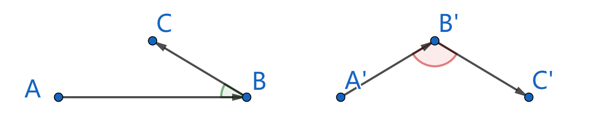
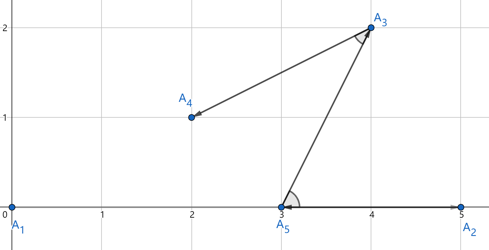

<h1 style='text-align: center;'> C. Nezzar and Nice Beatmap</h1>

<h5 style='text-align: center;'>time limit per test: 2 seconds</h5>
<h5 style='text-align: center;'>memory limit per test: 512 megabytes</h5>

Nezzar loves the game osu!.

osu! is played on beatmaps, which can be seen as an array consisting of distinct points on a plane. A beatmap is called nice if for any three consecutive points $A,B,C$ listed in order, the angle between these three points, centered at $B$, is strictly less than $90$ degrees.

  Points $A,B,C$ on the left have angle less than $90$ degrees, so they can be three consecutive points of a nice beatmap; Points $A',B',C'$ on the right have angle greater or equal to $90$ degrees, so they cannot be three consecutive points of a nice beatmap. Now Nezzar has a beatmap of $n$ distinct points $A_1,A_2,\ldots,A_n$. Nezzar would like to reorder these $n$ points so that the resulting beatmap is nice.

Formally, you are required to find a permutation $p_1,p_2,\ldots,p_n$ of integers from $1$ to $n$, such that beatmap $A_{p_1},A_{p_2},\ldots,A_{p_n}$ is nice. If it is impossible, you should determine it.

### Input

The first line contains a single integer $n$ ($3 \le n \le 5000$).

Then $n$ lines follow, $i$-th of them contains two integers $x_i$, $y_i$ ($-10^9 \le x_i, y_i \le 10^9$) — coordinates of point $A_i$.

It is guaranteed that all points are distinct.

### Output

If there is no solution, print $-1$.

Otherwise, print $n$ integers, representing a valid permutation $p$.

If there are multiple possible answers, you can print any.

## Example

### Input


```text
5
0 0
5 0
4 2
2 1
3 0
```
### Output


```text
1 2 5 3 4
```
## Note

Here is the illustration for the first test:

  Please note that the angle between $A_1$, $A_2$ and $A_5$, centered at $A_2$, is treated as $0$ degrees. However, angle between $A_1$, $A_5$ and $A_2$, centered at $A_5$, is treated as $180$ degrees.


#### Tags 

#2200 #NOT OK #constructive_algorithms #geometry #greedy #math #sortings 

## Blogs
- [All Contest Problems](../Codeforces_Round_698_(Div._1).md)
- [Announcement (en)](../blogs/Announcement_(en).md)
- [Tutorial (en)](../blogs/Tutorial_(en).md)
