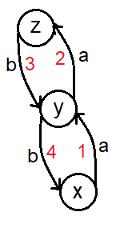
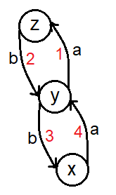

# Tutorial_(en)


### [1481A - Space Navigation](../problems/A._Space_Navigation_.md "Codeforces Round 699 (Div. 2)")

Hint 1: You can think of this problem as 2 independent 1D questions (one is up and down , and the other is left and right) instead of 1 2D question.

Hint 2: For each 1D part what is the interval of positions that you can reach and see if the end point is in this interval.

Hint 3: The interval of up and down is [-The count of D , The count of U] and the interval of left and right is [-The count of L , The count of R].

 **code**
```cpp
#include <bits/stdc++.h>

using namespace std;

int main(){
    int t;cin>>t;
    while(t--){
        int x,y;cin>>x>>y;
        string s;cin>>s;
        int u=0,d=0,l=0,r=0;
        for(int i=0;i<s.length();i++){
            if(s[i]=='U')u++;
            else if(s[i]=='R')r++;
            else if(s[i]=='D')d++;
            else l++;
        }
        if(x > 0 && r >= x )x = 0;
        if(x < 0 && l >= -x )x = 0;
        if(y > 0 && u >= y )y = 0;
        if(y < 0 && d >= -y )y = 0;
        cout<<((!x && !y)?"YES":"NO")<<endl;
    }
}
```
Author: [Salem_Alwarawreh](https://codeforces.com/profile/Salem_Alwarawreh "Expert Salem_Alwarawreh") 

### [1481B - New Colony](../problems/B._New_Colony.md "Codeforces Round 699 (Div. 2)")

The two key observation here is that if one boulder fall into the collection system all later boulders will fall into the collection system too and the number of boulders that will end up at any mountain is too small (Hence it will be at most $(n-1) \cdot (100 - 1)$).

So we can simulate all boulders throwing until one boulder fall into the collection system, this will take at most $O(100 \cdot n)$.

 **code**
```cpp
#include <bits/stdc++.h>

using namespace std;

#define all(x) (x).begin(), (x).end()
#define fast ios::sync_with_stdio(false);cin.tie(0);
typedef long long ll;
typedef long double ld;
typedef unsigned long long ull;
mt19937 rng(chrono::steady_clock::now().time_since_epoch().count());

int main(){
	fast
	int t;
	cin>>t;
	while(t--){
		int n,k;
		cin>>n>>k;
		vector<int> a(n);
		for(int i=0;i<n;i++)cin>>a[i];
		int mx = *max_element(all(a));
		if(n * mx < k){
			cout << -1 << 'n';
			continue;
		}
		int ans = n+1;
		for(int b=0;b<k;b++){
			int to = -2;
			for(int i=0;i<n-1;i++){
				if(a[i] < a[i+1]){
					to = i;
					break;
				}
			}
			ans = to + 1;
			if(to == -2)break;
			a[to]++;
		}
		cout << ans << 'n';
	}	
}
```
Author: [Warawreh](https://codeforces.com/profile/Warawreh "Master Warawreh") 

### [1481C - Fence Painting](../problems/C._Fence_Painting.md "Codeforces Round 699 (Div. 2)")

We must first see that the most important painter is the last one (and he will paint plank $x$ where $b_x = c_m$) because of two reasons: when he paints plank $x$ it won't be changed and if some other painter have a color that we don't need we can make him paint plank $x$, which will be repainted later.

Now we need to find $x$ where $b_x = c_m$, there are three options: 

* $b_x \ne a_x$.
* $b_x = a_x$.
* There are no $b_x = c_m$ this case is impossible and the answer is "NO".

If the first two are true we choose $x$ such that $b_x \ne a_x$, then we greedily distribute all painters $j$ $(1 \le j < m)$ such that:

* There is plank $i$ such that $b_i = c_j$ and $b_i \ne a_i$ then the $j^{th}$ painter will paint plank $i$ (as a result the color of the $i^{th}$ plank will be changed).
* There is no plank $i$ such that $b_i = c_j$ and $b_i \ne a_i$ then the $j^{th}$ painter will paint plank $x$.

At the end there might be some planks that didn't end up as we want so we make a last liner check on all planks $i$ and check if $b_i = a_i$, the total time is $O(n)$.

 **code**
```cpp
#include <bits/stdc++.h>
using namespace std;
#define mod 1000000007
#define oo 1000000010
const int N = 300010;

int n , m;

int a[N] , b[N] , c[N] , ans[N];

vector< int > g[N];

void solve(){
	scanf("%d%d",&n,&m);
	for(int i = 1 ;i <= n;i++) g[i].clear();
	for(int i = 0 ;i < n;i++)
		scanf("%d",&a[i]);
	for(int i = 0 ;i < n;i++){
		scanf("%d",&b[i]);
		if(b[i] != a[i])
			g[b[i]].push_back(i);
	}
	for(int i = 0; i < m;i++){
		scanf("%d",&c[i]);
	}
	int last = -1;
	if((int)g[c[m - 1]].size() > 0){
		last = g[c[m - 1]].back();
		g[c[m - 1]].pop_back();
	}
	else{
		for(int i = 0 ;i < n;i++){
			if(b[i] == c[m - 1]){
				last = i;
				break;
			}
		}
	}
	if(last == -1){
		puts("NO");
		return;
	}
	ans[m - 1] = last;
	for(int i = 0 ;i < m - 1;i++){
		if((int)g[c[i]].size() == 0){
		 	ans[i] = last;
		}
		else{
			ans[i] = g[c[i]].back();
			g[c[i]].pop_back();
		}
	}
	for(int i = 1;i <= n;i++){
		if((int)g[i].size() > 0){
			puts("NO");
			return;
		}
	}
	puts("YES");
	for(int i = 0 ;i < m;i++){
		if(i) putchar(' ');
		printf("%d",ans[i] + 1);
	}
	puts("");
}


int main(){
	int t;
	cin >> t;
	while(t--)
		solve();
	return 0;
}
```
Author: [Kilani](https://codeforces.com/profile/Kilani "Grandmaster Kilani")

Preperation: [Warawreh](https://codeforces.com/profile/Warawreh "Master Warawreh") 

### [1481D - AB Graph](../problems/D._AB_Graph.md "Codeforces Round 699 (Div. 2)")

If you can find any two nodes $x$, $y$ such that the edge going from $x$ to $y$ has the same value as the edge going from $y$ to $x$, then the answer is obviously YES.

If not, if $m$ is odd you can just choose any two nodes $x$ and $y$ and keep going $y \xrightarrow{} x \xrightarrow{} y \xrightarrow{} x \xrightarrow{} y \xrightarrow{} x \xrightarrow{} y$ until you have a string with length $m$, because any alternating string of odd length is a palindrome. 

If $m$ is even than you should check if there is two consecutive edges with the same value, that is you need to find three different nodes $x$, $y$ and $z$ such that the edge $x \xrightarrow{} y$ has the same value as the edge $y \xrightarrow{} z$. Otherwise any string you can get will be an alternating string and any alternating string with even length is not a palindrome (note that for $(n \geq 3)$ it is always possible to find these three nodes).

After finding nodes $x$ $y$, $z$ a way that guarantees you can generate a palindrome string is:

if $\frac{m}{2}$ is odd just keep moving $x \xrightarrow{} y \xrightarrow{} z \xrightarrow{} y \xrightarrow{} x \xrightarrow{} y \xrightarrow{} z$ until you have a string of length $m$.



The string will look like aabbaabb...aabbaa which is palindrome.

if $\frac{m}{2}$ is even then keep moving $y \xrightarrow{} z \xrightarrow{} y \xrightarrow{} x \xrightarrow{} y \xrightarrow{} z \xrightarrow{} y$ until you have a string of length $m$.



The string will look like abbaabba...abba which is palindrome.

Complexity $O(n^{2} + m)$.

 

 **code**
```cpp
#include <bits/stdc++.h>
using namespace std;
#define mod 998244353
#define oo 1000000010
const int N = 1010;
int n , m;
char grid[N][N];
int has[N][2];


void solve(){
	scanf("%d%d",&n,&m);
	for(int i = 0 ;i <= n;i++) has[i][0] = has[i][1] = -1;
	for(int i = 0 ;i < n;i++){
		scanf("%s",grid[i]);
		for(int j = 0  ;j < n;j++){
			if(j == i) continue;
			has[i][grid[i][j] - 'a'] = j;
		}
	}
	if(m & 1){
		puts("YES");
		for(int i = 0 ;i < m + 1;i++){
			if(i) putchar(' ');
			printf("%d",(i & 1) + 1);
		}
		puts("");
		return;
	}
	for(int i = 0 ;i < n;i++){
		for(int j = i + 1;j < n;j++){
			if(grid[i][j] == grid[j][i]){
				puts("YES");
				for(int k = 0 ;k < m + 1;k++){
					if(k) putchar(' ');
					printf("%d",(k & 1 ? i + 1 : j + 1));
				}
				puts("");
				return;
			}
		}
	}
	for(int i = 0 ;i < n;i++){
		for(int j = 0;j < n;j++){
		    if(i == j) continue;
			if(has[j][grid[i][j] - 'a'] == -1) continue;
			puts("YES");
			int cur = has[j][grid[i][j] - 'a'];
			if((m / 2) % 2 == 1){
				for(int k = 0 ;k < m + 1;k++){
					if(k) putchar(' ');
					if(k % 4 == 0)
						printf("%d",i + 1);
					else if(k % 4 == 2)
						printf("%d",cur + 1);
					else
						printf("%d",j + 1);
				}
				puts("");
				return;
			}
			printf("%d",j + 1);
			for(int k = 0 ;k < m / 2;k++){
				if(k & 1) printf(" %d",j + 1); else printf(" %d",cur + 1);
			}
			for(int k = 0 ;k < m / 2;k++){
				if(k & 1) printf(" %d",j + 1); else printf(" %d",i + 1);
			}
			puts("");
			return;			
		}
	}
	puts("NO");
	return;
}

int main(){
	int t;
	scanf("%d",&t);
	while(t--)
	    solve();
	return 0;
}
```
Author: [Kilani](https://codeforces.com/profile/Kilani "Grandmaster Kilani") 

### [1481E - Sorting Books](../problems/E._Sorting_Books.md "Codeforces Round 699 (Div. 2)")

Lets try to solve the opposite version of the problem where you want to find the maximum number of books that will stay unmoved, so we will choose number of books that will stay unmoved and then move the rest in a way that will make the shelf beautiful.

To do that lets first for each color $c$ find the leftmost and rightmost occurrence $l_c$ and $r_c$ and the frequency of this color $f_c$.Then we will use $dp_i$ which will find for each $i$ the maximum number of books that we can leave unmoved in the suffix $[i,n]$.

We will go from right to left and for each index $i$ the $dp$ will work as follow :

* If $i = l_{a_i}$, we leave all occurrences of color $a_i$ unmoved and move everything in between the first and last occurrence of color $a_i$, so between $l_{a_i}$ and $r_{a_i}$ only books with color $a_i$ will stay unmoved, we can see that this will be only true if we are at the first occurrence of color $a_i$ (when $i = l_{a_i}$ because we want to cover the segment $[l_{a_i} , r_{a_i}]$), as a result $dp_i = f_{a_i} + dp_{r_{a_i} + 1}$.
* If $i \ne l_{a_i}$, we can keep all books with color $a_i$ in range $[i,n]$ unmoved and move everything else, as a result $dp_i = cf_{a_i}$ where $cf_{a_i}$ is the number of books with color $a_i$ in range $[i,n]$ (we can update this array as we move) (note that here we move all books even those after $r_{a_i}$).
* In either cases we can move the book $a_i$ and get $dp_i = dp_{i+1}$.

The answer will be $n - dp_1$ and the time is $O(n)$.

 **code**
```cpp
#include <bits/stdc++.h>

using namespace std;

#define all(x) (x).begin(), (x).end()
#define fast ios::sync_with_stdio(false);cin.tie(0);
typedef long long ll;
typedef long double ld;
typedef unsigned long long ull;
mt19937 rng(chrono::steady_clock::now().time_since_epoch().count());

int main(){
	fast
	int n;
	cin>>n;
	vector<int> a(n),f(n),cf(n);
	vector<pair<int,int>> at(n,{-1,-1});
	for(int i=0;i<n;i++){
		cin>>a[i];
		a[i]--;
		f[a[i]]++;
		if(at[a[i]].first == -1)at[a[i]] = {i,i};
		at[a[i]].second = i;
	}
	vector<int> dp(n+1);

	for(int i=n-1;i>=0;i--){
		dp[i] = dp[i+1];
		cf[a[i]]++;
		if(i == at[a[i]].first)dp[i] = max(dp[i] , dp[at[a[i]].second + 1] + f[a[i]]);
		else dp[i] = max(dp[i] , cf[a[i]]);
	}

	cout << n - dp[0] << 'n';
}
```
Author: [Warawreh](https://codeforces.com/profile/Warawreh "Master Warawreh") 

### [1481F - AB Tree](../problems/F._AB_Tree.md "Codeforces Round 699 (Div. 2)")

let the diameter of the tree (the maximum distance between a root and a leaf) be $d$, then the answer couldn't be less than $d+1$ because you will add strings of all lengths between $1$ and $d+1$.

In order to have the answer $d+1$, you need all strings with the same length to be equal, so all nodes on the same level must have the same character. Let's define an array $a$ of size $d+1$, such that $a_i$ = (number of nodes at level $i$). So if the answer is $d+1$ there must exist a subset from $a$ with sum $x$, so we assign character a to all the nodes with a level belongs to that subset, and character b to all other nodes.

To check if there is a subset with sum $x$ we can use dynamic programming, the complexity of this solution is $O(x \cdot (d+1))$, which is in worst case $O(n^{2})$.

But since the sum of array $a$ is equal to $n$, the number of unique values in $a$ will be at most $\sqrt{n}$, so lets have an array of size at most $\sqrt{n}$ having every value with it's frequency. Now let $dp[i][j]$ be true if it is possible to find a subset with sum $j$ in the suffix $i$. So to check if $dp[i][j]$ is true or not we need to check $dp[i+1][j - val[i]], dp[i+1][j - 2 \cdot val[i]] ... , dp[i+1][j - freq[i] \cdot val[i]]$, in another way we need to find a value $k$ such that $dp[i+1][j - k \cdot val[i]]$ is true and $(k \leq freq[i])$, so for every $j$ let's find the minimum possible $k$, if $dp[i + 1][j]$ is true then $k_j$ will be equal to $0$, otherwise it is equal to $k_{j - val[i]} + 1$.

So this way we can check if the answer is $d+1$ in $O(n \cdot \sqrt{n})$.

Now if the answer is not $d+1$, then it is $d+2$. To find the answer let's start from level $0$ to level $d$, when you are at level $i$ let the number of remaining nodes be $m$ (the number of nodes with depth greater than or equal to $i$) and you have $y$ remaining a's you can still use.

If $a_i$ is not greater than $y$ or not greater than $m-y$, you can assign all nodes on the current level with the same character and move on to the next level.

If not then you will have to use the two characters on the current level so you are going to add at least one more string on the answer. If you have two nodes on the same level having the same character but the nodes have different prefixes, then the strings will not be considered equal, so to guarantee not adding more than one string to the answer later on, you should make sure to assign the same character to all non-leaf nodes on the current level.

Now if we have $l$ non-leaf nodes then $l$ must be less than or equal to $\frac{m}{2}$, because every non-leaf node should have at least one more node in it's sub tree, and we know that for any value $y$ ($\frac{m}{2} \leq max(y , m - y)$), so it is possible to assign the same character to all non-leaf nodes, after assigning all non-leaf nodes with the same character make sure to finish all the remaining copies of this character on the current level so you guarantee on the next levels all nodes will be the same.

This way only one string will be added on the current level so the answer will be $d+2$.

Total complexity is $O(n \cdot \sqrt{n})$

 **code**
```cpp
#include <bits/stdc++.h>
using namespace std;
#define mod 998244353
#define oo 1000000010
const int N = 100010;
const int SQ = 500;
int n , x , p;
vector< int > g[N] , cur[N];

char c[N];

int mx;

vector< pair<int,int> > v , v2;

pair< int , char > a , b;

int sz[N];

bool comp(int u,int v){
	return (sz[u] < sz[v]);
}

int DFS(int node,int d){
	mx = max(mx,d);
	cur[d].push_back(node);
	sz[node] = 1;
	for(int i = 0 ;i < (int)g[node].size();i++)
		sz[node] += DFS(g[node][i] , d + 1);	
	return sz[node];
}

bool dp[SQ][N];

int f[N];

void build_path(int i,int j){
	if(i == (int)v2.size())
		return;
	while(!dp[i + 1][j]){
		f[v2[i].first]++;
		j -= v2[i].first;
	}
	build_path(i + 1 , j);
}

int main(){
	scanf("%d%d",&n,&x);
	a = make_pair(x , 'a');
	b = make_pair(n - x , 'b');
	if(a > b) swap(a , b);
	for(int i = 2 ;i <= n;i++){
		scanf("%d",&p);
		g[p].push_back(i);
	}
	DFS(1 , 0);
	for(int i = 0 ;i <= mx;i++)
		v.push_back(make_pair((int)cur[i].size() , i));
	sort(v.begin(),v.end());
	for(int i = 0 ;i < (int)v.size();i++){
		if(i == 0 || v[i].first != v[i - 1].first)
			v2.push_back(make_pair(v[i].first , 1));
		else
			v2.back().second++;
	}
	dp[(int)v2.size()][0] = true;
	int val , frq;
	for(int i = (int)v2.size() - 1;i >= 0;i--){
		val = v2[i].first;
		frq = v2[i].second;
		vector< int > last(val , -1);
		for(int j = 0 ;j <= a.first;j++){
			if(dp[i + 1][j] == true)
				last[j % val] = j;
			if(last[j % val] == -1 || ((j - last[j % val]) / val) > frq)
				dp[i][j] = false;
			else
				dp[i][j] = true;
		}
	}
	if(dp[0][a.first]){
		build_path(0 , a.first);
		for(int i = 1;i <= n;i++) c[i - 1] = b.second;
		for(int i = 0 ;i <= mx;i++){
			if(f[(int)cur[i].size()] == 0) continue;
			f[(int)cur[i].size()]--;
			for(int j = 0 ;j < (int)cur[i].size();j++)
				c[cur[i][j] - 1] = a.second;
		}
		printf("%dn",mx + 1);
		c[n] = '0';
		puts(c);
		return 0;	
	}
	printf("%dn",mx + 2);
	for(int i = 0 ;i <= mx;i++){
		sort(cur[i].begin(),cur[i].end(),comp);
		if(a.first < b.first) swap(a , b);
		while((int)cur[i].size() > 0 && a.first > 0){
			c[cur[i].back() - 1] = a.second;
			cur[i].pop_back();
			a.first--;
		}
		while((int)cur[i].size() > 0 && b.first > 0){
			c[cur[i].back() - 1] = b.second;
			cur[i].pop_back();
			b.first--;
		}
	}
	c[n] = '0';
	puts(c);
	return 0;
}
```
Author: [Kilani](https://codeforces.com/profile/Kilani "Grandmaster Kilani")

