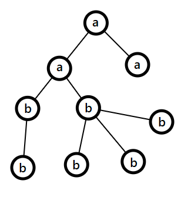

<h1 style='text-align: center;'> F. AB Tree</h1>

<h5 style='text-align: center;'>time limit per test: 2 seconds</h5>
<h5 style='text-align: center;'>memory limit per test: 256 megabytes</h5>

Kilani and Abd are neighbors for 3000 years, but then the day came and Kilani decided to move to another house. As a farewell gift, Kilani is going to challenge Abd with a problem written by their other neighbor with the same name Abd.

  The problem is:

You are given a connected tree rooted at node $1$.

You should assign a character a or b to every node in the tree so that the total number of a's is equal to $x$ and the total number of b's is equal to $n - x$.

Let's define a string for each node $v$ of the tree as follows: 

* if $v$ is root then the string is just one character assigned to $v$:
* otherwise, let's take a string defined for the $v$'s parent $p_v$ and add to the end of it a character assigned to $v$.

You should assign every node a character in a way that minimizes the number of distinct strings among the strings of all nodes.

### Input

The first line contains two integers $n$ and $x$ ($1 \leq n \leq 10^5$; $0 \leq x \leq n$) — the number of vertices in the tree the number of a's.

The second line contains $n - 1$ integers $p_2, p_3, \dots, p_{n}$ ($1 \leq p_i \leq n$; $p_i \neq i$), where $p_i$ is the parent of node $i$.

It is guaranteed that the input describes a connected tree.

### Output

In the first line, print the minimum possible total number of distinct strings.

In the second line, print $n$ characters, where all characters are either a or b and the $i$-th character is the character assigned to the $i$-th node.

Make sure that the total number of a's is equal to $x$ and the total number of b's is equal to $n - x$.

If there is more than one answer you can print any of them.

## Example

### Input


```text
9 3
1 2 2 4 4 4 3 1
```
### Output


```text
4
aabbbbbba
```
## Note

The tree from the sample is shown below:

  The tree after assigning characters to every node (according to the output) is the following:

  Strings for all nodes are the following: 

* string of node $1$ is: a
* string of node $2$ is: aa
* string of node $3$ is: aab
* string of node $4$ is: aab
* string of node $5$ is: aabb
* string of node $6$ is: aabb
* string of node $7$ is: aabb
* string of node $8$ is: aabb
* string of node $9$ is: aa

The set of unique strings is $\{\text{a}, \text{aa}, \text{aab}, \text{aabb}\}$, so the number of distinct strings is $4$.


#### Tags 

#3100 #NOT OK #dp #greedy #trees 

## Blogs
- [All Contest Problems](../Codeforces_Round_699_(Div._2).md)
- [Announcement (en)](../blogs/Announcement_(en).md)
- [Tutorial (en)](../blogs/Tutorial_(en).md)
