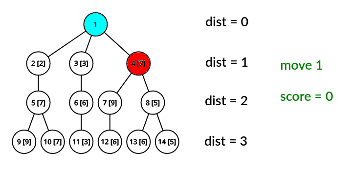

<h1 style='text-align: center;'> E. Move and Swap</h1>

<h5 style='text-align: center;'>time limit per test: 2 seconds</h5>
<h5 style='text-align: center;'>memory limit per test: 256 megabytes</h5>

You are given $n - 1$ integers $a_2, \dots, a_n$ and a tree with $n$ vertices rooted at vertex $1$. The leaves are all at the same distance $d$ from the root. 

Recall that a tree is a connected undirected graph without cycles. The distance between two vertices is the number of edges on the simple path between them. All non-root vertices with degree $1$ are leaves. If vertices $s$ and $f$ are connected by an edge and the distance of $f$ from the root is greater than the distance of $s$ from the root, then $f$ is called a child of $s$.

Initially, there are a red coin and a blue coin on the vertex $1$. Let $r$ be the vertex where the red coin is and let $b$ be the vertex where the blue coin is. You should make $d$ moves. A move consists of three steps: 

* Move the red coin to any child of $r$.
* Move the blue coin to any vertex $b'$ such that $dist(1, b') = dist(1, b) + 1$. Here $dist(x, y)$ indicates the length of the simple path between $x$ and $y$. 
## Note

 that $b$ and $b'$ are not necessarily connected by an edge.
* You can optionally swap the two coins (or skip this step).

## Note

 that $r$ and $b$ can be equal at any time, and there is no number written on the root.

After each move, you gain $|a_r - a_b|$ points. What's the maximum number of points you can gain after $d$ moves?

### Input

The first line contains a single integer $t$ ($1 \le t \le 10^4$) — the number of test cases.

The first line of each test case contains a single integer $n$ ($2 \leq n \leq 2 \cdot 10^5$) — the number of vertices in the tree.

The second line of each test case contains $n-1$ integers $v_2, v_3, \dots, v_n$ ($1 \leq v_i \leq n$, $v_i \neq i$)  — the $i$-th of them indicates that there is an edge between vertices $i$ and $v_i$. It is guaranteed, that these edges form a tree.

The third line of each test case contains $n-1$ integers $a_2, \dots, a_n$ ($1 \leq a_i \leq 10^9$) — the numbers written on the vertices.

It is guaranteed that the sum of $n$ for all test cases does not exceed $2 \cdot 10^5$.

### Output

For each test case, print a single integer: the maximum number of points you can gain after $d$ moves.

## Example

### Input


```text
4
14
1 1 1 2 3 4 4 5 5 6 7 8 8
2 3 7 7 6 9 5 9 7 3 6 6 5
6
1 2 2 3 4
32 78 69 5 41
15
1 15 1 10 4 9 11 2 4 1 8 6 10 11
62 13 12 43 39 65 42 86 25 38 19 19 43 62
15
11 2 7 6 9 8 10 1 1 1 5 3 15 2
50 19 30 35 9 45 13 24 8 44 16 26 10 40
```
### Output


```text
14
45
163
123
```
## Note

In the first test case, an optimal solution is to: 

* move $1$: $r = 4$, $b = 2$; no swap;
* move $2$: $r = 7$, $b = 6$; swap (after it $r = 6$, $b = 7$);
* move $3$: $r = 11$, $b = 9$; no swap.

The total number of points is $|7 - 2| + |6 - 9| + |3 - 9| = 14$.

  In the second test case, an optimal solution is to: 

* move $1$: $r = 2$, $b = 2$; no swap;
* move $2$: $r = 3$, $b = 4$; no swap;
* move $3$: $r = 5$, $b = 6$; no swap.

The total number of points is $|32 - 32| + |78 - 69| + |5 - 41| = 45$.


#### Tags 

#2500 #NOT OK #dfs_and_similar #dp #greedy #trees 

## Blogs
- [All Contest Problems](../Codeforces_Round_701_(Div._2).md)
- [Announcement (en)](../blogs/Announcement_(en).md)
- [Tutorial (en)](../blogs/Tutorial_(en).md)
