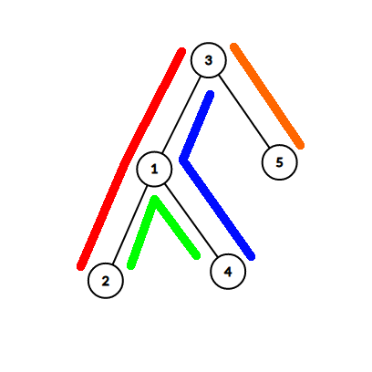

<h1 style='text-align: center;'> F. Pairs of Paths</h1>

<h5 style='text-align: center;'>time limit per test: 6 seconds</h5>
<h5 style='text-align: center;'>memory limit per test: 512 megabytes</h5>

You are given a tree consisting of $n$ vertices, and $m$ simple vertex paths. Your task is to find how many pairs of those paths intersect at exactly one vertex. More formally you have to find the number of pairs $(i, j)$ $(1 \leq i < j \leq m)$ such that $path_i$ and $path_j$ have exactly one vertex in common. 

##### Input

First line contains a single integer $n$ $(1 \leq n \leq 3 \cdot 10^5)$.

Next $n - 1$ lines describe the tree. Each line contains two integers $u$ and $v$ $(1 \leq u, v \leq n)$ describing an edge between vertices $u$ and $v$.

Next line contains a single integer $m$ $(1 \leq m \leq 3 \cdot 10^5)$.

Next $m$ lines describe paths. Each line describes a path by it's two endpoints $u$ and $v$ $(1 \leq u, v \leq n)$. The given path is all the vertices on the shortest path from $u$ to $v$ (including $u$ and $v$).

##### Output

##### Output

 a single integer — the number of pairs of paths that intersect at exactly one vertex.

## Examples

##### Input


```text
5
1 2
1 3
1 4
3 5
4
2 3
2 4
3 4
3 5
```
##### Output


```text
2
```
##### Input


```text
1
3
1 1
1 1
1 1
```
##### Output


```text
3
```
##### Input


```text
5
1 2
1 3
1 4
3 5
6
2 3
2 4
3 4
3 5
1 1
1 2
```
##### Output


```text
7
```
## Note



The tree in the first example and paths look like this. Pairs $(1,4)$ and $(3,4)$ intersect at one vertex.

In the second example all three paths contain the same single vertex, so all pairs $(1, 2)$, $(1, 3)$ and $(2, 3)$ intersect at one vertex.

The third example is the same as the first example with two additional paths. Pairs $(1,4)$, $(1,5)$, $(2,5)$, $(3,4)$, $(3,5)$, $(3,6)$ and $(5,6)$ intersect at one vertex.


#### Tags 

#2600 #NOT OK #combinatorics #data_structures #dfs_and_similar #dp #trees 

## Blogs
- [All Contest Problems](../Codeforces_Round_703_(Div._2).md)
- [Announcement](../blogs/Announcement.md)
- [Tutorial (en)](../blogs/Tutorial_(en).md)
