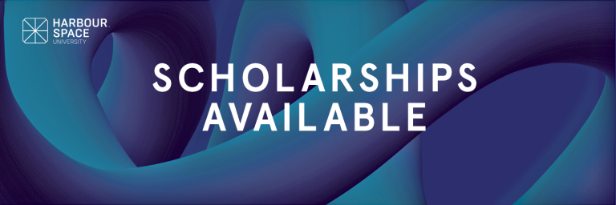

# Announcement

Hello Codeforces!

On [Monday, February 15, 2021 at 20:35UTC+6](https://codeforces.com/https://www.timeanddate.com/worldclock/fixedtime.html?day=15&month=2&year=2021&hour=17&min=35&sec=0&p1=166) [Educational Codeforces Round 104 (Rated for Div. 2)](https://codeforces.com/contest/1487 "Educational Codeforces Round 104 (Rated for Div. 2)") will start.

Series of Educational Rounds continue being held as [Harbour.Space University](https://codeforces.com/https://harbour.space/) initiative! You can read the details about the cooperation between [Harbour.Space University](https://codeforces.com/https://harbour.space/) and Codeforces in the [blog post](//codeforces.com/blog/entry/51208).

This round will be **rated for the participants with rating lower than 2100**. It will be held on extended ICPC rules. The penalty for each incorrect submission until the submission with a full solution is 10 minutes. After the end of the contest you will have 12 hours to hack any solution you want. You will have access to copy any solution and test it locally.

You will be given **6 or 7 problems** and **2 hours** to solve them.

The problems were invented and prepared by Roman [Roms](https://codeforces.com/profile/Roms "Master Roms") Glazov, Adilbek [adedalic](https://codeforces.com/profile/adedalic "International Master adedalic") Dalabaev, Vladimir [vovuh](https://codeforces.com/profile/vovuh "Master vovuh") Petrov, Ivan [BledDest](https://codeforces.com/profile/BledDest "International Grandmaster BledDest") Androsov, Maksim [Neon](https://codeforces.com/profile/Neon "Candidate Master Neon") Mescheryakov and me. Also huge thanks to Mike [MikeMirzayanov](https://codeforces.com/profile/MikeMirzayanov "Headquarters, MikeMirzayanov") Mirzayanov for great systems Polygon and Codeforces.

Good luck to all the participants!

Our friends at Harbour.Space also have a message for you:

*Amazing news, Codeforces!*

*As we promised last time, we are coming back with a new **scholarship opportunity**!* 

*We have partnered with Coherra to open the door for an exciting career in technology for the most talented people in our network.* 

*In partnership with Coherra, we are offering a full scholarship to study a Master’s in **Front End Development** at Harbour.Space while working as a Front End Developer at Coherra!*

*Scholarship Highlights:*

➡ *Work in Europe’s most exciting tech cities*

➡ *Scholarship value of up to €22,900 to study at Harbour.Space University*

➡ *Competitive compensation for the internship at Coherra*

➡ *Opportunity to join Coherra full-time after graduation*

*We have previously partnered with other companies like OneRagtime, Hansgrohe, and Remy Robotics to empower young talents around the world and help them boost their tech career. We’ve already filled a few of the positions with our partners including:*

 * *Full Stack Developer at **OneRagtime** awarded to Alejandro Martinez from Mexico*
* *Innovation Designer at **Hansgrohe** awarded to Giorgi Zhuzhiashvili from Georgia*

*We are always happy to see Codeforces members join the Harbour.Space family. Apply now to get a chance to learn from the best in the field and kickstart your career!*

*Keep in touch and follow us on [LinkedIn](https://codeforces.com/https://www.linkedin.com/school/harbour-space/) for more scholarship opportunities. And follow us on [Instagram](https://codeforces.com/https://www.instagram.com/harbour.space/) to evidence student life, events, and success stories from our apprenticeship programme students.*

*Good luck on your round, and see you next time!* 

*Harbour.Space University* 

Congratulations to the winners: 

| Rank | Competitor | Problems Solved | Penalty |
| --- | --- | --- | --- |
| 1 | [Muffinhead](https://codeforces.com/profile/Muffinhead "International Grandmaster Muffinhead") | 7 | 211 |
| 2 | [noimi](https://codeforces.com/profile/noimi "International Grandmaster noimi") | 7 | 271 |
| 3 | [LayCurse](https://codeforces.com/profile/LayCurse "International Grandmaster LayCurse") | 7 | 279 |
| 4 | [satashun](https://codeforces.com/profile/satashun "International Grandmaster satashun") | 7 | 333 |
| 5 | [nhho](https://codeforces.com/profile/nhho "Grandmaster nhho") | 7 | 366 |

90 successful hacks and 1286 unsuccessful hacks were made in total!

And finally people who were the first to solve each problem: 

| Problem | Competitor | Penalty |
| --- | --- | --- |
| A | [BOOBA](https://codeforces.com/profile/BOOBA "Master BOOBA") | 0:01 |
| B | [noimi](https://codeforces.com/profile/noimi "International Grandmaster noimi") | 0:04 |
| C | [MurasakiShion](https://codeforces.com/profile/MurasakiShion "Newbie MurasakiShion") | 0:07 |
| D | [peti1234](https://codeforces.com/profile/peti1234 "International Grandmaster peti1234") | 0:06 |
| E | [Bhaiya_ko_nahi_batana](https://codeforces.com/profile/Bhaiya_ko_nahi_batana "Unrated, Bhaiya_ko_nahi_batana") | 0:12 |
| F | [uwi](https://codeforces.com/profile/uwi "International Grandmaster uwi") | 0:51 |
| G | [renascencepjw0510](https://codeforces.com/profile/renascencepjw0510 "Unrated, renascencepjw0510") | 0:27 |

**UPD:** [Editorial is out](Tutorial.md)

