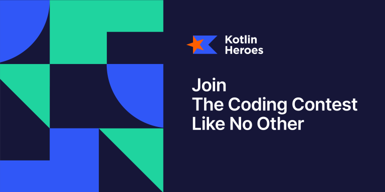

# Announcement

Hello, Codeforces!

First and foremost, we would like to say a massive thank you to everyone who entered and submitted their answers to the five Kotlin Heroes competitions which were held previously: [Episode 1](https://codeforces.com/contests/1170), [Episode 2](https://codeforces.com/contests/1211), [Episode 3](https://codeforces.com/contests/1297), [Episode 4](https://codeforces.com/contests/1346), and [Episode 5: ICPC Round](https://codeforces.com/contest/1431).

Ready to challenge yourself to do better? The [Kotlin Heroes: Episode 6](https://codeforces.com/contest/1488 "Kotlin Heroes: Episode 6") competition will be hosted on the Codeforces platform on [Tuesday, March 9, 2021 at 20:35UTC+6](https://codeforces.com/https://www.timeanddate.com/worldclock/fixedtime.html?day=9&month=3&year=2021&hour=17&min=35&sec=0&p1=166). The contest will last 2 hours 30 minutes and will feature a set of problems from simple ones, designed to be solvable by anyone, to hard ones, to make it interesting for seasoned competitive programmers. 

**Prizes:**

**Top three winners will get prizes of $512, $256, and $128 respectively, top 50 will win a Kotlin Heroes t-shirt and an exclusive Kotlin sticker, competitors solving at least one problem will enter into a draw for one of 50 Kotlin Heroes t-shirts.**

Registration is already open and available via [the link](https://codeforces.com/contests/1488,1489). It will be available until the end of the round.

The round will again be held in accordance with a set of slightly modified ICPC rules:

 * The round is unrated.
* The contest will have 9 problems of various levels of complexity.
* You are only allowed to use Kotlin to solve these problems.
* Participants are ranked according to the number of correctly solved problems. Ties are resolved based on the lowest total penalty time for all problems, which is computed as follows. For each solved problem, a penalty is set to the submission time of that problem (the time since the start of the contest). An extra penalty of 10 minutes is added for each failed submission on solved problems (i. e., if you never solve the problem, you will not be penalized for trying that problem). If two participants solved the same number of problems and scored the same penalty, then those of them who had previously made the last successful submission will be given an advantage in the distribution of prizes and gifts.

  

 [REGISTER →](https://codeforces.com/contests/1488,1489)  If you are still new to Kotlin we have prepared [a tutorial on competitive programming in Kotlin](https://codeforces.com/https://kotlinlang.org/docs/tutorials/competitive-programming.html) and [Kotlin Heroes: Practice 6](https://codeforces.com/contest/1489 "Kotlin Heroes: Practice 6"), where you can try to solve a few simple problems in Kotlin. The practice round is available by [the link](https://codeforces.com/contests/1489).

We wish you luck and hope you enjoy Kotlin.

