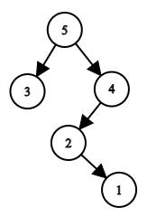
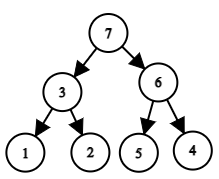

<h1 style='text-align: center;'> D. Permutation Transformation</h1>

<h5 style='text-align: center;'>time limit per test: 2 seconds</h5>
<h5 style='text-align: center;'>memory limit per test: 256 megabytes</h5>

A permutation — is a sequence of length $n$ integers from $1$ to $n$, in which all the numbers occur exactly once. For example, $[1]$, $[3, 5, 2, 1, 4]$, $[1, 3, 2]$ — permutations, and $[2, 3, 2]$, $[4, 3, 1]$, $[0]$ — no.

Polycarp was recently gifted a permutation $a[1 \dots n]$ of length $n$. Polycarp likes trees more than permutations, so he wants to transform permutation $a$ into a rooted binary tree. He transforms an array of different integers into a tree as follows: 

* the maximum element of the array becomes the root of the tree;
* all elements to the left of the maximum — form a left subtree (which is built according to the same rules but applied to the left part of the array), but if there are no elements to the left of the maximum, then the root has no left child;
* all elements to the right of the maximum — form a right subtree (which is built according to the same rules but applied to the right side of the array), but if there are no elements to the right of the maximum, then the root has no right child.

For example, if he builds a tree by permutation $a=[3, 5, 2, 1, 4]$, then the root will be the element $a_2=5$, and the left subtree will be the tree that will be built for the subarray $a[1 \dots 1] = [3]$, and the right one — for the subarray $a[3 \dots 5] = [2, 1, 4]$. As a result, the following tree will be built: 

  The tree corresponding to the permutation $a=[3, 5, 2, 1, 4]$. Another example: let the permutation be $a=[1, 3, 2, 7, 5, 6, 4]$. In this case, the tree looks like this: 

  The tree corresponding to the permutation $a=[1, 3, 2, 7, 5, 6, 4]$. Let us denote by $d_v$ the depth of the vertex $a_v$, that is, the number of edges on the path from the root to the vertex numbered $a_v$. Note that the root depth is zero. Given the permutation $a$, for each vertex, find the value of $d_v$.

### Input

The first line contains one integer $t$ ($1 \le t \le 100$) — the number of test cases. Then $t$ test cases follow.

The first line of each test case contains an integer $n$ ($1 \le n \le 100$) — the length of the permutation.

This is followed by $n$ numbers $a_1, a_2, \ldots, a_n$ — permutation $a$.

### Output

For each test case, output $n$ values — $d_1, d_2, \ldots, d_n$.

## Example

### Input


```text
3
5
3 5 2 1 4
1
1
4
4 3 1 2
```
### Output


```text
1 0 2 3 1 
0 
0 1 3 2 
```


#### Tags 

#1200 #NOT OK #dfs_and_similar #divide_and_conquer #implementation 

## Blogs
- [All Contest Problems](../Codeforces_Round_702_(Div._3).md)
- [Announcement](../blogs/Announcement.md)
- [Tutorial](../blogs/Tutorial.md)
