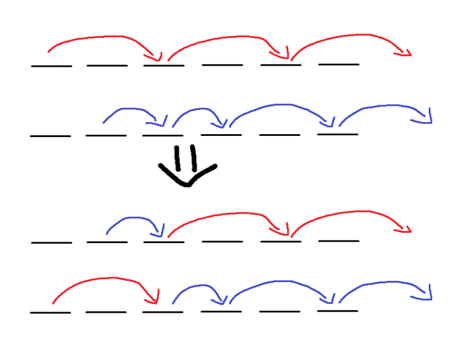
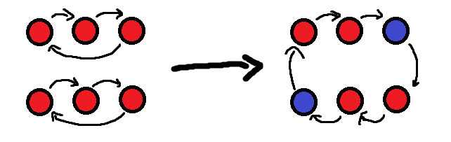
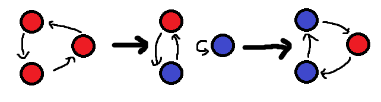
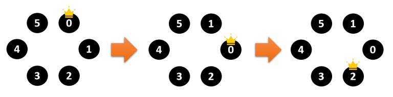
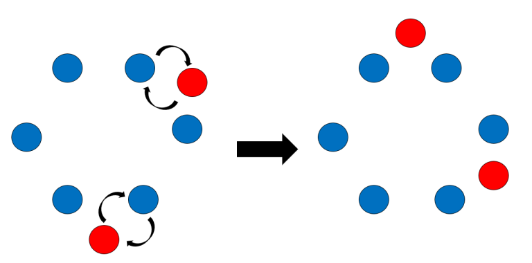

# Tutorial_(en)

[1491A - K-th Largest Value](../problems/A._K-th_Largest_Value.md "Codeforces Global Round 13")
----------------------------------------------------------------------------------------------------------

Setter: [syksykCCC](https://codeforces.com/profile/syksykCCC "Master syksykCCC")  
Prepared by: [syksykCCC](https://codeforces.com/profile/syksykCCC "Master syksykCCC") 

 **Hint 1**How can we find the largest k such that the k-th smallest element of the array is 0?

 **Hint 2**How can we maintain k?

 **Solution**Let's define cnt to represent the number of 1s in the array.

For the modifications, if ai is already 1 now, then we let cnt←cnt−1. Otherwise, let cnt←cnt+1.

For the querys, just compare cnt with k. If cnt≥k, the answer will be 1. Otherwise, the answer will be 0.

The complexity : O(n+q).

 **Code (C++)**
```cpp
#include <bits/stdc++.h>
using namespace std;
const int N = 1e6 + 5;
int n, q, a[N], cnt;
int main()
{
    scanf("%d%d",&n,&q);
	for(int i = 1; i <= n; ++i)
	{
    	scanf("%d",a+i);
		cnt += a[i];
	}
	while(q--)
	{
		int opt, x;
		scanf("%d%d",&opt,&x);
		if(opt == 1)
		{
			if(a[x]) cnt--;
			else cnt++;
			a[x] = 1 - a[x];
		}
		else
		{
			if(cnt >= x) puts("1");
			else puts("0");
		}
	}
	return 0;
}
```
 **Code (Python) (vim1729)**
```cpp
n, q = map(int,input().split())
a = list(map(int,input().split()))
zero = a.count(0)
one = n - zero
for _ in range(q):
    t, x = map(int,input().split())
    if t == 1:
        if a[x-1] == 1:
            zero += 1
            one -= 1
            a[x-1] = 0
        else:
            zero -= 1
            one += 1
            a[x-1] = 1
    else:
        if x<=one:
            print(1)
        else:
            print(0)
```
[1491B - Minimal Cost](../problems/B._Minimal_Cost.md "Codeforces Global Round 13")
---------------------------------------------------------------------------------------------------

Setter: [syksykCCC](https://codeforces.com/profile/syksykCCC "Master syksykCCC")  
Prepared by: [syksykCCC](https://codeforces.com/profile/syksykCCC "Master syksykCCC") 

 **Hint 1**When is the answer 0? Or rather, when do you not have to make any moves?

 **Hint 2**What happens if a[i] is same for all i?

 **Solution**Consider the following situations:

 * ∀i∈[2,n],|ai−ai−1|=0, then the answer will be v+min(u,v).
* ∃i∈[2,n],|ai−ai−1|>1, then the answer will be 0.
* Otherwise, the answer will be min(u,v).
 **Code (C++)**
```cpp
#include <bits/stdc++.h>
using namespace std;
const int N = 1e6 + 5;
int n, a[N], ans = INT_MAX, u, v, T;
int main()
{
	ios::sync_with_stdio(false);
	cin>>T;
	while(T--){
	    ans = INT_MAX;
	    cin >> n >> u >> v;
	    for(int i = 1; i <= n; i++)
		    cin >> a[i];
	    for(int i = 2; i <= n; i++)
	    {
		    if(abs(a[i] - a[i - 1]) >= 2) ans = 0;
	    	if(abs(a[i] - a[i - 1]) == 1) ans = min(ans, min(u, v));
		    if(a[i] == a[i - 1]) ans = min(ans, v + min(u, v));
	    }
	    cout << ans << endl;
	}
	
	return 0;
}
```
[1491C - Pekora and Trampoline](../problems/C._Pekora_and_Trampoline.md "Codeforces Global Round 13")
------------------------------------------------------------------------------------------------------------

Setter: [oolimry](https://codeforces.com/profile/oolimry "Master oolimry")  
Prepared by: [errorgorn](https://codeforces.com/profile/errorgorn "Grandmaster errorgorn") 

 **Hint 1**Think greedily!

 **Hint 2**By exchange argument, where can Pekora start her pass in an optimal solution?

 **Solution**For a series of passes, we can describe it as an array P where Pi is the trampoline Pekora starts at in the i-th pass. We claim that the final state of trampolines after performing any **permutation** of P will be the same.

 **Proof**Focus on 2 adjacent passes. We realize that if we swap those 2 passes, the jumps done on both these passes are the same.



Since swapping any 2 adjacent passes does not change the final state of trampolines, any permutation of P will not change the final state of trampolines.

Now, we can claim that there is an optimal solution with P being non-decreasing. Since Pekora can only move right, we must put Pekora on the first trampoline such that Si≠1.

However, we cannot directly simulate putting Pekora on the first trampoline such that Si≠1. This actually uses O(N3).

 **Countertest**`5000 4999 4998 4997 ... 2 1`

However, we can simulate this in O(N2) by the following. Instead of simulating passes individually, we will combine them. The main idea is that when Pekora jumps on a trampoline of strength Si, we just add another Pekora on trampoline Si+i and process it later. 

So, when we process trampolines from 1 to N, we keep track of how many Pekoras there are on trampoline i, which we will denote as Ci. Then, we only add extra Pekoras to trampoline i if Si>Ci+1. Now, we have some Pekoras on trampoline i and we need to update other values of Ci. 

If Si=4 and Ci=6 for example, we would add 1 Pekora each trampolines to i+2,i+3,i+4 to reduce Si to 1. Then, the rest of the Pekoras will be moved to trampoline i+1. 

This algorithm runs in O(N2) as we only need to update O(N) other trampolines at each step.

Bonus: solve this problem in O(N). (This was the original constraints but it was later changed since it was too hard for its position.)

 **Code (C++)**
```cpp
//雪花飄飄北風嘯嘯
//天地一片蒼茫

#include <bits/stdc++.h>
#include <ext/pb_ds/assoc_container.hpp>
#include <ext/pb_ds/tree_policy.hpp>
#include <ext/rope>
using namespace std;
using namespace __gnu_pbds;
using namespace __gnu_cxx;
#define ll long long
#define ii pair<ll,ll>
#define iii pair<ii,ll>
#define fi first
#define se second
#define endl 'n'
#define debug(x) cout << #x << " is " << x << endl

#define pub push_back
#define pob pop_back
#define puf push_front
#define pof pop_front
#define lb lower_bound
#define up upper_bound

#define rep(x,start,end) for(auto x=(start)-((start)>(end));x!=(end)-((start)>(end));((start)<(end)?x++:x--))
#define all(x) (x).begin(),(x).end()
#define sz(x) (int)(x).size()

#define indexed_set tree<ll,null_type,less<ll>,rb_tree_tag,tree_order_statistics_node_update>
//change less to less_equal for non distinct pbds, but erase will bug

mt19937 rng(chrono::system_clock::now().time_since_epoch().count());

int n;
int arr[5005];
ll curr[5005];

int main(){
	ios::sync_with_stdio(0);
	cin.tie(0);
	cout.tie(0);
	cin.exceptions(ios::badbit | ios::failbit);
	
	int TC;
	cin>>TC;
	while (TC--){
		cin>>n;
		rep(x,0,n) cin>>arr[x];
		rep(x,0,n) curr[x]=0;
		
		ll ans=0;
		
		rep(x,0,n){
			ll temp=curr[x];
			
			if (temp<arr[x]-1){
				ans+=arr[x]-1-temp;
				temp+=arr[x]-1-temp;
			}
			
			curr[x+1]+=temp-arr[x]+1;
			if (x+2<n) rep(y,x+2,min(n,x+arr[x]+1)) curr[y]++;
		}
		
		cout<<ans<<endl;
	}
}
```
 **Code (Python)**
```cpp
TC=int(input())

for tc in range(TC):
    n=int(input())
    arr=list(map(int,input().split()))
    
    curr=[0]*(n+5)
    
    ans=0
    
    for x in range(n):
        temp=curr[x]
        
        if (temp<arr[x]-1):
            ans+=arr[x]-1-temp
            temp+=arr[x]-1-temp
            
        curr[x+1]+=temp-arr[x]+1
        for y in range(x+2,min(n,x+arr[x]+1)):
            curr[y]+=1
        
    print(ans)
```
[1491D - Zookeeper and The Infinite Zoo](../problems/D._Zookeeper_and_The_Infinite_Zoo.md "Codeforces Global Round 13")
---------------------------------------------------------------------------------------------------------------------

Setter: [errorgorn](https://codeforces.com/profile/errorgorn "Grandmaster errorgorn")  
Prepared by: [errorgorn](https://codeforces.com/profile/errorgorn "Grandmaster errorgorn") 

 **Hint 1**Since & is a bitwise operation, represent the number in binary form!

 **Hint 2**We can convert any u+v move to a series of u+v′ moves where u&v′=v′ and v′=2k.

 **Hint 3**Such a move converts a substring of the binary string of the form 01…11 into 10…00.

 **Hint 4**Focus on converting 01 into 10.

 **Solution**Firstly, we can show that the reachability graph is equivalent if we restrict to a directed edge between vertices u and u+v if u&v=v and that v=2k for some k. 

This is because we can add each bit from v from u from the highest bit as adding a bit to a number will not affect lower bits.

Now, we observe that such as operation converts a binary string of the form 01…11 into 10…00 for some substring when we represent u as a binary string. (more significant bits are to the left).

Now, we consider s and t as binary strings.

If and only if there is a matching from bits in t to a lower bit in s and t > s, then t is reachable from s.

Turning 01…11 into 10…00 means that we can move a bit (01->10) or we can squish multiple bits (0111->1000).

Let us show it is necessary. If s>t, it is impossible. And if there is no such matching, we are not able to put a position in t as bits cannot move back, or there are not enough bits in s to form t (since the number of bits cannot increase).

Let is show it is sufficient. Since s<t (s=t is trivial), the strings have some common prefix and the most significant different bit has 0 in s and 1 and t. Now, we can shift every bit in s into a position in t and squish the most significant bits.

To check if there is a matching, we find the least significant bit (lsb) of t and s. if lsb(t)<lsb(s) or if s=0, then it is impossible. Else, we remove the lsb from both t and s and repeat. If we're able to remove bits until t=0, then it is possible to go from s to t. 

 **Code (C++)**
```cpp
//雪花飄飄北風嘯嘯
//天地一片蒼茫

#include <bits/stdc++.h>
#include <ext/pb_ds/assoc_container.hpp>
#include <ext/pb_ds/tree_policy.hpp>
#include <ext/rope>
using namespace std;
using namespace __gnu_pbds;
using namespace __gnu_cxx;
#define ll long long
#define ii pair<ll,ll>
#define iii pair<ii,ll>
#define fi first
#define se second
#define endl 'n'
#define debug(x) cout << #x << " is " << x << endl

#define pub push_back
#define pob pop_back
#define puf push_front
#define pof pop_front
#define lb lower_bound
#define up upper_bound

#define rep(x,start,end) for(auto x=(start)-((start)>(end));x!=(end)-((start)>(end));((start)<(end)?x++:x--))
#define all(x) (x).begin(),(x).end()
#define sz(x) (int)(x).size()

#define indexed_set tree<ll,null_type,less<ll>,rb_tree_tag,tree_order_statistics_node_update>
//change less to less_equal for non distinct pbds, but erase will bug

mt19937 rng(chrono::system_clock::now().time_since_epoch().count());

int main(){
	ios::sync_with_stdio(0);
	cin.tie(0);
	cout.tie(0);
	cin.exceptions(ios::badbit | ios::failbit);
	
	int TC;
	cin>>TC;
	while (TC--){
		int a,b;
		cin>>a>>b;
		
		vector<int> va,vb;
		
		if (a>b){
			cout<<"NO"<<endl;
			goto done;
		}
		
		rep(x,0,30){
			if (a&(1<<x)) va.pub(x);
			if (b&(1<<x)) vb.pub(x);
		}
		
		if (sz(va)<sz(vb)){
			cout<<"NO"<<endl;
			goto done;
		}
		
		rep(x,0,sz(vb)){
			if (va[x]>vb[x]){
				cout<<"NO"<<endl;
				goto done;
			}
		}
		
		cout<<"YES"<<endl;
		
		done:;
	}
}
```
 **Code (C++) (gamegame)**
```cpp
#include<bits/stdc++.h>
using namespace std;
typedef long long ll;
int main(){
	ios::sync_with_stdio(false);cin.tie(0);
	int t;cin >> t;
	while(t--){
		int x,y;cin >> x >> y;
		int z=0;
		bool ok=(x<=y);
		for(int i=0; i<30 ;i++){
			if((x>>i)&1) z++;
			if((y>>i)&1) z--;
			if(z<0) ok=false;
		}
		if(ok) cout << "YESn";
		else cout << "NOn";
	}
}
```
 **Code (Python)**
```cpp
def lsb(x):
    return x & (-x)
Q = int(input())
for q in range(Q):
    a,b = map(int,input().split(" "))
    if a > b:
        print("NO")
    else:
        can = True
        while b > 0:
            if lsb(b) < lsb(a) or a == 0:
                can = False
                break
            a -= lsb(a)
            b -= lsb(b)
        print("YES" if can else "NO")
```
[1491E - Fib-tree](../problems/E._Fib-tree.md "Codeforces Global Round 13")
------------------------------------------------------------------------------------------------

Setter: [Widowmaker](https://codeforces.com/profile/Widowmaker "Master Widowmaker")  
Prepared by: [Widowmaker](https://codeforces.com/profile/Widowmaker "Master Widowmaker") and [syksykCCC](https://codeforces.com/profile/syksykCCC "Master syksykCCC") 

 **Hint**The only pair (j,k) that satisfies Fi=Fj+Fk is (i−1,i−2).

 **Solution**Firstly, we can discover that we can only cut a tree in the size of fi into one in size of fi−1 and one in size of fi−2.

 **Proof**We want to show that the only solution to Fi=Fj+Fk is (j,k)=(i−1,i−2) for j≥k.

Clearly, i>j, otherwise, Fi<Fj+Fk.

Furthermore, j>i−2 as Fi>2⋅Fi−2.

Therefore, we have shown the only solution is (j,k)=(i−1,i−2).

However, we will have 2 ways to partition the tree sometimes. But it turns out we can cut any edge!

We will prove that if some edge cuts Fib-tree of Fn vertices into trees with sizes Fn−1 and Fn−2, we can cut it, and the resulting trees are also Fib-trees.

 **Proof**By induction. For n=2 it's obvious.

If only edge cuts Fib-tree into trees with sizes Fn−1 and Fn−2, we have to cut it.

If there are two such edges: suppose that cutting the first edge results in making two Fib-trees. Then in the tree of size Fn−1 the second edge divides it into trees of sizes Fn−2 and Fn−3, so we can cut it as well in the next step. But then we could as well cut the second edge first: we will have one Fib-tree of size Fn−2, and one tree of size Fn−1 which is cut into Fib-trees of sizes Fn−2 and Fn−3 by the first edge, so it's also a Fib-tree!

Because the growth of Fibonacci sequence is approximately O(ϕn), we only need to cut our tree O(logϕn) times: every time, if we find the splitting edge, we cut it, and recurse to the resulting trees, if at some point there was no splitting edge — tree isn't Fib-tree.

Finally, we got an O(nlogϕn) solution.

 **Code (C++)**
```cpp
#include <bits/stdc++.h>
using namespace std;
const int N = 2e5 + 5;
int n, siz[N];
vector<int> fib;
vector<pair<int, bool> > G[N];
void NO() { cout << "NOn"; exit(0); }
void GetSize(int u, int fa)
{
    siz[u] = 1;
    for(pair<int, bool> e : G[u])
    {
        if(e.second) continue;
        int v = e.first;
        if(v == fa) continue;
        GetSize(v, u);
        siz[u] += siz[v];
    }
}
void CutEdge(int u, int fa, int k, int &pu, int &pv, int &kd)
{
    for(pair<int, bool> e : G[u])
    {
        if(pu) return;
        if(e.second) continue;
        int v = e.first;
        if(v == fa) continue;
        if(siz[v] == fib[k - 1] || siz[v] == fib[k - 2])
        {
            pu = u; pv = v;
            kd = (siz[v] == fib[k - 1]) ? k - 1 : k - 2;
            break;
        }
        CutEdge(v, u, k, pu, pv, kd);
    }
}
void Check(int u, int k)
{
//    cout << "Check " << u << ' ' << k << endl;
    if(k <= 1) return;
    GetSize(u, 0);
    int pu = 0, pv = 0, kd = 0;
    CutEdge(u, 0, k, pu, pv, kd);
//    cout << pu << ' ' << pv << ' ' << kd << endl;
    if(!pu) NO();
    for(pair<int, bool> &e : G[pu])
        if(e.first == pv) e.second = true;
    for(pair<int, bool> &e : G[pv])
        if(e.first == pu) e.second = true;
    Check(pv, kd);
    Check(pu, (kd == k - 1) ? k - 2 : k - 1);
}
int main()
{
    ios::sync_with_stdio(false);
    cin >> n;
    fib.push_back(1);
    fib.push_back(1);
    for(int i = 1; ; i++)
    {
        if(fib[i] >= n) break;
        int new_fib = fib[i] + fib[i - 1];
        fib.push_back(new_fib);
    }
    for(int i = 1; i < n; i++)
    {
        int u, v;
        cin >> u >> v;
        G[u].push_back(make_pair(v, false));
        G[v].push_back(make_pair(u, false));
    }
    if(fib[fib.size() - 1] != n) NO();
    Check(1, fib.size() - 1);
    cout << "YESn";
    return 0;
}
```
[1491F - Magnets](../problems/F._Magnets.md "Codeforces Global Round 13")
----------------------------------------------------------------------------------------------

Setter: [3.141592653](https://codeforces.com/profile/3.141592653 "Grandmaster 3.141592653") and [star_xingchen_c](https://codeforces.com/profile/star_xingchen_c "Master star_xingchen_c")  
Prepared by: [3.141592653](https://codeforces.com/profile/3.141592653 "Grandmaster 3.141592653") and [star_xingchen_c](https://codeforces.com/profile/star_xingchen_c "Master star_xingchen_c") 

 **Hint 1**Try to construct a solution that works in 2n queries.

 **Hint 2**Try to find the second magnet which is not `-'.

 **Hint 3**The actual query limit is n−1+⌈log2n⌉.

 **Solution**It seems this problem needs some random technique, but here is a determinate solution:

We just try to find a not demagnetized magnet.

You can go through the following method to find one: 

First put the first magnet in the left.

Then ask all the other magnets with the left pile.

If we got a non-zero answer, we find a valid magnet; else we just put this magnet in the left.

It can be proven later that we will always be able to find a valid magnet.

Then use this magnet to try on all other magnets.

This process form a solution requiring at most 2n−2 queries.

However, when we look back at this solution we'll realize that there is a huge waste of information in the previous queries.

As all the previous answers are 0, it's easy to prove that the magnet we found is the **second** one we have selected.

Since we know nothing about the right part, we can simply check the magnets in the right one by one.

However, you have known that there is only 1 magnetic magnet in the left, so you can do a binary search to seek for the answer.

The maximum number of queries is n−1+⌈log2n⌉, which perfectly matches the limit.

 **Code (C++)**
```cpp
#include<bits/stdc++.h>
int n;
std::vector<int>ans,tmp,hlf;
int main()
{
    int T;
	scanf("%d",&T);
	for(;T--;)
	{
	    ans.clear(),tmp.clear(),hlf.clear();
    	scanf("%d",&n);
    	register int i,ii;
    	int sec=0;
    	for(i=2;i<=n;i++)
    	{
    		printf("? 1 %dn%dn",i-1,i);
    		for(ii=1;ii<i;ii++)printf("%d ",ii);
    		puts(""),fflush(stdout);
    		int f;
    		scanf("%d",&f);
    		if(f){sec=i;break;}
    	}for(i=sec+1;i<=n;i++)
    	{
    		printf("? 1 1n%dn%dn",sec,i);
    		fflush(stdout);
    		int f;
    		scanf("%d",&f);
    		if(!f)ans.push_back(i);
    	}for(i=1;i<sec;i++)tmp.push_back(i);
    	while(tmp.size()>1)
    	{
    		int md=tmp.size()>>1;
    		hlf.clear();
    		for(i=1;i<=md;i++)
    			hlf.push_back(tmp.back()),tmp.pop_back();
    		printf("? 1 %dn%dn",md,sec);
    		for(int t:hlf)printf("%d ",t);
    		puts(""),fflush(stdout);
    		int f;
    		scanf("%d",&f);
    		if(f)tmp=hlf;
    	}
    	for(i=1;i<sec;i++)if(tmp[0]!=i)ans.push_back(i);
    	printf("! %u",ans.size());
    	for(int t:ans)printf(" %d",t);
    	puts(""),fflush(stdout);
	}
}
```
[1491G - Switch and Flip](../problems/G._Switch_and_Flip.md "Codeforces Global Round 13")
------------------------------------------------------------------------------------------------------

Setter: [errorgorn](https://codeforces.com/profile/errorgorn "Grandmaster errorgorn") and [oolimry](https://codeforces.com/profile/oolimry "Master oolimry")  
Prepared by: [errorgorn](https://codeforces.com/profile/errorgorn "Grandmaster errorgorn") 

 **Hint 1**Visualize this problem as graph with directed edges (i,ci).

 **Hint 2**Solve this problem where there is only 1 big cycle.

 **Hint 3**What if a cycle has 2 coins that are upside down? How can we force a cycle into such state?

 **Solution**We can visualize the problem as a graph with nodes of 2 colors (face up — red and face down — blue). Initially, the graph has nodes with all red color and with a directed edge to ci.

Firstly, any 2 cycles with all red nodes can be converted into a single cycle with 2 blues nodes with 1 swap.



A cycle with 2 blue nodes is very convenient here as swapping a blue node with a red node it is pointing to will decrease the cycle size and maintain that the cycle still has 2 blue nodes. We can keep decreasing the cycle size until the cycle has only 2 blue nodes and solve that in 1 swap. Thus, solving 2 cycles which have X nodes in total uses only X swaps.

Now, we simply pair the cycles and do this.

However, if there is an odd number of cycles, there are 2 cases:

If the cycle does not cover the whole graph, we can solve the remaining cycle and a cycle of size 1 together. 

Otherwise, we can force 2 blue nodes into the cycle with 2 swaps (does not work for n=2 so be careful).



Both cases need X+1 moves where X is the size of the remaining cycle.

Thus, at most X+1 swaps is needed in this algorithm.

 **Code (C++)**
```cpp
//雪花飄飄北風嘯嘯
//天地一片蒼茫

#include <bits/stdc++.h>
#include <ext/pb_ds/assoc_container.hpp>
#include <ext/pb_ds/tree_policy.hpp>
#include <ext/rope>
using namespace std;
using namespace __gnu_pbds;
using namespace __gnu_cxx;
#define ll long long
#define ii pair<ll,ll>
#define iii pair<ii,ll>
#define fi first
#define se second
#define endl 'n'
#define debug(x) cout << #x << " is " << x << endl

#define pub push_back
#define pob pop_back
#define puf push_front
#define pof pop_front
#define lb lower_bound
#define up upper_bound

#define rep(x,start,end) for(auto x=(start)-((start)>(end));x!=(end)-((start)>(end));((start)<(end)?x++:x--))
#define all(x) (x).begin(),(x).end()
#define sz(x) (int)(x).size()

#define indexed_set tree<ll,null_type,less<ll>,rb_tree_tag,tree_order_statistics_node_update>
//change less to less_equal for non distinct pbds, but erase will bug

mt19937 rng(chrono::system_clock::now().time_since_epoch().count());

int n;
int arr[200005];
bool vis[200005];
vector<ii> ans;

void cswap(int i,int j){
	swap(arr[i],arr[j]);
	arr[i]=-arr[i],arr[j]=-arr[j];
	ans.pub(ii(i,j));
}

void swap_cyc(int i,int j){
	cswap(i,j);
	
	int curr=i;
	while (arr[-arr[curr]]>0){
		cswap(curr,-arr[curr]);
	}
	
	curr=-arr[curr];
	while (arr[-arr[curr]]>0){
		cswap(curr,-arr[curr]);
	}
	
	cswap(curr,-arr[curr]);
}

int main(){
	ios::sync_with_stdio(0);
	cin.tie(0);
	cout.tie(0);
	cin.exceptions(ios::badbit | ios::failbit);
	
	cin>>n;
	rep(x,1,n+1) cin>>arr[x];
	
	int p=-1;
	
	rep(x,1,n+1) if (!vis[x]){
		if (arr[x]==x) continue;
		
		int curr=x;
		do{
			vis[curr]=true;
			curr=arr[curr];
		} while (curr!=x);
		
		if (p==-1) p=x;
		else{
			swap_cyc(p,x);
			p=-1;
		}
	}
	
	if (p!=-1){
		bool can=false;
		rep(x,1,n+1) if (arr[x]==x){
			swap_cyc(p,x);
			can=true;
			break;
		}
		
		if (!can){
			int t1=arr[p],t2=arr[arr[p]];
			cswap(p,t1);
			swap_cyc(t1,t2);
		}
	}
	
	cout<<sz(ans)<<endl;
	for (auto &it:ans) cout<<it.fi<<" "<<it.se<<endl;
}
```
 **Code (Python)**
```cpp
from sys import stdin, stdout

n=int(stdin.readline())

#make 1-indexed
arr=[0]+list(map(int,stdin.readline().split()))

vis=[0]*(n+1)

ans=[]

def cswap(i,j):
    arr[i],arr[j]=-arr[j],-arr[i]
    ans.append((i,j))
    
def swap_cyc(i,j):
    cswap(i,j)
    
    curr=i
    while (arr[-arr[curr]]>0):
        cswap(curr,-arr[curr])
        
    curr=-arr[curr]
    while (arr[-arr[curr]]>0):
        cswap(curr,-arr[curr])
        
    cswap(curr,-arr[curr])
    
p=-1
for i in range(1,n+1):
    if (vis[i]==1): continue
    if (arr[i]==i): continue
    
    curr=i
    while (True):
        vis[curr]=1
        curr=arr[curr]
        if (curr==i): break
        
    if (p==-1): 
        p=i
    else:
        swap_cyc(p,i)
        p=-1

if (p!=-1):
    can=False
    for i in range(1,n+1):
        if (arr[i]==i):
            swap_cyc(p,i)
            can=True
            break
        
    if (can==False):
        t1,t2=arr[p],arr[arr[p]]
        cswap(p,t1)
        swap_cyc(t1,t2)
            
print(len(ans))
[print(i[0],i[1]) for i in ans]
```
[1491H - Yuezheng Ling and Dynamic Tree](../problems/H._Yuezheng_Ling_and_Dynamic_Tree.md "Codeforces Global Round 13")
---------------------------------------------------------------------------------------------------------------------

Setter: [Ynoi](https://codeforces.com/profile/Ynoi "Master Ynoi")  
Prepared by: [Widowmaker](https://codeforces.com/profile/Widowmaker "Master Widowmaker") and [Ynoi](https://codeforces.com/profile/Ynoi "Master Ynoi")

 **Hint 1**The complexity is O(n√n).


 **Solution**Divide the nodes into √n blocks. The i-th block will contain the nodes in [(i−1)√n+1,i√n].

Let's define fx as an ancestor of x such that fx is in the same block as x and afx is not in the same block as x.

Notice that for a given block, if all ax is not in the same block as x, then fx=x.

So, we do not have to re-compute all values of fx for a certain block if ∀x,x−ax≥√n in this block.

When we update a range, we will update some ranges fully and update at most 2 ranges partially. Let's show that only O(n+q) re-computations will happen. 

For a certain block, if it is completely contained in an update, the value of x−ax will increase by 1, a single block will be re-computed by at most O(√n) of such updates, which will contribute O(√n⋅√n)=O(n) re-computations.

For blocks that are partially updated by an update, such things will only happen at most 2q times, therefore we have a bound of O(q) re-computations from such updates.

Maintaining fx, querying can be easily done in O(√n).

 **Code (C++)**
```cpp
#include <bits/stdc++.h>
#define N 100005
using namespace std;

template <typename T>

void read(T &a)
{
	T x = 0,f = 1;
	char ch = getchar();
	while (ch < '0' || ch > '9')
	{
		if (ch == '-') f = -1;
		ch = getchar();
	}
	while (ch >= '0' && ch <= '9')
	{
		x = (x << 1) + (x << 3) + (ch ^ 48);
		ch = getchar();
	}
	a = x * f;
}

template <typename T>

void write(T x)
{
	if (x < 0) putchar('-'),x = -x;
	if (x < 10) return (void) putchar(x + '0');
	write(x / 10);
	putchar(x % 10 + '0');
}

template <typename T>

void writeln(T x)
{
	write(x);
	putchar('n');
}

template <typename T>

void writes(T x)
{
	write(x);
	putchar(' ');
}

template <typename T,typename... Args> 

void read(T &maxx,Args &... args)
{
	read(maxx);
	read(args...);
}

template <typename T,typename... Args>

void writeln(T maxx,Args ... args)
{
	writes(maxx);
	writes(args...);
	putchar('n');
}

const int B = 300;
int n,q,a[N],num,bl[N],vis[N];
std::vector<int> v;

struct Block
{
	int f[B],lazy,flag,cnt,L,R;
	void update()
	{
		flag = 1;
		for (int i = L; i <= R; i++)
		{
			if (bl[i] != bl[a[i]]) f[i - L] = i;
			else f[i - L] = f[a[i] - L],flag = 0;
		}
	}
	void update(int l,int r,int x)
	{
		for (int i = l; i <= r; i++)
			a[i] = i == 1 ? 0 : max(a[i] - x,1);
		update();
	}
	void update(int x)
	{
		if (flag) lazy += x;
		else update(L,R,x);
	}
}T[(N - 1) / B + 5];

void update(int l,int r,int x)
{
	if (bl[l] == bl[r])
	{
		T[bl[l]].update(l,r,x);
		return ;
	}
	T[bl[l]].update(l,T[bl[l]].R,x);
	for (int i = bl[l] + 1; i < bl[r]; i++)
		T[i].update(x);
	T[bl[r]].update(T[bl[r]].L,r,x);
	// cout << l << ' ' << r << ' ' << x << endl;
	// cout << '0' << ' ';
	// for (int i = 2; i <= n; i++)
	// 	cout << max(a[i] - T[bl[i]].lazy,1) << ' ';
	// cout << endl;
}

void clear()
{
	for (int i = 0; i < v.size(); i++)
		vis[v[i]] = 0;
	v.clear();
}

int query(int x,int y)
{
	// cout << '0' << ' ';
	// for (int i = 2; i <= n; i++)
	// 	cout << max(a[i] - T[bl[i]].lazy,1) << ' ';
	// cout << endl;
	while (T[bl[x]].f[x - T[bl[x]].L] != T[bl[y]].f[y - T[bl[y]].L])
	{
		if (bl[x] < bl[y]) swap(x,y);
		// cout << x << ' ' << T[bl[x]].f[x - T[bl[x]].L] << endl;
		x = (T[bl[x]].f[x - T[bl[x]].L] == 1) ? 0 : max(a[T[bl[x]].f[x - T[bl[x]].L]] - T[bl[x]].lazy,1);
	}
	int qaq = (T[bl[x]].f[x - T[bl[x]].L] == 1) ? 0 : max(a[T[bl[x]].f[x - T[bl[x]].L]] - T[bl[x]].lazy,1);
	while (x != qaq)
	{
		assert(x != qaq);
		vis[x] = 1;
		v.push_back(x);
		x = (x == 1) ? 0 : max(a[x] - T[bl[x]].lazy,1);
	}
	while (y != qaq)
	{
		if (vis[y]) return clear(),y;
		y = (y == 1) ? 0 : max(a[y] - T[bl[y]].lazy,1);
	}
}

signed main()
{
	read(n,q);
	for (int i = 2; i <= n; i++) read(a[i]);
	num = (n - 1) / B + 1;
	for (int i = 1; i <= num; i++)
	{
		T[i].L = (i - 1) * B + 1;
		T[i].R = min(i * B,n);
		T[i].cnt = i * B - (i - 1) * B;
		T[i].flag = T[i].lazy = 0;
		for (int j = T[i].L; j <= T[i].R; j++)
			bl[j] = i;
	}
	for (int i = 1; i <= num; i++)
		T[i].update();
	while (q--)
	{
		int opt;
		read(opt);
		if (opt == 1)
		{
			int l,r,x;
			read(l,r,x);
			update(l,r,x);
		}
		if (opt == 2)
		{
			int u,v;
			read(u,v);
			writeln(query(u,v));
		}
	}
	// cerr << (double) clock() / CLOCKS_PER_SEC << endl;
	return 0;
}
```
[1491I - Ruler Of The Zoo](../problems/I._Ruler_Of_The_Zoo.md "Codeforces Global Round 13")
-------------------------------------------------------------------------------------------------------

Setter: [oolimry](https://codeforces.com/profile/oolimry "Master oolimry")  
Prepared by: [oolimry](https://codeforces.com/profile/oolimry "Master oolimry") 

As the solution to this problem is very long, the full editorial is split into 4 parts. If you want to challenge yourself, you can try reading one part at a time and see if you get any inspiration. You can also try to read the specific hints for each part.

 **Part 1 Hint 1**Convert the queue into a circle.

 **Part 1**Firstly, let's convert the queue into a circle. In our new problem, n animals stand in a circle. The king fights the animal directly clockwise to it. If the king wins, he and the other person swap places, otherwise nothing happens. The animal that is king will always move 1 space clockwise regardless of what happens.



For example, in this scenario, 0 beats 1, so he stays as king. But he then loses to 2.

 **Part 2 Hint 1**Call animals whose A is smaller than the B of the animal before them RED color and the rest of the animals NONRED color.

 **Part 2 Hint 2**Work out the inequalities.

 **Part 2 Hint 3**How do the colors of animals change?

 **Part 2**Let's give each animal a color. An animal i is RED if Bi−1 > Ai. In other words, and animal is red if and only if the previous animal will beat it as king. The animals that are not red are called NONRED for now.

We can assume no two animals are consecutively RED* (*will elaborate more in part 4). Suppose we have 3 animals XYZ in that order, and Y is red while X and Z are non-red. Suppose X becomes king and wins Y but not Z. As such, the final arrangement is YXZ. The claim here is that X and Z cannot become RED.

For X, X beats Y, We have BX>AY, but since AX>BX and AY>BY, we get that BY<AX. As such, X cannot be RED.

For Z, we have CX<AZ (since X lost to Z) and BX<CX, we hence have BX<AZ. As such, Z cannot be RED

Finally for Y, it is possible that it turns from RED to NONRED.

From these we can conclude that **RED cannot be created, but can be destroyed**.

 **Part 3 Hint 1**REDs can only be destroyed at most O(n) times. 

 **Part 3 Hint 2**Simulate a lot "uneventful" moves at once.

 **Part 3 Hint 3**Consider NONRED positions to be fixed, and the REDs rotate anti-clockwise about them.

 **Part 3 Hint 4**After n−1 moves, what do you observe?

 **Part 3 Hint 5**Do many sets of n−1 moves at once until a RED is destroyed or when the game ends.

 **Part 3 Hint 6**How to find when a RED is destroyed or when the game ends event occurs quickly?

 **Part 3**As such, we have the following conclusions:

 * REDS are never created only destroyed
* The order of NONREDS will not change unless a RED inserts itself within the sequence
* REDS will never battle REDS (because of * assumption)

Since the number of times REDS can be destroyed is limited, we should exploit that. We define an event as either when a RED is destroyed or when the game ends. Since events can occur at most O(n) times, we just need to find some way to quickly simulate the moves until the next event. 

Let's visualize the moves like this: instead of the RED and NONRED swapping positions, the NONREDs are fixed in position, and the REDs move around anticlockwise. 



After n−1 moves, every RED moves one space anticlockwise around the belt of NONREDs Then in that case, we just need to check how many sets of n−1 moves is needed until the first event occurs. 

For convenience, let's split NONRED into BLUE and GREEN. If a NONRED beats a red in front of it, and it loses to next animal, then it is BLUE. If it wins one more time (and hence the entire game) it is GREEN.

Let's look at the conditions for the events:

 1. A RED is destroyed. This occurs when Bnr<Ar where nr is any BLUE or GREEN
2. The game ends. This occurs when Bg>Ar where g is any GREEN

To find the first how many times the reds need to move anticlockwise, we could maintain a monotonic vector across the belt of NONREDs, and then for each RED, binary search the earliest position where an event occurs. 

Finally, when we find the number of sets of n−1 we need to move backwards, we move everything manually, check if the game ends. Then we recompute the color of all animals, and repeat. If no event occurs, then it will repeat infinitely. 

The step of finding the number of steps before first event occurs takes O(nlogn) in total. Since REDs can disappear at most O(n) times, then the total time complexity is O(n2logn). 

It's worth noting that the constant factor for this algorithm is small as the number of REDs is 0.5n and binary search is a very fast log. Hence, it passes quite comfortably (author's solution is under 400ms) even though n≤6000.

 **Part 4**In terms of implementation, we can run the first 2n by brute force just to handle some bad corner cases. In particular, it is mostly to handle the assumption "We can assume no two animals are consecutively RED". 

If two animals are consecutively RED, then working out the inequalities will show that the one right before the two REDs should be able to win, and hence the game should end within 2n moves.

 **Code (C++)**
```cpp
#include <bits/stdc++.h>
using namespace std;
const int RED = 0, BLUE = 1, GREEN = 2;
const long long inf = 1e16;
typedef pair<long long, long long> ii;
typedef pair<long long, ii> iii;

long long n;
struct animal{ int a, b, c, id, pos, colour, redHere; };
vector<animal> belt;
vector<animal> arr;

vector<iii> s; ///strictly increasing stack
vector<ii> reds;
void insert(long long b, long long beltPos, long long pos){
	while(!s.empty() && s.back().first >= b) s.pop_back();
	s.push_back(iii(b,ii(beltPos, pos)));
}

long long totalMoves = 0;

void brute(){
	deque<animal> q;
	animal w = arr[0];
	
	for(int i = 1;i < n;i++){
		q.push_back(arr[i]);
	}

	long long count = 1;
	for(int x = 1;;x++){
		if(x > 2*n){
			return;
		}
		
		if(count == 3){
			cout << w.id << " " << x << "n"; // << "n" << (int)((clock() - start));
			exit(0);
		}
			
		if(count == 1){
			if(w.b > q.front().a){
				animal y = q.front();
				q.push_back(y);
				q.pop_front();
				count++;
			}
			else{
				q.push_back(w);
				w = q.front();
				q.pop_front();
				count = 1;
			}
		}
		else{
			if(w.c > q.front().a){
				animal y = q.front();
				q.push_back(y);
				q.pop_front();
				count++;
			}
			else{
				q.push_back(w);
				w = q.front();
				q.pop_front();
				count = 1;
			}
		}
	}
}

int main(){
	ios_base::sync_with_stdio(false); cin.tie(0); cout.tie(0);
	
	cin >> n;
	for(int i = 0;i < n;i++){
		int a, b, c; cin >> a >> b >> c;
		assert(a > b and b < c);
		arr.push_back({a,b,c,i,-1,1,-1});
	}
	
	if(arr[0].a > arr[1].a) swap(arr[0],arr[1]); ///settle first game
	arr.push_back(arr[0]); arr.erase(arr.begin());
	
	brute();
	
	///deciding which are RED
	for(int i = 1;i < n;i++){
		if(arr[i-1].b > arr[i].a){
			arr[i].colour = RED;
		}
	}
	
	///for non-RED, decide if it's BLUE or GREEN
	for(int i = 0;i < n;i++){
		arr[i].pos = i;
		
		if(arr[i].colour == RED) continue;
		int nxt = i+1; if(nxt == n) nxt = 0;
		if(arr[nxt].colour == RED) nxt++; if(nxt == n) nxt = 0;
		
		if(arr[i].c > arr[nxt].a) arr[i].colour = GREEN;
		else arr[i].colour = BLUE;
	}
	
	///get ready the belt
	arr.push_back(arr[0]);
	for(int i = 0;i < n;i++){
		if(arr[i].colour != RED){
			if(arr[i+1].colour == RED){
				arr[i].redHere = arr[i+1].pos;
			}
			belt.push_back(arr[i]);
		}
	}
	
	while(true){
		s.clear(); reds.clear();
		
		///Account for cyclic nature, so every element is inserted once, then later inserted again
		for(int i = 0;i < (int) belt.size();i++){
			animal A = belt[i];
			if(A.colour == BLUE) insert(A.b, A.pos, i);
			else insert(-inf, A.pos, i); ///GREEN trigger events regardless of the value of a
		}
				
		long long minMoves = inf;
		for(int i = 0;i < (int) belt.size();i++){
			animal A = belt[i];
			if(A.colour == BLUE) insert(A.b, A.pos, i);
			else insert(-inf, A.pos, i); ///GREEN trigger events regardless of the value of a
			
			///find the RED at that position, if any
			int red = A.redHere; if(red == -1) continue;
			reds.push_back(ii(red, i));
			
			///find the earliest event that triggers this RED (rightmost non-Red with nonRED.a < RED.b or rightmost GREEN)
			auto early = lower_bound(s.begin(), s.end(), iii(arr[red].a, ii(-1,-1)));
			if(early == s.begin()) continue; ///no event in this case
			early--;
			
			///Number of rotations before event (rotation = N-1 turns)
			long long distance = i - (early->second).second;
			if(distance < 0) distance += (belt.size());
			minMoves = min(distance, minMoves); ///find the minimum number of rotations
		}
		
		///No event can occur, answer last infiinite
		if(minMoves == inf){
			cout << "-1 -1";
			return 0;
		}
		else if(minMoves != 0){ ///Move the reds CCW along the belt
			totalMoves += minMoves * (n-1);
			for(ii R : reds) belt[R.second].redHere = -1;
			for(ii R : reds){
				int pos = R.second;
				pos -= minMoves; if(pos < 0) pos += belt.size();
				belt[pos].redHere = R.first;
			}
		}
		
		ii ans = ii(inf, inf);
		
		///Updating the belt
		for(int i = 0;i < (int) belt.size();i++){
			if(belt[i].redHere == -1) continue;
			animal R = arr[belt[i].redHere];
			if(belt[i].b < R.a){ ///BLUE type event occured
				belt[i].redHere = -1;		
				belt.insert(belt.begin()+(i+1), R); ///inserting in middle of vector
				
				///updating the colours of the surrounding non-REDs
				if(belt[i].c > R.a) belt[i].colour = GREEN;
				else belt[i].colour = BLUE;
				
				int nxt = i+2; if(nxt == (int) belt.size()) nxt = 0;
				if(belt[i+1].c > belt[nxt].a) belt[i+1].colour = GREEN;
				else belt[i+1].colour = BLUE;
			}
			else if(belt[i].colour == GREEN){ ///GREEN type event occured, game ends
				ans = min(ans, ii(totalMoves + R.pos + 2, belt[i].id));
			}
		}
		
		if(ans.first != inf){
			cout << ans.second << " " << ans.first;
			return 0;
		}
	}
}
```
 **Code (C++) (errorgorn)**
```cpp
//雪花飄飄北風嘯嘯
//天地一片蒼茫

#include <bits/stdc++.h>
#include <ext/pb_ds/assoc_container.hpp>
#include <ext/pb_ds/tree_policy.hpp>
#include <ext/rope>
using namespace std;
using namespace __gnu_pbds;
using namespace __gnu_cxx;
#define ll long long
#define ii pair<ll,ll>
#define iii pair<ii,ll>
#define fi first
#define se second
#define endl 'n'
#define debug(x) cout << #x << " is " << x << endl

#define pub push_back
#define pob pop_back
#define puf push_front
#define pof pop_front
#define lb lower_bound
#define up upper_bound

#define rep(x,start,end) for(auto x=(start)-((start)>(end));x!=(end)-((start)>(end));((start)<(end)?x++:x--))
#define all(x) (x).begin(),(x).end()
#define sz(x) (int)(x).size()

#define indexed_set tree<ll,null_type,less<ll>,rb_tree_tag,tree_order_statistics_node_update>
//change less to less_equal for non distinct pbds, but erase will bug

mt19937 rng(chrono::system_clock::now().time_since_epoch().count());

struct dat{
	int a,b,c;
	int idx;
};

int n;
dat head;
deque<dat> dq;

dat state[6005];
dat trans_belt[6005];
bool green[6005];

int curr;
ll moves=1;

void brute(){
	rep(x,0,1000000){
		if ((curr==0?head.a:(curr==1?head.b:head.c))>dq.front().a){
			dq.pub(dq.front());
			dq.pof();
			curr++;
			if (curr==3){
				cout<<head.idx<<" "<<moves<<endl;
				exit(0);
			}
		}
		else{
			dq.pub(head);
			head=dq.front();
			dq.pof();
			curr=1;
		}
		
		moves++;
		
		if (x>n && curr==1) break;
	}
}

int main(){
	ios::sync_with_stdio(0);
	cin.tie(0);
	cout.tie(0);
	cin.exceptions(ios::badbit | ios::failbit);
	
	cin>>n;
	
	rep(x,0,n){
		int a,b,c;
		cin>>a>>b>>c;
		
		if (!x) head={a,b,c,x};
		else dq.pub({a,b,c,x});
	}
	
	curr=0;
	brute();
	
	//convert to state
	state[0]=head;
	rep(x,1,n) state[x]=dq[x-1];
	
	while (true){
		//cout<<"move: "<<moves-1<<endl;
		//rep(x,0,n) cout<<state[x].idx<<" "; cout<<endl;
		
		vector<ii> stk;
		
		//find the first instance where state[z].b<state[x].a
		//maintain min stack of state[z].b
		
		//now, we focus on the belt itself
		//there is a case where the red does not convert to a anything but the game ends
		//we need to handle that case carefully!
		//i think lets just insert it into stack with value -1
		//then if it appears its easily handled
		
		memset(green,false,sizeof(green));
		
		int cnt=0;
		
		int pidx=-1;
		rep(x,0,n){
			if (x && state[x-1].b>state[x].a){ //red
				
			}
			else{ //not red
				if (pidx!=-1 && state[pidx].c>state[x].a){
					green[pidx]=true;
				}
				
				pidx=x;
			}
		}
		if (state[pidx].c>state[0].a) green[0]=true;
		
		rep(x,0,n){
			if (x && state[x-1].b>state[x].a){ //red
				
			}
			else{ //not red
				int temp=green[x]?-1:state[x].b;
				
				while (!stk.empty() && stk.back().fi>temp) stk.pob();
				stk.pub(ii(temp,cnt));
				cnt++;
			}
		}
		
		int best=1e9; //shortest distance until red becomes not red
		int cnt2=cnt;
		
		//cout<<"non-reds: "<<cnt<<endl;
		
		rep(x,0,n){
			if (x && state[x-1].b>state[x].a){ //red
				if (stk.front().fi>state[x].a) continue; //it wont become red here
				
				int lo=0,hi=sz(stk),mi;
				while (hi-lo>1){
					mi=hi+lo>>1;
					if (stk[mi].fi<state[x].a) lo=mi;
					else hi=mi;
				}
				
				//cout<<"debug: "<<x<<endl;
				//for (auto &it:stk) cout<<it.fi<<"_"<<it.se<<" "; cout<<endl;
				//cout<<state[x].a<<endl;
				
				//cout<<"found: "<<pos[stk[hi]]<<endl;
				int dist=cnt2-stk[lo].se;
				//cout<<dist<<endl;
				if (dist<best){
					best=dist;
				}
				
				//cout<<endl;
				
			}
			else{ //not red
				int temp=green[x]?-1:state[x].b;
				
				while (!stk.empty() && stk.back().fi>temp) stk.pob();
				stk.pub(ii(temp,cnt2));
				cnt2++;
			}
		}
		
		//cout<<"number in belt: "<<cnt<<endl;
		//cout<<"d: "<<best<<" "<<idx<<endl;
		
		if (best==1e9){
			cout<<"-1 -1"<<endl;
			return 0;
		}
		
		//we simulate best-1 cycles for the reds
		
		best--;
		
		//cout<<"hmm: "<<endl;
		//cout<<best<<" "<<cnt<<endl;
		if (best>=0){
			moves+=best*(n-1);
			
			//cout<<endl;
			cnt2=0;
			rep(x,0,n){
				if (x && state[x-1].b>state[x].a){ //red
				
				}
				else{ //not red
					trans_belt[cnt2]=state[x];
					cnt2++;
				}
			}
			
			//rep(x,0,cnt2) cout<<trans_belt[x].idx<<" "; cout<<endl;
			
			rep(x,n,0){
				if (x && state[x-1].b>state[x].a){ //red
					
				}
				else{ //not red
					cnt2--;
					//cout<<x<<" "<<(cnt2-best+cnt)%cnt<<endl;
					state[x]=trans_belt[(cnt2-best+cnt)%cnt];
				}
			}
		}
		
		//cout<<cnt<<endl;
		//cout<<"move: "<<moves-1<<endl;
		//rep(x,0,n) cout<<state[x].idx<<" "; cout<<endl;
		
		head=state[0];
		dq.clear();
		rep(x,1,n) dq.pub(state[x]);
		
		curr=1;
		brute();
		
		//convert to state
		state[0]=head;
		rep(x,1,n) state[x]=dq[x-1];
		
		//cout<<"move: "<<moves-1<<endl;
		//rep(x,0,n) cout<<state[x].idx<<" "; cout<<endl;
		//cout<<endl;
		
		//break;
	}
}
```
