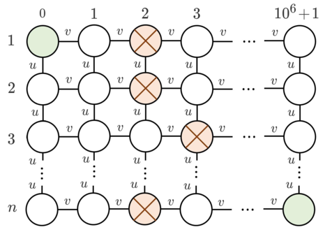
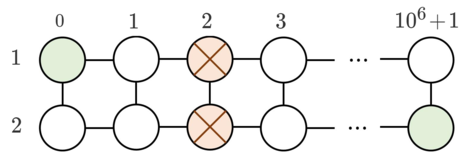

<h1 style='text-align: center;'> B. Minimal Cost</h1>

<h5 style='text-align: center;'>time limit per test: 2 seconds</h5>
<h5 style='text-align: center;'>memory limit per test: 256 megabytes</h5>

There is a graph of $n$ rows and $10^6 + 2$ columns, where rows are numbered from $1$ to $n$ and columns from $0$ to $10^6 + 1$:

  Let's denote the node in the row $i$ and column $j$ by $(i, j)$.

Initially for each $i$ the $i$-th row has exactly one obstacle — at node $(i, a_i)$. You want to move some obstacles so that you can reach node $(n, 10^6+1)$ from node $(1, 0)$ by moving through edges of this graph (you can't pass through obstacles). Moving one obstacle to an adjacent by edge free node costs $u$ or $v$ coins, as below:

* If there is an obstacle in the node $(i, j)$, you can use $u$ coins to move it to $(i-1, j)$ or $(i+1, j)$, if such node exists and if there is no obstacle in that node currently.
* If there is an obstacle in the node $(i, j)$, you can use $v$ coins to move it to $(i, j-1)$ or $(i, j+1)$, if such node exists and if there is no obstacle in that node currently.
* 
## Note

 that you can't move obstacles outside the grid. For example, you can't move an obstacle from $(1,1)$ to $(0,1)$.

Refer to the picture above for a better understanding. 

Now you need to calculate the minimal number of coins you need to spend to be able to reach node $(n, 10^6+1)$ from node $(1, 0)$ by moving through edges of this graph without passing through obstacles.

### Input

The first line contains a single integer $t$ ($1 \le t \le 10^4$) — the number of test cases.

The first line of each test case contains three integers $n$, $u$ and $v$ ($2 \le n \le 100$, $1 \le u, v \le 10^9$) — the number of rows in the graph and the numbers of coins needed to move vertically and horizontally respectively.

The second line of each test case contains $n$ integers $a_1, a_2, \dots, a_n$ ($1 \le a_i \le 10^6$) — where $a_i$ represents that the obstacle in the $i$-th row is in node $(i, a_i)$.

It's guaranteed that the sum of $n$ over all test cases doesn't exceed $2 \cdot 10^4$.

### Output

For each test case, output a single integer — the minimal number of coins you need to spend to be able to reach node $(n, 10^6+1)$ from node $(1, 0)$ by moving through edges of this graph without passing through obstacles.

It can be shown that under the constraints of the problem there is always a way to make such a trip possible.

## Example

### Input


```text
3
2 3 4
2 2
2 3 4
3 2
2 4 3
3 2
```
### Output


```text
7
3
3
```
## Note

In the first sample, two obstacles are at $(1, 2)$ and $(2,2)$. You can move the obstacle on $(2, 2)$ to $(2, 3)$, then to $(1, 3)$. The total cost is $u+v = 7$ coins.

  In the second sample, two obstacles are at $(1, 3)$ and $(2,2)$. You can move the obstacle on $(1, 3)$ to $(2, 3)$. The cost is $u = 3$ coins.

  

#### Tags 

#1200 #NOT OK #brute_force #math 

## Blogs
- [All Contest Problems](../Codeforces_Global_Round_13.md)
- [Announcement (en)](../blogs/Announcement_(en).md)
- [Tutorial (en)](../blogs/Tutorial_(en).md)
