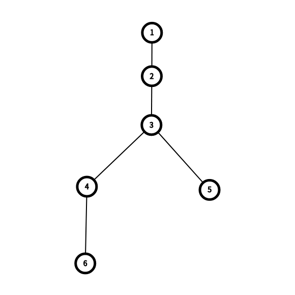
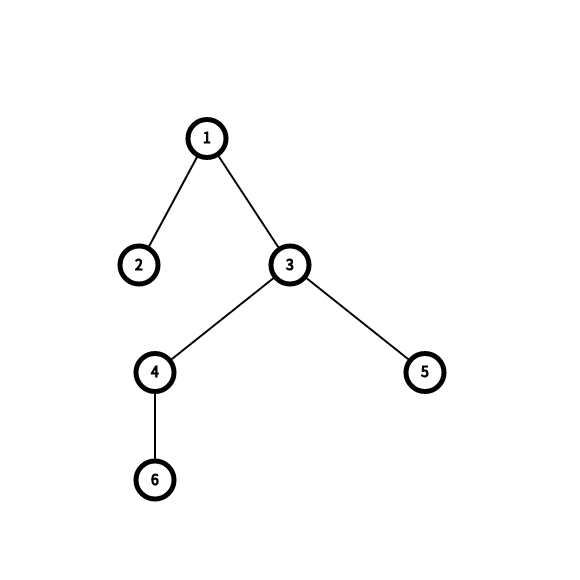

<h1 style='text-align: center;'> H. Yuezheng Ling and Dynamic Tree</h1>

<h5 style='text-align: center;'>time limit per test: 1.5 seconds</h5>
<h5 style='text-align: center;'>memory limit per test: 256 megabytes</h5>

Yuezheng Ling gives Luo Tianyi a tree which has $n$ nodes, rooted at $1$. 

Luo Tianyi will tell you that the parent of the $i$-th node is $a_i$ ($1 \leq a_i<i$ for $2 \le i \le n$), and she will ask you to perform $q$ queries of $2$ types:

1. She'll give you three integers $l$, $r$ and $x$ ($2 \le l \le r \le n$, $1 \le x \le 10^5$). You need to replace $a_i$ with $\max(a_i-x,1)$ for all $i$ with $l \leq i \leq r$.
2. She'll give you two integers $u$, $v$ ($1 \le u, v \le n$). You need to find the [LCA](https://en.wikipedia.org/wiki/Lowest_common_ancestor) of nodes $u$ and $v$ (their lowest common ancestor).
### Input

The first line contains two integers $n$ and $q$ ($2\leq n,q \leq 10^5$) — the number of nodes and the number of queries, respectively.

The second line contains $n-1$ integers $a_2, a_3,\dots, a_n$ ($1 \le a_i < i$), where $a_i$ is the parent of the node $i$.

Next $q$ lines contain queries. For each query, the first integer of each line is $t$ ($t = 1$ or $2$) — the type of the query. 

 If $t = 1$, this represents the query of the first type. Then, three integers will follow: $l$, $r$, $x$ ($2 \le l \le r \le n$, $1 \le x \le 10^5$), meaning that you have to replace $a_i$ with $\max(a_i-x,1)$ for all $i$ with $l \leq i \leq r$.

 If $t = 2$, this represents the query of the second type. Then, two integers will follow: $u$ and $v$ ($1 \le u, v \le n$), and you have to find the LCA of $u$ and $v$. 

 It's guaranteed that there is at least one query of the second type.

### Output

For each query of the second type output answer on a new line.

## Example

### Input


```text
6 4
1 2 3 3 4
2 3 4
1 2 3 1
2 5 6
2 2 3
```
### Output


```text
3
3
1
```
## Note

The tree in example is shown below.

  After the query of the first type, the tree changes and is looking as shown below.

  

#### Tags 

#3400 #NOT OK #data_structures #trees 

## Blogs
- [All Contest Problems](../Codeforces_Global_Round_13.md)
- [Announcement (en)](../blogs/Announcement_(en).md)
- [Tutorial (en)](../blogs/Tutorial_(en).md)
