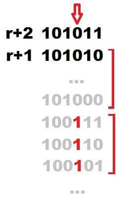

# Tutorial

[1493A - Anti-knapsack](../problems/A._Anti-knapsack.md "Codeforces Round 705 (Div. 2)") 

Idea: [AlFlen](https://codeforces.com/profile/AlFlen "Master AlFlen"), [74TrAkToR](https://codeforces.com/profile/74TrAkToR "Master 74TrAkToR")

 **Tutorial**
### [1493A - Anti-knapsack](../problems/A._Anti-knapsack.md "Codeforces Round 705 (Div. 2)")

Let's notice that we can take all numbers k+1,k+2…n, because every one of them is greater than k, and sum of any number from k+1,k+2…n and any number from 1,2…n also is greater than k. Let's also take numbers from ⌈k2⌉ to k−1 inclusive. Notice that the sum of any two chosen numbers is already greater than k, and no chosen number is equal to k, therefore such set is correct. It contains (n−k)+(k−⌈k2⌉)=n−⌈k2⌉ numbers.

Let's show why such size of a set is the maximal possible. Numbers from k+1 to n won't give subsets with sum k with any other numbers, so we can take them to the answer: their amount is n−k. The number k can't be taken to the answer, because if we take a subset consisting from that number only, the sum in it will be k. Let's consider numbers from 1 to k−1. They can be divided into ⌊k2⌋ pairs, in each of which the sum of numbers will be k (1 and k−1, 2 and k−2 etc.; if k is even, then the pair with number k2 will consist of one number). If we took at least ⌊k2⌋+1 numbers from 1 to k−1, then at least two chosen numbers will be in one pair, and their sum will be equal to k, what contradicts with problem condition. It means that we can take not more than ⌊k2⌋ numbers from 1 to k−1.

Then the total size of the set will not exceed (n−k)+⌊k2⌋. As known, k = ⌊k2⌋+⌈k2⌉ (you can prove that fact by considering two cases: when k is even, and when k is odd). Let's replace k in recieved estimation: n−(⌊k2⌋+⌈k2⌉)+⌊k2⌋=n−⌈k2⌉, which is the size of mentioned set, therefore mentioned set is the answer to the problem.

 **Solution (74TrAkToR)**
```cpp
#include <bits/stdc++.h>

using namespace std;

int main() {
    ios_base::sync_with_stdio(0);
    cin.tie(0);

    int t, n, k;
    cin >> t;
    while (t--) {
        cin >> n >> k;
        cout << n - k + k / 2 << 'n';
        for (int i = k + 1; i <= n; ++i) cout << i << " ";
        for (int i = (k + 1) / 2; i < k; ++i) cout << i << " ";
        cout << 'n';
    }

    return 0;
}
```
[1493B - Planet Lapituletti](../problems/B._Planet_Lapituletti.md "Codeforces Round 705 (Div. 2)") 

Idea: [AlFlen](https://codeforces.com/profile/AlFlen "Master AlFlen")

 **Tutorial**
### [1493B - Planet Lapituletti](../problems/B._Planet_Lapituletti.md "Codeforces Round 705 (Div. 2)")

In order to solve the problem, you need to look over all the moments of time after the given one and check if the reflected time is correct in that moment of time. If such moment of time does not exist on the current day, the moment 00:00 of the next day is always correct.

For realization you need to notice that digits 0, 1, 8 transform into themselves after reflection, 2 transforms into 5, 5 transforms into 2, and other digits (3, 4, 6, 7, 9) transform into incorrect digits after reflection. 

 **Solution (74TrAkToR)**
```cpp
#include <bits/stdc++.h>

using namespace std;

vector < int > go = {0, 1, 5, -1, -1, 2, -1, -1, 8, -1};
int inf = 1e9 + 7;

int get(int x) {
    string s = to_string(x);
    if ((int)s.size() == 1) s = "0" + s;
    string answ = "";
    for (int i = 1; i >= 0; --i) {
        if (go[s[i] - '0'] == -1) return inf;
        answ += char(go[s[i] - '0'] + '0');
    }
    return stoi(answ);
}

string good(int x) {
    string ans = to_string(x);
    if (x < 10) {
        ans = "0" + ans;
    }
    return ans;
}

main() {
    ios_base::sync_with_stdio(0);
    cin.tie(0);
    cout.tie(0);
    int t, h, m, H, M;
    cin >> t;
    string s;
    while (t--) {
        cin >> h >> m;
        cin >> s;
        H = (s[0] - '0') * 10 + s[1] - '0';
        M = (s[3] - '0') * 10 + s[4] - '0';
        while (1) {
            if (M == m) {
                H++, M = 0;
            }
            if (H == h) {
                H = 0;
            }
            if (get(M) < h && get(H) < m) {
                cout << good(H) << ":" << good(M) << 'n';
                break;
            }
            M++;
        }
    }
    return 0;
}
```
[1493C - K-beautiful Strings](../problems/C._K-beautiful_Strings.md "Codeforces Round 705 (Div. 2)") 

Idea: [74TrAkToR](https://codeforces.com/profile/74TrAkToR "Master 74TrAkToR")

 **Tutorial**
### [1493C - K-beautiful Strings](../problems/C._K-beautiful_Strings.md "Codeforces Round 705 (Div. 2)")

First of all, let's notice that if the length of the string n is not divisible by k, no beautiful string of such length exists. Otherwise the answer to the problem always exists (because the string zz…z is the greatest string of length n and is beautiful).

If the string s is beautiful, then s itself is the answer. Otherwise, let's iterate over all the options of the maximal common prefix of the answer string and s, that way we will iterate from n−1 to 0.

Let's maintain an array cnti — how many times does the i-th leter of English alphabet occur in the prefix we have fixed. We can recalculate that array totally in 0(n), because when we iterate to the smaller prefix we only need to change one value of cnt.

Denote the length of common prefix as pref. Let's iterate over all possible letters at position pref+1 (numeration starts from one) in increasing order. We need to iterate over all letters that are strictly greater than spref+1, because otherwise either the answer will be less than s or the length of common prefix won't be equal to pref.

Now we need to learn how to check quickly if we can pick any suffix so that we will get a beautiful string. To do that you need to go through the array cnt and to calculate for each letter which miminal number of times we need to write it more in order to get the amount of occurences divisible by k. For i-th leter it is (k−cnti % k) % k. Let sum be the sum of such value over all i. If sum isn't greater than the length of the suffix, then what's left is to find the minimal suffix.

How to build the minimal suffix: let's denote the length of unknown suffix as suff (suff=n−pref−1). We know that sum≤suff. If sum<suff, then let's increase the amount of occurences of a on suffix by suff−sum. Now we will place all letters a, then all letters b and so on to z.

A detail of realization: we will consider iterated letter at position pref+1 in the array cnt. We can maintain array cnt on prefix of length pref+1 and take into account that pref+1-st symbol is the iterated symbol and not the symbol of string s.

The complexity of solution is O(n⋅C), where C is the size of the alphabet (26). You can also write a solution in O(n), by maintaining the sum (k−cnti % k) % k in a variable.

 **Solution (74TrAkToR)**
```cpp
#include <bits/stdc++.h>

using namespace std;

int cnt[26];

int get(int x, int k) {
    return (k - x % k) % k;
}

main() {
    ios_base::sync_with_stdio(0);
    cin.tie(0);
    cout.tie(0);
    int n, k, t;
    cin >> t;
    while (t--) {
        cin >> n >> k;
        string s;
        cin >> s;
        for (int j = 0; j < 26; ++j) cnt[j] = 0;
        for (auto c : s) cnt[c - 'a']++;

        int sum = 0, flag = 1;
        for (int i = 0; i < 26; ++i) {
            sum += get(cnt[i], k);
        }

        if (sum == 0) {
            cout << s << 'n';
            flag = 0;
        }

        if (n % k != 0) {
            cout << -1 << 'n';
            continue;
        }

        for (int i = n - 1; i >= 0 && flag; --i) {
            sum -= get(cnt[s[i] - 'a'], k);
            cnt[s[i] - 'a']--;
            sum += get(cnt[s[i] - 'a'], k);
            for (int j = s[i] - 'a' + 1; j < 26; ++j) {

                int lst_sum = sum;
                sum -= get(cnt[j], k);
                cnt[j]++;
                sum += get(cnt[j], k);

                if (i + sum + 1 <= n) {
                    for (int pos = 0; pos < i; ++pos) {
                        cout << s[pos];
                    }
                    cout << char('a' + j);

                    string add = "";
                    for (int w = 0; w < 26; ++w) {
                        int f = get(cnt[w], k);
                        while (f) {
                            f--;
                            add += char('a' + w);
                        }
                    }
                    while ((int)add.size() + i + 1 < n) {
                        add += "a";
                    }

                    sort(add.begin(), add.end());
                    cout << add << 'n';
                    flag = 0;
                    break;
                }

                cnt[j]--;
                sum = lst_sum;
            }
        }
    }
    return 0;
}
```
[1493D - GCD of an Array](../problems/D._GCD_of_an_Array.md "Codeforces Round 705 (Div. 2)") 

Idea: [74TrAkToR](https://codeforces.com/profile/74TrAkToR "Master 74TrAkToR")

 **Tutorial**
### [1493D - GCD of an Array](../problems/D._GCD_of_an_Array.md "Codeforces Round 705 (Div. 2)")

Notice that after each query the answer doesn't become smaller and we can solve the problem for each prime divisor independently.

For each number let's maintain an amount of occurences for all its prime divisors (you can implement it using map). For each prime divisor let's write to its corresponding multiset the amount of times it is met in every of the numbers of the array, at the same time we won't add null values.

Initially, ans=1. Let's understand the way a prime divisor p is included in the answer. If the size of its multiset is not equal to n, then ans won't change, otherwise ans=(ans⋅px) % mod, where x is a minimal number of multiset.

Since ans is not decreasing, then we can avoid calculating it all over again every time and instead recalculate it only for divisors that are being changed (with that, because the minimal number of multiset is not decreasing as well, we can just increase the answer using multiplication).

To process the query, we need to find the prime factorization of x (for example, using the Sieve of Eratosthenes) and add the prime divisors to the map for i-th element (and correspondingly change the multiset for that divisor).

Each query is processed in the complexity of the amount of prime divisors multiplied by the time of map and multiset operation, i.e. log.

 **Solution (74TrAkToR)**
```cpp
#include <bits/stdc++.h>

using namespace std;

typedef long long ll;

int const maxn = 2e5 + 5, max_val = 2e5 + 5;
ll mod = 1e9 + 7, ans = 1;
int nxt[max_val], n;
multiset <int> cnt[max_val];
map <int, int> cnt_divisor[maxn];

void add(int i, int x) {
    while (x != 1) {
        int div = nxt[x], add = 0;
        while (nxt[x] == div) add++, x = x / nxt[x];

        int lst = cnt_divisor[i][div];
        cnt_divisor[i][div] += add;
        int lst_min = 0;
        if ((int)cnt[div].size() == n) {
            lst_min = (*cnt[div].begin());
        }
        if (lst != 0) {
            cnt[div].erase(cnt[div].find(lst));
        }
        cnt[div].insert(lst + add);
        if ((int)cnt[div].size() == n) {
            for (int j = lst_min + 1; j <= (*cnt[div].begin()); ++j) {
                ans = ans * (ll)div % mod;
            }
        }
    }
}

main() {
    ios_base::sync_with_stdio(0);
    cin.tie(0);

    int q, l, x;
    cin >> n >> q;

    for (int i = 2; i < maxn; ++i) {
        if (nxt[i] == 0) {
            nxt[i] = i;
            if (i > 10000) continue;
            for (int j = i * i; j < maxn; j += i) {
                if (nxt[j] == 0) nxt[j] = i;
            }
        }
    }

    for (int i = 1; i <= n; ++i) {
        cin >> x;
        add(i, x);
    }

    for (int i = 1; i <= q; ++i) {
        cin >> l >> x;
        add(l, x);
        cout << ans << 'n';
    }

    return 0;
}
```
[1493E - Enormous XOR](../problems/E._Enormous_XOR.md "Codeforces Round 705 (Div. 2)") 

Idea: [AlFlen](https://codeforces.com/profile/AlFlen "Master AlFlen")

 **Tutorial**
### [1493E - Enormous XOR](../problems/E._Enormous_XOR.md "Codeforces Round 705 (Div. 2)")

Let's numerate bits from 0 to n−1 from the least significant bit to the most significant (from the end of the representation). If n−1-st bits of numbers l and r differ, then there is a power transition between numbers l and r, and the answer to the problem is 11…1 (the number contains n ones).

Otherwise it can be shown that if 0 bit of the number r is equal to 1, then the answer is r itself. If 0 bit of the number r is equal to 0 and l<=r−2, the answer is r+1, otherwise the answer is r.

Proof.

Firstly, if there is a power transition between l and r, then we can take a segment [11…1; 100…0] (n−1 ones; 1 and n−1 zero), and get xor on it of n ones. It is not hard to show that it will be the maximal possible.

Let's prove that for odd r without power transition the answer is r. That answer can be reached if we take a segment consisting of one number r. Let's prove that the answer if maximal using induction. Base: for segments [r;r], [r−1;r], r is odd, the answer is r (in the first case there is no other segments, in the second case subsegments [r−1;r−1] and [r−1;r] have less xor-s).

Let's take induction step from [l;r] to [l;r+2]. The answer on segment [r+1;r+2] is obviously r+2, remaining subsegments can be split into three groups: with right bound r+2, with right bound r+1, and lying inside the segment [l;r], with that all the left bounds of the subsegments are lying inside [l;r]. The answer on the segments of third group is r (proved by induction). The segments of the first group contain subsegment [r+1;r+2], which has xor equal to 1, and some segment ending at r. Notice that that way we can increase the answer of the segment [l;r] not more by 1, i.e. the answer for the segments of the first group is not greater than r+1.

Now let's consider the segments of the second group. Suppose that we could find the segment from that group with xor on it greater than r+2. Then some bit which was 0 in r+2, became 1 in that xor, with that it is not the 0 bit (since r+2 is odd). Let's find the amount of numbers from r+1 (inclusively) to the nearest having 1 in that bit (non-inclusively). It is not hard to show that that amount is odd (from even to zero inclusively).  In order to make the bit 1, we need to take an odd amount of numbers with 1 in that bit. Since the blocks (among consecutive numbers blocks with 0 in that bit and blocks with 1 in that bit) have even length (2, 4, 8 and so on), we need to take an odd amount of numbers in total to take an odd amount of numbers with 1 in that bit. Then the whole segment will contain odd + odd = even amount of numbers (the first summand is the amount of numbers from r to the nearest having 1 in that bit, the second summand is the amount of numbers we will take to make that bit equal to 1), but then the most significant ((n−1)-st) bit will become equal to 0, therefore we will get xor less than r+2. It means that among segments of the second group there is no segment with xor greater than r+2 as well. So, r+2 is the answer for [l;r+2].

Now let's consider even right bounds. If the length of the segment is less than 2 (l>r−2), then it is simple to show that the right bound will be the answer. Otherwise r+1 is the answer. It can be reached on the segment [r−2;r] and is the maximal possible, because we can increase the right bound of the segment by 1 (it will become odd), with that the answer surely won't decrease, and the answer on [l;r+1] is proven to be r+1.

 **Solution (74TrAkToR)**
```cpp
#include<bits/stdc++.h>

using namespace std;

string add(string s) {
    int i = (int)s.size() - 1;
    while (s[i] == '1') {
        s[i] = '0';
        i--;
    }
    s[i] = '1';
    return s;
}

main() {
    ios_base::sync_with_stdio(0);
    cin.tie(0);
    cout.tie(0);
    int n;
    cin >> n;
    string l, r;
    cin >> l >> r;
    if (l == r) {
        cout << r << 'n';
        return 0;
    }
    if (l[0] != r[0]) {
        for (int i = 1; i <= n; ++i) cout << "1";
        return 0;
    }
    if (add(l) == r || r.back() == '1') {
        cout << r << 'n';
        return 0;
    }
    cout << add(r) << 'n';
    return 0;
}
```
[1493F - Enchanted Matrix](../problems/F._Enchanted_Matrix.md "Codeforces Round 705 (Div. 2)") 

Idea: [74TrAkToR](https://codeforces.com/profile/74TrAkToR "Master 74TrAkToR")

 **Tutorial**
### [1493F - Enchanted Matrix](../problems/F._Enchanted_Matrix.md "Codeforces Round 705 (Div. 2)")

Te problem can be solved in various ways but the main idea is that if we want to check, if the x consecutive blocks are equal to each other, then we can do it using ⌈log2x⌉ queries. Let's suppose we want to check the equality of x blocks, then we will check if the first and second ⌊x2⌋ blocks are equal. If they are not equal, then x blocks are not equal to each other, otherwise we need to check if the last ⌈x2⌉ blocks are equal.

Notice that the problem can be solved independently for rows and columns.

Let's solve the problem for n rows and let's find all r such that the matrix can be split into equal rectangles of r rows. If r is the answer, then the numbers that are divisible by r are also the answers. If r is not the answer, then all divisors of r are not the answers. If r1 and r2 are the answers, then gcd(r1,r2) is the answer as well.

Let's make a dynamic dpr. If dpr=1, then the matrix can be divided into r rows, otherwise dpr=0 and the matrix cannot be divided that way. We will iterate over r in descending order. Let's suppose we want to calculate dpr. Then we know for sure that for every x that are divisors of n and are divisible by r, dpx=1 (because otherwise dpr=0 and we don't have to calculate it). Let's find such minimal x and check the equality of xr blocks using the idea described in the beginning of the editorial.

Let's calculate the sum of dpr — that is the amount of suitable r. Then we will solve the problem similarly for columns and output the product of suitable r and suitable c.

It is guaranteed that with any initial field the described solution will ask less than 3⋅⌊log2(n+m)⌋ queries. An accurate estimation of number of queries will be shown later.

An accurate eastimation of number of queries: let us have the least r such that we can split the matrix into r rows (in order to get equal subrectangles) and all remaining r are divided by it. Using that dynamic we maintain a minimal suitable r, and after that we try to decrease it using the algorithm from the editorial. The worst case is when we divide current minimal r by 3 with 2 queries. Then we need 2⋅log3n queries, which is equal to log34⋅log2n. 

 **Solution (74TrAkToR)**
```cpp
#include <bits/stdc++.h>

using namespace std;

int const maxn = 1005;
int dp[maxn];
vector < vector < int > > T;

int ask(int lx1, int ly1, int rx1, int ry1, int lx2, int ly2, int rx2, int ry2) {
    cout << "? " << rx1 - lx1 + 1 << " " << ry1 - ly1 + 1 << " " << lx1 << " " << ly1
    << " " << lx2 << " " << ly2 << endl;
    int ans;
    cin >> ans;
    return ans;
}

int good(int l, int r) {
    if (l == r) return 1;

    int cnt = (r - l + 1) / 2;
    if (ask(T[l][0], T[l][1], T[l + cnt - 1][2], T[l + cnt - 1][3], T[l + cnt][0], T[l + cnt][1], T[l + 2 * cnt - 1][2], T[l + 2 * cnt - 1][3])) {
        return good(l + cnt, r);
    }
    return 0;
}

main() {
    ios_base::sync_with_stdio(0);
    cin.tie(0);
    cout.tie(0);
    int n, m, cntn = 0, cntm = 0;
    cin >> n >> m;

    for (int i = n; i >= 1; --i) {
        if (n % i != 0 || dp[i] != 0) continue;

        for (int j = 2 * i; j <= n; j += i) {
            if (n % j == 0 && j % i == 0) {
                T = {};
                for (int k = 1; k <= j / i; ++k) {
                    T.push_back({(k - 1) * i + 1, 1, k * i, m});
                }
                if (good(0, (int)T.size() - 1)) dp[i] = 1;
                else dp[i] = 2;
                break;
            }
        }

        if (dp[i] == 2) {
            for (int j = 1; j <= n; ++j) {
                if (i % j == 0) dp[j] = 2;
            }
        }
        else {
            dp[i] = 1;
            for (int j = i; j <= n; ++j) {
                if (dp[j] == 1) {
                    int w = __gcd(i, j);
                    for (int pos = w; pos <= n; pos += w) {
                        dp[pos] = 1;
                    }
                }
            }
        }
    }

    for (int i = 1; i <= n; ++i) {
        if (n % i == 0) cntn += (dp[i] == 1);
        dp[i] = 0;
    }

    for (int i = m; i >= 1; --i) {
        if (m % i != 0 || dp[i] != 0) continue;

        for (int j = 2 * i; j <= m; j += i) {
            if (m % j == 0 && j % i == 0) {
                T = {};
                for (int k = 1; k <= j / i; ++k) {
                    T.push_back({1, (k - 1) * i + 1, n, k * i});
                }
                if (good(0, (int)T.size() - 1)) dp[i] = 1;
                else dp[i] = 2;
                break;
            }
        }
        if (dp[i] == 2) {
            for (int j = 1; j <= i; ++j) {
                if (i % j == 0) {
                    dp[j] = 2;
                }
            }
        }
        else {
            dp[i] = 1;
            for (int j = i; j <= m; ++j) {
                if (dp[j] == 1) {
                    int w = __gcd(i, j);
                    for (int pos = w; pos <= m; pos += w) {
                        dp[pos] = 1;
                    }
                }
            }
        }
    }

    for (int i = 1; i <= m; ++i) {
        if (m % i == 0) cntm += (dp[i] == 1);
    }
    cout << "! " << cntn * cntm << endl;
    return 0;
}
```
