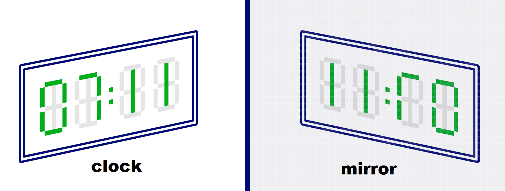
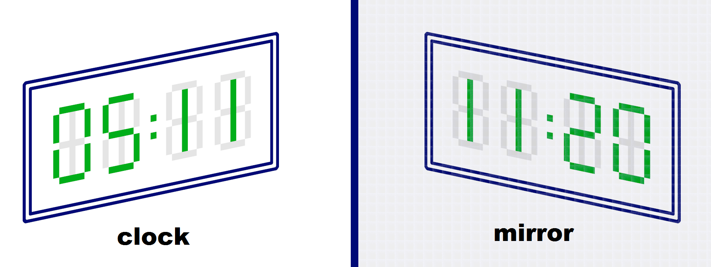
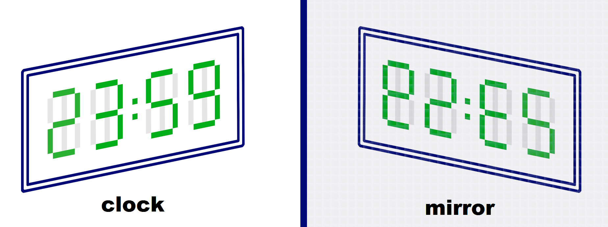

<h1 style='text-align: center;'> B. Planet Lapituletti</h1>

<h5 style='text-align: center;'>time limit per test: 2 seconds</h5>
<h5 style='text-align: center;'>memory limit per test: 256 megabytes</h5>

The time on the planet Lapituletti goes the same way it goes on Earth but a day lasts $h$ hours and each hour lasts $m$ minutes. The inhabitants of that planet use digital clocks similar to earth ones. Clocks display time in a format HH:MM (the number of hours in decimal is displayed first, then (after the colon) follows the number of minutes in decimal; the number of minutes and hours is written with leading zeros if needed to form a two-digit number). Hours are numbered from $0$ to $h-1$ and minutes are numbered from $0$ to $m-1$. 

 That's how the digits are displayed on the clock. Please note that digit $1$ is placed in the middle of its position. 

A standard mirror is in use on the planet Lapituletti. Inhabitants often look at the reflection of the digital clocks in the mirror and feel happy when what you see on the reflected clocks is a valid time (that means that you see valid digits in the reflection and this time can be seen on the normal clocks at some moment of a day).

The image of the clocks in the mirror is reflected against a vertical axis. 

 The reflection is not a valid time.



The reflection is a valid time with $h=24$, $m = 60$. However, for example, if $h=10$, $m=60$, then the reflection is not a valid time. 

An inhabitant of the planet Lapituletti begins to look at a mirrored image of the clocks at some time moment $s$ and wants to know the nearest future time moment (which can possibly happen on the next day), when the reflected clock time is valid.

It can be shown that with any $h$, $m$, $s$ such a moment exists. If the reflected time is correct at the moment the inhabitant began to look at the clock, that moment is considered the nearest.

You are asked to solve the problem for several test cases.

### Input

The first line contains a single integer $T$ ($1 \le T \le 100$) — the number of test cases.

The next $2 \cdot T$ lines contain the description of test cases. The description of each test case consists of two lines.

The first line of a test case contains two integers $h$, $m$ ($1 \le h, m \le 100$).

The second line contains the start time $s$ in the described format HH:MM.

### Output

For each test case output in a separate line the nearest moment in format HH:MM when the reflected time is correct.

## Example

### Input


```text
5
24 60
12:21
24 60
23:59
90 80
52:26
1 100
00:01
10 10
04:04
```
### Output


```text
12:21
00:00
52:28
00:00
00:00
```
## Note

In the second test case it is not hard to show that the reflection of 23:59 is incorrect, while the reflection of the moment 00:00 on the next day is correct. 

  

#### Tags 

#1300 #NOT OK #brute_force #implementation 

## Blogs
- [All Contest Problems](../Codeforces_Round_705_(Div._2).md)
- [Announcement](../blogs/Announcement.md)
- [Tutorial](../blogs/Tutorial.md)
