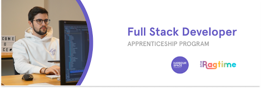

# Announcement

Hello Codeforces!

On [Tuesday, March 2, 2021 at 20:45UTC+6](https://codeforces.com/https://www.timeanddate.com/worldclock/fixedtime.html?day=2&month=3&year=2021&hour=17&min=45&sec=0&p1=166) [Educational Codeforces Round 105 (Rated for Div. 2)](https://codeforces.com/contest/1494 "Educational Codeforces Round 105 (Rated for Div. 2)") will start.

Series of Educational Rounds continue being held as [Harbour.Space University](https://codeforces.com/https://harbour.space/) initiative! You can read the details about the cooperation between [Harbour.Space University](https://codeforces.com/https://harbour.space/) and Codeforces in the [blog post](//codeforces.com/blog/entry/51208).

This round will be **rated for the participants with rating lower than 2100**. It will be held on extended ICPC rules. The penalty for each incorrect submission until the submission with a full solution is 10 minutes. After the end of the contest you will have 12 hours to hack any solution you want. You will have access to copy any solution and test it locally.

You will be given **6 or 7 problems** and **2 hours** to solve them.

The problems were invented and prepared by Roman [Roms](https://codeforces.com/profile/Roms "Master Roms") Glazov, Adilbek [adedalic](https://codeforces.com/profile/adedalic "International Master adedalic") Dalabaev, Vladimir [vovuh](https://codeforces.com/profile/vovuh "Master vovuh") Petrov, Ivan [BledDest](https://codeforces.com/profile/BledDest "International Grandmaster BledDest") Androsov, Maksim [Neon](https://codeforces.com/profile/Neon "Candidate Master Neon") Mescheryakov and me. Also huge thanks to Mike [MikeMirzayanov](https://codeforces.com/profile/MikeMirzayanov "Headquarters, MikeMirzayanov") Mirzayanov for great systems Polygon and Codeforces.

Good luck to all the participants!

Our friends at Harbour.Space also have a message for you:

*Amazing news once again, Codeforces!*

*We are especially glad to have a chance to share our **scholarship opportunities** more often!* 

*This time we have partnered with OneRagtime again to open the door for an exciting career in technology for the most talented people in our network.* 

*In partnership with OneRagtime, we are offering a full scholarship to study a Master’s in Computer Science at Harbour.Space while working as a [Full Stack Developer](https://harbour.space/scholarships/computer-science-apprenticeship-oneragtime?utm_source=codeforces&utm_medium=referral&utm_campaign=oneragtime-fullstack&utm_content=) at OneRagtime!*

*Scholarship Highlights:*

➡ *Work in Europe’s most exciting tech cities*

➡ *Scholarship value of up to €31,500*

➡ *Competitive compensation for the internship at OneRagtime (€800 / month)*

➡ *Opportunity to join OneRagtime full-time after graduation*

*Some of the advantages of working at OneRagtime:*

 * *International team*
* *Fast-paced workplace*
* *Be a part of the OneRagtime adventure!*
* *Be fully immersed in the European tech ecosystem*
* *Thrive within a Venture Capital that does things a little differently*
* *Work in Europe’s most exciting tech cities*

*We have previously partnered with other companies like OneRagtime, Hansgrohe, Coherra, and Remy Robotics to empower young talents around the world and help them boost their tech career. We’ve already filled a few of the positions with OneRagtime including:*

 * *Full Stack Developer at **OneRagtime** awarded to Alejandro Martinez from Mexico*
* *UI/UX designer at **OneRagtime** awarded to [Davit Petriashvili](https://codeforces.com/https://youtu.be/9s7vrYXUNwo) from Georgia*

*We are always happy to see Codeforces members join the Harbour.Space family. Apply now to get a chance to learn from the best in the field and kickstart your career!*

*Keep in touch and follow us on [LinkedIn](https://codeforces.com/https://www.linkedin.com/school/harbour-space/) for more scholarship opportunities. And follow us on [Instagram](https://codeforces.com/https://www.instagram.com/harbour.space/) to evidence student life, events, and success stories from our apprenticeship program students.*

*Good luck on your round, and see you next time!* 

*Harbour.Space University*

Congratulations to the winners: 

| Rank | Competitor | Problems Solved | Penalty |
| --- | --- | --- | --- |
| 1 | [antontrygubO_o](https://codeforces.com/profile/antontrygubO_o "International Grandmaster antontrygubO_o") | 6 | 251 |
| 1 | [Pyqe](https://codeforces.com/profile/Pyqe "Grandmaster Pyqe") | 6 | 251 |
| 3 | [244mhq](https://codeforces.com/profile/244mhq "Legendary Grandmaster 244mhq") | 6 | 260 |
| 4 | [tute7627](https://codeforces.com/profile/tute7627 "Grandmaster tute7627") | 6 | 272 |
| 5 | [Um_nik](https://codeforces.com/profile/Um_nik "Legendary Grandmaster Um_nik") | 6 | 288 |

Congratulations to the best hackers: 

| Rank | Competitor | Hack Count |
| --- | --- | --- |
| 1 | [noimi](https://codeforces.com/profile/noimi "International Grandmaster noimi") | **11** |
| 2 | [neal](https://codeforces.com/profile/neal "Legendary Grandmaster neal") | **7** |
| 3 | [Origenes](https://codeforces.com/profile/Origenes "Grandmaster Origenes") | **6** |
| 4 | [Kregor](https://codeforces.com/profile/Kregor "Expert Kregor") | **5****:-2** |
| 5 | [chilliagon](https://codeforces.com/profile/chilliagon "Newbie chilliagon") | **5****:-4** |

 94 successful hacks and 293 unsuccessful hacks were made in total!And finally people who were the first to solve each problem: 

| Problem | Competitor | Penalty |
| --- | --- | --- |
| A | [noimi](https://codeforces.com/profile/noimi "International Grandmaster noimi") | 0:01 |
| B | [noimi](https://codeforces.com/profile/noimi "International Grandmaster noimi") | 0:04 |
| C | [wygzgyw](https://codeforces.com/profile/wygzgyw "Master wygzgyw") | 0:15 |
| D | [conan1412yang99](https://codeforces.com/profile/conan1412yang99 "International Master conan1412yang99") | 0:16 |
| E | [thenymphsofdelphi](https://codeforces.com/profile/thenymphsofdelphi "International Master thenymphsofdelphi") | 0:15 |
| F | [rainboy](https://codeforces.com/profile/rainboy "Specialist rainboy") | 0:35 |

**UPD:** [Editorial is out](Tutorial.md)

