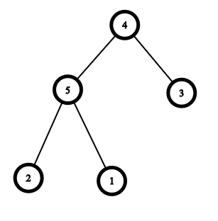

<h1 style='text-align: center;'> D. Dogeforces</h1>

<h5 style='text-align: center;'>time limit per test: 2 seconds</h5>
<h5 style='text-align: center;'>memory limit per test: 256 megabytes</h5>

The Dogeforces company has $k$ employees. Each employee, except for lower-level employees, has at least $2$ subordinates. Lower-level employees have no subordinates. Each employee, except for the head of the company, has exactly one direct supervisor. The head of the company is a direct or indirect supervisor of all employees. It is known that in Dogeforces, each supervisor receives a salary strictly more than all his subordinates.

The full structure of the company is a secret, but you know the number of lower-level employees and for each pair of lower-level employees, the salary of their common supervisor is known (if there are several such supervisors, then the supervisor with the minimum salary). You have to restore the structure of the company.

### Input

The first line contains a single integer $n$ ($2 \le n \le 500$) — the number of lower-level employees.

This is followed by $n$ lines, where $i$-th line contains $n$ integers $a_{i,1}, a_{i,2}, \dots, a_{i,n}$ ($1 \le a_{i,j} \le 5000$) — salary of the common supervisor of employees with numbers $i$ and $j$. It is guaranteed that $a_{i,j} = a_{j,i}$. 
## Note

 that $a_{i,i}$ is equal to the salary of the $i$-th employee.

### Output

In the first line, print a single integer $k$ — the number of employees in the company.

In the second line, print $k$ integers $c_1, c_2, \dots, c_k$, where $c_i$ is the salary of the employee with the number $i$.

In the third line, print a single integer $r$ — the number of the employee who is the head of the company.

In the following $k-1$ lines, print two integers $v$ and $u$ ($1 \le v, u \le k$) — the number of the employee and his direct supervisor.

## Note

 that the lower-level employees have numbers from $1$ to $n$, and for the rest of the employees, you have to assign numbers from $n+1$ to $k$. If there are several correct company structures, you can print any of them.

## Example

### Input


```text
3
2 5 7
5 1 7
7 7 4
```
### Output


```text
5
2 1 4 7 5 
4
1 5
2 5
5 4
3 4
```
## Note

One of the possible structures in the first example: 


#### Tags 

#2300 #NOT OK #constructive_algorithms #data_structures #dfs_and_similar #divide_and_conquer #dsu #greedy #sortings #trees 

## Blogs
- [All Contest Problems](../Educational_Codeforces_Round_105_(Rated_for_Div._2).md)
- [Announcement](../blogs/Announcement.md)
- [Tutorial](../blogs/Tutorial.md)
