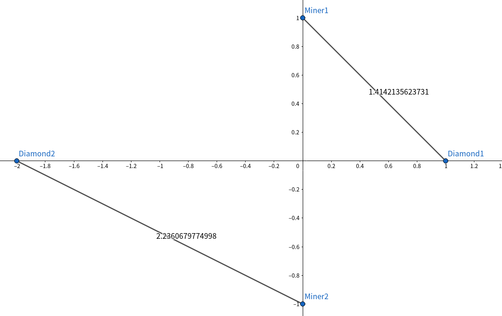

<h1 style='text-align: center;'> A. Diamond Miner</h1>

<h5 style='text-align: center;'>time limit per test: 1 second</h5>
<h5 style='text-align: center;'>memory limit per test: 256 megabytes</h5>

Diamond Miner is a game that is similar to Gold Miner, but there are $n$ miners instead of $1$ in this game.

The mining area can be described as a plane. The $n$ miners can be regarded as $n$ points on the y-axis. There are $n$ diamond mines in the mining area. We can regard them as $n$ points on the x-axis. For some reason, no miners or diamond mines can be at the origin (point $(0, 0)$). 

Every miner should mine exactly one diamond mine. Every miner has a hook, which can be used to mine a diamond mine. If a miner at the point $(a,b)$ uses his hook to mine a diamond mine at the point $(c,d)$, he will spend $\sqrt{(a-c)^2+(b-d)^2}$ energy to mine it (the distance between these points). The miners can't move or help each other.

The object of this game is to minimize the sum of the energy that miners spend. Can you find this minimum?

### Input

The input consists of multiple test cases. The first line contains a single integer $t$ ($1\le t\le 10$) — the number of test cases. The description of the test cases follows.

The first line of each test case contains a single integer $n$ ($1 \le n \le 10^5$) — the number of miners and mines.

Each of the next $2n$ lines contains two space-separated integers $x$ ($-10^8 \le x \le 10^8$) and $y$ ($-10^8 \le y \le 10^8$), which represent the point $(x,y)$ to describe a miner's or a diamond mine's position. Either $x = 0$, meaning there is a miner at the point $(0, y)$, or $y = 0$, meaning there is a diamond mine at the point $(x, 0)$. There can be multiple miners or diamond mines at the same point.

It is guaranteed that no point is at the origin. It is guaranteed that the number of points on the x-axis is equal to $n$ and the number of points on the y-axis is equal to $n$.

It's guaranteed that the sum of $n$ for all test cases does not exceed $10^5$.

### Output

For each test case, print a single real number — the minimal sum of energy that should be spent.

Your answer is considered correct if its absolute or relative error does not exceed $10^{-9}$.

Formally, let your answer be $a$, and the jury's answer be $b$. Your answer is accepted if and only if $\frac{|a - b|}{\max{(1, |b|)}} \le 10^{-9}$.

## Example

### Input


```text
3
2
0 1
1 0
0 -1
-2 0
4
1 0
3 0
-5 0
6 0
0 3
0 1
0 2
0 4
5
3 0
0 4
0 -3
4 0
2 0
1 0
-3 0
0 -10
0 -2
0 -10
```
### Output


```text
3.650281539872885
18.061819283610362
32.052255376143336
```
## Note

In the first test case, the miners are at $(0,1)$ and $(0,-1)$, while the diamond mines are at $(1,0)$ and $(-2,0)$. If you arrange the miners to get the diamond mines in the way, shown in the picture, you can get the sum of the energy $\sqrt2 + \sqrt5$.




#### Tags 

#1200 #NOT OK #geometry #greedy #math #sortings 

## Blogs
- [All Contest Problems](../Codeforces_Round_706_(Div._1).md)
- [Codeforces Round #706 (en)](../blogs/Codeforces_Round_706_(en).md)
- [Tutorial (en)](../blogs/Tutorial_(en).md)
