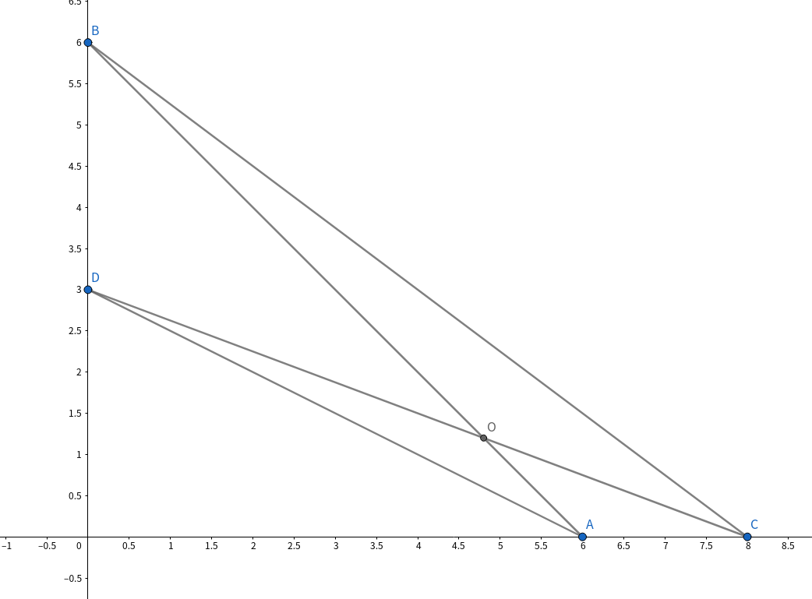
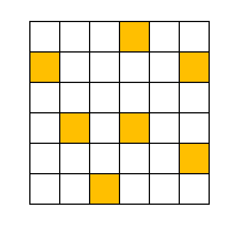
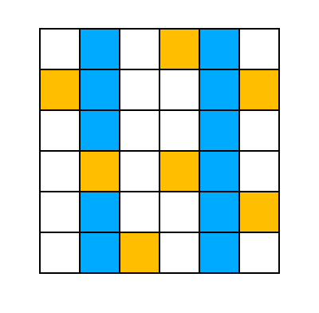
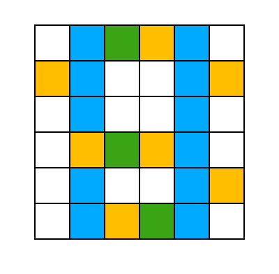
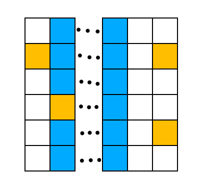
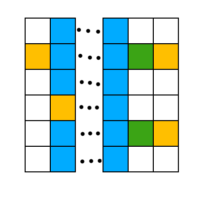
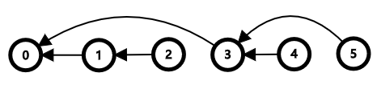
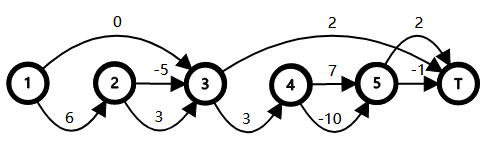

# Tutorial_(en)

~~The jury solutions will be updated later.~~

The jury solution is updated now.

[1496A - Split it!](../problems/A._Split_it!.md "Codeforces Round 706 (Div. 2)")

Idea: [waaitg](https://codeforces.com/profile/waaitg "Master waaitg")

 
### [1496A - Split it!](../problems/A._Split_it!.md "Codeforces Round 706 (Div. 2)")

If k=0 or s[1,k]+s[n−k+1,n] is a palindrome, the answer is yes.

Otherwise, the answer is no.

Note that when 2k=n, the answer is no, too.

The time complexity is O(n+k) for each test case.

 **Solution (Imakf)**[109627519](https://codeforces.com/contest/1496/submission/109627519 "Submission 109627519 by Imakf")

[1496B - Max and Mex](../problems/B._Max_and_Mex.md "Codeforces Round 706 (Div. 2)")

Idea: [waaitg](https://codeforces.com/profile/waaitg "Master waaitg")

 
### [1496B - Max and Mex](../problems/B._Max_and_Mex.md "Codeforces Round 706 (Div. 2)")

Let a=max(S),b=mex(S).

When k=0, the answer is n.

Otherwise if b>a, then b=a+1 , so ⌈a+b2⌉=b . It's not hard to find out that max(S∪{b})=b,mex(S∪{b})=b+1, so the set S always satisfies max(S)+1=mex(S). So the answer is n+k when b=a+1.

Otherwise b<a. So b<a⇒2b<a+b⇒a+b2>b⇒⌈a+b2⌉>b. In that case mex(S)=b is always true. So the element we add in all operations is always ⌈a+b2⌉. Just check whether it is in S at first.

The time complexity is O(n) or O(nlogn) for each test case depending on your implementation.

 **Solution (waaitg)**[109637470](https://codeforces.com/contest/1496/submission/109637470 "Submission 109637470 by Imakf")

[1495A - Diamond Miner](https://codeforces.com/contest/1495/problem/A "Codeforces Round 706 (Div. 1)")

Idea: [smg23333](https://codeforces.com/profile/smg23333 "Expert smg23333")

 
### [1495A - Diamond Miner](https://codeforces.com/contest/1495/problem/A "Codeforces Round 706 (Div. 1)")

First, you can turn a point (x,y) to (|x|,|y|), while not changing the answer.

After this operation, all points can be described as (0,a) or (b,0) (a,b>0).

In a triangle, if the length of the edges are a, b, c, it is obvious that a+b>c.

So, if you connect all match-pairs with a segment and there are two segments intersecting each other, you must be able to change the matching ways to make the answer smaller.

For example, if you match A(a1,0) with B(0,b1), C(a2,0) with D(0,b2), the answer will be |AB|+|CD|; if you match A with D and B with C, the answer will be |AD|+|BC|<|AO|+|DO|+|BO|+|CO|=|AB|+|CD|.

So in the best solution, there won't be two segments intersecting each other.

Sort all the points on the x-axis and on the y-axis, then match the points in ascending order of x or y, you can get the minimum.

The time complexity is O(nlogn) for each test case.

 **Solution (smg23333)**[109637538](https://codeforces.com/contest/1495/submission/109637538 "Submission 109637538 by Imakf")

[1495B - Let's Go Hiking](https://codeforces.com/contest/1495/problem/B "Codeforces Round 706 (Div. 1)")

Idea: [waaitg](https://codeforces.com/profile/waaitg "Master waaitg")

 
### [1495B - Let's Go Hiking](https://codeforces.com/contest/1495/problem/B "Codeforces Round 706 (Div. 1)")

Let's consider that the 2k+1(k≥0)-th turn is Qingshan's and the 2k+2(k≥0)-th turn is Daniel's.

If Qingshan chooses x(1<x≤n) satisfying x=n or px<px+1, then Daniel can choose y=x−1 to make Qingshan can't move in the first turn. The case that x=1 or px<px−1 is the same. So Qingshan must choose x(1<x<n) satisfying px>px−1 and px>px+1 at first.

Let l be the length of the longest monotone segments and c be the number of the longest monotone segments. l≥2 and c≥1 are always true.

It is obvious that Qingshan can't win when c>2 because wherever Qingshan chooses, Daniel can always find a place that he can move l−1 times while Qingshan can move l−1 times at most.

When c=1, Qingshan will also lose. If the only longest monotone segment is ps,ps+1…,ps+l−1 and it's increasing(if it's decreasing, the discussion is almost the same). Qingshan must choose x=s+l−1 at first. The discussion follows:

* If lmod2=0, Daniel can choose y=s at first. After the l−3-th turn(Qingshan's turn), x=s+l−l2 and After the l−2-th turn(Daniel's turn), y=s+l2−1. The next turn is Qingshan's and Qingshan loses.
* If lmod2=1, Daniel can choose y=s+1 at first. Pay attention that Qingshan can't change x to x+1 in the first turn because Daniel can move l−2 times while Qingshan can move l−2 times at most if she change x to x+1 in the first turn. After the l−4-th turn(Qingshan's turn), x=s+l−l−12 and After the l−3-th turn(Daniel's turn), y=s+l−12. The next turn is Qingshan's and Qingshan loses.

When c=2 , the only two longest monotone segments must be like pm−l+1<pm−l+2<⋯<pm>pm+1>⋯>pm+l−1. (Otherwise Qingshan will lose.) In that case Qingshan will lose if lmod2=0 because Daniel can choose y=m−l+1 at first and whatever Qingshan's first move is, Qingshan will lose(just like the discussion above). If lmod2=1, Qingshan is the winner. It is not hard to check it in O(n).

The overall time complexity is O(n).

 **Solution (waaitg)**[109637608](https://codeforces.com/contest/1495/submission/109637608 "Submission 109637608 by Imakf")

[1495C - Garden of the Sun](https://codeforces.com/contest/1495/problem/C "Codeforces Round 706 (Div. 1)")

Idea: [Imakf](https://codeforces.com/profile/Imakf "Master Imakf")

 
### [1495C - Garden of the Sun](https://codeforces.com/contest/1495/problem/C "Codeforces Round 706 (Div. 1)")

When m is the multiple of 3, it's easy to construct a solution: First, remove all the sunflowers on column 2,5,8,11,…. This operation won't form a cycle in the graph. 

Let's take this as an example:

 

After the operation, the graph turns into: 

After that, you need to connect these columns to make them connected but without forming a cycle. 

The green cells are all alternatives. 

This way of construction also works for m=3k+2. But you need to be cautious about the case of m=3k+1 because there is an extra column that may not be connected with the left part. Don't forget to connect them.

Another approach is to remove column 1,4,7,10,… when m=3k+1. So there won't be an extra column.

The time complexity is O(nm) for each test case.

 **Solution (Imakf)**[109628224](https://codeforces.com/contest/1495/submission/109628224 "Submission 109628224 by Imakf")

[1495D - BFS Trees](https://codeforces.com/contest/1495/problem/D "Codeforces Round 706 (Div. 1)")

Idea: [waaitg](https://codeforces.com/profile/waaitg "Master waaitg"), [Daniel_yuan](https://codeforces.com/profile/Daniel_yuan "Master Daniel_yuan"), [isaf27](https://codeforces.com/profile/isaf27 "International Grandmaster isaf27")

 
### [1495D - BFS Trees](https://codeforces.com/contest/1495/problem/D "Codeforces Round 706 (Div. 1)")

Let's enumerate vertexes x,y, and calculate f(x,y) for them.

Let dist(x,y) denote the number of the vertexes which lie on the shortest-path between x and y on the graph.

It is obvious that the distance between x and y in the tree is equal to dist(x,y). And the vertex z satisfying dist(x,z)+dist(y,z)−1=dist(x,y) must be on the path between x and y. So the number of the vertexes z must be equal to dist(x,y) ( including x and y ).

Then, let's consider the contributions of other vertexes i. In the bfs-trees of both x and y, there must be and only be a edge linking i and j, which j satisfies dist(x,i)=dist(x,j)+1∧dist(y,i)=dist(y,j)+1. 

Proof :

Let's prove it recursively.

All the vertexes linked to the path between x and y satisfy the condition ( There is and only is a edge linking them ). We can call them layer 1.

All the vertexes linked to the layer 1 satisfy the condition ( There is and only is a edge linking them ). We can call them layer 2.

All the vertexes ...

End of proof

And the contribution of each vertex is independent, which means that for each vertex i we can choose a vertex j without considering other vertexes. 

Proof :

No matter which j we choose for i, the layer of i will not change.

So the choice of i won't change the number of choices of others.

End of proof

So we only need calculate the number of j for every i, and multiply them.

For every x,y, we should enumerate all the edges to calculate j for every i. So the complexity is O(m) per x,y. The total complexity is O(n2m).

 **Solution (Daniel_yuan)**[109637767](https://codeforces.com/contest/1495/submission/109637767 "Submission 109637767 by Imakf")

[1495E - Qingshan and Daniel](https://codeforces.com/contest/1495/problem/E "Codeforces Round 706 (Div. 1)")

Idea: [Imakf](https://codeforces.com/profile/Imakf "Master Imakf")

 
### [1495E - Qingshan and Daniel](https://codeforces.com/contest/1495/problem/E "Codeforces Round 706 (Div. 1)")

We can consider that the robots are standing on a cycle. 

The game ends up with at least one team having no cards. Let the team having no cards in the end be team A and let the other be team B. If two teams both use up their cards, the first robot's team is A. For team A, we've already known how many cards will its robots discard, because they will discard all their cards. But how to calculate the answer for team B?

Let's look at the process of the game. Obviously, robots in A and robots in B will discard cards alternatively. In another word, if we write down the team of robots who discard cards in time order, it will form a sequence — ABABAB⋯B or BABABA⋯B. For the second type (starting with B), we can just use brute-force to discard the first card and then find the next A. So there is only one circumstance: ABABAB⋯B. 

Note that in the sequence every A is followed by exactly one B. So the length of the sequence is the number of cards of team A multiplying 2.

Currently, we are not able to figure out which robot is exactly represented by a particular A or B in the sequence. Luckily, we don't need to know it. What we care about is only how many cards the robot in team B discards. You can consider every AB is the sequence as a query and change operation — "In the current game, some robot i in team A will find the first robot j in team B on its right, and change aj to aj−1". It's a very important limit "In the current game" here because some robot will quit the game halfway according to the statement.

But on the contrary, an interesting fact is that the "important" limit is not important at all. We can make the query and the change in any order and it won't change the answer!

So you just need to iterate the array and maintain a variable cnt — the number of operations that are visited but not performed. If the team of the current robot is A, assign cnt+ai to cnt. Otherwise, you can perform min(ai,cnt) operations now, and assign ai−min(ai,cnt) to ai. Since robots are standing on a cycle, you need to iterate the array 2 times.

So the time complexity is O(n+m).

 **Solution (Imakf)**[109628977](https://codeforces.com/contest/1495/submission/109628977 "Submission 109628977 by Imakf")

[1495F - Squares](https://codeforces.com/contest/1495/problem/F "Codeforces Round 706 (Div. 1)")

Idea: [waaitg](https://codeforces.com/profile/waaitg "Master waaitg")

 
### [1495F - Squares](https://codeforces.com/contest/1495/problem/F "Codeforces Round 706 (Div. 1)")

If we let the parent of i(1≤i≤n) is the rightmost j satisfying j<i,pj>pi(if that j doesn't exist, the parent of i is 0), we can get a tree and we can dfs the tree with the order 0,1,2,…,n. Let's call the parent of i is pai and the children set of i is childi.

Here is an example. n=5 and the permutation is 2,1,5,3,4.

  The graphs we build follow.

  Let's call the edges with the cost ai A-type and the edges with the cost bi B-type. Consider that now you are on the i-th square. If you choose a B-type edge(with the cost bi), you will jump over all the squares in i's subtree(i is not included), that is to say, you will not pass through them. If you choose an A-type edge, we can think you enter i's subtree and you must pass through all of the i's child.

To simplify the problem, we think you choose a node i if and only if you pass through the A-type edge from the i-th square. Let's call the chosen set is S. It is not hard to find out that the node i can be chosen if and only if all the ancestors of i in the tree are chosen(if not, you even don't have the chance to pass through i). And that you pass through the i-th square is equivalent to you choosing the parent of i.

Then the problem is simplified. You purpose is to choose some nodes in the tree (0 must be chosen as it is the root) and minimize your cost. Here your cost is ∑i∈Sai+∑i∉S,pai∈Sbi. If we let ci=ai−bi+∑j∈childibj, the cost can be considered as ∑i∈Sci+∑j∈child0bj. It is very easy to solve it with binups.

The time complexity is O((n+q)logn).

 **Solution (waaitg)**[109637826](https://codeforces.com/contest/1495/submission/109637826 "Submission 109637826 by Imakf")

