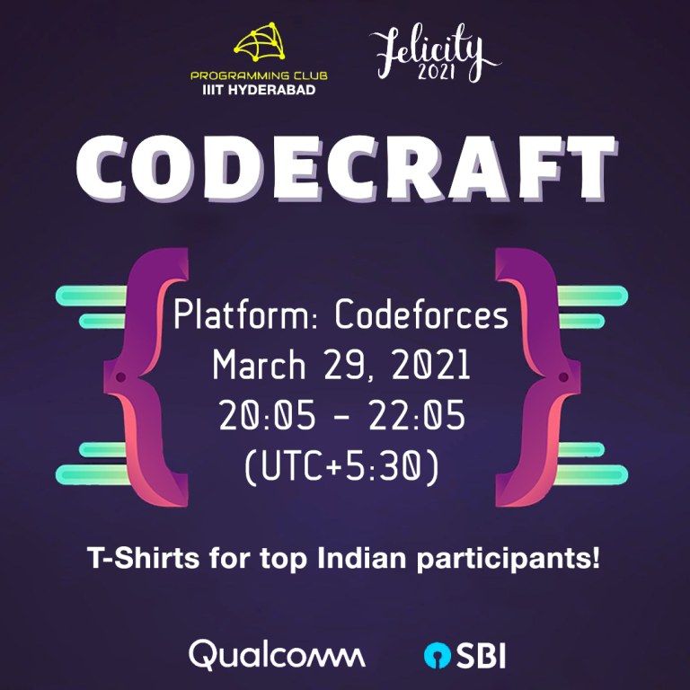

# Announcement_(en)

Hello all!

We are proud to invite you to **CodeCraft-21**, which takes place on [Monday, March 29, 2021 at 20:35UTC+6](https://codeforces.com/https://www.timeanddate.com/worldclock/fixedtime.html?day=29&month=3&year=2021&hour=17&min=35&sec=0&p1=166). It is rated for all Div2 participants (rating under 2100).

This contest comes under **Threads'21**, as a part of our annual techno-cultural fest [Felicity, IIIT Hyderabad](https://codeforces.com/https://felicity.iiit.ac.in). We have **special prizes for Indian participants**!

You will be given **six problems** to solve in a duration of **two hours**. 

We have tried our best to keep clean statements, useful samples with good explanations, and strong pretests! We have written step-wise editorials, and will also release video editorials!

We would like to thank these amazing people for helping make the contest happen:

 * [BledDest](https://codeforces.com/profile/BledDest "International Grandmaster BledDest") for great coordination of our round
* [ninja_28](https://codeforces.com/profile/ninja_28 "Candidate Master ninja_28"), [dixitgarg](https://codeforces.com/profile/dixitgarg "Master dixitgarg"), [ltc.groverkss](https://codeforces.com/profile/ltc.groverkss "Master ltc.groverkss") and myself for amazing problemsetting
* [madlad](https://codeforces.com/profile/madlad "Master madlad"), [AnimeshSinha1309](https://codeforces.com/profile/AnimeshSinha1309 "Candidate Master AnimeshSinha1309"), [shash42](https://codeforces.com/profile/shash42 "Candidate Master shash42"), [nikhil_c](https://codeforces.com/profile/nikhil_c "Expert nikhil_c") for contributing several important problem ideas
* [TheOneYouWant](https://codeforces.com/profile/TheOneYouWant "Grandmaster TheOneYouWant"), [amnesiac_dusk](https://codeforces.com/profile/amnesiac_dusk "Grandmaster amnesiac_dusk"), [awoo](https://codeforces.com/profile/awoo "Grandmaster awoo"), [SleepyShashwat](https://codeforces.com/profile/SleepyShashwat "Master SleepyShashwat"), [gaurav172](https://codeforces.com/profile/gaurav172 "Master gaurav172"), [adedalic](https://codeforces.com/profile/adedalic "International Master adedalic"), [amul_agrawal](https://codeforces.com/profile/amul_agrawal "Candidate Master amul_agrawal"), [vasu0403](https://codeforces.com/profile/vasu0403 "Candidate Master vasu0403"), [d_shi](https://codeforces.com/profile/d_shi "Candidate Master d_shi"), [Horcrux1729](https://codeforces.com/profile/Horcrux1729 "Expert Horcrux1729"), [RajMaheshwari](https://codeforces.com/profile/RajMaheshwari "Expert RajMaheshwari"), [menavlikar.rutvij](https://codeforces.com/profile/menavlikar.rutvij "Expert menavlikar.rutvij"), [Arpanet](https://codeforces.com/profile/Arpanet "Expert Arpanet"), [spashal](https://codeforces.com/profile/spashal "Specialist spashal"), [Tinkidinki](https://codeforces.com/profile/Tinkidinki "Specialist Tinkidinki") for testing our problemset, and providing very valuable feedback to improve problem statements, sample cases, and pretests
* [gaurav172](https://codeforces.com/profile/gaurav172 "Master gaurav172") and [shaanknight](https://codeforces.com/profile/shaanknight "Master shaanknight") for giving valuable advice on contest creation
* [ahish9009](https://codeforces.com/profile/ahish9009 "Pupil ahish9009") and [harshita_gupta](https://codeforces.com/profile/harshita_gupta "Unrated, harshita_gupta") for excellent poster and tshirt design
* And finally [MikeMirzayanov](https://codeforces.com/profile/MikeMirzayanov "Headquarters, MikeMirzayanov") for the amazing platforms, Codeforces and Polygon.

There will be an **interactive problem**! You are recommended to read the [corresponding guide](https://codeforces.com/blog/entry/45307).

We hope you enjoy the contest as much as we did preparing it! Good luck!

**Update:** The scoring distribution is 500/1000/1750/2500/2500/3000.

**Update:** [**Editorial**](Tutorial_(en).md) is up! **Video editorials** available on **[our YouTube channel](https://codeforces.com/https://www.youtube.com/channel/UCVfvb0BPfXW0aFgzHWsGmjQ)**.

We are sorry for the sudden increase in difficulty from C to D. Nonetheless we hope you enjoyed the problems! :)

 

---

**PRIZES**: The following twenty lucky participants receive a **tshirt**:

 * top 10 Indian participants
* random 10 from top 100 (ranks 11-100) Indian participants

These ranks are determined from the combined unofficial ranklist. We are coordinating with the CF team for the tshirt design, and we'll update the blog post when it is finalized. We also have **INR 7K** worth prizes exclusively for IIIT-Hyderabad students!

