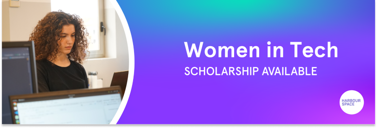

# Announcement

Hello Codeforces!

On [Thursday, March 18, 2021 at 20:50UTC+6](https://codeforces.com/https://www.timeanddate.com/worldclock/fixedtime.html?day=18&month=3&year=2021&hour=17&min=50&sec=0&p1=166) [Educational Codeforces Round 106 (Rated for Div. 2)](https://codeforces.com/contest/1499 "Educational Codeforces Round 106 (Rated for Div. 2)") will start.

Series of Educational Rounds continue being held as [Harbour.Space University](https://codeforces.com/https://harbour.space/) initiative! You can read the details about the cooperation between [Harbour.Space University](https://codeforces.com/https://harbour.space/) and Codeforces in the [blog post](//codeforces.com/blog/entry/51208).

This round will be **rated for the participants with rating lower than 2100**. It will be held on extended ICPC rules. The penalty for each incorrect submission until the submission with a full solution is 10 minutes. After the end of the contest you will have 12 hours to hack any solution you want. You will have access to copy any solution and test it locally.

You will be given **6 or 7 problems** and **2 hours** to solve them.

The problems were invented and prepared by Roman [Roms](https://codeforces.com/profile/Roms "Master Roms") Glazov, Adilbek [adedalic](https://codeforces.com/profile/adedalic "International Master adedalic") Dalabaev, Vladimir [vovuh](https://codeforces.com/profile/vovuh "Master vovuh") Petrov, Ivan [BledDest](https://codeforces.com/profile/BledDest "International Grandmaster BledDest") Androsov, Maksim [Neon](https://codeforces.com/profile/Neon "Candidate Master Neon") Mescheryakov and me. Also huge thanks to Mike [MikeMirzayanov](https://codeforces.com/profile/MikeMirzayanov "Headquarters, MikeMirzayanov") Mirzayanov for great systems Polygon and Codeforces.

Good luck to all the participants!

Our friends at Harbour.Space also have a message for you:

*Dear Codeforces!* 

*We are coming with another scholarship opportunity to share with you. This time, our scholarship is targeted towards the brightest women in the community.* 

*As you might know, March is the month where the whole world celebrates women. At Harbour.Space we want to use this opportunity to encourage more women to join the tech world and challenge the gender-bias in this field.* 

*We believe that gender equality in the workplace starts with gender equality in the classroom. For that reason, we are offering our **Women in Tech Scholarship**. The scholarship consists of:*

 * *50% off the yearly tuition fee: covers around €29,000 for bachelors and €11,450 for masters.*
* *32% off the application fee: €85 instead of €125*

*You can find more information about the scholarship here.*

  [MORE INFO→](https://iwd-scholarship.harbour.space/?utm_source=codeforces&utm_medium=referral&utm_campaign=iwd&utm_content=) 

***Make sure to apply before March 31st to benefit from the scholarship and discount.*** 

*Don’t hesitate to share this opportunity with any bright women in your personal circle as well. A simple share can help us transform someone's life.* 

*We are always happy to see Codeforce members join the Harbour.Space family.* 

*Keep in touch and follow us on [LinkedIn](https://codeforces.com/https://www.linkedin.com/school/harbour-space/) for more scholarship opportunities. And follow us on [Instagram](https://codeforces.com/https://www.instagram.com/harbour.space/) to stay in touch with our student life, events, and success stories from our students.*

*Good luck on your round, and see you next time!* 

*Harbour.Space University* 

Congratulations to the winners: 

| Rank | Competitor | Problems Solved | Penalty |
| --- | --- | --- | --- |
| 1 | [dlalswp25](https://codeforces.com/profile/dlalswp25 "International Grandmaster dlalswp25") | 6 | 128 |
| 2 | [Maksim1744](https://codeforces.com/profile/Maksim1744 "International Grandmaster Maksim1744") | 6 | 138 |
| 2 | [Savior-of-Cross](https://codeforces.com/profile/Savior-of-Cross "Grandmaster Savior-of-Cross") | 6 | 138 |
| 4 | [nuip](https://codeforces.com/profile/nuip "International Grandmaster nuip") | 6 | 149 |
| 4 | [kotatsugame](https://codeforces.com/profile/kotatsugame "International Grandmaster kotatsugame") | 6 | 149 |

149 successful hacks and 1485 unsuccessful hacks were made in total!

And finally people who were the first to solve each problem: 

| Problem | Competitor | Penalty |
| --- | --- | --- |
| A | [pavement](https://codeforces.com/profile/pavement "Master pavement") | 0:01 |
| B | [PCTprobability](https://codeforces.com/profile/PCTprobability "Candidate Master PCTprobability") | 0:04 |
| C | [PCTprobability](https://codeforces.com/profile/PCTprobability "Candidate Master PCTprobability") | 0:08 |
| D | [Parliament](https://codeforces.com/profile/Parliament "Master Parliament") | 0:09 |
| E | [KaladinStormblessed](https://codeforces.com/profile/KaladinStormblessed "Master KaladinStormblessed") | 0:17 |
| F | [718_MiL](https://codeforces.com/profile/718_MiL "Master 718_MiL") | 0:10 |
| G | [rainboy](https://codeforces.com/profile/rainboy "Expert rainboy") | 1:27 |

**UPD:** [Editorial is out](Tutorial.md)

