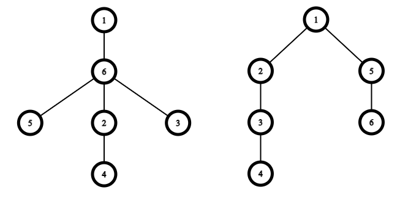

<h1 style='text-align: center;'> F. Diameter Cuts</h1>

<h5 style='text-align: center;'>time limit per test: 2 seconds</h5>
<h5 style='text-align: center;'>memory limit per test: 256 megabytes</h5>

You are given an integer $k$ and an undirected tree, consisting of $n$ vertices.

The length of a simple path (a path in which each vertex appears at most once) between some pair of vertices is the number of edges in this path. A diameter of a tree is the maximum length of a simple path between all pairs of vertices of this tree.

You are about to remove a set of edges from the tree. The tree splits into multiple smaller trees when the edges are removed. The set of edges is valid if all the resulting trees have diameter less than or equal to $k$.

Two sets of edges are different if there is an edge such that it appears in only one of the sets.

Count the number of valid sets of edges modulo $998\,244\,353$.

###### Input

The first line contains two integers $n$ and $k$ ($2 \le n \le 5000$, $0 \le k \le n - 1$) — the number of vertices of the tree and the maximum allowed diameter, respectively.

Each of the next $n-1$ lines contains a description of an edge: two integers $v$ and $u$ ($1 \le v, u \le n$, $v \neq u$).

The given edges form a tree.

###### Output

Print a single integer — the number of valid sets of edges modulo $998\,244\,353$.

## Examples

###### Input


```text
4 3
1 2
1 3
1 4
```
###### Output


```text
8
```
###### Input


```text
2 0
1 2
```
###### Output


```text
1
```
###### Input


```text
6 2
1 6
2 4
2 6
3 6
5 6
```
###### Output


```text
25
```
###### Input


```text
6 3
1 2
1 5
2 3
3 4
5 6
```
###### Output


```text
29
```
## Note

In the first example the diameter of the given tree is already less than or equal to $k$. Thus, you can choose any set of edges to remove and the resulting trees will have diameter less than or equal to $k$. There are $2^3$ sets, including the empty one.

In the second example you have to remove the only edge. Otherwise, the diameter will be $1$, which is greater than $0$.

Here are the trees for the third and the fourth examples: 

  

#### Tags 

#2400 #NOT OK #combinatorics #dfs_and_similar #dp #trees 

## Blogs
- [All Contest Problems](../Educational_Codeforces_Round_106_(Rated_for_Div._2).md)
- [Announcement](../blogs/Announcement.md)
- [Tutorial](../blogs/Tutorial.md)
