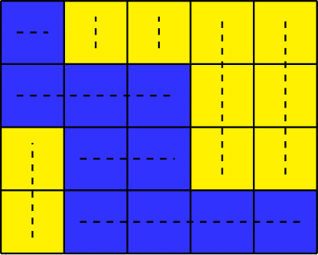
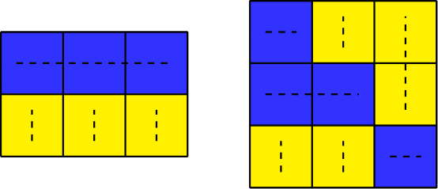
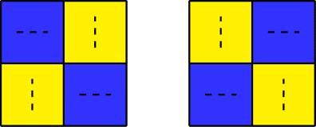

<h1 style='text-align: center;'> E. 2-Coloring</h1>

<h5 style='text-align: center;'>time limit per test: 3 seconds</h5>
<h5 style='text-align: center;'>memory limit per test: 256 megabytes</h5>

There is a grid with $n$ rows and $m$ columns. Every cell of the grid should be colored either blue or yellow.

A coloring of the grid is called stupid if every row has exactly one segment of blue cells and every column has exactly one segment of yellow cells.

In other words, every row must have at least one blue cell, and all blue cells in a row must be consecutive. Similarly, every column must have at least one yellow cell, and all yellow cells in a column must be consecutive.

  An example of a stupid coloring.   
## Examples

 of clever colorings. The first coloring is missing a blue cell in the second row, and the second coloring has two yellow segments in the second column. How many stupid colorings of the grid are there? Two colorings are considered different if there is some cell that is colored differently.

##### Input

The only line contains two integers $n$, $m$ ($1\le n, m\le 2021$).

##### Output

##### Output

 a single integer — the number of stupid colorings modulo $998244353$.

## Examples

##### Input


```text
2 2
```
##### Output


```text
2
```
##### Input


```text
4 3
```
##### Output


```text
294
```
##### Input


```text
2020 2021
```
##### Output


```text
50657649
```
## Note

In the first test case, these are the only two stupid $2\times 2$ colorings.

  

#### Tags 

#3100 #NOT OK #combinatorics #dp #math 

## Blogs
- [All Contest Problems](../Codeforces_Round_712_(Div._1).md)
- [Codeforces Round #712 (en)](../blogs/Codeforces_Round_712_(en).md)
- [Tutorial (en)](../blogs/Tutorial_(en).md)
