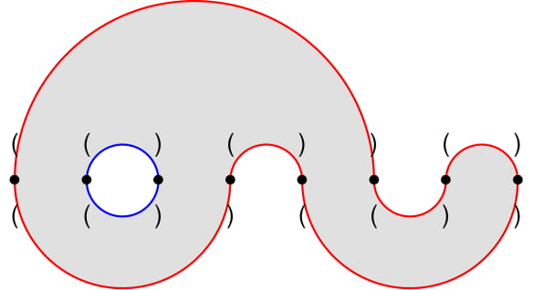
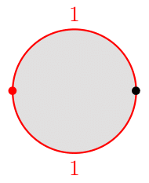
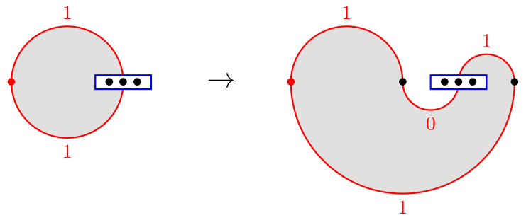
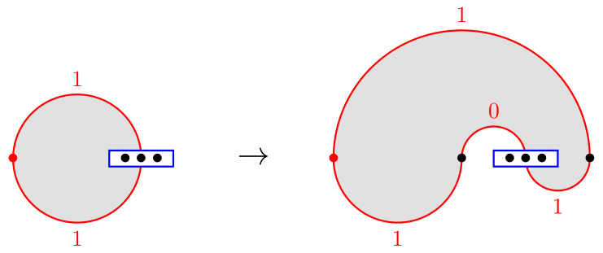
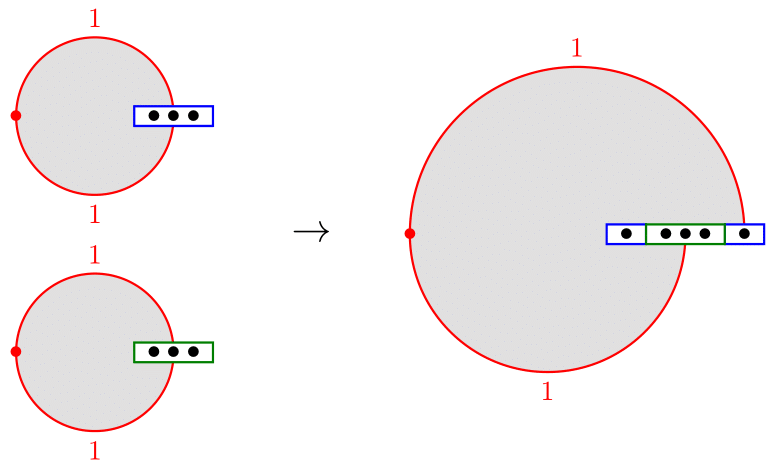

# Tutorial_(en)

omg hi!

I will add implementations soon.

**UPD**: Implementations are added

[1504A - Дежавю](../problems/A._Déjà_Vu.md "Codeforces Round 712 (Div. 2)")

 **Tutorial**
### [1504A - Déjà Vu](../problems/A._Déjà_Vu.md "Codeforces Round 712 (Div. 2)")

If $s$ is the character 'a' repeated some number of times, there is no solution. Otherwise, I claim either 'a' + $s$ or $s$ + 'a' is a solution (or both).

Let's prove it. Assume for contradiction that 'a' + $s$ and $s$ + 'a' are both palindromes. Then the first and last characters of $s$ are 'a'. Then the second and second to last characters of $s$ are 'a'. Repeating this, we see that all characters of $s$ are 'a', but we assumed we are not in this case. Therefore, the claim is true.

The solution is simply to check if 'a' + $s$ and $s$ + 'a' are palindromes and output the correct one. Complexity is $O(n)$.

[Implementation](https://codeforces.com/contest/1504/submission/111950211)

[1504B - Меняем биты](../problems/B._Flip_the_Bits.md "Codeforces Round 712 (Div. 2)")

 **Tutorial**
### [1504B - Flip the Bits](../problems/B._Flip_the_Bits.md "Codeforces Round 712 (Div. 2)")

Let's call a prefix legal if it contains an equal number of $0$ and $1$ symbols. The key observation is that applying operations never changes which prefixes are legal. In fact, suppose we apply an operation to a prefix of length $i$, and consider a prefix of length $j$. We want to show that if $j$ was legal before, it remains legal. And if it wasn't legal, it won't become legal.

* If $j<i$, then all bits in the length $j$ prefix are inverted. The numbers of $0$'s and $1$'s swap, so it cannot change whether they are equal, and hence it cannot change whether $j$ is legal.
* If $j\ge i$, then $i/2$ of the $0$ symbols become $1$ and $i/2$ of the $1$ symbols become $0$. So the numbers of both symbols do not change, so it cannot change whether $j$ is legal.

Using prefix sums, we can determine for each prefix whether it is legal.

Consider an index $i$. If $i=n$ and $a_n\ne b_n$, then we must flip the length $n$ prefix at some point. If $i<n$ and $a_i=b_i$, $a_{i+1}\ne b_{i+1}$, or $a_i\ne b_i$, $a_{i+1}=b_{i+1}$, then we must flip the length $i$ prefix at some point. If we flip precisely these prefixes in any order, it will transform $a$ into $b$. So we should simply check that every prefix that must be flipped is legal.

Complexity is $O(n)$.

[Implementation](https://codeforces.com/contest/1504/submission/111950248)

[1504C - Сбалансируйте биты](https://codeforces.com/contest/1504/problem/C "Codeforces Round 712 (Div. 2)")

 **Tutorial**
### [1504C - Balance the Bits](https://codeforces.com/contest/1504/problem/C "Codeforces Round 712 (Div. 2)")

Any balanced bracket sequence must begin with '(' and end with ')'. Therefore, $a$ and $b$ must agree in the first and last positions, so we require $s_1=s_n=1$ or a solution doesn't exist.

The total number of open brackets in $a$ and $b$ must be $n$, which is even. Each $1$ bit in $s$ creates an even number of open brackets and each $0$ bit creates an odd number of open brackets. Therefore, there must be an even number of $0$ bits, or a solution doesn't exist. Note that the number of $1$ bits also must be even.

Assuming these conditions hold, let's construct a solution. Suppose there are $k$ positions where $s_i=1$. We will make the first $\frac k2$ positions open in both $a$ and $b$, and we will make the last $\frac k2$ positions closed in both $a$ and $b$. Then, the $0$ bits in $s$ will alternate between which string gets the open bracket.

[Implementation](https://codeforces.com/contest/1503/submission/111950260)

[1504D - 3-раскраска](https://codeforces.com/contest/1504/problem/D "Codeforces Round 712 (Div. 2)")

 **Tutorial**
### [1504D - 3-Coloring](https://codeforces.com/contest/1504/problem/D "Codeforces Round 712 (Div. 2)")

Imagine the grid is colored like a checkerboard with black and white squares. Then Bob's strategy is to put tokens $1$ on white squares and tokens $2$ on black squares as long as he is able. If he is unable, this means all squares of one color are filled, and he can start placing tokens $3$ without making an invalid coloring. More specifically, this is his strategy:

* If Alice chooses $1$:
	+ If a black square is free, place a $2$ there.
	+ Otherwise, place a $3$ on a white cell.
* If Alice chooses $2$:
	+ If a white square is free, place a $1$ there.
	+ Otherwise, place a $3$ on a black cell.
* If Alice chooses $3$:
	+ If a white square is free, place a $1$ there.
	+ Otherwise, place a $2$ on a black cell.
[Implementation](https://codeforces.com/contest/1503/submission/111950287)

[1504E - Задача коммивояжёра](https://codeforces.com/contest/1504/problem/E "Codeforces Round 712 (Div. 2)")

 **Tutorial**
### [1504E - Travelling Salesman Problem](https://codeforces.com/contest/1504/problem/E "Codeforces Round 712 (Div. 2)")

Let's reindex the cities so they are in increasing order of beauty. Note that it doesn't matter which city we call the start: the trip will be a cycle visiting every city exactly once.

Let's rewrite the cost of a flight $i\to j$ as $$\max(c_i, a_j-a_i)=c_i+\max(0, a_j-a_i-c_i).$$

Since we always need to leave each city exactly once, we can ignore the $c_i$ term from all flights and only try to minimize the sum of $\max(0,a_j-a_i-c_i).$ 

Note that a flight to a city of smaller beauty is always free in the adjusted cost. So all we need is a path from $a_1$ to $a_n$, and the rest of the trip can be done for free. Also, any valid trip will contain a path from $a_1$ to $a_n$, so the shortest path is optimal.

Solution 1

All we have to do is encode the graph without storing all edges explicitly, and we can simply run Dijkstra's algorithm to find the shortest path. Add the following edges: 

1. $a_i\to a_{i-1}$ with weight $0$.
2. $i\to j$ with weight $0$, where $j$ is the largest index with $a_j-a_i-c_i\le 0$. The index $j$ can be found with binary search.
3. $i\to j+1$ with weight $\max(0, a_{j+1}-a_i-c_i)$ where $j$ is the same as before.

Every edge in this new graph corresponds to an edge in the original graph, and every edge in the original graph corresponds to a path in the new graph with at most the same cost. So the distance from $a_1$ to $a_n$ is preserved.

Solution 2

A simpler solution is to compute for all $i>1$, the minimum possible cost of the first trip reaching $a_i$ or larger. It's easy to see that any path must have at least this cost, and we can construct a path of this cost since moving to smaller $a_i$ is free. It corresponds to the following summation.

$$\sum_{i=2}^n \max(0, a_i-\max_{j<i}(a_j+c_j))$$

Complexity is $O(n\log n)$.

[Implementation 1](https://codeforces.com/contest/1503/submission/111950332)

[Implementation 2](https://codeforces.com/contest/1503/submission/111950321)

[1504F - Переверните карты](https://codeforces.com/contest/1504/problem/F "Codeforces Round 712 (Div. 2)")

 **Tutorial**
### [1504F - Flip the Cards](https://codeforces.com/contest/1504/problem/F "Codeforces Round 712 (Div. 2)")

Suppose there is a sorted deck where the $i$-th card has $c_i$ on the front and $d_i$ on the back. That is, it looks like this:

$$ c_1< c_2< \cdots< c_n\\\ d_1> d_2> \cdots> d_n $$

The values $1,\ldots, n$ must appear in some prefix of $c_i$ and some suffix of $d_i$. That is, they must all appear on distinct cards. So, if two values between $1$ and $n$ appear on the same card, we should report there is no solution.

Now, we know that every card in the input has a value in $[1,n]$ and a value in $[n+1,2n]$. Let $f(k)$ denote the number matched with the value $k$. Let's split the cards into two sets. Set $A$ will be the cards that will end with the smaller number on the front, and $B$ is the set of cards ending with the smaller number on the back. In each set, as the smaller numbers increase, the larger numbers decrease. Therefore, it must be possible to decompose $[f(1),\ldots,f(n)]$ into two decreasing subsequences, or there is no solution.

To decompose an array into two decreasing subsequences, there is a standard greedy approach. Also, note that any decomposition of $[f(1),\ldots,f(n)]$ into two decreasing sequences corresponds to a solution. In fact, we can put all the cards of one subsequence in $A$ and the rest in $B$, and it will create a sorted deck.

But how can we find the decomposition that corresponds to the minimum number of card flips? For every index $i$ such that $\min\limits_{j\le i} f(j)>\max\limits_{j>i}f(j)$, let's add a divider between $i$ and $i+1$. This splits the array $[f(1),\ldots, f(n)]$ into several segments. We can independently choose how to decompose each segment into two subsequences, and combining them is guaranteed to be a valid decomposition for the entire array. Also, there is a unique way to decompose each segment: the only choice is in which one we call the first subsequence. And so, we can independently choose for each segment the choice that requires the smallest number of flips.

Complexity is $O(n)$.

[Implementation](https://codeforces.com/contest/1503/submission/111950351)

[1503E - 2-раскраска](https://codeforces.com/contest/1503/problem/E "Codeforces Round 712 (Div. 1)")

 **Tutorial**
### [1503E - 2-Coloring](https://codeforces.com/contest/1503/problem/E "Codeforces Round 712 (Div. 1)")

Before counting, we should understand the structure of a stupid coloring.

First, both of the following cannot hold: 

1. There exists a path of yellow cells from column $1$ to column $m$.
2. There exists a path of blue cells from row $1$ to row $n$.

In fact, if two such paths existed, they must have a cell in common, and it would have to be blue and yellow at the same time.

Without loss of generality, suppose statement 1 is false. Consider a yellow cell in the grid. All blue cells in its row must be to its left or right because they lie in one segment. So, each yellow cell either belongs to the connected component $A$ of yellow cells touching the first column or the component $B$ touching the last column.

There cannot be a column with one cell in $A$ and another cell in $B$, otherwise the segment would connect the two components. And every column has at least one yellow cell, so there exists a number $c$ ($1\le c<m$) such that $A$ occupies the first $c$ columns and $B$ occupies the last $m-c$ columns.

Let $[l_A, r_A]$ be the segment of yellow cells in column $c$ and $[l_B, r_B]$ be the segment of yellow cells in column $c+1$. Since the segments do not overlap, we either have $r_A<l_B$ or $r_B<l_A$. Without loss of generality, suppose $r_A<l_B$. The cells in $A$ create a monotonically increasing path from $(1,0)$ to $(r_A, c)$, then make a monotonically decreasing path from $(r_A, c-1)$ to $(n,0)$. A similar structure happens for $B$.

The number of monotonic paths where we step right $a$ times and up $b$ times is counted by the binomial coefficient ${a+b\choose a}$. Now, if we fix $r_A$ and $l_B$, we can count the number of stupid colorings with the product of $4$ binomial coefficients. To make this fast enough, we can fix only $r_A$ and use a prefix sum to find the number of ways over all $l_B>r_A$.

To generalize from the assumption that $r_A<l_B$, we can multiply the answer by $2$ since it's symmetric. To generalize from the assumption that statement $1$ is false, we can also count the number of ways if $n$ and $m$ are swapped. But we should be careful about double counting the case where both statements 1 and 2 are false. This can be handled without too much trouble by simply requiring $r_A+1<l_B$ for one of the two cases.

Complexity is $O(\max(n, m)^2)$.

[Implementation](https://codeforces.com/contest/1503/submission/111950373)

[1503F - Сбалансируйте карты](https://codeforces.com/contest/1503/problem/F "Codeforces Round 712 (Div. 1)")

 **Tutorial**
### [1503F - Balance the Cards](https://codeforces.com/contest/1503/problem/F "Codeforces Round 712 (Div. 1)")

Suppose we have a deck of cards where the front and back are both balanced bracket sequences. Let's line the cards up horizontally and draw them as points. For each pair of matching brackets on the front and back, we will connect them with an edge. For matched brackets on the front, we add an edge as a semicircle lying above the points. And for matched brackets on the back, we add a similar edge below the points.

  Since every point is incident to exactly two edges, this graph decomposes into cycles. Since the edges are non-intersecting, each cycle is a Jordan curve in the plane. Imagine the curve as a track, and a monorail makes one full trip clockwise around the track. Each edge turns the monorail clockwise or counterclockwise by 180 degrees. Since the overall effect must turn the monorail a full 360 degrees clockwise, there are two more clockwise edges than counterclockwise edges in the cycle. If a cycle has $2m$ edges, then there are $m+1$ clockwise edges and $m-1$ counterclockwise edges.

Now, in the actual problem we are given a shuffled deck of cards. If there exists a way to reorder them so that the front and back are both balanced, then we know the above property must hold. Even though the cards are shuffled, we still have enough information to construct the edges and distinguish two edges in the same cycle by orientation (clockwise and counterclockwise). If there are $m+1$ edges of one orientation, we should call them the clockwise edges. Otherwise if the number of edges of both orientations are invalid, we should report that no solution exists.

Now that we have restricted ourselves to the case where this important condition holds, we should construct a solution. We can do this by solving for all the cycles independently and concatenating them together.

Consider a cycle. Let's make a binary string describing the sequence of orientations, where $1$ denotes a clockwise turn and $0$ denotes a counterclockwise turn. Since there are $m+1$ clockwise turns, we can find two adjacent $1$'s in the string. For consistency, let's cyclically shift the string so that it begins and ends with $1$, and we can consider the curve to begin at the leftmost point. Let's see how we can build the curve recursively. First, there is the base case where the string is $11$. Clearly, we can build the curve with two points like this.

Base Case:

  Now, suppose we have constructed a curve corresponding to $1s1$ for some string $s$. We will hide the turns of $s$ in the drawing, and just display it as a blue box. From this, we can build a curve corresponding to the string $10s11$ as shown on the right. This requires us to add two new points and reverse the order of the points in the blue box.

Operation 1:

  Similarly, if we have constructed a curve for $1s1$, we can build the curve for $11s01$.

Operation 2:

  Suppose we have constructed the curves $1s1$ and $1t1$ for two strings $s$ and $t$. The turns of $s$ are displayed as a blue box, and the turns of $t$ are displayed as a green box. Then we can build the curve $1st1$ as shown on the right. We take the last point in the blue box visited by the curve, and replace it with the points in the green box, in the same order.

Operation 3:

  It turns out that the base case and these three operations are enough to build any curve satisfying the required condition. We can do it recursively as follows.

* If the string is $11$, return the base case.
* If the string is $10s11$ for some $s$, build the curve $1s1$ and apply operation 1.
* If the string is $11s01$ for some $s$, build the curve $1s1$ and apply operation 2.
* Otherwise, there exist non-empty strings $s$ and $t$ so that the string is $1st1$, and $s$ contains the same number of $0$'s and $1$'s (and thus so does $t$). Recursively build the curves $1s1$ and $1t1$, and apply operation 3.

How can we apply these operations efficiently? When constructing a curve, we only care about the list of points (ignoring the leftmost one) as they appear from left to right, and which points are visited immediately before and after the leftmost point by the curve. If we store the list in the form of a doubly linked list, the operations of reversing and inserting in the middle can be done in constant time.

To build it recursively, we also need an efficient way to find a splitting point in the case of $1st1$. If we just scan from one endpoint maintaining a prefix sum (number of $1$'s minus number of $0$'s), the algorithm will take $O(n^2)$ time overall. Instead, we should scan from both endpoints in parallel, and stop when one of them finds a splitting point. If it splits into lengths $k$ and $m-k$, then the time is given by the recurrence $$T(m)=T(k)+T(m-k)+\min(k,m-k)=O(m\log m).$$

Complexity is $O(n\log n)$.

There is also an $O(n)$ solution. Scan the string $s$ (ignoring the first and last $1$) from left to right, maintaining a stack of linked lists. When the prefix sum (number of $1$'s minus number of $0$'s) increases in absolute value, we push the base case to the stack. When the prefix sum decreases in absolute value, we apply an operation $1$ or $2$ to the curve on the top of the stack, then merge the top two curves with operation $3$.

[Implementation](https://codeforces.com/contest/1503/submission/111950395)

