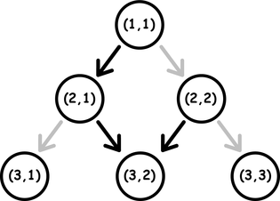

<h1 style='text-align: center;'> F. Triangular Paths</h1>

<h5 style='text-align: center;'>time limit per test: 2 seconds</h5>
<h5 style='text-align: center;'>memory limit per test: 256 megabytes</h5>

Consider an infinite triangle made up of layers. Let's number the layers, starting from one, from the top of the triangle (from top to bottom). The $k$-th layer of the triangle contains $k$ points, numbered from left to right. Each point of an infinite triangle is described by a pair of numbers $(r, c)$ ($1 \le c \le r$), where $r$ is the number of the layer, and $c$ is the number of the point in the layer. From each point $(r, c)$ there are two directed edges to the points $(r+1, c)$ and $(r+1, c+1)$, but only one of the edges is activated. If $r + c$ is even, then the edge to the point $(r+1, c)$ is activated, otherwise the edge to the point $(r+1, c+1)$ is activated. Look at the picture for a better understanding.

  Activated edges are colored in black. Non-activated edges are colored in gray. From the point $(r_1, c_1)$ it is possible to reach the point $(r_2, c_2)$, if there is a path between them only from activated edges. For example, in the picture above, there is a path from $(1, 1)$ to $(3, 2)$, but there is no path from $(2, 1)$ to $(1, 1)$.

Initially, you are at the point $(1, 1)$. For each turn, you can: 

* Replace activated edge for point $(r, c)$. That is if the edge to the point $(r+1, c)$ is activated, then instead of it, the edge to the point $(r+1, c+1)$ becomes activated, otherwise if the edge to the point $(r+1, c+1)$, then instead if it, the edge to the point $(r+1, c)$ becomes activated. This action increases the cost of the path by $1$;
* Move from the current point to another by following the activated edge. This action does not increase the cost of the path.

You are given a sequence of $n$ points of an infinite triangle $(r_1, c_1), (r_2, c_2), \ldots, (r_n, c_n)$. Find the minimum cost path from $(1, 1)$, passing through all $n$ points in arbitrary order.

### Input

The first line contains one integer $t$ ($1 \le t \le 10^4$) is the number of test cases. Then $t$ test cases follow.

Each test case begins with a line containing one integer $n$ ($1 \le n \le 2 \cdot 10^5$) is the number of points to visit.

The second line contains $n$ numbers $r_1, r_2, \ldots, r_n$ ($1 \le r_i \le 10^9$), where $r_i$ is the number of the layer in which $i$-th point is located.

The third line contains $n$ numbers $c_1, c_2, \ldots, c_n$ ($1 \le c_i \le r_i$), where $c_i$ is the number of the $i$-th point in the $r_i$ layer.

It is guaranteed that all $n$ points are distinct.

It is guaranteed that there is always at least one way to traverse all $n$ points.

It is guaranteed that the sum of $n$ over all test cases does not exceed $2 \cdot 10^5$.

### Output

For each test case, output the minimum cost of a path passing through all points in the corresponding test case.

## Example

### Input


```text
4
3
1 4 2
1 3 1
2
2 4
2 3
2
1 1000000000
1 1000000000
4
3 10 5 8
2 5 2 4
```
### Output


```text
0
1
999999999
2
```


#### Tags 

#2000 #NOT OK #constructive_algorithms #graphs #math #shortest_paths #sortings 

## Blogs
- [All Contest Problems](../Codeforces_Round_710_(Div._3).md)
- [Announcement](../blogs/Announcement.md)
- [Разбор](../blogs/Разбор.md)
