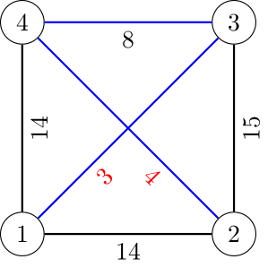

<h1 style='text-align: center;'> C. Complete the MST</h1>

<h5 style='text-align: center;'>time limit per test: 3 seconds</h5>
<h5 style='text-align: center;'>memory limit per test: 256 megabytes</h5>

As a teacher, Riko Hakozaki often needs to help her students with problems from various subjects. Today, she is asked a programming task which goes as follows.

You are given an undirected complete graph with $n$ nodes, where some edges are pre-assigned with a positive weight while the rest aren't. You need to assign all unassigned edges with non-negative weights so that in the resulting fully-assigned complete graph the [XOR](https://en.wikipedia.org/wiki/Bitwise_operation#XOR) sum of all weights would be equal to $0$.

Define the ugliness of a fully-assigned complete graph the weight of its [minimum spanning tree](https://en.wikipedia.org/wiki/Minimum_spanning_tree), where the weight of a spanning tree equals the sum of weights of its edges. You need to assign the weights so that the ugliness of the resulting graph is as small as possible.

As a reminder, an undirected complete graph with $n$ nodes contains all edges $(u, v)$ with $1 \le u < v \le n$; such a graph has $\frac{n(n-1)}{2}$ edges.

She is not sure how to solve this problem, so she asks you to solve it for her.

##### Input

The first line contains two integers $n$ and $m$ ($2 \le n \le 2 \cdot 10^5$, $0 \le m \le \min(2 \cdot 10^5, \frac{n(n-1)}{2} - 1)$)  — the number of nodes and the number of pre-assigned edges. The inputs are given so that there is at least one unassigned edge.

The $i$-th of the following $m$ lines contains three integers $u_i$, $v_i$, and $w_i$ ($1 \le u_i, v_i \le n$, $u \ne v$, $1 \le w_i < 2^{30}$), representing the edge from $u_i$ to $v_i$ has been pre-assigned with the weight $w_i$. No edge appears in the input more than once.

##### Output

Print on one line one integer  — the minimum ugliness among all weight assignments with XOR sum equal to $0$.

## Examples

##### Input


```text
4 4
2 1 14
1 4 14
3 2 15
4 3 8
```
##### Output


```text
15
```
##### Input


```text
6 6
3 6 4
2 4 1
4 5 7
3 4 10
3 5 1
5 2 15
```
##### Output


```text
0
```
##### Input


```text
5 6
2 3 11
5 3 7
1 4 10
2 4 14
4 3 8
2 5 6
```
##### Output


```text
6
```
## Note

The following image showcases the first test case. The black weights are pre-assigned from the statement, the red weights are assigned by us, and the minimum spanning tree is denoted by the blue edges.

  

#### Tags 

#2500 #NOT OK #bitmasks #brute_force #data_structures #dfs_and_similar #dsu #graphs #greedy #trees 

## Blogs
- [All Contest Problems](../Codeforces_Round_715_(Div._1).md)
- [Codeforces Round #715 (en)](../blogs/Codeforces_Round_715_(en).md)
- [Tutorial (en)](../blogs/Tutorial_(en).md)
