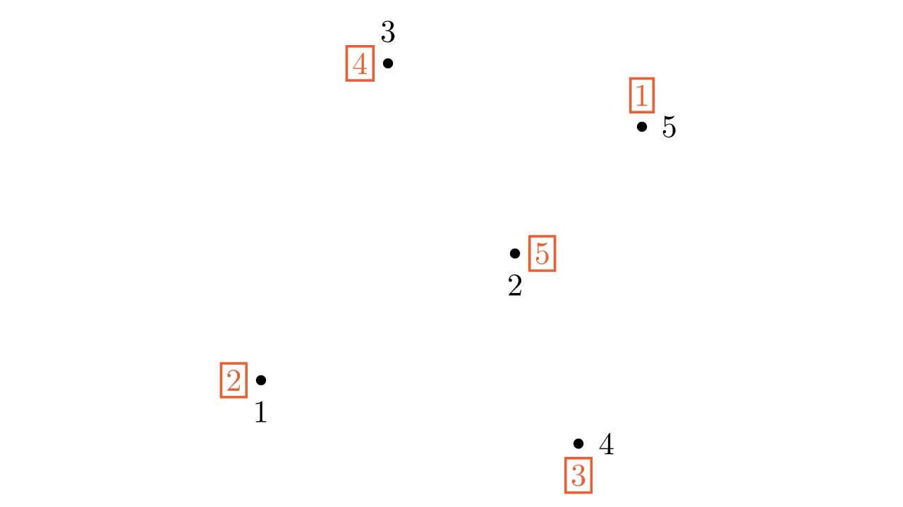

<h1 style='text-align: center;'> D. Swap Pass</h1>

<h5 style='text-align: center;'>time limit per test: 2 seconds</h5>
<h5 style='text-align: center;'>memory limit per test: 256 megabytes</h5>

Based on a peculiar incident at basketball practice, Akari came up with the following competitive programming problem!

You are given $n$ points on the plane, no three of which are collinear. The $i$-th point initially has a label $a_i$, in such a way that the labels $a_1, a_2, \dots, a_n$ form a permutation of $1, 2, \dots, n$.

You are allowed to modify the labels through the following operation:

1. Choose two distinct integers $i$ and $j$ between $1$ and $n$.
2. Swap the labels of points $i$ and $j$, and finally
3. Draw the segment between points $i$ and $j$.

A sequence of operations is valid if after applying all of the operations in the sequence in order, the $k$-th point ends up having the label $k$ for all $k$ between $1$ and $n$ inclusive, and the drawn segments don't intersect each other internally. Formally, if two of the segments intersect, then they must do so at a common endpoint of both segments.

In particular, all drawn segments must be distinct.

Find any valid sequence of operations, or say that none exist. 

#### Input

The first line contains an integer $n$ ($3 \le n \le 2000$)  — the number of points.

The $i$-th of the following $n$ lines contains three integers $x_i$, $y_i$, $a_i$ ($-10^6 \le x_i, y_i \le 10^6$, $1 \le a_i \le n$), representing that the $i$-th point has coordinates $(x_i, y_i)$ and initially has label $a_i$.

It is guaranteed that all points are distinct, no three points are collinear, and the labels $a_1, a_2, \dots, a_n$ form a permutation of $1, 2, \dots, n$.

#### Output

If it is impossible to perform a valid sequence of operations, print $-1$.

Otherwise, print an integer $k$ ($0 \le k \le \frac{n(n - 1)}{2}$)  — the number of operations to perform, followed by $k$ lines, each containing two integers $i$ and $j$ ($1 \le i, j \le n$, $i\neq j$)  — the indices of the points chosen for the operation.

## Note

 that you are not required to minimize or maximize the value of $k$.

If there are multiple possible answers, you may print any of them.

## Examples

#### Input


```text
5
-1 -2 2
3 0 5
1 3 4
4 -3 3
5 2 1
```
#### Output


```text
5
1 2
5 3
4 5
1 5
1 3
```
#### Input


```text
3
5 4 1
0 0 2
-3 -2 3
```
#### Output


```text
0
```
## Note

The following animation showcases the first sample test case. The black numbers represent the indices of the points, while the boxed orange numbers represent their labels.

  In the second test case, all labels are already in their correct positions, so no operations are necessary.


#### Tags 

#3000 #NOT OK #constructive_algorithms #geometry #sortings 

## Blogs
- [All Contest Problems](../Codeforces_Round_715_(Div._1).md)
- [Codeforces Round #715 (en)](../blogs/Codeforces_Round_715_(en).md)
- [Tutorial (en)](../blogs/Tutorial_(en).md)
