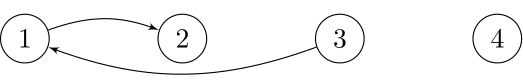
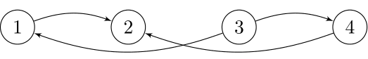
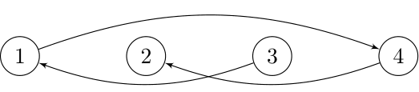

<h1 style='text-align: center;'> F. Optimal Encoding</h1>

<h5 style='text-align: center;'>time limit per test: 7 seconds</h5>
<h5 style='text-align: center;'>memory limit per test: 1024 megabytes</h5>

Touko's favorite sequence of numbers is a permutation $a_1, a_2, \dots, a_n$ of $1, 2, \dots, n$, and she wants some collection of permutations that are similar to her favorite permutation.

She has a collection of $q$ intervals of the form $[l_i, r_i]$ with $1 \le l_i \le r_i \le n$. To create permutations that are similar to her favorite permutation, she coined the following definition:

* A permutation $b_1, b_2, \dots, b_n$ allows an interval $[l', r']$ to holds its shape if for any pair of integers $(x, y)$ such that $l' \le x < y \le r'$, we have $b_x < b_y$ if and only if $a_x < a_y$.
* A permutation $b_1, b_2, \dots, b_n$ is $k$-similar if $b$ allows all intervals $[l_i, r_i]$ for all $1 \le i \le k$ to hold their shapes.

Yuu wants to figure out all $k$-similar permutations for Touko, but it turns out this is a very hard task; instead, Yuu will encode the set of all $k$-similar permutations with directed acylic graphs (DAG). Yuu also coined the following definitions for herself:

* A permutation $b_1, b_2, \dots, b_n$ satisfies a DAG $G'$ if for all edge $u \to v$ in $G'$, we must have $b_u < b_v$.
* A $k$-encoding is a DAG $G_k$ on the set of vertices $1, 2, \dots, n$ such that a permutation $b_1, b_2, \dots, b_n$ satisfies $G_k$ if and only if $b$ is $k$-similar.

Since Yuu is free today, she wants to figure out the minimum number of edges among all $k$-encodings for each $k$ from $1$ to $q$.

##### Input

The first line contains two integers $n$ and $q$ ($1 \le n \le 25\,000$, $1 \le q \le 100\,000$).

The second line contains $n$ integers $a_1, a_2, \dots, a_n$ which form a permutation of $1, 2, \dots, n$.

The $i$-th of the following $q$ lines contains two integers $l_i$ and $r_i$. ($1 \le l_i \le r_i \le n$).

##### Output

Print $q$ lines. The $k$-th of them should contain a single integer  — The minimum number of edges among all $k$-encodings.

## Examples

##### Input


```text
4 3
2 4 1 3
1 3
2 4
1 4
```
##### Output


```text
2
4
3
```
##### Input


```text
8 4
3 7 4 8 1 5 2 6
3 6
1 6
3 8
1 8
```
##### Output


```text
3
5
9
7
```
##### Input


```text
10 10
10 5 1 2 7 3 9 4 6 8
2 2
4 5
6 8
4 10
4 4
2 7
2 2
7 8
3 7
2 10
```
##### Output


```text
0
1
3
6
6
9
9
9
9
8
```
## Note

For the first test case:

* All $1$-similar permutations must allow the interval $[1, 3]$ to hold its shape. Therefore, the set of all $1$-similar permutations is $\{[3, 4, 2, 1], [3, 4, 1, 2], [2, 4, 1, 3], [2, 3, 1, 4]\}$. The optimal encoding of these permutations is 
* All $2$-similar permutations must allow the intervals $[1, 3]$ and $[2, 4]$ to hold their shapes. Therefore, the set of all $2$-similar permutations is $\{[3, 4, 1, 2], [2, 4, 1, 3]\}$. The optimal encoding of these permutations is 
* All $3$-similar permutations must allow the intervals $[1, 3]$, $[2, 4]$, and $[1, 4]$ to hold their shapes. Therefore, the set of all $3$-similar permutations only includes $[2, 4, 1, 3]$. The optimal encoding of this permutation is 


#### Tags 

#3500 #NOT OK #brute_force #data_structures 

## Blogs
- [All Contest Problems](../Codeforces_Round_715_(Div._1).md)
- [Codeforces Round #715 (en)](../blogs/Codeforces_Round_715_(en).md)
- [Tutorial (en)](../blogs/Tutorial_(en).md)
