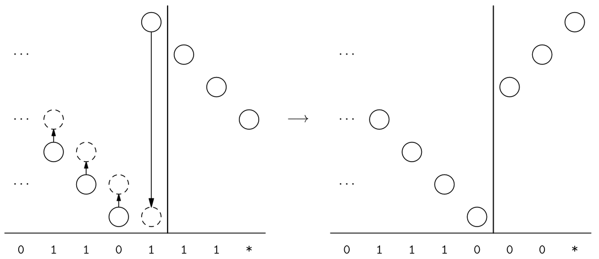
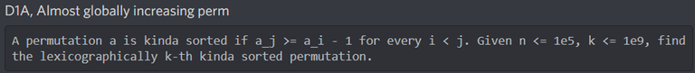
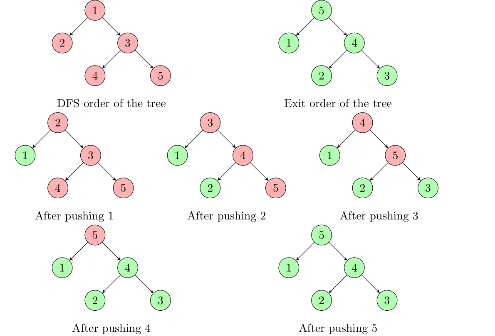
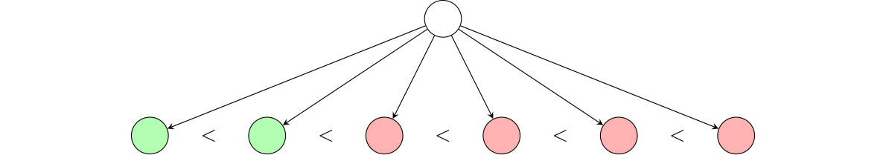
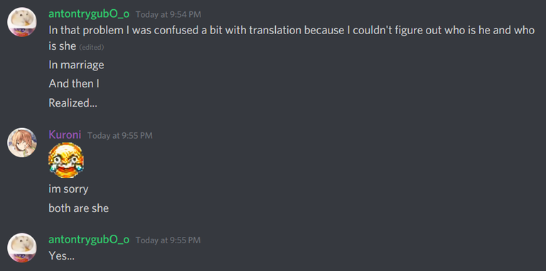
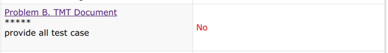
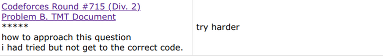

# Tutorial_(en)

Note: I can't figure out how to place the tutorials inside spoilers. If someone is familiar with how CF spoilers work and can help I would really appreciate it. For now, be warned that the tutorials are visible by default (but everything else isn't)

**UPD:** I figured out how to use spoilers! Also added implementations for all problems.

Thanks for participating in our contest!

[1509A - Average Height](../problems/A._Average_Height.md "Codeforces Round 715 (Div. 2)")

Author: [Kuroni](https://codeforces.com/profile/Kuroni "International Grandmaster Kuroni")   
 First solve: [Nutella3001](https://codeforces.com/profile/Nutella3001 "Expert Nutella3001") at 00:01:02

 **Hint**How can you write the condition that au+av2 is an integer in a more useful way? Think of the parities.

 **Tutorial**
### [1509A - Average Height](../problems/A._Average_Height.md "Codeforces Round 715 (Div. 2)")

For two consecutive members to be non-photogenic, au and av must have different parity. Therefore, to maximize the number of photogenic pairs, or to minimize the number of non-photogenic pairs, we will order the members so that all members with even height are in front and all members with odd height are at the back.

 **Comments from the authors**

[Implementation](https://codeforces.com/contest/1509/submission/113263196)

[1509B - TMT Document](../problems/B._TMT_Document.md "Codeforces Round 715 (Div. 2)")

Author: [Ari](https://codeforces.com/profile/Ari "Grandmaster Ari")   
 First solve: [blue](https://codeforces.com/profile/blue "Unrated, blue") at 00:04:51

 **Hint**You can think of the partition as associating to each M character a T to its left and a T to its right. What's the best way to perform this assignment?

 **Answer**Assign greedily from left to right.

 **Tutorial**
### [1509B - TMT Document](../problems/B._TMT_Document.md "Codeforces Round 715 (Div. 2)")

There are many slightly different solutions, all based on some sort of greedy idea. Write $n = 3k$ for convenience. Obviously, the string must have $k$ characters M and $2k$ characters T for the partition to be possible, so we can just discard all other cases.

Now, let's consider the first M character in the string. This must be part of some TMT subsequence, so we must choose a T character to its left to work as the first character of this subsequence. Which character should we choose? Well, it seems intuitive to match it with the first T character we find going from left to right - it is certainly not the right character of any sequence, and it seems like a good idea to assign it to the first M character since characters that are further to the right may be too far right to match with this character.

Continuing this idea, we come up with the following greedy algorithm: Take the first $k$ T characters and use them as the first characters of the subsequences, matching them with the $k$ M characters from left to right greedily. Similarly, take the last $k$ T characters and match them with each M character from left to right greedily. If either of these steps fails, the partition is impossible. This can be formalized into the following observation, which is both easy to prove and gives a solution that is very easy to implement.

Claim. Let $m_1 < m_2 < \dots < m_k$ be the positions of the M characters and let $t_1 < t_2 < \dots < t_{2k}$ be the positions of the T characters. Then the partition exists if and only if $t_i < m_i < t_{i + k}$ for $1 \le i \le k$.

Proof. If the condition holds then we can just choose the $k$ subsequences with indices $(t_i, m_i, t_{i + k})$, so it is sufficient. To see that it's necessary, consider the first $i$ M characters with indices $m_1, m_2, \dots, m_i$, and consider the left T characters in the subsequence they're in. These are to the left of their corresponding M characters, and in particular they are to the left of the $i$-th M character. Thus there's at least $i$ T characters to the left of the $i$-th M character, meaning $t_i < m_i$. The other inequality is proved similarly.

 **Comments from the authors**Do yourself a favor and listen to Towa-sama's singing! [Here](https://codeforces.com/https://www.youtube.com/watch?v=3UV8OZj2olg) [are](https://codeforces.com/https://www.youtube.com/watch?v=2D0B3wTjE20) [some](https://codeforces.com/https://www.youtube.com/watch?v=ZQ3gmQzpvBM) [links](https://codeforces.com/https://www.youtube.com/watch?v=2o_H09MdT94) [to](https://codeforces.com/https://www.youtube.com/watch?v=64kI2BWRd2g) [cool](https://codeforces.com/https://www.youtube.com/watch?v=9RBY7u5qas8) [songs.](https://codeforces.com/https://www.youtube.com/watch?v=Ud73fm4Uoq0)

[Implementation](https://codeforces.com/contest/1509/submission/113263820)

[1509C - The Sports Festival](../problems/C._The_Sports_Festival.md "Codeforces Round 715 (Div. 2)")

Author: [Ari](https://codeforces.com/profile/Ari "Grandmaster Ari")   
 First solve: [Dukkha](https://codeforces.com/profile/Dukkha "Specialist Dukkha") at 00:05:32

 **Hint 1**What is the discrepancy of the last stage? How can we make it smaller in previous stages?

 **Answer**The discrepancy of the last stage is always the difference between the largest and the smallest ai. We can make it smaller in the previous stages by placing the smallest or the largest ai at the end.

 **Hint 2**Use dynamic programming.

 **Tutorial**
### [1509C - The Sports Festival](../problems/C._The_Sports_Festival.md "Codeforces Round 715 (Div. 2)")

Assume that the array of speeds is sorted, i.e. $s_1 \le s_2 \le \dots \le s_n$.

The key observation is that the last running can be assumed to be either $s_1$ or $s_n$. This is because if $s_1$ and $s_n$ are both in the prefix of length $i$, then clearly $d_i = s_n - s_1$, which is the maximum possible value of any discrepancy. Similarly $d_{i + 1}, d_{i + 2}, \dots, d_n$ are all equal to $s_n - s_1$. This moving either $s_1$ or $s_n$ (whichever appears last) to the very end of the array cannot possibly increase the sum of these discrepancies, since they already have the largest possible value.

If we repeat the previous observation, we deduce that for each $i$, the prefix of length $i$ in an optimal solution forms a contiguous subarray of the sorted array. Therefore, we may solve the problem through dynamic programming: $dp(l, r)$ represents the minimum possible answer if we solve for the subarray $s[l \dots r]$. Clearly $dp(x, x) = 0$, and the transition is given by

$$dp(l, r) = s_r - s_l + \min(dp(l + 1, r), dp(l, r - 1))$$

Which corresponds to placing either the smallest or the largest element at the end of the sequence. The final answer is $dp(1, n)$. This allows us to solve the problem in $O(n^2)$.

 **Comments from the authors**This problem was originally going to appear in [Codeforces Round 668 (Div. 2)](https://codeforces.com/contest/1405 "Codeforces Round 668 (Div. 2)"), but it was removed one day before the contest for balance reasons :P

[Implementation](https://codeforces.com/contest/1509/submission/113263837)

[1508A - Binary Literature](https://codeforces.com/contest/1508/problem/A "Codeforces Round 715 (Div. 1)")

Author: [Ari](https://codeforces.com/profile/Ari "Grandmaster Ari")   
 First solve (Div. 2): [traxex2](https://codeforces.com/profile/traxex2 "Unrated, traxex2") at 00:22:48   
 First solve (Div. 1): [tourist](https://codeforces.com/profile/tourist "Legendary Grandmaster tourist") at 00:05:04

 **Hint 1**Consider two of the strings. We can obviously achieve our goal using at most 4n characters. How can we save some of them?

 **Answer**Take advantage of any common subsequence in our two strings by including the characters in it only once.

 **Hint 2**Find a long common subsequence that has a simple structure. You'll need to involve the third string as well.

 **Hint 3**Either 00…0 or 11…1 is a subsequence of each string.

 **Tutorial**
### [1508A - Binary Literature](https://codeforces.com/contest/1508/problem/A "Codeforces Round 715 (Div. 1)")

First solution

Let's focus on two bitstrings $s$ and $t$. How can we get a short string that has them both as subsequences? Well, suppose both strings have a common subsequence of length $L$. Then we can include this subsequence as part of our string. Then we just place the remaining characters of both sequences in the correct positions between the characters of this common sequence, to make both strings a subsequence of the result. This saves us $L$ characters compared to just concatenating $s$ and $t$ since the characters of the common subsequence only have to included once, i.e. this uses $|s| + |t| - L$ characters.

Now, in our problem, all strings have a length of $2n$, so this algorithm will use a total of $4n - L$ characters. This means if we can find two strings that have a common subsequence of length $n$, we can finish the problem. However, the usual algorithm for computing the longest common subsequence works in $\mathcal{O}(n^2)$, which is unlikely to pass the time limit, so we have to construct this common subsequence more concretely.

The observation is that because each character is either $0$ or $1$, one of these characters must appear at least $n$ times. Call such a character frequent. Now since each string has at least one frequent character, two of these frequent characters are equal. Considering these two strings and their frequent character we find a common subsequence of length $n$, equal to either $000\dots 0$ or $111\dots 1$.

Second solution

This solution uses a similar idea, in a way that is a bit easier to implement. Consider three pointers $p_1, p_2, p_3$, pointing to a character in each string, and a string $t$ representing our answer. These pointers will represent the prefixes of each string that we have represented in our answer. Initially, $t$ is empty and $p_1 = p_2 = p_3 = 1$ (here our strings are $1$-indexed).

Now we will add characters to $t$ one by one. At each step, consider the three characters pointed at by our three pointers. Since they are either $0$ or $1$, two of them are equal. Add this equal character to $t$, and advance the pointers that match this character by $1$.

Continue this algorithm until one of the strings is completely contained in $t$, let's say $s_1$. At this point, suppose $t$ has $k$ characters, and thus the pointers have advanced by at least $2k$, since at least two of them advance on each step. We have exhausted the characters of $s_1$, so we have advanced $p_1$ by $2n$, and the other two pointers have advanced $2k - 2n$, and thus one of them has advanced by at least $k - n$. Now just add the remaining characters of this string to $t$. There are at most $2n - (k - n) = 3n - k$ of them, so in the end $t$ has at most $3n$ characters.

 **Comments from the authors**This problem was originally suggested as a 2B. It turned out to be too hard and was switched to 2C, before being further switched to 1A because it was still too hard. Some testers still believed this problem to be even harder, but we ended up deciding to have it as 1A with a larger score than usual.   
   
 Apologies to the testers who had to solve this as if it was the second easiest problem in the contest :^)

[Implementation](https://codeforces.com/contest/1508/submission/113263847)

[1508B - Almost Sorted](https://codeforces.com/contest/1508/problem/B "Codeforces Round 715 (Div. 1)")

Author: Both of us!   
 First solve (Div. 2): [shenmadongdong.qaq](https://codeforces.com/profile/shenmadongdong.qaq "Newbie shenmadongdong.qaq") at 00:29:52   
 First solve (Div. 1): [tourist](https://codeforces.com/profile/tourist "Legendary Grandmaster tourist") at 00:08:19

 **Hint 1**What is the general structure of an almost sorted permutation?

 **Answer**Start with the identity permutation, choose some disjoint subarrays, and reverse each of them.

 **Hint 2**How many almost sorted permutations of length n exist? In other words, how many ways are there to reverse subarrays?

 **Answer**2n−1

 **Hint 3**Two options — either solve recursively in a greedy fashion or find a smart bijection.

 **Tutorial**
### [1508B - Almost Sorted](https://codeforces.com/contest/1508/problem/B "Codeforces Round 715 (Div. 1)")

First solution.

Let's first analyze the general structure of an almost sorted permutation. We know that when the sequence decreases, it must decrease by exactly $1$. Thus, every decreasing subarray covers some consecutive range of values. Let's split the permutation into decreasing subarrays, each of them as large as possible. For example, we can split the almost sorted permutation $[3, 2, 1, 4, 6, 5, 7]$ as $[3, 2, 1], [4], [6, 5], [7]$. The main claim goes as follows.

Claim. Each almost sorted permutation is determined uniquely by the sequence of sizes of its maximal decreasing subarrays.

So for instance, in the previous example, the sequence of sizes $3, 1, 2, 1$ uniquely determines the permutation as $[3, 2, 1, 4, 6, 5, 7]$. This is because the last element $a_i$ of a decreasing block must be smaller than the first element $a_{i + 1}$ in the next block. Otherwise we either have $a_{i + 1} = a_i - 1$, in which case we should expand the previous block, or $a_{i + 1} < a_i - 1$, which is contradictory.

Now, this is basically enough to get a complete solution. Through some careful counting (which we will go into detail about later) we can show that there are $2^{n - 1}$ almost sorted permutations of size $n$. Now notice that smaller sizes for the first block produce lexicographically smaller permutations (since a permutation whose first block has size $m$ starts with $m$). Moreover, the remaining sequence after deleting the first block is almost sorted. This enables to do a recursive argument to find the permutation, by first choosing the correct size for the first block and then solving recursively for the remaining sequence. This works in $\mathcal{O}(n \log k)$.

Second solution.

But we can do better. Let's mark the positions in the array where a decreasing block ends with $0$, and the other positions as $1$. Notice that the last character is always $0$, so we will ignore it and assign only the other $n - 1$ characters. Thus our example permutation $[3, 2, 1, 4, 6, 5, 7]$ becomes $110010$ since the first, second, and third blocks end at positions $3$, $4$, and $6$. By the first claim, we can recover the permutation from this sequence (which is also the proof of there being $2^{n - 1}$ permutations of size $n$ that we promised earlier!).

Now, we can read the assigned sequence as a binary number, for instance, the corresponding number is $110010_2 = 2^5 + 2^4 + 2^1 = 50$ for our trusty example. The point of doing this is the following:

Claim 2. The $k$-th almost sorted permutation in lexicographical order is assigned the number $k - 1$.

To prove this it's actually enough to check that the number $m + 1$ is assigned to a greater permutation than the number $m$. This can be done by looking at how the permutation changes when we add $1$ to $m$, looking at the binary representation of $m$ from right to left. We leave it to the reader to fill in the details of the proof, but here's a diagram showing the situation graphically (with height representing the values of the permutation).

  Anyways, once we have proven this claim, we get a simple $\mathcal{O}(n + \log k)$ solution by finding the binary representation of $k$ and using it to reconstruct the blocks in $\mathcal{O}(n)$.

 **Comments from the authors**This problem's creation has a funny story. Back when we were coming up with problems for Round 668, I (Ari) came up the following relatively simple and standard problem and shared it.   
   
    
   
 The next day, Kuroni saw the problem, but misread it and ended up solving the version that made it into this contest, which we think is a lot cooler!   
   
 One more fun fact for your consideration: This problem's name in Polygon is "sorrow".

[Implementation](https://codeforces.com/contest/1508/submission/113263859)

[1508C - Complete the MST](https://codeforces.com/contest/1508/problem/C "Codeforces Round 715 (Div. 1)")

Author: [Kuroni](https://codeforces.com/profile/Kuroni "International Grandmaster Kuroni")   
 First solve (Div. 2): [deepspacewaifu](https://codeforces.com/profile/deepspacewaifu "Newbie deepspacewaifu") at 01:42:36   
 First solve (Div. 1): [maroonrk](https://codeforces.com/profile/maroonrk "Legendary Grandmaster maroonrk") at 00:33:17

 **Hint 1**How can we solve this problem without the restriction that the xor of all edge weights is 0?

 **Answer**Just assign 0 to every unassigned edge :P

 **Hint 2**When does the solution to the unrestricted problem fail for the real problem?

 **Answer**When any minimum spanning tree (of the graph with every unassigned edge having weight 0) contains every unassigned edge, and the xor sum of all the edge weights is not 0.

 **Hint 3**Leave the xor sum of the weights of the unassigned edges in the spanning tree fixed. How do we minimize their sum?

 **Answer**Assign the entire xor sum to a single edge, and assign weight 0 to every other edge.

 **Hint 4**Exactly one unassigned edge ends up with a non-zero weight. If we don't use all unassigned edges, which others can we use?

 **Answer**Any edge that isn't part of the MST when we consider unassigned edges to have weight 0, and that doesn't form a cycle with pre-assigned edges with smaller weights.

 **Tutorial**
### [1508C - Complete the MST](https://codeforces.com/contest/1508/problem/C "Codeforces Round 715 (Div. 1)")

Call $x$ the XOR sum of the weights of all pre-assigned edges.

Lemma. All but one unassigned edges are assigned with $0$, while the remaining unassigned edge is assigned with $x$.

Proof. Consider any assignment of unassigned edges. There are two cases on the minimum spanning tree:

* The MST does not use all unassigned edges: We can assign one unused unassigned edge with $x$, while all other unassigned edges (including all used in the MST) are assigned with $0$. This reduces the weight of the MST.
* The MST uses all unassigned edges: We can prove that the sum of weights of unassigned edges is at least $x$, and the equality can be achieved with the construction from the lemma. Intuitively, the XOR sum is an "uncarried" summation, and the construction from the lemma removes any digit carry.

Let's DFS on the unassigned edges. It can happen that the unassigned edges may separate the graph into multiple components, and we might need to use some pre-assigned edges in our MST. I will divide the collection of pre-assigned edges into 3 types:

1. Edges that must be included in the MST: these are edges with smallest weights that connect the components after traversing through unassigned edges.
2. Edges that cannot be included in the MST: these are edges that form cycles with smaller-weighted pre-assigned edges. In other words, these are edges that do not exist in the minimum spanning forest of the pre-assigned edges.
3. Edges that are in neither of the previous types.

For the unassigned edges, there are two cases:

* The unassigned edges form at least a cycle: We can assign any edge on this cycle as $x$, the rest as $0$, then build an MST using the $0$-weighted edges with pre-assigned edges of type 1.
* The unassigned edges does not form a cycle. Suppose we build the tree using only unassigned edges and edges of type 1. Then any edge of type 3 can replace an unassigned edge in the tree. That is because the edges of type 3 must form a cycle with edges of type 1 and unassigned edges (else it would either be in type 1 or type 2). We can simply replace an unassigned edge in that cycle with this type 3 edge. Therefore, for this case, our solution is to first form the tree with all edges of type 1 and unassigned edge. Then, if the smallest weighted type 3 edge has weight $< x$, we can replace an unassigned edge with this edge; else, we keep the tree.
 **Comments from the authors**If the unassigned edges in the graph don't form a forest, then the answer is simply the weight of the MST where all the unassigned edges have weight 0. Thus the interesting tests in this problem require these edges to form a forest, which means m≥n(n−1)2−(n−1). This automatically limits the maximum value of n to approximately 2√m. Concretely, n≤633 for all interesting tests in this problem. You can also use this to obtain a solution that runs in O(m√m), which a tester found, and which passes if implemented reasonably.

[Implementation](https://codeforces.com/contest/1508/submission/113263168)

[1508D - Swap Pass](https://codeforces.com/contest/1508/problem/D "Codeforces Round 715 (Div. 1)")

Author: [Ari](https://codeforces.com/profile/Ari "Grandmaster Ari")   
 First solve: [ksun48](https://codeforces.com/profile/ksun48 "Legendary Grandmaster ksun48") at 00:57:13

 **Hint 1**It is always possible to find the sequence.

 **Hint 2**There's a simple algorithm that fixes a point and repeatedly moves its current label to the correct position. When does it work?

 **Answer**When the permutation of the labels is a single cycle.

 **Hint 3**Any permutation can be split into one or more cycles. What can we do to these cycles?

 **Answer**Merge them, by swapping two elements in different cycles.

 **Hint 4**We would like to merge all cycles of the permutation by swapping elements in different cycles and then repeatedly move each label from a certain point to its correct location. How can we do this without intersections?

 **Answer**Fix a point beforehand to perform the final step, and sort angularly with respect to this point.

 **Tutorial**
### [1508D - Swap Pass](https://codeforces.com/contest/1508/problem/D "Codeforces Round 715 (Div. 1)")

As it turns out, it is always possible to find the required sequence, no matter the position of the points in the plane and the initial permutation.

It turns out that it's pretty hard to analyze even particular positions of the points, and it will be more convenient to start by analyzing particular permutations instead. To this effect, we will begin by doing two things:

1. Ignore every $i$ such that initially $a_i = i$. Since we'll prove that the sequence exists for any configuration anyway, they can't ever matter.
2. Draw an arrow from point $i$ to point $a_i$ for each $i$. This divides the points into a bunch of cycles.

Now we can make the following observation:

Observation 1. If we have any cycle, we can get all the balls in that cycle to their correct position by choosing any member $i$ in the cycle, and repeatedly swap passing between $i$ and $a_i$, without generating any intersections.

This allows us to solve the problem for any position of the points as long as the permutation has a single cycle. However, this will generally not be the case. We can hope to deal with this by making a second observation.

Observation 2. If we have any two distinct cycles and any two members $u$ and $v$ in those two cycles, then swap passing between $u$ and $v$ will merge both cycles.

By combining both observations we can come up with the following general idea to solve any case:

1. First, perform swaps between distinct cycles until all of the cycles merge into a single one.
2. Then, move all the balls to their correct positions as described in the first observation.

Now we just have to figure out how to perform these moves without having intersections between segments. It might be helpful to think about the case when the points are vertices of a convex polygon first since it simplifies the model without sacrificing too much of the geometry. Either way, we will describe only the general case.

Consider any point, which we will use as a "pivot" for the operations at the end. Now, sort all of the other points by the angle of the segment between them and the pivot point. Call the segments that join two consecutive points in the ordering border segments, and the segments between the pivot and the other points central segments. Now we will just merge all the cycles by using border segments and then move all the balls to their intended position by using central segments, this solves the problem.

However, there's one small special case that we might have to deal with depending on how we're thinking about the problem: If the pivot point we chose is on the convex hull of the set of points, then one of the border segments may actually intersect some other segments! Luckily, we can easily prove that this can't happen for more than one of the segments, so our plan still works. There are many different ways to deal with this case. From simplest to most complicated:

* Always choose the bottom-most and left-most point as a pivot. This makes this potentially troublesome segment predictable, and also allows us to slightly simplify the angular sorting code.
* Discard the problematic segment by looking at which pair of consecutive points makes a clockwise turn instead of a counter-clockwise turn.
* Discard the problematic segment by brute-force intersecting each border segment with each central segment. This increases our complexity to $\mathcal{O}(n^2)$, but this is still fine.
* Intentionally choose a pivot that is not on the convex hull and do something slightly different if the points are the vertices of a convex polygon.

Regardless of how we choose to deal with it, we can now solve the problem with approximately $\frac{3}{2}n$ operations in the worst case, and a time complexity of either $\mathcal{O}(n \log n)$ or $\mathcal{O}(n^2)$ depending on how we implement the solution.

 **Comments from the authors**This problem was originally proposed with the points always being the vertices of a convex polygon. This allows us to do a slightly different solution where we first merge the cycles and choose the pivot afterwards by choosing a point unaffected by the previous swaps.   
   
 The reason for having n=2000 in this problem rather than a larger n like 105 is because of the validator: it is essential to not have three collinear points in this problem, and I don't know how to check this for large n. The small n also makes the checker much easier to write, though it's possible (albeit tricky) to write a checker that works in O(nlogn).   
   
 Regarding the number of operations used: The solution described in the editorial uses approximately 32n operations in the worst case when the permutation consists of cycles of size 2. The minimum number of operations is lower bounded by n−1 by combinatorics reasons when the permutation is a single cycle. Moreover, by Euler's formula, we have an upper bound of 3n−6 operations for any valid sequence, which goes down to 2n−3 when the points are the vertices of a convex polygon. I don't know of a solution that uses cn operations for some c<3/2, nor do I know of a general test case where it can be proven that at least cn operations are needed for some c>1, so I'd be really interested in seeing either.

[Implementation](https://codeforces.com/contest/1508/submission/113263865)

[1508E - Tree Calendar](https://codeforces.com/contest/1508/problem/E "Codeforces Round 715 (Div. 1)")

Author: [Kuroni](https://codeforces.com/profile/Kuroni "International Grandmaster Kuroni")   
 First solve: [ecnerwala](https://codeforces.com/profile/ecnerwala "Legendary Grandmaster ecnerwala") at 01:02:26

 **Hint 1**During the process, we will repeatedly push the same label down until we no longer can. What happens at this point?

 **Answer**The labels that have been fully pushed down will look like a post-order of the tree, while the other labels will look like a pre-order of the tree.

 **Hint 2**Look at the children of a particular vertex. What can we say about the ones that are fully pushed down in relation to the ones that aren't?

 **Answer**Every fully pushed down label is smaller than every other label.

 **Hint 3**For each node, the order of the labels of its children stays fixed. 

 **Hint 4**How can we use the previous observations to identify the state of the process?

 **Answer**We can reconstruct the DFS order and the fully pushed down labels. Then check that the current pushing step of the process is valid.

 **Tutorial**
### [1508E - Tree Calendar](https://codeforces.com/contest/1508/problem/E "Codeforces Round 715 (Div. 1)")

From the structure, we see that until the end, the process is divided into $n$ phases, where the $i$-th involves phase pushing value $i$ from the root to the smallest-labeled leaf. Also in the following tutorial, I will use post-order and exit order, as well as pre-order and DFS order interchangeably.

Lemma 1. After finishing pushing $i$, labels $1$ to $i$ are at the post-order positions, and the remaining labels from $i + 1$ to $n$ form the pre-order of the remaining part of the tree offsetted by $i$.

Proof. There's a formal proof, but I think a better way is to show an illustration instead.

  After pushing $i$, we see that all green labels (label from $1$ to $i$) are at their post-order positions, while all red labels (labels from $i + 1$ to $n$) are connected and form the pre-order of the red subtree, with an offset of $i$. Moreover, this suggests that while pushing $i$, the label of the root is $i + 1$.

Lemma 2. On any day, the order of the values of the children of any node stays the same.

The proof will be left as an exercise for the reader, but a hint would be that for any node, a prefix of its children will be green nodes (nodes that have been pushed), the rest are red nodes (nodes that haven't been pushed). We can prove that the green nodes are ordered the same, the red nodes are ordered the same, and the green nodes are always less than the red nodes.

  Lemma 3. Suppose we are pushing/have just finished pushing $i$. Then the number of days that have passed is the sum of heights of all labels from $1$ to $i$.

Proof. All labels that have finished being pushed, or are being pushed, have all traversed from the root down to their current position, which means the number of days to push each of these labels is equal to the height of the node containing the label.

With the three lemmas, we can finally discuss the algorithm: First, we sort the children of each node by its value. Then we use this order to create the pre-order of the tree, and we can also figure out the current value that is being pushed (it is the value of the root minus 1). Call this value $v$. Knowing the current value being pushed, we first check if the current value is being pushed to the correct destination (i.e. check if the node with label $v$ is an ancestor of the node with post-order $v$). Then, we can "revert" the pushing of $v$ by swapping it back up the root, also taking to account the number of days. Finally, we check if values $< v$ are in the post-order positions, and values that are $\ge v$ form the pre-order shifted by $v - 1$ of the remaining of the tree.

Complexity is $O(n \log n)$.

 **Comments from the authors**This problem was inspired by a wrong solution to [1477D - Nezzar and Hidden Permutations](https://codeforces.com/contest/1477/problem/D "Codeforces Round 698 (Div. 1)"), but it seems that knowing that problem beforehand doesn't help at all to solve this one.

[Implementation](https://codeforces.com/contest/1508/submission/113263313)

[1508F - Optimal Encoding](https://codeforces.com/contest/1508/problem/F "Codeforces Round 715 (Div. 1)")

Author: [Kuroni](https://codeforces.com/profile/Kuroni "International Grandmaster Kuroni")   
 First solve: [ecnerwala](https://codeforces.com/profile/ecnerwala "Legendary Grandmaster ecnerwala") at 01:52:02 (The only contestant who solved this problem!)

 **Hint 1**Start by solving the problem for q-encodings only.

 **Hint 2**We can get an encoding by including every possible edge. Which of them can we exclude?

 **Answer**We need to keep an edge u→v if and only if no other path from u to v exists.

 **Hint 3**What does the previous observation look like from the perspective of a single vertex?

 **Answer**Each vertex has at most two outgoing edges, one on each side, and we can easily characterize when one of them is redundant.

 **Hint 4**We need to solve the full version now. For a vertex u, how do the endpoints of its outgoing edges change when we add a new interval?

 **Answer**The endpoints of the right edges increase monotonically, while the endpoints of the left edges decrease monotonically.

 **Hint 5**How can we use the previous observation to characterize edges becoming redundant more concretely?

 **Answer**For each right edge, we can find a particular left edge, such that the right edge becomes redundant once the left edge appears. This gives us an interval of times for each edge during which it is relevant.

 **Hint 6**Use Mo's algorithm on the input intervals to find the relevant edges.

 **Tutorial**
### [1508F - Optimal Encoding](https://codeforces.com/contest/1508/problem/F "Codeforces Round 715 (Div. 1)")

We will first solve the problem for $q$-similar permutations only. Let's transform each of the $q$ ranges into edges on a DAG we call $G$: for all ranges $[l_i, r_i]$, for all pairs of indices $l \le x, y \le r$ such that $a_x < a_y$, we add an edge from $x$ to $y$. We can easily see a permutation is $q$-similar iff it satisfies $G$. Now, our task is to remove edges from $G$ such that the number of permutations that satisfy it stays the same.

Lemma 1. We can remove an edge $(u, v)$ if and only if there is a path from $u$ to $v$ with length $\ge 2$.

Proof. If there exists a path of length $\ge 2$ between $(u, v)$, then we can remove the edge $(u, v)$ without having to worry about losing dependency between $u$ and $v$. On the other hand, if there doesn't exist such a path, then the only path connecting $u$ and $v$ is via the edge $(u, v)$ itself; removing that edge removes any dependency between $u$ and $v$. When that is the case, we can easily create a permutation such that $a_v = a_u + 1$, then we simply swap $a_u$ and $a_v$ to gain a permutation that does not satisfy the original DAG.

Let's return to our problem. For any element $u$, we consider the edges connecting $u \to v$ such that $v > u$ a right edge of $u$; we define a left edge of $u$ in a similar manner.

Lemma 2. There is at most one right edge of $u$.

Proof. Suppose there are two right edges of $u$, namely $u \to w'$ and $u \to w$ (suppose $w' < w$). Because of our range construction, there must be a range that covers both $u$ and $w$. This range must covers $w'$ too, therefore there is a path between $w$ and $w'$, therefore we can remove either $u \to w$ or $u \to w'$.

Therefore, there is at most one right edge $u \to u_r$. We can actually find this right edge: suppose $[l, r]$ is a range such that $l \le u \le r$, and $r$ is as large as possible. Then $u_r$ is the index between $u$ and $r$ such that $a_{u_r} > a_u$ and $a_{u_r}$ is as small as possible. We can prove similar results with the left edge of $u$ (denoted as $u \to u_l$).

However, there will be cases when $u \to u_r$ is actually not needed (I will call this phenomenon being hidden). What is the condition for $u \to u_r$ to be hidden? That's when there's a path from $u$ to $u_r$ with length $\ge 2$! Suppose this path is in the format $u \to \dots \to t \to u_r$. We can prove that $t < u$: if $t > u$ then that implies $a_t > a_u$ but $a_t < a_{u_r}$, which means the right edge of $u$ is $u \to t$ instead. Because $t < u$, we can take the range $[l, r]$ such that $l \le u_r \le r$, $l$ is as small as possible, and check if there exists an index $t \in [l, u]$ such that $a_u < a_t < a_w$. That concludes the solution for finding the optimal encoding for $q$-permutations. To recap: 

1. Find left and right edges of all $u$.
2. Check if the left/right edges of all $u$ are hidden. If they are, remove them from the answer.

Let's return to the original problem. For each range $[l_i, r_i]$, instead of adding an edge for every $l \le x, y \le r$ to $G$, let's only add an edge between $x'$ and $y'$ such that $a_{x'}$ and $a_{y'}$ are adjacent values in the range. This doesn't change our answer because of lemma 1. Let's call these edges candidate edges.

Surprisingly, all of our previous observations hold, but this time on the set of candidate edges. Namely,

* At any query, there is at most one right edge $u \to u_r$, which is one of the candidate edges.
* The right edge $u \to u_r$ must satisfy that $u_r > u$, $a_{u_r} < a_u$ and $a_{u_r}$ is the smallest such value in the range $[u, r]$, where $[l, r]$ is the range covering $u$ with the largest $r$.
* $u \to u_r$ is hidden if there exists a candidate edge $u \to t$ such that $t < u$, $a_u < a_t < a_{u_r}$, and $t \in [l, u]$ where $[l, r]$ is the range covering $u_r$ with the smallest $l$. We call this edge $u \to t$ the destroyer of the edge $u \to u_r$.
* All of the above points holds for the left edge $u \to u_l$.

Let's organize the candidate edges: for any edge $u \to v$, if $v > u$, label $u \to v$ as a right candidate edge of $u$, else label $u$ as a left candidate edge of $u$. Let's sort the right candidate edges of $u$ by increasing $u_r$, and sort the left candidate edges of $u$ by decreasing $u_l$.

Observation. The values of the right end of the right candidate edges are decreasing, i.e. if the right candidate edges of $u$ are $u \to u_{r,1}, u \to u_{r,2}, ..., u \to u_{r,k}$ such that, $u_{r,1} < u_{r,2} < \dots < u_{r,k}$, then $a_{u_{r,1}} > a_{u_{r,2}} > \dots > a_{u_{r,k}}$. Similarly, if we sort the left candidate edges of $u$ by decreasing index, then the values of the left end of these candidate edges are decreasing.

Using this observation, we can prove that if the destroyer of $u \to u_{r_i}$ is $u \to u_{l_j}$, and the destroyer of $u \to u_{r_{i + 1}}$ is $u \to u \to u_{l, k}$, then $u_{l, j} \ge u_{l, k}$, or $j \le k$; we can also prove a similar result with the destroyers of left candidate edges. Therefore, we can use two pointers to figure out the destroyer for each left and right candidate edge of $u$.

For each right candidate edge $[u \to u_{r,i}]$, let's see when this candidate edge is used in the optimal encoding:

* The candidate edge is first activated when there exists a range covering $[u, u_{r, i}]$. We call this timestamp $t_1$.
* The candidate edge is hidden when there exists a range covering $[u_{l, j}, u_{r,i}]$, where $u \to u_{l,j}$ is the destroyer of $u \to u_{r,i}$. We call this timestamp $t_2$.
* The candidate edge is deactivated when there exists a range covering $[u, u_{r, i + 1}]$, where $u \to u_{r, i + 1}$ is the right candidate edge after $u \to u_{r,i}$. We call this timestamp $t_3$.

For each candidate edge, we can find these timestamps using a Fenwick tree. With these three timestamps, we can figure out the range of time where each candidate edge is used (which is $[t_1, \min(t_2, t_3))$), and modify the answer accordingly.

Finally, let's find out how many candidate edges there are:

Lemma 3. The number of candidate edges is $O(n \sqrt{q})$.

Proof. Suppose for a range $[l, r]$, we maintain edges $u \to v$ such that $l \le u, v \le r$, and the values $a_u$ and $a_v$ are adjacent in the range $[l, r]$. When we add/subtract one of the ends by 1, i.e. when we consider $[l \pm 1, r \pm 1]$, the amount of edges that are modified between $[l, r]$ and $[l \pm 1, r \pm 1]$ is $O(1)$ (for example, if we add another element, then we remove at most 1 old edge and add at most 2 new edges; similarly, when removing an element, we remove at most 2 old edges and add at most 1 new edge).

Therefore, consider Mo's algorithm on the given collection of ranges $[l_i, r_i]$, each candidate edge must appear during the process of iterating over the ranges, and the number of modification is $O(n \sqrt{q})$, therefore the number of candidate edges is $O(n \sqrt{q})$.

That concludes the solution to the full problem. To recap:

* Find all candidate edges.
* Find the destroyer of all candidate edges.
* Find the range of timestamps where each candidate edge is used.

The complexity is $O(n \sqrt{q} \log n)$.

Notes. In particular, your set candidate edges does not have to be exactly the edges connecting consecutive values between ranges; these candidate edges only need to satisfy 3 conditions:

* All edges that are included in some optimal $k$-encoding must be present in the set of candidate edges.
* The observation is not violated, i.e. if we sort the left/right candidate edges of any node $u$ by the other endpoint, then the value at the other endpoint must be sorted as well.
* The number of candidate edges must not be too large, at about $O(n \sqrt{q})$ edges.

This is to loosen up the process of generating the candidate edges, since the naive Mo-and-set-of-values approach is incredibly expensive. My edge-generating approach involves using Mo with rollback to only allow deletion of values so I can maintain the sorted values with a linked list, and I also do not delete intermediary edges while iterating one range to another.

 **Comments from the authors**Huge shoutouts to [tfg](https://codeforces.com/profile/tfg "Grandmaster tfg") who came up with one of the key steps of the solution! Including this problem probably would have not been possible without him. ❤️

[Implementation](https://codeforces.com/contest/1508/submission/113263058)

Finally, here's some funny moments that happened while we were working on the round :)

 **Memes**    

