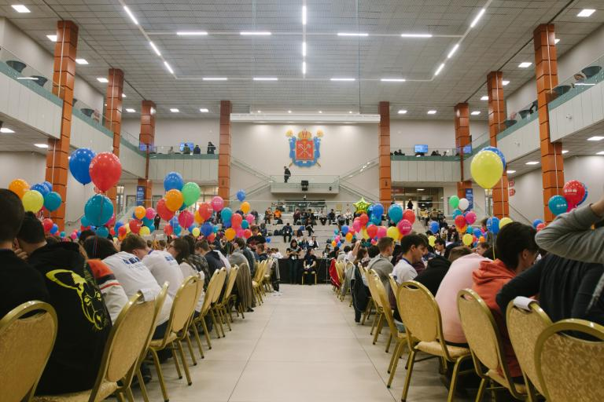
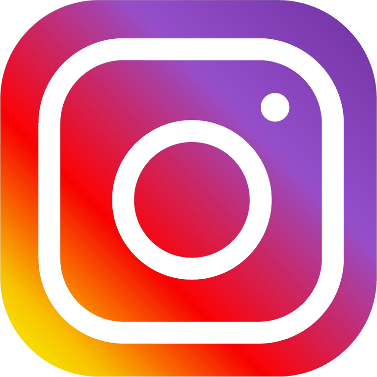

# A_(en)

Hello everyone!

After all online qualifiers, we are pleased to announce that the **Northern Eurasia Finals** and ICPC 2021 semi-final offline stage will take place this weekend on **April 3-4**!

[ICPCLive broadcast](https://codeforces.com/https://youtu.be/65oO4Zauvgc) [Standings](https://codeforces.com/http://nerc.itmo.ru/archive/2020/standings.html)

[Mirror](https://codeforces.com/contests/1510) [Problems](https://codeforces.com/http://nerc.itmo.ru/archive/2020/problems.pdf) [Problems solutions](https://codeforces.com/http://nerc.itmo.ru/archive/2020/nerc-2020-offline-tutorial.pdf)

In December 2020, [we announced](https://codeforces.com/blog/entry/85537) that **50 student teams out of 330** were selected for the **Northern Eurasia Finals**. Most of the teams will compete in St. Petersburg. Still, some teams will compete at Minsk, Tbilisi, and Riga sites due to travel restrictions between countries.

NERCNews is going to monitor the championship and report on the main events! We will post links to the results table, contest tasks, contest mirror, and analytics published on the official website.

**UPD** today were qualified for ICPC 2021 World Finals next 12 teams:

 * SPb ITMO: Insert your name (Budin, Korobkov, Naumov)
* HSE: Overtrained (Gorokhovskii, Safonov, Rakhmatullin)
* Moscow SU: Nonames (Koshelev, Chunaev, Kalendarov)
* St. Petersburg SU: LOUD Enough (Bochkov, Makarov, Gaevoi)
* Saratov SU: N (Petrov, Piklyaev, Meshcheryakov)
* SPb HSE 1: Lemon Tree (Makhnev, Surkov, Alferov)
* Belarusian SU: 3 (Klimasheuski, Paliukhovich, Filinovich)
* Moscow IPT: LinkCat (Zgursky, Gaponov, Surkov)
* Kazan FU: AJ (Ilikayev, Yagafarov, Kapralov)
* NNSU: 1 (Khlyustov, Ryabchikova, Emelin)
* Tolyatti SU: A (Zakharov, Sabirov, Panin)
* IITU: 1 (Baimukanov, Sardarbekov, Kyzyrkanov)

Also, join the traditional [ICPCLive](https://codeforces.com/https://www.twitch.tv/icpclive_ru) team online broadcast from the site in St. Petersburg. The schedule for both days can be found [here](https://codeforces.com/http://nerc.itmo.ru/information/agenda.html).

We have compiled a list of teams grouped by ratings, which will be especially interesting to follow. What are your predictions? Favorites?

 

| Team | Contestant 1 | Contestant 2 | Contestant 3 | Rating |
| --- | --- | --- | --- | --- |
| HSE: Overtrained | Ramazan Rakhmatullin[never_giveup](https://codeforces.com/profile/never_giveup "Legendary Grandmaster never_giveup") | Maksim Gorokhovskii[Maksim1744](https://codeforces.com/profile/Maksim1744 "International Grandmaster Maksim1744") | Ivan Safonov[isaf27](https://codeforces.com/profile/isaf27 "International Grandmaster isaf27") | 8672 |
| SPb SU: 25 | Egor Gorbachev[peltorator](https://codeforces.com/profile/peltorator "Grandmaster peltorator") | Semen Petrov[Semenar](https://codeforces.com/profile/Semenar "Grandmaster Semenar") | Dmitriy Belichenko[Dmitriy.Belichenko](https://codeforces.com/profile/Dmitriy.Belichenko "International Grandmaster Dmitriy.Belichenko") | 7970 |
| SPb SU: Cheba Kings | Saveliy Grigoryev[sava-cska](https://codeforces.com/profile/sava-cska "Grandmaster sava-cska") | Andrey Efremov[receed](https://codeforces.com/profile/receed "International Grandmaster receed") | Mikhail Ivanov[orz](https://codeforces.com/profile/orz "Grandmaster orz") | 7967 |
| SPb ITMO: Insert your name | Nikolay Budin[budalnik](https://codeforces.com/profile/budalnik "International Grandmaster budalnik") | Stanislav Naumov[josdas](https://codeforces.com/profile/josdas "Grandmaster josdas") | Roman Korobkov[romanasa](https://codeforces.com/profile/romanasa "International Master romanasa") | 7863 |
| SPb SU: LOUD Enough | Ivan Bochkov[tranquility](https://codeforces.com/profile/tranquility "Grandmaster tranquility") | Vladislav Makarov[Kaban-5](https://codeforces.com/profile/Kaban-5 "Grandmaster Kaban-5") | Nikita Gaevoi[nikgaevoy](https://codeforces.com/profile/nikgaevoy "Grandmaster nikgaevoy") | 7608 |
| MIPT: Malaya Bronnaya | Yury Semenov[SYury](https://codeforces.com/profile/SYury "Grandmaster SYury") | Maksym Machula[mHuman](https://codeforces.com/profile/mHuman "Grandmaster mHuman") | Artem Komendantian[komendart](https://codeforces.com/profile/komendart "International Grandmaster komendart") | 7529 |
| HSE: Sleeveless shorts | Philipp Gribov[grphil](https://codeforces.com/profile/grphil "Master grphil") | Fedor Kuyanov[Kuyan](https://codeforces.com/profile/Kuyan "Master Kuyan") | Semyon Savkin[cookiedoth](https://codeforces.com/profile/cookiedoth "International Grandmaster cookiedoth") | 7410 |
| SPb HSE 1: Lemon Tree | Vasily Alferov[platypus179](https://codeforces.com/profile/platypus179 "International Master platypus179") | Konstantin Makhnev[kokokostya](https://codeforces.com/profile/kokokostya "Grandmaster kokokostya") | Maksim Surkov[maximumSHOT](https://codeforces.com/profile/maximumSHOT "Grandmaster maximumSHOT") | 7370 |
| Belarusian SU 1 | Aliaksandr Kernazhytski[gepardo](https://codeforces.com/profile/gepardo "International Grandmaster gepardo") | Dzianis Kim[kimden](https://codeforces.com/profile/kimden "International Master kimden") | Ivan Lukyanov[greencis](https://codeforces.com/profile/greencis "Grandmaster greencis") | 7377 |

Share your impressions and photos on social networks using hashtag #NERC.

Who will represent the **Northern Eurasian Region** in the **ICPC 2021** Final whenever it happens? We will find out this Sunday! Stay tuned!

    

