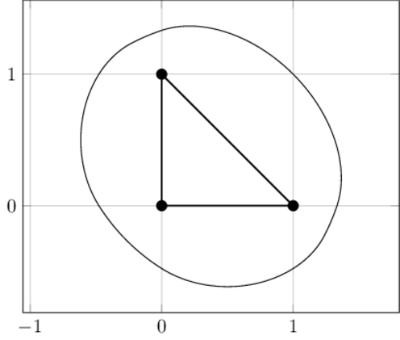
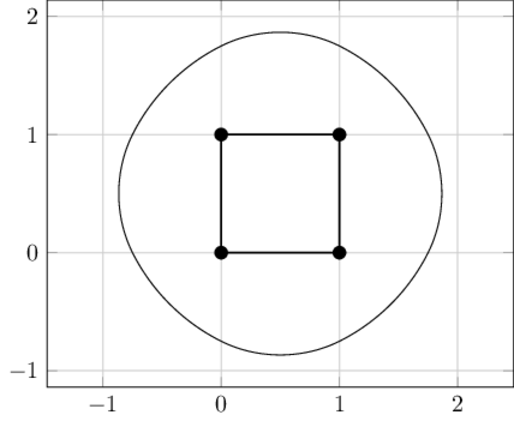
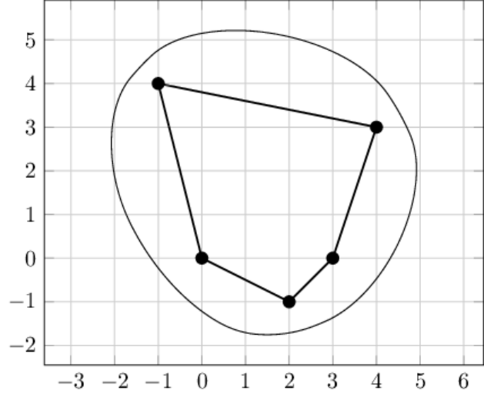

<h1 style='text-align: center;'> F. Fiber Shape</h1>

<h5 style='text-align: center;'>time limit per test: 3 seconds</h5>
<h5 style='text-align: center;'>memory limit per test: 512 megabytes</h5>

Imagine a board with $n$ pins put into it, the $i$-th pin is located at $(x_i, y_i)$. For simplicity, we will restrict the problem to the case where the pins are placed in vertices of a convex polygon.

Then, take a non-stretchable string of length $l$, and put it around all the pins. Place a pencil inside the string and draw a curve around the pins, trying to pull the string in every possible direction. The picture below shows an example of a string tied around the pins and pulled by a pencil (a point $P$).

  Your task is to find an area inside this curve. Formally, for a given convex polygon $S$ and a length $l$ let's define a fiber shape $F(S, l)$ as a set of points $t$ such that the perimeter of the convex hull of $S \cup \{t\}$ does not exceed $l$. Find an area of $F(S, l)$.

##### Input

The first line contains two integers $n$ and $l$ ($3 \le n \le 10^4$; $1 \le l \le 8 \cdot 10^5$) — the number of vertices of the polygon $S$ and the length of the string. Next $n$ lines contain integers $x_i$ and $y_i$ ($-10^5 \le x_i, y_i \le 10^5$) — coordinates of polygon's vertices in counterclockwise order. All internal angles of the polygon are strictly less than $\pi$. The length $l$ exceeds the perimeter of the polygon by at least $10^{-3}$.

##### Output

##### Output

 a single floating-point number — the area of the fiber shape $F(S, l)$. Your answer will be considered correct if its absolute or relative error doesn't exceed $10^{-6}$. 

## Examples

##### Input


```text
3 4
0 0
1 0
0 1
```
##### Output


```text
3.012712585980357
```
##### Input


```text
4 5
0 0
1 0
1 1
0 1
```
##### Output


```text
5.682061989789656
```
##### Input


```text
5 17
0 0
2 -1
3 0
4 3
-1 4
```
##### Output


```text
37.719371276930820
```
## Note

The following pictures illustrate the example tests.

 

  

#### Tags 

#2800 #NOT OK 

## Blogs
- [All Contest Problems](../2020-2021_ICPC,_NERC,_Northern_Eurasia_Onsite_(Unrated,_Online_Mirror,_ICPC_Rules,_Teams_Preferred).md)
- [A (en)](../blogs/A_(en).md)
